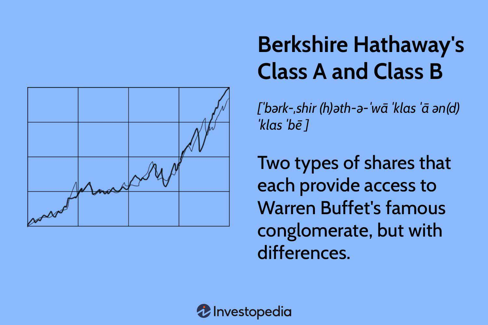

Berkshire Hathaway, a renowned multinational conglomerate, is headed by the esteemed investor Warren Buffett. The company offers two primary classes of stock: Class A (BRK.A) and Class B (BRK.B). These shares have long been the subject of robust discussions among investors due to their notable differences, particularly in terms of price and the implications these differences carry.

Class A shares are characterized by their high price point, reflecting substantial voting rights and a direct representation of long-term value, which aligns with Buffett's investment philosophy. In contrast, Class B shares serve as a more accessible investment opportunity, designed to attract a broader audience while providing a fractional representation of the ownership and rights associated with Class A shares.



This article aims to provide a comprehensive comparison between Class A and Class B shares, drawing on historical context and exploring the specific considerations relevant to each share type. By examining the evolution of these shares and their characteristics, we aim to clarify the strategic options available to investors seeking to incorporate Berkshire Hathaway into their portfolios.

Additionally, the article will address how algorithmic trading has become an instrumental factor in the evaluation of these stocks. This advanced trading approach leverages vast computational resources to analyze market patterns, enabling investors to make data-driven decisions and optimize their investment strategies across both share classes.

Ultimately, understanding the differences between Berkshire Hathaway's Class A and Class B shares can empower investors to make informed choices aligned with their financial goals and investment strategies.

## Table of Contents

## Overview of Berkshire Hathaway Class A and Class B Shares

Berkshire Hathaway is a prominent multinational conglomerate, and its stock is available in two classes: Class A (BRK.A) and Class B (BRK.B). These classes serve distinct investor needs, primarily characterized by differences in share price, convertibility, and voting rights.

Class A shares (BRK.A) represent the original stock offering of Berkshire Hathaway and are renowned for their high price per share. This high cost reflects several factors, including the greater voting power and prestige associated with Class A holdings. Investors acquiring Class A shares gain significant influence within the company's governance, as each Class A share typically carries far more voting rights than a Class B share. This voting power can be essential for investors prioritizing corporate governance influence in their investment strategy.

Class B shares (BRK.B) were introduced in 1996 to facilitate broader access to Berkshire Hathaway’s stock. The aim was to provide a more affordable entry point for individual investors who might be deterred by the formidable price tag of Class A shares. Consequently, Class B shares possess a lower price and reduced voting rights compared to their Class A counterparts. It is essential to note, however, that both Class A and Class B shares represent ownership in Berkshire Hathaway, granting shareholders a stake in the conglomerate's financial prosperity.

An additional point of differentiation between these two classes is their convertibility feature. Class A shares can be converted into Class B shares at any time, following a fixed ratio. This mechanism allows significant flexibility for investors who initially opt for Class A shares but later wish to capitalize or reallocate their investment without exiting their position in the firm. Conversely, Class B shares cannot be converted into Class A shares, maintaining the exclusivity and elevated status of Class A shares.

Understanding these distinctions in price, convertibility, and voting rights is crucial for investors considering an investment in Berkshire Hathaway. Each class of stock caters to different investor demographic and strategic goals, aligning financial capabilities with desired involvement in corporate governance.

## Berkshire Hathaway's History and the Introduction of Class B Shares

Berkshire Hathaway, an American multinational conglomerate, introduced Class B shares in 1996, primarily addressing the high costs associated with its Class A shares. At the time, the price of Class A shares made it difficult for smaller investors to participate in ownership of the company, which led to the creation of unit trusts that pooled investments into Class A shares. These trusts could potentially mislead investors by suggesting that their financial products were endorsed by or affiliated with Berkshire Hathaway. 

The introduction of Class B shares was a strategic move to discourage such practices. By offering a more accessible entry point for investment, Berkshire Hathaway ensured a broader range of investors could own a stake in the company. Initially, Class B shares were priced at approximately 1/30th of the value of Class A shares. This pricing was achieved by dividing the financial attributes such as voting rights and economic interest of Class A shares into more manageable proportions for Class B shares. 

In 2010, Berkshire Hathaway made another significant decision by splitting Class B shares at a 50-to-1 ratio. This stock split was aimed at increasing the market accessibility of these shares even further, thereby expanding the base of potential investors. Moreover, the split served to manage [volatility](/wiki/volatility-trading-strategies) by augmenting [liquidity](/wiki/liquidity-risk-premium), making it easier for investors to buy and sell shares without causing substantial price swings. The stock split followed Berkshire Hathaway's acquisition of Burlington Northern Santa Fe Corporation, which necessitated wider distribution and pricing accommodation for new investors entering the market. 

Through these mechanisms, Berkshire Hathaway has maintained a balance between preserving the high-value, long-term investment appeal of Class A shares while simultaneously creating an environment where more investors can participate in the company's success through Class B shares. This strategic bifurcation caters to both large institutional investors and individual stakeholders seeking diversified investment opportunities.

## Key Differences Between Class A and Class B Shares

Berkshire Hathaway's Class A and Class B shares present distinct characteristics that cater to different types of investors, primarily due to differences in voting rights, pricing, and conversion options. 

Class A shares notably [carry](/wiki/carry-trading) more voting rights than Class B shares. Specifically, each Class A share grants the holder significant influence over corporate decisions compared to Class B shares, which offer significantly limited voting power. This disparity ensures that Class A shareholders maintain a stronger voice in the governance of Berkshire Hathaway, aligning with the long-term vision and strategic direction promoted by chairman Warren Buffett.

The price per share for Class A is substantially higher than that of Class B shares. As of recent evaluations, Class A shares trade at prices that surpass hundreds of thousands of dollars per share, marking them as one of the highest-priced stocks available in the market. This high price point reflects the prestige and the comprehensive voting power associated with Class A shares and often serves as a status symbol among investors. Conversely, Class B shares offer an affordable alternative with a more accessible price point, initially introduced at a fraction, specifically 1/30, of the Class A share price.

Regarding convertibility, Class A shares can be converted into Class B shares at a fixed ratio of 1:1500. This option provides existing Class A shareholders with the flexibility to diversify their investment into Class B shares without exiting their investment in Berkshire Hathaway. However, it is important to note that this conversion is one-way; Class B shares cannot be converted back to Class A shares. This restriction helps maintain the exclusivity and higher control associated with Class A shares.

The high price of Class A shares tends to attract long-term investors who align with Warren Buffett’s investment philosophy, which emphasizes value investing and holding investments over extended periods. This attracts an investor demographic less inclined toward frequent trading, thus ensuring stability in the shareholder base and adherence to Buffett’s overarching investment strategy.

In summary, while both Class A and Class B shares provide ownership stakes in Berkshire Hathaway, the key differences between them lie in voting rights, pricing, and the convertibility of Class A shares into Class B. These distinctions play a critical role in an investor's decision-making process, enabling them to choose the class that best fits their financial objectives and investment style.

## Pros and Cons of Investing in Class A vs Class B Shares

Berkshire Hathaway's Class A and Class B shares present distinct investment opportunities, each with its own set of advantages and disadvantages that cater to different investor profiles. Understanding the pros and cons of each can guide investors towards choices that align with their financial objectives and strategic preferences.

Class A shares are renowned for their higher historical performance, attributable to several factors. Primarily, these shares carry substantial voting rights, with each share typically granting the holder more influence over corporate governance decisions. This advantage is particularly appealing for long-term investors who wish to have a say in the company's strategic direction. Warren Buffett's investment philosophy, which emphasizes long-term value creation, resonates well with the investor profiles attracted to Class A shares.

However, the high price of Class A shares can act as a significant barrier to entry. As of the latest evaluations, Class A shares trade at a significantly higher price compared to their Class B counterparts, making them inaccessible for many investors. This financial commitment is substantial and might not suit those with smaller portfolios or those who seek diversification without allocating a large portion of their capital to a single holding.

On the other hand, Class B shares offer a more affordable entry point into investing in Berkshire Hathaway. These shares provide greater trading flexibility due to their lower price per share, enabling a wider range of investors to buy into the company and adjust their holdings more fluidly. This is particularly beneficial for individual investors or those managing smaller portfolios, as it facilitates easier buying and selling in response to market conditions or personal financial needs.

The major trade-off for Class B shares is the reduced voting power. Each class B share has less voting strength compared to a Class A share, limiting the shareholder's influence on corporate decisions. Despite this, Class B shares still offer the benefit of being part of a respected and historically successful company led by esteemed investors.

Additionally, Class B shares can offer potential tax advantages. Due to their lower valuation, there may be opportunities to minimize tax liabilities when transferring shares compared to Class A shares. The lower valuation can decrease the resultant tax burden in both gifting and inheritance transfers, making Class B shares an attractive option for wealth transfer strategies.

In summary, the decision between investing in Class A or Class B shares of Berkshire Hathaway involves a balance of historical performance, voting rights, affordability, and potential tax benefits. Investors should carefully evaluate their financial capacity, investment strategy, and long-term goals when determining which share class aligns best with their portfolio preferences.

## Algorithmic Trading and Its Role in Evaluating Berkshire Shares

Algorithmic trading provides investors with powerful tools to analyze financial markets, enabling them to make data-driven and evidence-based investment decisions. When evaluating Berkshire Hathaway's Class A and Class B shares, [algorithmic trading](/wiki/algorithmic-trading) plays a crucial role due to significant differences in stock price and voting power between the two classes.

The primary advantage of algorithmic trading lies in its ability to handle vast amounts of data at high speeds, which is essential in comparing the two share classes efficiently. Algorithms can process historical price data, news sentiment, and macroeconomic indicators to identify market patterns that may influence the performance of either Class A or Class B shares. By employing statistical techniques, such as regression analysis and [machine learning](/wiki/machine-learning), algorithms assess the correlation between different variables and predict potential market movements.

For instance, consider a simple moving average algorithm used to identify trends in stock prices:

```python
def moving_average(prices, window_size):
    averages = []
    for i in range(len(prices) - window_size + 1):
        window = prices[i:i + window_size]
        averages.append(sum(window) / window_size)
    return averages

# Example usage
class_a_prices = [...]
class_b_prices = [...]
window_size = 5
class_a_moving_avg = moving_average(class_a_prices, window_size)
class_b_moving_avg = moving_average(class_b_prices, window_size)
```

This code snippet calculates the moving averages for both Class A and Class B share prices, providing insight into their respective trends over a specified window size. Such analyses help investors discern whether to favor one class over the other based on short-term price movements.

Algorithmic trading also evaluates risk factors and potential returns. By using algorithms to compute key metrics like volatility and Sharpe ratio, investors gain a clearer understanding of the risk-return profile for each share class. The Sharpe ratio, defined as $\frac{(R_p - R_f)}{\sigma_p}$, where $R_p$ is the portfolio return, $R_f$ is the risk-free rate, and $\sigma_p$ is the standard deviation of the portfolio's excess return, helps in comparing the performance of Class A and Class B against the market.

Furthermore, algorithms enable real-time analysis and quick decision-making, essential for responding to shifts in market sentiment. By continuously analyzing market conditions, algorithmic trading helps in optimizing investment strategies that align with an investor’s specific financial goals and risk tolerance. This capability is particularly advantageous for investors looking to balance the high prestige and influence of Class A shares with the affordability and flexibility of Class B shares.

In conclusion, algorithmic trading serves as an indispensable asset for evaluating Berkshire Hathaway's shares, providing the computational power necessary to navigate the complexities of financial markets and enhancing investor decision-making processes.

## Conclusion

Both Class A and Class B shares of Berkshire Hathaway present unique benefits tailored to different investor profiles. Class A shares, characterized by their high price and substantial voting rights, are well-suited for investors aiming for long-term investments with considerable influence within the company. These attributes align with Warren Buffett's investment philosophy, attracting those who prioritize direct participation in corporate governance.

Conversely, Class B shares provide a more accessible entry point for investors with smaller budgets. They are designed for flexibility and ease of trading, appealing to those who prioritize market accessibility over corporate influence. Despite lower voting rights compared to Class A, the affordability of Class B shares makes them attractive for a broader audience, facilitating portfolio diversification.

Algorithmic trading plays a significant role in determining the optimal investment strategy for these shares. By leveraging advanced computational techniques to analyze market patterns and trends, algorithmic trading allows investors to make more informed decisions based on evidence and data-driven insights. It enhances the ability to navigate the complexities of trading these disparate classes, thereby maximizing potential returns.

Ultimately, the choice between Class A and Class B shares should be guided by an investor's specific financial objectives and investment strategy. Those seeking a long-term investment with substantial influence might favor Class A shares, whereas investors aiming for flexibility and affordability may find Class B shares more suitable. Aligning the selection of shares with personal investment goals and philosophies is crucial in crafting an effective investment portfolio.

## References & Further Reading

[1]: ["The Essays of Warren Buffett: Lessons for Corporate America, Fourth Edition"](https://www.amazon.com/Essays-Warren-Buffett-Lessons-Corporate/dp/1611637589) by Warren E. Buffett and Lawrence A. Cunningham

[2]: ["Common Stocks and Uncommon Profits and Other Writings"](https://www.amazon.com/Common-Stocks-Uncommon-Profits-Writings/dp/0471445509) by Philip A. Fisher

[3]: ["Berkshire Hathaway: The Growth of a Classic American Corporation"](https://en.wikipedia.org/wiki/Berkshire_Hathaway) by Richard J. Connors

[4]: ["Advances in Financial Machine Learning"](https://www.wiley.com/en-us/Advances+in+Financial+Machine+Learning-p-9781119482086) by Marcos Lopez de Prado

[5]: ["Quantitative Trading: How to Build Your Own Algorithmic Trading Business"](https://books.google.com/books/about/Quantitative_Trading.html?id=j70yEAAAQBAJ) by Ernest P. Chan

[6]: ["Algorithmic Trading: Winning Strategies and Their Rationale"](https://www.wiley.com/en-us/Algorithmic+Trading%3A+Winning+Strategies+and+Their+Rationale-p-9781118460146) by Ernest P. Chan