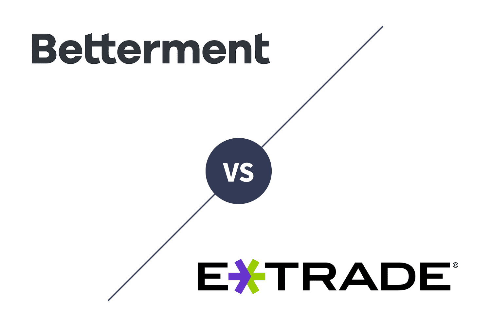

Robo-advisors and algorithmic trading have fundamentally transformed investment management by leveraging technology to automate and optimize investment strategies. Over the past decade, these innovations have gained significant traction among individual and institutional investors seeking efficient, data-driven investment solutions. Robo-advisors are financial advisory platforms that use algorithms to generate personalized investment advice and manage portfolios with minimal human intervention. Algorithmic trading refers to the use of computer algorithms to execute trading orders based on predefined criteria, allowing for high-frequency trading and enhanced precision.

Several key players in the market have emerged as leaders in this rapidly evolving landscape. Notable among them are Betterment and E*TRADE Core Portfolios. Betterment, founded in 2008, is one of the largest independent robo-advisors, offering a comprehensive suite of services that include portfolio management, retirement planning, and tax optimization. E*TRADE, a veteran in online financial services, introduced its Core Portfolios to combine the strength of its brokerage offerings with automated investment management.

The purpose of this article is to provide a nuanced comparison of Betterment and E*TRADE Core Portfolios, focusing on their algorithmic trading capabilities. By examining these platforms, investors can gain a clearer understanding of how their algorithm-driven features and services differ and align with various investment goals. This comparison aims to equip readers with valuable insights into fee structures, algorithmic strategies, user experiences, and performance metrics.

Investors today face a plethora of tools and platforms, making it imperative to conduct thorough evaluations before making investment decisions. As these tools continue to evolve and reshuffle the financial landscape, understanding their differences and potential benefits becomes crucial. By offering a detailed analysis between Betterment and E*TRADE Core Portfolios, this article hopes to facilitate more informed decision-making, ensuring that investors choose platforms that best align with their financial objectives and preferences.

## Table of Contents

## Understanding Betterment and E*TRADE Core Portfolios

Betterment, founded in 2008, has established itself as a pioneering force in the robo-advisory sector. As one of the earliest entrants to this burgeoning market, Betterment offers a platform that provides personalized investment advice utilizing sophisticated algorithms. These algorithms optimize investment portfolios based on the individual financial goals and risk tolerance of each user. The overarching mission of Betterment is to democratize access to financial advisory services, making professional guidance available to a wider audience that may not have the resources to consult with traditional financial advisors.

On the other hand, E*TRADE, a well-established name in the brokerage industry, launched its Core Portfolios service as an extension of its comprehensive digital financial services. E*TRADE Core Portfolios aims to combine the ease of robo-advisory services with the depth of E*TRADE's broader investment product offerings. The platform uses a similar algorithm-driven model that creates diversified portfolios tailored to each client's financial situation and investment horizon.

The general features common to both Betterment and E*TRADE Core Portfolios include automated portfolio management, personalized financial planning, and low-cost fee structures. Furthermore, both platforms offer tax-efficient strategies, such as tax-loss harvesting and automatic rebalancing, which are crucial for optimizing post-tax investment returns. However, Betterment is known for its additional financial planning packages integrating human advisors, adding an extra layer of personalization for users requiring bespoke advice.

User interface and customer experience are critical for any digital advisory service. Betterment prides itself on an intuitive interface that ensures a seamless user journey from onboarding to portfolio monitoring. Its design prioritizes clarity, enabling users to easily track their investment goals and portfolio performance. E*TRADE Core Portfolios features a more comprehensive dashboard that is integrated with E*TRADE's broader trading platform. This integration serves users who might be interested in a more hands-on approach to investing, offering them additional tools and resources beyond automated management.

Target audience segmentation highlights distinct approaches by each platform. Betterment primarily attracts beginner investors or those with a preference for a more passive investment strategy, valuing simplicity and automated guidance with optional human advisor input. E*TRADE Core Portfolios, however, draws individuals who may already engage in self-directed trading but seek to allocate a portion of their assets to a professionally managed service. These users value the flexibility of having access to a broader range of investment products while benefiting from automated portfolio management. 

In summary, both Betterment and E*TRADE Core Portfolios cater to different facets of the investment community. Their distinct offerings and user experiences reflect the diversity in investor needs, from those seeking hands-off, algorithm-driven investment solutions to those looking for a blend of automated advice with self-directed trading capabilities.

## How Algorithmic Trading Works in Investment Platforms

Algorithmic trading is a method of executing trades using automated and pre-programmed trading instructions. These algorithms are designed to account for variables such as time, price, and [volume](/wiki/volume-trading-strategy). Developed to maximize efficiency and ensure data-driven decision-making, [algorithmic trading](/wiki/algorithmic-trading) has become a cornerstone in modern investment strategies. Its significance lies in its ability to process large volumes of data at high speeds, thus enabling investors to execute trades with precision and minimal manual intervention.

One of the primary advantages of algorithmic trading is the elimination of human error. Algorithms can operate under the predefined conditions without emotional influence, facilitating trades based on historical data and market trends. This leads to increased efficiency, as trades can be made at optimal times, often in fractions of a second, which is a considerable advantage in the fast-paced financial markets. Furthermore, algorithms are designed to backtest using historical data to optimize the strategies before they are live-traded.

Platforms like Betterment and E*TRADE leverage several common algorithms for their trading strategies. Among these, mean reversion, [momentum](/wiki/momentum) trading, and market-making algorithms are frequently employed. Mean reversion strategies are based on the assumption that asset prices will revert to the mean over time. Momentum trading relies on the trend-following strategy where algorithms buy securities when their prices are rising and sell them when their prices are falling. Market-making algorithms enable platforms to provide [liquidity](/wiki/liquidity-risk-premium) by simultaneously buying and selling assets.

Algorithmic trading aligns with modern investment goals by prioritizing risk management and strategic asset allocation. Investors can target specific risk-reward ratios by utilizing algorithms designed to rebalance portfolios in response to market fluctuations. This is particularly relevant in diversified portfolios, where maintaining an optimal asset mix is crucial for achieving long-term financial objectives. Risk management is further enhanced through the use of stop-loss orders and other protective measures embedded within the algorithms.

Technological advancements have played a pivotal role in the evolution of algorithmic trading. Increased computational power, data storage capability, and connectivity have enabled the development of complex algorithms capable of processing vast amounts of financial data in real time. Machine learning and [artificial intelligence](/wiki/ai-artificial-intelligence) are increasingly being integrated into these algorithms, allowing platforms to improve their predictive accuracy and adapt to changing market conditions dynamically.

In summary, algorithmic trading is an indispensable tool in contemporary investment platforms, providing efficiency, precision, and strategic flexibility. As technology continues to evolve, the methodologies surrounding algorithmic trading are expected to become more sophisticated, further enhancing their appeal to investors seeking comprehensive and proactive financial management solutions.

## Key Features of Betterment’s Algo Trading

Betterment is a prominent player in the robo-advisory market, renowned for its sophisticated algorithmic trading strategies. At the core of Betterment’s approach is the use of advanced algorithms to automate personalized portfolio management, allowing for a tailored investment experience. Utilizing Modern Portfolio Theory (MPT), Betterment optimizes asset allocation based on an investor's risk tolerance and financial goals. This strategic allocation is continually adjusted using data-driven insights to maintain an ideal balance between risk and return.

A key feature of Betterment’s algorithmic trading is tax-loss harvesting, a process whereby investments that have experienced losses are sold to offset capital gains, thereby minimizing tax liabilities. This is facilitated through automated algorithms that scan for opportunities to implement tax-loss harvesting strategies efficiently. Furthermore, Betterment offers automatic rebalancing, ensuring that an investor's portfolio remains aligned with their target asset allocation. This rebalancing acts as a safeguard against market [volatility](/wiki/volatility-trading-strategies), automatically adjusting the portfolio to ensure it remains in accordance with the investor’s predetermined risk profile.

Feedback from users often highlights Betterment’s intuitive platform and the effectiveness of its algorithmic strategies in achieving financial objectives. Performance metrics indicate consistent returns aligned with market performance, although individual results may vary based on specific investment plans and market conditions. Betterment’s client satisfaction is bolstered by its transparent cost structure. The platform employs a straightforward fee system, generally charging a percentage of assets under management, which typically includes all transactions and administration fees. This transparency enables investors to comprehend the total cost of their investment management services without hidden charges.

Moreover, transparency is further enhanced by offering detailed portfolio analyses and projections, which help investors understand the potential risks and rewards associated with their investments. The innovative use of technology not only provides an efficient service but also educates users, empowering them to make informed investment choices. Overall, Betterment’s algorithmic trading capabilities provide a compelling mix of personalized service, efficiency, and cost-effectiveness, making it a popular choice among tech-savvy investors seeking automated financial solutions.

## Key Features of E*TRADE Core Portfolios’ Algo Trading

E*TRADE Core Portfolios harnesses the power of algorithmic trading to deliver an efficient and data-driven approach to personal investment management. This service utilizes sophisticated algorithms to automate the processes involved in portfolio management, thereby reducing the manual effort usually required in monitoring and rebalancing investments.

### Algorithmic Balancing and Optimization

E*TRADE Core Portfolios' algorithms are designed to balance and optimize investment portfolios based on predetermined financial goals and risk tolerances. By analyzing a myriad of market variables and asset performance metrics, these algorithms ensure that portfolios remain congruent with the client’s financial objectives. The system regularly evaluates asset allocations and adjusts them to maintain the desired level of risk and return, thus providing a systematic approach to investment management.

The platform utilizes Modern Portfolio Theory, employing principles such as diversification to spread investment risk across different asset classes. The mean-variance optimization technique is often used to identify the most efficient portfolio configuration, balancing the expected return against the associated risk.

### Rebalancing and Tax Efficiency

The automatic rebalancing feature is a significant advantage of E*TRADE Core Portfolios. This service maintains the strategic asset allocation by adjusting the portfolio composition when certain thresholds are exceeded due to market fluctuations. Periodic rebalancing is crucial as it aligns the portfolio back to its intended risk profile and asset allocation, thereby adhering to the investor’s financial strategy.

Moreover, E*TRADE provides tax-efficient investment solutions through strategies such as tax-loss harvesting. This process involves selling underperforming securities at a loss to offset capital gains tax liabilities, thus enhancing the tax efficiency of the investment portfolio.

### Performance and Client Satisfaction

E*TRADE's approach to algorithmic trading is marked by considerable client satisfaction, largely due to its user-friendly interface and robust customer support services. In terms of performance, E*TRADE Core Portfolios have a track record of achieving competitive returns by leveraging algorithmic strategies that systematically evaluate and adjust investments.

Customer feedback typically highlights the ease of setting up and managing portfolios, with many investors appreciating the transparency and clarity found in service reports and communications.

### Fee Structure

E*TRADE Core Portfolios operate on a straightforward fee structure, charging an annual advisory fee of 0.30% of the assets under management (AUM). This fee covers the cost of investment management, including algorithmic trading activities, rebalancing services, and customer support. The transparent fee model is designed to ensure that there are no hidden charges, allowing investors to clearly understand the costs associated with managing their portfolios.

The impact of the fee structure on investment returns is often positive due to the potentially higher efficiency gained through algorithmic management, although investors should always consider whether the service aligns with their financial goals and cost expectations. 

To summarize, E*TRADE Core Portfolios stands as a potentially effective solution for investors seeking automated, algorithm-driven asset management coupled with tax efficiency and consistent portfolio optimization.

## Comparison: Betterment vs E*TRADE Core Portfolios

Betterment and E*TRADE Core Portfolios are prominent players in the landscape of robo-advisory services, each offering distinct algorithmic trading features tailored to various investor profiles. 

### Algorithmic Trading Features

Betterment primarily focuses on leveraging sophisticated algorithms for personalized portfolio management. It offers automated rebalancing and tax-loss harvesting, which are designed to optimize investment strategies and enhance after-tax returns. Betterment's algorithms are built to maximize efficiency through a rules-based approach, ensuring portfolios remain aligned with the user's financial goals and risk tolerance.

E*TRADE Core Portfolios also employ algorithmic strategies, emphasizing portfolio optimization and risk management. One of its notable features is automatic rebalancing, similar to Betterment, which helps maintain the intended asset allocation as market conditions fluctuate. Additionally, E*TRADE integrates tax efficiency solutions, though its approach is less centered on advanced tax-loss harvesting compared to Betterment, focusing instead on broad tax efficiencies.

### Fees and Costs

Betterment charges an annual fee that typically ranges from 0.25% to 0.40% of assets under management (AUM). This fee structure is competitive, especially for investors seeking value from tax strategies and a sophisticated algorithmic framework. In contrast, E*TRADE's fee is around 0.30% of AUM, positioning it slightly above Betterment's basic tier but with potential savings for investors who do not require elaborate tax optimization strategies.

Fees are a critical consideration, as higher fees can erode investment gains over time. The formula for calculating the impact of fees is as follows:

$$
\text{Net Return} = \text{Gross Return} - \text{Fees}
$$

Where $\text{Fees}$ could range depending on AUM and the specific fee percentage.

### Performance, Customer Support, and Ease of Use

Performance analysis reveals that both platforms offer competitive returns, shaped largely by their exposure to diverse asset classes and adherence to algorithmic strategies. Betterment has received positive feedback for its robust financial planning tools and comprehensive performance metrics, which resonate with tech-savvy investors.

Customer support at Betterment is noted for its accessibility through multiple channels, including digital interfaces and human advisors. E*TRADE provides strong client support, emphasizing its integration with E*TRADE's broader brokerage services, offering a slight edge for investors who might need more traditional trading capabilities.

Ease of use is another consideration where Betterment excels, with its streamlined interface designed for intuitive navigation and minimal user intervention. E*TRADE, while user-friendly, appeals to investors who might value a more integrated approach with additional features beyond core portfolios.

### Scenarios of Preference

Betterment is often preferred by investors who value advanced tax strategies and a highly automated service with minimal fees. It's ideal for tech-savvy individuals or those focusing on long-term wealth accumulation with personalized strategies.

Conversely, E*TRADE Core Portfolios might be preferable for investors who appreciate broader platform services, such as direct access to traditional trading and banking services through E*TRADE. It is also suitable for investors looking for a slightly more hands-on approach but still desire the benefits of algorithmic portfolio management.

### Customer Reviews and Testimonials

Customer reviews highlight Betterment's efficiency and insightful financial tools, with users frequently praising its intuitive setup and potent tax strategies. E*TRADE Core Portfolios receive commendations for seamless integration with broader investment opportunities and strong customer service support.

In conclusion, the choice between Betterment and E*TRADE Core Portfolios hinges on individual investor needs, balancing desired fee structures, tax considerations, and additional platform features. Each platform offers unique benefits, making comprehensive evaluations essential to aligning with personal financial goals.

## Conclusion

Betterment and E*TRADE Core Portfolios stand as prominent choices for investors seeking algorithmic trading platforms with distinctive features and advantages. While both platforms offer algorithmic trading solutions, they cater to different needs and preferences, providing users with a choice based on their investment strategies and goals.

Betterment is renowned for its user-friendly interface and focus on personalized portfolio management. It excels in offering tools such as tax-loss harvesting and automatic rebalancing, making it a preferred choice for individual investors aiming for optimized tax efficiencies and seamless management. The platform's transparent fee structure, starting at 0.25% of assets under management annually, appeals to those looking for straightforward and predictable costs.

In contrast, E*TRADE Core Portfolios provides a comprehensive suite of algorithmic trading features that emphasize portfolio optimization and balance. With a slightly higher fee starting at 0.30%, E*TRADE offers additional benefits such as access to extensive research resources and a wider array of investment options. This positions E*TRADE as a favorable choice for investors who value in-depth research capabilities and broader access to diverse market segments.

Investors must consider their long-term financial goals when selecting between these platforms. Those prioritizing ease of use and personalized services might lean towards Betterment, whereas investors seeking more extensive tools and resources may find E*TRADE more suitable. Exploring demo accounts for hands-on experience with the platforms can provide valuable insights before committing.

The future of algorithmic trading is promising, as technological advancements continue to refine and enhance these platforms. Both Betterment and E*TRADE demonstrate the evolving role of technological solutions in personal finance, offering innovative ways to manage investments effectively. As algorithmic trading becomes increasingly sophisticated, its capacity to deliver data-driven, efficient investment strategies is likely to grow, continuing to shape the landscape of investment management for the benefit of individual investors.

## Additional Resources

### Links to Official Websites

For comprehensive understanding and personal exploration of the services offered by these platforms, you can visit their respective official websites:
- [Betterment](https://www.betterment.com/)
- [E*TRADE Core Portfolios](https://us.etrade.com/what-we-offer/etrade-core-portfolios)

These websites provide in-depth information about their investment strategies, pricing structures, and account setup procedures.

### Recommended Readings

For those interested in learning more about algorithmic trading and robo-advisory services, the following readings are recommended:
1. *Algorithmic Trading: Winning Strategies and Their Rationale* by Ernest P. Chan - This book provides insights into developing algorithmic trading strategies.

2. *The Bogleheads' Guide to Investing* by Mel Lindauer, Taylor Larimore, and Michael LeBoeuf - An excellent resource for understanding long-term investment strategies, which can complement algorithm-driven approaches.

3. *Robo-Advisory: Opportunities and Risks for the Future of Financial Advisory* edited by Markus Schaulinski - A comprehensive guide to the role and future of robo-advisors in financial management.

### Access to Investment Forums and User Groups

Engaging with online communities can provide valuable user experiences and insights. Here are a few platforms where investors discuss Betterment and E*TRADE:
- [Bogleheads Forum](https://www.bogleheads.org/forum/index.php?sid=df1a8b2bc635960eae492bfd9cf4599f) - A community focused on long-term passive investment strategies, including discussions on robo-advisors.
- [Reddit's r/PersonalFinance](https://www.reddit.com/r/personalfinance/) - A subreddit where individuals share experiences and advice on different investment platforms.
- [Investopedia’s Forum](https://www.investopedia.com/) - A place for investors to discuss various financial markets and tools.

### Suggested Financial Advisory Books

To further enrich your understanding of finance and investments, the following [books](/wiki/algo-trading-books) can be invaluable:
- *The Intelligent Investor* by Benjamin Graham - Considered the definitive book on value investing.
- *Principles: Life and Work* by Ray Dalio - Offers principles from a leading hedge fund manager which can be applied in investment decision-making.
- *A Random Walk Down Wall Street* by Burton G. Malkiel - Provides insights into various investment strategies, including the use of algorithms.

### Contact Information for Financial Planners

For personalized guidance in algorithmic investments, consider reaching out to financial planners with expertise in this area. Professional resources such as [NAPFA (National Association of Personal Financial Advisors)](https://www.napfa.org/) can help locate fiduciary financial planners. Additionally, utilizing platforms like [XY Planning Network](https://www.xyplanningnetwork.com/) may connect you with advisors who specialize in innovative investment strategies including robo-advisory services.

## References & Further Reading

[1]: Bergstra, J., Bardenet, R., Bengio, Y., & Kégl, B. (2011). ["Algorithms for Hyper-Parameter Optimization."](https://papers.nips.cc/paper/4443-algorithms-for-hyper-parameter-optimization) Advances in Neural Information Processing Systems 24.

[2]: ["Advances in Financial Machine Learning"](https://www.amazon.com/Advances-Financial-Machine-Learning-Marcos/dp/1119482089) by Marcos Lopez de Prado

[3]: ["Evidence-Based Technical Analysis: Applying the Scientific Method and Statistical Inference to Trading Signals"](https://www.amazon.com/Evidence-Based-Technical-Analysis-Scientific-Statistical/dp/0470008741) by David Aronson

[4]: ["Machine Learning for Algorithmic Trading"](https://github.com/stefan-jansen/machine-learning-for-trading) by Stefan Jansen

[5]: ["Quantitative Trading: How to Build Your Own Algorithmic Trading Business"](https://www.amazon.com/Quantitative-Trading-Build-Algorithmic-Business/dp/1119800064) by Ernest P. Chan