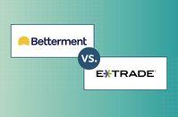

## Table of Contents

## What are Betterment and E*TRADE Core Portfolios?

Betterment is an online investment platform that helps people manage their money easily. It's known for being a robo-advisor, which means it uses computer programs to create and manage investment portfolios for its users. Betterment asks you questions about your goals and how much risk you're willing to take, then it builds a personalized investment plan for you. It automatically adjusts your investments to keep them in line with your goals and risk level. Betterment also offers features like tax-loss harvesting, which can help you save money on taxes.

E*TRADE Core Portfolios is another robo-advisor service, but it's offered by E*TRADE, a well-known online brokerage. Like Betterment, E*TRADE Core Portfolios uses algorithms to build and manage your investment portfolio based on your goals and risk tolerance. It's designed to be simple and easy to use, making investing accessible to everyone. E*TRADE Core Portfolios also provides regular account updates and rebalances your portfolio to keep it aligned with your investment strategy. Both services aim to make investing easier and more efficient, but they come from different companies with slightly different features and fees.

## How do Betterment and E*TRADE Core Portfolios differ in terms of investment options?

Betterment offers a wide range of investment options that are designed to fit different goals and levels of risk. They have portfolios that include stocks, bonds, and other assets like real estate and commodities. Betterment also lets you choose between different types of funds, such as socially responsible funds if you want to invest in companies that are good for the environment or society. They even offer a cash management account for those who want to keep some of their money in a safe place while still earning a bit of interest.

E*TRADE Core Portfolios, on the other hand, focuses on a more straightforward approach. They mainly use exchange-traded funds (ETFs) to build your portfolio. These ETFs cover a mix of stocks and bonds, and E*TRADE tries to keep things simple by not offering as many specialized options as Betterment. If you're looking for a basic, easy-to-understand investment plan, E*TRADE Core Portfolios might be the better choice. But if you want more variety and the ability to customize your investments, Betterment could be more suitable for you.

## What are the fee structures for Betterment and E*TRADE Core Portfolios?

Betterment has two types of accounts: a basic one and a premium one. The basic account has a fee of 0.25% of the money you have invested each year. So, if you have $10,000 invested, you'll pay $25 a year. The premium account costs more, at 0.40% per year, but it comes with extra features like talking to a financial expert. Both accounts also have fees from the funds they invest in, which are usually around 0.07% to 0.15% a year.

E*TRADE Core Portfolios is simpler with its fees. They charge a flat fee of 0.30% of your total investment each year. That means if you have $10,000 invested, you'll pay $30 a year. Just like Betterment, E*TRADE also has fees from the ETFs they use, but these are usually low, around 0.06% to 0.12% a year. So, overall, the fees for both services are pretty close, but Betterment gives you the option to pay more for extra help.

## How do the minimum investment requirements compare between Betterment and E*TRADE Core Portfolios?

Betterment has a low minimum investment requirement. You can start investing with just $10 if you want to use their basic account. If you choose the premium account, which gives you extra help from financial experts, you need at least $100,000 to start.

E*TRADE Core Portfolios has a higher minimum investment requirement compared to Betterment's basic account. You need at least $500 to start investing with E*TRADE Core Portfolios. This might be a bit more than what some people can start with, but it's still a reasonable amount for many.

## What kind of account types are supported by Betterment and E*TRADE Core Portfolios?

Betterment supports a variety of account types to help people with different needs. You can open an individual account if you want to invest by yourself. They also offer joint accounts for couples or partners who want to manage their money together. If you're saving for retirement, Betterment has traditional IRAs and Roth IRAs. They even have SEP IRAs for self-employed people and small business owners. Plus, if you're saving for a child's education, you can use a 529 college savings plan with Betterment.

E*TRADE Core Portfolios also offers several types of accounts to fit different goals. You can start with an individual account for personal investing. They also provide joint accounts for shared investments. For retirement, E*TRADE Core Portfolios supports traditional IRAs and Roth IRAs, which can help you save for your future. If you're a business owner, you can use a SEP IRA to save for retirement. E*TRADE Core Portfolios focuses on keeping things simple, so they might not offer as many specialized account types as Betterment, but they cover the basics well.

## How do the tax strategies of Betterment and E*TRADE Core Portfolios differ?

Betterment uses smart tax strategies to help you keep more of your money. One big thing they do is called tax-loss harvesting. This means they look for chances to sell investments that have gone down in value and then buy similar ones. By doing this, they can help you get a tax break without changing your investment plan much. Betterment also lets you choose how to handle taxes in your account, like deciding which investments go into your IRA or taxable accounts to save on taxes. They do all this automatically, so you don't have to worry about it.

E*TRADE Core Portfolios also cares about taxes, but they keep things simpler. They use tax-loss harvesting too, but they might not do it as often or in as many ways as Betterment. E*TRADE focuses on keeping your investments balanced, which can help with taxes, but they don't offer as many special tax strategies. They do the basic things to help you with taxes, but if you want a lot of different ways to save on taxes, Betterment might be better for you.

## What are the performance histories of Betterment and E*TRADE Core Portfolios?

Betterment has been around since 2010 and has shown good performance over the years. They focus on keeping your investments balanced and use smart strategies to help you earn more money. They say that if you stick with them for a long time, you could see good results. But remember, past performance doesn't promise future success. It's always a good idea to look at the latest numbers and see how they're doing now.

E*TRADE Core Portfolios started a bit later, in 2016. They've also done well, but they haven't been around as long as Betterment. They use a simple approach to help your money grow, and they keep things easy to understand. Like with Betterment, past performance doesn't mean they'll do the same in the future. It's smart to check their recent performance and see if it matches what you're looking for in an investment.

## How do Betterment and E*TRADE Core Portfolios handle portfolio rebalancing?

Betterment makes sure your investments stay on track by automatically rebalancing your portfolio. They check your investments regularly and make small changes to keep your mix of stocks and bonds the same as when you started. If one part of your portfolio grows faster than the others, Betterment will sell some of it and buy more of the slower-growing parts. This way, your investments match your goals and how much risk you want to take, without you having to do anything.

E*TRADE Core Portfolios also rebalances your portfolio automatically, but they might do it a bit differently. They look at your investments from time to time and adjust them to keep everything in line with your plan. If your stocks or bonds get out of balance, E*TRADE will sell some and buy others to fix it. Like Betterment, they do this work for you, so you don't have to worry about keeping your investments in the right mix.

## What tools and features does each platform offer for financial planning and analysis?

Betterment offers a variety of tools to help you plan your finances and understand how your money is doing. They have a goal-setting feature where you can tell them what you want to save for, like buying a house or retiring, and they'll show you how to reach those goals. Betterment also gives you reports and charts that help you see where your money is going and how your investments are growing. They have a tool called Tax Impact Preview that shows you how different choices might affect your taxes. Plus, if you have a premium account, you can talk to a financial expert who can give you advice on your plans.

E*TRADE Core Portfolios keeps things simple but still gives you tools to help with your financial planning. They show you how your portfolio is doing with easy-to-read charts and reports. You can see how your investments are performing over time and how they compare to the market. E*TRADE also lets you set up different goals, like saving for retirement or a big purchase, and they'll help you stay on track. While they don't offer as many advanced tools as Betterment, E*TRADE Core Portfolios focuses on making sure you have the basics to manage your money well.

## How do customer service and user experience compare between Betterment and E*TRADE Core Portfolios?

Betterment is known for being easy to use and having good customer service. They have a website and app that are simple to navigate, so you can manage your money without any trouble. If you need help, Betterment has a lot of ways to get in touch with them. You can use their chat service, send an email, or call them. If you have a premium account, you can even talk to a financial expert who can give you advice. People like how friendly and helpful Betterment's customer service is.

E*TRADE Core Portfolios also tries to make things easy for you. Their website and app are straightforward, so you can see how your investments are doing without getting confused. For customer service, E*TRADE offers phone support and email, but they don't have a live chat like Betterment. Some people think E*TRADE's customer service can be a bit slower to respond, but they still try to help you out. Overall, both platforms want to make investing simple, but Betterment might have a bit more to offer when it comes to customer support and user experience.

## What are the mobile app capabilities for Betterment and E*TRADE Core Portfolios?

Betterment's mobile app is easy to use and lets you do a lot of things right from your phone. You can see how your investments are doing, add money to your account, and change your goals if you need to. The app also lets you talk to Betterment's customer service through chat if you have questions. It's simple to use, so you don't need to be a money expert to use it. People like how the app helps them keep an eye on their money without any trouble.

E*TRADE Core Portfolios' mobile app is also easy to use, but it might not have as many features as Betterment's. You can check your investments, see how they're doing, and add money to your account. The app has charts and reports that help you understand your money better. If you need help, you can call or email customer service, but there's no chat option like Betterment has. The app is good for keeping things simple and helping you manage your investments on the go.

## How do the advanced investment options and customization features differ between Betterment and E*TRADE Core Portfolios?

Betterment offers a lot of ways to make your investments fit what you want. They have different types of funds, like ones that focus on being good for the environment or society. You can also choose how much risk you want to take and set goals for things like buying a house or retiring. Betterment even lets you decide where to put your money to save on taxes, like choosing which investments go into your IRA or regular account. If you pay for their premium account, you get to talk to a financial expert who can help you make your plan even better.

E*TRADE Core Portfolios keeps things simpler and doesn't offer as many special options as Betterment. They mainly use exchange-traded funds (ETFs) to build your portfolio, and you can pick how much risk you want to take. You can set goals for saving, but you won't find as many different types of funds to choose from. E*TRADE focuses on making investing easy and straightforward, so if you want a lot of different ways to customize your investments, Betterment might be better for you.

## Which is better: Betterment or E*TRADE Core Portfolios?

Betterment and E*TRADE Core Portfolios are prominent players in the landscape of robo-advisory services, each offering distinct [algorithmic trading](/wiki/algorithmic-trading) features tailored to various investor profiles. 

### Algorithmic Trading Features

Betterment primarily focuses on leveraging sophisticated algorithms for personalized portfolio management. It offers automated rebalancing and tax-loss harvesting, which are designed to optimize investment strategies and enhance after-tax returns. Betterment's algorithms are built to maximize efficiency through a rules-based approach, ensuring portfolios remain aligned with the user's financial goals and risk tolerance.

E*TRADE Core Portfolios also employ algorithmic strategies, emphasizing portfolio optimization and risk management. One of its notable features is automatic rebalancing, similar to Betterment, which helps maintain the intended asset allocation as market conditions fluctuate. Additionally, E*TRADE integrates tax efficiency solutions, though its approach is less centered on advanced tax-loss harvesting compared to Betterment, focusing instead on broad tax efficiencies.

### Fees and Costs

Betterment charges an annual fee that typically ranges from 0.25% to 0.40% of assets under management (AUM). This fee structure is competitive, especially for investors seeking value from tax strategies and a sophisticated algorithmic framework. In contrast, E*TRADE's fee is around 0.30% of AUM, positioning it slightly above Betterment's basic tier but with potential savings for investors who do not require elaborate tax optimization strategies.

Fees are a critical consideration, as higher fees can erode investment gains over time. The formula for calculating the impact of fees is as follows:

$$
\text{Net Return} = \text{Gross Return} - \text{Fees}
$$

Where $\text{Fees}$ could range depending on AUM and the specific fee percentage.

### Performance, Customer Support, and Ease of Use

Performance analysis reveals that both platforms offer competitive returns, shaped largely by their exposure to diverse asset classes and adherence to algorithmic strategies. Betterment has received positive feedback for its robust financial planning tools and comprehensive performance metrics, which resonate with tech-savvy investors.

Customer support at Betterment is noted for its accessibility through multiple channels, including digital interfaces and human advisors. E*TRADE provides strong client support, emphasizing its integration with E*TRADE's broader brokerage services, offering a slight edge for investors who might need more traditional trading capabilities.

Ease of use is another consideration where Betterment excels, with its streamlined interface designed for intuitive navigation and minimal user intervention. E*TRADE, while user-friendly, appeals to investors who might value a more integrated approach with additional features beyond core portfolios.

### Scenarios of Preference

Betterment is often preferred by investors who value advanced tax strategies and a highly automated service with minimal fees. It's ideal for tech-savvy individuals or those focusing on long-term wealth accumulation with personalized strategies.

Conversely, E*TRADE Core Portfolios might be preferable for investors who appreciate broader platform services, such as direct access to traditional trading and banking services through E*TRADE. It is also suitable for investors looking for a slightly more hands-on approach but still desire the benefits of algorithmic portfolio management.

### Customer Reviews and Testimonials

Customer reviews highlight Betterment's efficiency and insightful financial tools, with users frequently praising its intuitive setup and potent tax strategies. E*TRADE Core Portfolios receive commendations for seamless integration with broader investment opportunities and strong customer service support.

In conclusion, the choice between Betterment and E*TRADE Core Portfolios hinges on individual investor needs, balancing desired fee structures, tax considerations, and additional platform features. Each platform offers unique benefits, making comprehensive evaluations essential to aligning with personal financial goals.

## References & Further Reading

[1]: Bergstra, J., Bardenet, R., Bengio, Y., & Kégl, B. (2011). ["Algorithms for Hyper-Parameter Optimization."](https://papers.nips.cc/paper/4443-algorithms-for-hyper-parameter-optimization) Advances in Neural Information Processing Systems 24.

[2]: ["Advances in Financial Machine Learning"](https://www.amazon.com/Advances-Financial-Machine-Learning-Marcos/dp/1119482089) by Marcos Lopez de Prado

[3]: ["Evidence-Based Technical Analysis: Applying the Scientific Method and Statistical Inference to Trading Signals"](https://www.amazon.com/Evidence-Based-Technical-Analysis-Scientific-Statistical/dp/0470008741) by David Aronson

[4]: ["Machine Learning for Algorithmic Trading"](https://github.com/stefan-jansen/machine-learning-for-trading) by Stefan Jansen

[5]: ["Quantitative Trading: How to Build Your Own Algorithmic Trading Business"](https://www.amazon.com/Quantitative-Trading-Build-Algorithmic-Business/dp/1119800064) by Ernest P. Chan