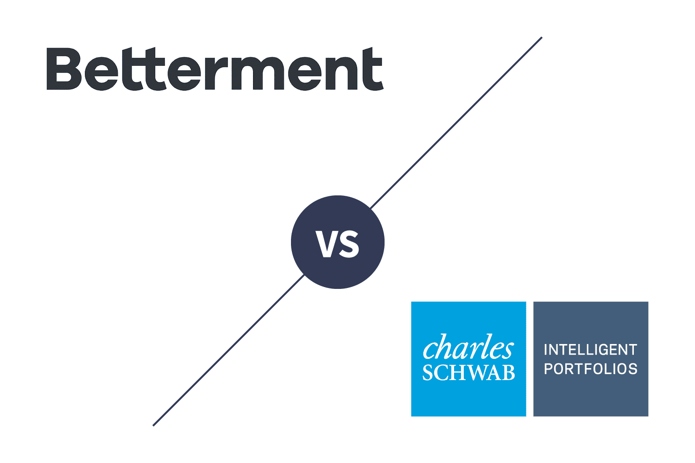

## Table of Contents

## What are Betterment and Schwab Intelligent Portfolios?

Betterment and Schwab Intelligent Portfolios are both robo-advisors, which means they are online services that use computer algorithms to manage your investments. Betterment was one of the first robo-advisors and it helps you invest your money in a way that matches your goals and how much risk you are willing to take. They offer different types of accounts like individual, joint, and retirement accounts. Betterment also gives you advice on how to save for things like buying a house or going to college.

Schwab Intelligent Portfolios is a robo-advisor from Charles Schwab, a big financial company. Like Betterment, it uses technology to create and manage a portfolio for you based on your goals and risk tolerance. One big difference is that Schwab Intelligent Portfolios does not charge any advisory fees, but you need to keep at least $5,000 in your account. They also offer different types of accounts and can help you with planning for retirement or other financial goals.

Both services are easy to use and can be a good choice if you want to invest your money but don't want to spend a lot of time managing it yourself. They take care of the hard work of choosing and adjusting your investments to help you reach your financial goals.

## How do Betterment and Schwab Intelligent Portfolios differ in terms of fees?

Betterment charges a fee for managing your money. For their basic plan, called Betterment Digital, you pay 0.25% of the money you have invested each year. If you want more help and advice, you can choose Betterment Premium, which costs 0.40% per year, but you need to have at least $100,000 invested. On top of these fees, there are also costs for the ETFs (exchange-traded funds) that Betterment invests your money in, which are usually around 0.07% to 0.15% per year.

Schwab Intelligent Portfolios, on the other hand, does not charge any advisory fees. This means you don't pay them to manage your money. However, you need to keep at least $5,000 in your account to use their service. Like Betterment, Schwab also invests your money in ETFs, and these ETFs have their own fees, which are about 0.02% to 0.16% per year. So, while you don't pay Schwab directly for managing your money, you still pay the costs of the ETFs they choose for your portfolio.

## What types of investment accounts can be opened with Betterment and Schwab Intelligent Portfolios?

With Betterment, you can open several types of accounts to help you reach your financial goals. They offer individual and joint taxable accounts, which are good if you want to invest money that you can take out at any time. Betterment also has retirement accounts like Traditional IRAs, Roth IRAs, and SEP IRAs, which are great for saving for your future. If you're saving for your kids' education, you can open a 529 account with Betterment too. They even have trust accounts if you need to manage money for someone else.

Schwab Intelligent Portfolios also offers a variety of account types to suit different needs. You can open individual and joint taxable accounts, just like with Betterment, to invest money you might need to access at any time. For retirement, they offer Traditional IRAs, Roth IRAs, and rollover IRAs to help you save for your later years. If you're planning for your children's education, Schwab Intelligent Portfolios allows you to set up a 529 account as well. They also provide trust accounts for managing money on behalf of others.

## How do the investment strategies of Betterment and Schwab Intelligent Portfolios compare?

Betterment and Schwab Intelligent Portfolios both use computer programs to pick and manage your investments. They look at how much risk you want to take and what you want to achieve with your money. Betterment spreads your money across different types of investments like stocks and bonds. They use ETFs to do this. Betterment also changes your investments over time to keep them in line with what you want, a process they call rebalancing. They also use a special method called tax-loss harvesting to help you save on taxes.

Schwab Intelligent Portfolios works in a similar way but with some differences. They also use ETFs and spread your money across different investments based on your risk level and goals. Schwab's portfolios include a mix of stocks, bonds, and even cash. They also rebalance your investments to keep them on track. However, Schwab does not offer tax-loss harvesting in their basic service, though you can get it if you pay for their premium service, called Schwab Intelligent Portfolios Premium. So, while both services aim to grow your money in a way that fits your needs, Betterment includes tax-loss harvesting in all their plans, while Schwab only offers it with their premium option.

## What are the minimum investment requirements for Betterment and Schwab Intelligent Portfolios?

Betterment does not have a minimum amount of money you need to start investing with them. You can begin with any amount you want. This makes it easy for anyone to start investing, even if you don't have a lot of money to begin with.

Schwab Intelligent Portfolios, on the other hand, does have a minimum amount you need to start. You need to have at least $5,000 to open an account with them. This might be harder for some people, but it's something to think about if you are choosing between the two services.

## How do Betterment and Schwab Intelligent Portfolios handle tax strategies?

Betterment uses a special method called tax-loss harvesting to help you save on taxes. This means they look at your investments and sell the ones that have gone down in value. By doing this, they can use those losses to reduce the taxes you owe on your gains. Betterment does this for all their customers, no matter which plan you choose. This can help you keep more of your money over time.

Schwab Intelligent Portfolios also wants to help you with your taxes, but they do it differently. Their basic service does not include tax-loss harvesting. If you want this feature, you have to pay for their premium service, called Schwab Intelligent Portfolios Premium. This means that if you want to use Schwab and save on taxes, you might have to pay extra for it.

## What kind of customer support do Betterment and Schwab Intelligent Portfolios offer?

Betterment offers customer support through several ways. You can call them, send an email, or use their live chat on their website. They have people available to help you from Monday to Friday during regular business hours. If you choose their premium plan, you also get a special team to help you with your money questions and give you advice on how to reach your goals.

Schwab Intelligent Portfolios also gives you different ways to get help. You can call them, send an email, or chat with someone online. They have support available every day of the week, and their hours are longer than Betterment's. If you choose their premium service, you get extra help from financial advisors who can give you personal advice on your investments.

## How do the user interfaces and experiences of Betterment and Schwab Intelligent Portfolios compare?

Betterment has a clean and easy-to-use website and app. When you sign up, you answer some questions about your money goals and how much risk you want to take. Then, Betterment shows you where your money is going in a simple way. You can see your investments, add or take out money, and change your settings easily. The app also gives you tips and ideas on how to save more and reach your goals. If you need help, you can quickly get in touch with someone through their chat, email, or phone.

Schwab Intelligent Portfolios also has a user-friendly website and app. When you start, you answer questions about your goals and risk, and then they show you your investment plan. The interface is straightforward, showing you your portfolio and letting you make changes easily. You can see how your money is doing and add or withdraw money without trouble. The app gives you updates and lets you reach customer support through chat, email, or phone. Both services make it easy to manage your money, but Schwab's app might feel a bit more detailed because they show you more about your investments.

## What are the performance histories of portfolios managed by Betterment and Schwab Intelligent Portfolios?

Betterment has been around since 2010 and has helped many people grow their money. They use a mix of stocks and bonds to make sure your money is safe but still grows. Over the years, Betterment's portfolios have done well compared to other similar investments. They use smart computer programs to pick the best investments for you and change them when needed. This has helped their customers get good returns, but remember, past results don't guarantee future success.

Schwab Intelligent Portfolios started in 2015 and also aims to help people save and grow their money. They use a mix of stocks, bonds, and even some cash to keep your investments balanced. Their portfolios have also done well over time, often doing better than similar investments. Schwab's computer programs look at your money and adjust it to make sure it's doing as well as it can. Just like with Betterment, past performance doesn't mean the same results in the future, but Schwab has shown they can help people reach their financial goals.

## How do Betterment and Schwab Intelligent Portfolios integrate with external financial tools and services?

Betterment makes it easy to connect with other money tools and services. You can link your Betterment account to apps like Mint, so you can see all your money in one place. They also work with tax software like TurboTax, which can help you when it's time to do your taxes. If you use a budgeting app, Betterment can help you save more by setting up automatic transfers to your investment account. This way, you can manage your money better and reach your goals faster.

Schwab Intelligent Portfolios also connects well with other financial tools. You can link it to budgeting apps like Mint or YNAB to keep track of your money. They work with tax services like TurboTax to make tax time easier. If you use other Schwab services, like their checking or savings accounts, everything can work together smoothly. This makes it simple to move money around and see how all your finances are doing in one place.

## What advanced features do Betterment and Schwab Intelligent Portfolios offer to expert investors?

Betterment offers some cool tools for people who know a lot about investing. They have something called "Flexible Portfolios" where you can pick your own investments. This means you can choose exactly what you want to put your money into, not just what Betterment suggests. They also have "Tax-Coordinated Portfolios," which is a fancy way of saying they help you save on taxes by putting different types of investments in different accounts. This can be really helpful if you want to keep more of your money. If you're into saving for retirement, Betterment's "Smart Saver" account can give you a good [interest rate](/wiki/interest-rate-trading-strategies) while still being easy to use.

Schwab Intelligent Portfolios also has some special features for expert investors. If you pay for their premium service, you get to work with real financial advisors who can give you personal advice. This can be really helpful if you want someone to look at your whole financial picture. They also offer something called "Tax-Loss Harvesting" in their premium plan, which helps you save on taxes by selling investments that have gone down in value. This is a smart way to keep more of your money. Plus, if you're already using other Schwab services, everything works together smoothly, making it easier to manage all your money in one place.

## How do regulatory compliance and security measures differ between Betterment and Schwab Intelligent Portfolios?

Both Betterment and Schwab Intelligent Portfolios follow the rules set by the government to keep your money safe. They are both registered with the SEC (Securities and Exchange Commission) and are members of FINRA (Financial Industry Regulatory Authority). This means they have to follow strict rules to protect your investments. Betterment and Schwab use strong security measures like encryption to keep your personal information safe. They also use two-[factor](/wiki/factor-investing) authentication, which means you need more than just a password to log in, making it harder for someone else to get into your account.

There are some small differences in how they handle security and compliance. Betterment has a special team that focuses on keeping your data safe and making sure they follow all the rules. They also have insurance to protect your money if something goes wrong. Schwab Intelligent Portfolios, being part of a bigger company, uses the same strong security systems that Charles Schwab uses for all their services. They also have insurance to protect your investments. Both services take security and following the rules very seriously, but they do it in slightly different ways.

## References & Further Reading

[1]: Karlsson, L., & Marshall, D. T. (2017). ["Robo-Advisors: A Portfolio Management Perspective."](https://ntnuopen.ntnu.no/ntnu-xmlui/bitstream/handle/11250/2473732/17822_COVER.pdf?sequence=2) Journal of Business Finance.

[2]: Vasant Dhar, (2016). ["Should You Trust Your Robo-Advisor?"](https://www.stern.nyu.edu/experience-stern/faculty-research/when-trust-robots-with-decisions-and-when-not) Big Data.

[3]: Ptak, J., & Ling-Wei, L. (2019). ["A Comparison of Robo Advisors in the U.S. Market."](https://www.sciencedirect.com/science/article/abs/pii/S0040162520312476) Morningstar.

[4]: Weinberg, H., & Peer, V. (2019). [“Algorithmic Trading and Robo-Advisors—A New Paradigm for Financial Markets."](https://www.sciencedirect.com/science/article/pii/S0040162520312476) In: Fintech as a Disruptive Technology for Financial Institutions. Springer.

[5]: DeMers, J. (2016). ["How Robo-Advisors Are And Aren't Changing The Financial World."](https://www.sciencedirect.com/science/article/pii/S1544612324001491) Forbes.