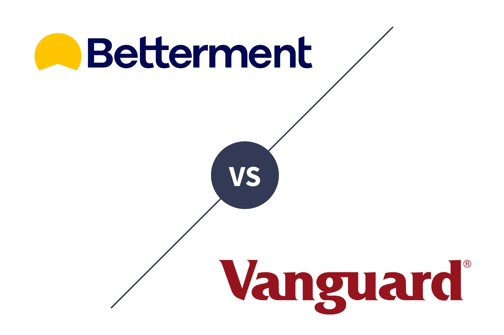

Automated investment platforms, often known as robo-advisors, have transformed the landscape of financial advisory services by leveraging technology to offer efficient, low-cost alternatives to traditional advisory models. These platforms utilize algorithms to manage investors' portfolios, designing strategies that align with individual risk tolerances and financial goals. In contrast, traditional advisors typically rely on human expertise to craft personalized investment plans, often with higher fees associated with such bespoke services.

Two notable players in the robo-advisory sector are Betterment and Vanguard Personal Advisor Services (PAS). Betterment emerged as a pioneer in the industry, providing a fully automated investment experience since its inception in 2010. Its platform appeals to both new and experienced investors with its user-friendly interface and cost-effective strategies. Meanwhile, Vanguard PAS combines the advantages of algorithm-driven investing with the insights of human advisors, offering a hybrid model that caters to those seeking personal touch alongside technological efficiency. 

The significance of Betterment and Vanguard PAS in the robo-advisory market can be attributed to their distinct approaches to combining algorithmic trading and investment management. These platforms are recognized not only for their operational excellence but also for their customer-centric services, making them attractive propositions for investors weighing the options between cost structures and professional advisory support.

The allure of robo-advisors is also bolstered by their accessibility and the burgeoning trend of digital financial solutions. By reducing entry barriers and offering tailored investment opportunities, these services democratize access to sophisticated financial planning and portfolio management, which were once the sole purview of wealthy individuals or institutions.

As the financial technology industry continues to evolve, individuals face the crucial task of selecting a platform that best addresses their unique financial objectives and preferences. While robo-advisors like Betterment offer seamless automation at lower costs, services like Vanguard PAS provide the added benefit of human advisors for those who value personalized guidance. Therefore, understanding the nuanced differences between these platforms – including their investment strategies, fee structures, and user experiences – becomes essential for investors seeking to make informed decisions aligned with their financial goals and personal circumstances.

## Table of Contents

## Overview of Betterment

Betterment, established in 2010, has been at the forefront of the robo-advisor industry, pioneering automated investment solutions that appeal to both novice and seasoned investors. By leveraging technology, Betterment has streamlined investment management, making it accessible without the substantial fees typically associated with traditional financial advisors.

Central to Betterment’s investment strategy is the use of Exchange-Traded Funds (ETFs). This approach emphasizes diversification and low-cost management, utilizing a mix of assets that spans domestic and international equity, bonds, and more specialized sectors. Betterment also ventured into [cryptocurrency](/wiki/cryptocurrency) investment options, broadening its portfolio offerings to meet the growing demand for digital assets. This diversification affords users the potential for improved risk-adjusted returns by including non-traditional assets that may not correlate directly with traditional markets.

One of Betterment’s distinguishing features is its tax-loss harvesting service. This strategic tool identifies and capitalizes on opportunities to minimize an investor’s tax liability by selling losing investments to offset gains. The harvested losses can be used to reduce taxable income, potentially enhancing the after-tax returns of an investment portfolio.

Furthermore, Betterment offers flexible portfolio options allowing investors to tailor their investment strategies according to personal financial goals and risk tolerance. The platform provides separate portfolio allocations for different objectives, such as retirement savings or general wealth building, enabling users to strategically assign investments based on specific needs.

Betterment targets a broad user base, catering to both beginners and more experienced investors. For newcomers, the simplified user interface and educational resources ease the learning curve associated with investment management. For seasoned investors, the ability to customize portfolios and access tax optimization tools presents an appealing value proposition.

The cost structure of Betterment underscores its commitment to affordability. With no minimum account balance required, the service is highly accessible. The fee model is tiered based on assets under management, starting at 0.25% annually for the digital plan, which offers comprehensive management of an individual's investment without human advisory support. For those seeking in-depth personal advisory services, a premium option is available at a 0.40% annual fee, albeit with a higher account minimum requirement. This stratified fee approach ensures that Betterment remains competitive and accessible across various investor demographics.

By integrating technological efficiency with key investment strategies, Betterment has positioned itself as a cost-effective and user-friendly solution in the automated investment landscape, appealing to a diverse range of investors with varying financial goals.

## Overview of Vanguard Personal Advisor Services

Vanguard, a stalwart in the investment world, has long been synonymous with low-cost mutual funds and index investments. Founded in 1975 by John C. Bogle, Vanguard revolutionized the investment industry by prioritizing the interests of investors and emphasizing the importance of cost-effectiveness in building wealth over time. This legacy continues with Vanguard's Personal Advisor Services (PAS), which marks the firm's strategic adaptation into the robo-advisory sector. 

Vanguard PAS employs a hybrid advisory model, seamlessly blending algorithmic investment management with direct access to human financial advisors. This approach caters to investors who appreciate technology-driven efficiency but also value personalized human interaction. Unlike fully automated robo-advisors, the hybrid nature of Vanguard PAS allows clients to receive tailored advice and build a relationship with a dedicated advisor, ensuring that their unique financial goals and circumstances are understood and addressed.

Portfolio customization is a hallmark of Vanguard PAS, allowing clients to invest in a range of proprietary mutual funds as part of their investment strategy. These funds are well-regarded for their low expense ratios and wide diversification, key factors in optimizing long-term investment performance. Clients work in collaboration with their advisors to create a personalized investment plan that aligns with their risk tolerance, financial goals, and time horizon, providing a level of customization not always available with other robo-advisors.

Vanguard PAS distinguishes itself with comprehensive goal planning and the availability of personalized advice. The service employs a thorough process to understand and prioritize clients' financial objectives, such as retirement planning, tax efficiency, and education funding. This process results in a structured and detailed financial plan tailored specifically to each client's needs, supported by ongoing advice and adjustments as necessary. The presence of human advisors introduces a qualitative element that can be critical during periods of market [volatility](/wiki/volatility-trading-strategies) or significant life changes, offering reassurance and expert guidance.

The fee structure for Vanguard PAS is straightforward and competitive, aligning well with Vanguard's overarching commitment to low-cost investing. The advisory fee for this service is approximately 0.30% of assets under management per year, which is relatively low compared to traditional financial advisory services but slightly higher than some purely automated robo-advisors. The account minimum for Vanguard PAS is $50,000, which may be a limiting [factor](/wiki/factor-investing) for some investors. However, this threshold is consistent with the service's comprehensive approach and the inclusion of dedicated human advisors. 

Overall, Vanguard PAS stands out by combining Vanguard's investment philosophy with modern advisory services, offering a robust option for investors seeking a balanced approach between automation and personalized advice.

## Comparison of Account Setup and Types

Setting up an account with either Betterment or Vanguard Personal Advisor Services (PAS) is an essential first step in beginning one’s investment journey. Each platform offers distinct processes and account types to cater to varying investor profiles and needs.

### Ease of Account Setup

**Betterment** is renowned for its straightforward online setup process, designed to be completed within minutes. Users can begin by answering a series of questions that aim to identify their financial goals and risk tolerance. This approach facilitates a quick entry into the investment world, without requiring extensive financial knowledge from users. The entire process is digital, requiring no paperwork, which is particularly appealing to tech-savvy users or those new to investing.

**Vanguard PAS**, on the other hand, involves a slightly more detailed process. While the platform integrates technology with human advisory elements, potential users are required to undergo an initial phone consultation with a Vanguard advisor. This step allows for a personalized investing strategy tailored to the client’s specific goals. Although this approach may take a bit longer, it ensures that users have a comprehensive understanding of their investment plan from the onset.

### Types of Accounts Available

**Betterment** offers a range of account types, including individual taxable accounts, joint accounts, traditional and Roth IRAs, SEP IRAs, and trusts. Additionally, Betterment provides cash management accounts like Checking and Cash Reserve, making it a versatile choice for individuals interested in various financial solutions. The absence of complex account options makes it particularly attractive to beginners and cost-conscious investors looking for a simplified investment approach.

**Vanguard PAS** provides a broader array of account types. Aside from standard individual and joint investment accounts, Vanguard offers numerous retirement account options, including traditional, Roth, SEP, and SIMPLE IRAs, as well as education savings accounts like 529 college savings plans. This extensive list caters well to investors who seek comprehensive financial planning and long-term investment strategies. 

### Minimum Investment Requirements

The minimum investment requirement is a significant differentiator between the two platforms. **Betterment** has no initial deposit or minimum balance requirement, making it accessible for new investors or those with limited capital looking to start small.

Conversely, **Vanguard PAS** requires a minimum investment of $50,000. This substantial requirement reflects its target audience of more seasoned investors or those with higher investment capital, thus potentially alienating first-time investors or those with smaller budgets.

### Alignment with Investor Profiles

The account types and setup processes provided by each platform demonstrate distinct alignment with different investor profiles. **Betterment’s** no-minimum account, coupled with its simple setup, aligns optimally with beginner investors and those who prefer a fully automated investment experience. It also suits those who appreciate flexibility in financial planning without the commitment of high initial investments.

In contrast, **Vanguard PAS** appeals to investors who value personalized advice and are willing to make a more substantial financial commitment. The requirement for human interaction ensures that accounts are tailored to individual needs, which may be more suitable for those looking for comprehensive investment strategies and who value the expertise of human advisors.

### Conclusion

For new investors, Betterment offers a more accessible entry point due to its ease of setup and no minimum investment requirement. Its straightforward process and diverse account offerings allow individuals to start investing quickly and with minimal financial barriers. Vanguard PAS, with its higher minimum and hybrid advisory model, is better suited to individuals seeking more extensive guidance and who have the financial means to meet its initial investment threshold. Each platform aligns its accounts and setup processes with specific investor needs, highlighting the importance of assessing personal financial goals and resources when selecting a platform.

## Investment Strategies and Portfolio Management

Betterment's investment strategy primarily revolves around the use of Exchange-Traded Funds (ETFs) and cryptocurrency options, providing a diversified investment approach that caters to both traditional and modern asset classes. ETFs are favored for their versatility and ability to track a wide range of market indices, allowing Betterment to offer portfolios that are not only diversified across sectors and geographies but also align with the risk tolerances and financial objectives of individual investors. This strategy is enhanced by the inclusion of cryptocurrencies, which appeals to users interested in engaging with high-growth potential assets, albeit at a higher risk.

The platform utilizes advanced algorithms to optimize portfolios through features like automated rebalancing and tax-loss harvesting. Automated rebalancing ensures that portfolios maintain their intended asset allocation, which is crucial for managing risk and achieving long-term financial goals. The rebalancing process automatically adjusts the portfolio by buying or selling assets to return to the pre-determined allocation after market movements cause deviations.

Betterment offers some degree of portfolio customization, allowing users to shift their allocation towards socially responsible investing or increase their desired exposure to specific sectors or asset classes. However, the overall control remains largely in the hands of the algorithm, ensuring a hands-off experience for investors who prefer minimal involvement in day-to-day management.

In contrast, Vanguard Personal Advisor Services (PAS) integrates both passive and active fund management strategies, leveraging its reputable suite of proprietary mutual funds. Users have the option to rely on passive index funds for a broad-market exposure with low costs or engage with actively managed funds for potential outperformance, albeit typically associated with higher fees. This dual approach enables a tailored investment strategy that can adapt to the specific needs and preferences of individual investors.

Vanguard PAS differentiates itself by combining algorithm-driven analysis with human advisor support, offering a hybrid model that enhances portfolio management decisions. Human advisors provide personalized guidance, ensuring that investment strategies align closely with personal financial goals and life circumstances. This combination allows for a level of bespoke portfolio customization beyond the capabilities of a fully automated system like Betterment. Advisors can recommend strategic asset allocation changes and incorporate more nuanced investment preferences, such as targeting specific fund types or account objectives.

Rebalancing within Vanguard PAS also plays a critical role in maintaining the desired portfolio structure. The integration of human oversight ensures that any strategic shifts or tactical adjustments are consistent with the overarching investment plan. This allows Vanguard to offer a nuanced approach, balancing the precision and efficiency of algorithms with the qualitative insights from financial experts.

In summary, Betterment provides a streamlined, technology-driven investing experience with portfolio diversification via ETFs and cryptocurrencies, suitable for those who prefer automation and minimal personal involvement. Vanguard PAS offers a more personalized portfolio management approach through active and passive fund options complemented by human advisors, beneficial for investors seeking tailored advice and greater control over their investments.

## Fees and Costs

When evaluating Betterment and Vanguard Personal Advisor Services (PAS) in terms of fees and costs, it's essential to consider both the explicit fees charged and the overall value they offer.

Betterment operates with a straightforward fee structure, charging an annual management fee of 0.25% for its Digital plan. For users seeking additional human advisor support through the Premium plan, the annual fee increases to 0.40%. Betterment does not charge transaction fees for trades or fund transfers, and there are no additional charges for premium services.

In contrast, Vanguard PAS charges an annual advisory fee of 0.30%. This fee covers both the automated services and access to human financial advisors, incorporating Vanguard's legacy of providing low-cost mutual funds. Unlike Betterment, Vanguard does not have separate fees for digital versus human advisory service since both are integrated. Vanguard PAS may have mutual fund expense ratios, which vary based on the fund selections within a portfolio, but these are generally low given Vanguard's extensive range of low-cost funds.

For high-net-worth individuals, the fee differences can be significant. Betterment's Premium plan with human advice remains slightly less costly until large account balances are considered. At higher asset levels, the lower-tier expense ratios of Vanguard's mutual funds might offer better value. The formula to calculate annual fees for each service can be expressed as follows:

$$
\text{Annual Fee} = \text{Account Balance} \times \text{Fee Percentage}
$$

For instance, for a $1,000,000 portfolio, Betterment's fee would be $4,000 annually at 0.40% (Premium plan), while Vanguard PAS would charge $3,000 at 0.30%, excluding fund expense ratios.

Transparency is a critical factor in understanding the costs associated with these platforms. Betterment provides a clear breakdown of fees on its platform and regularly updates users on any potential costs, aiding in a more transparent user experience. Vanguard PAS’s fee structure is similarly transparent, but potential users must be aware of additional mutual fund expenses, which can vary.

When evaluating fees, investors should align their choice with their personal financial goals and expected returns. Those who primarily value low-cost digital management may find Betterment’s fee structure accommodating. However, investors who seek the intrinsic value of advisory support should consider Vanguard PAS, particularly if their portfolio includes high balances, and they wish to leverage Vanguard’s low-expense mutual funds.

Ultimately, the decision should factor in the balance between cost and value — considering both the fees and the extent of service and advisory support desired.

## User Experience and Customer Service

In the evaluation of robo-advisors, user experience and customer service are critical components that can significantly influence an investor's choice between platforms such as Betterment and Vanguard Personal Advisor Services (PAS).

Betterment's platform is widely recognized for its intuitive design and ease of use. The web and mobile interfaces are user-friendly, featuring a clean layout that simplifies navigation and appeals to both beginners and seasoned investors. Users can easily access their portfolio performance, make adjustments, and explore various investment options with minimal complexity. The platform's design prioritizes simplicity, making it easy for investors to monitor and manage their investments. This emphasis on user-friendliness extends to the mobile application, where users enjoy the same comprehensive functionality as the web platform, ensuring seamless investment management on the go.

Customer service is another area where Betterment excels. The platform offers a variety of support options, including chat and email support, which are accessible to all users. For customers who subscribe to Betterment's premium service, phone support is also available, allowing for more personalized assistance. This robust array of support channels ensures that users can get help when they need it, enhancing the overall customer experience. 

In terms of educational resources, Betterment provides a wealth of articles, tutorials, and tools designed to educate investors about financial planning and investment strategies. These resources empower users to make informed decisions and optimize their investment outcomes.

On the other hand, Vanguard PAS combines technology with a human touch, reflecting its hybrid advisory model. The web interface, while comprehensive, may appear less intuitive compared to Betterment's streamlined design. However, it provides significant depth in terms of functionality, allowing users to access detailed portfolio information and perform a range of investment actions. The mobile app replicates much of this functionality but might involve a steeper learning curve for users unfamiliar with investing terminologies and processes.

Vanguard PAS highlights its customer service strengths through access to financial advisors. Users have the option to communicate with advisors via phone, with the potential for personalized guidance tailored to their financial goals. This level of personalized service is a major draw for users seeking more than just automated guidance. Email support and comprehensive FAQ sections further support user inquiries, albeit chat services are not as prominently featured as with Betterment.

Educational resources provided by Vanguard PAS are extensive, focusing on investment strategies and financial literacy enhancement. Tutorials, articles, and webinars form the backbone of Vanguard’s educational outreach, enabling users to deepen their financial knowledge and make well-informed investment decisions.

User reviews and satisfaction ratings indicate that Betterment is often praised for its ease of use and customer-centric approach, noting the platform's efficiency and the transparency of its advisory services. Vanguard PAS receives commendations for the personalized advice offered by human advisors, albeit some users occasionally cite the complexity of its interface as a drawback.

For investors selecting between these platforms, the importance of superior user experience and customer service cannot be overstated. Betterment appeals to those favoring straightforward automation and a seamless digital interface, whereas Vanguard PAS may be more suitable for investors who value in-depth personal advice and can navigate a more complex system. Ultimately, the choice of platform should align with an investor's personal preference for usability, support options, and the level of professional advisory services desired.

## Final Thoughts: Which is Right for You?

When deciding between Betterment and Vanguard Personal Advisor Services (PAS), investors must weigh both platforms' distinctive benefits against their personal financial goals and preferences.

Betterment stands out as a premier robo-advisor known for its fully automated investment approach. It offers a range of investment options, including ETFs and cryptocurrency, and features like tax-loss harvesting and portfolio flexibility. These aspects make it particularly appealing to tech-savvy investors who prefer hands-off investing and are comfortable with a purely algorithm-driven service. Betterment's competitive fee structure and no minimum investment requirement make it an attractive option for beginners and those with limited capital.

Vanguard PAS, on the other hand, appeals to investors seeking a more balanced investment management approach. Combining technology with human advisor support, Vanguard PAS offers personalized advice and comprehensive goal planning that caters to clients looking for more tailored financial guidance. The integration of proprietary mutual funds and the possibility of active fund management provide clients a range of strategies to suit diverse investment styles. While the minimum investment requirement of $50,000 sets a higher entry bar, the value of added human support can be significant, particularly for those who appreciate personalized advice.

Investors should consider their financial objectives and the level of involvement they desire in managing their portfolio. For those who prioritize cost-efficiency, technological convenience, and a straightforward investment strategy, Betterment might be the right choice. Conversely, investors who value human interaction and personalized guidance, and are willing to meet the higher minimum investment threshold, may find Vanguard PAS more suitable. The potential value of human advisor support should not be underestimated, as it can enhance decision-making for individuals with complex financial circumstances or those less confident in navigating investments alone.

Ultimately, choosing the right platform hinges on an individual's investment size, desired control level, and necessity for professional advisory services. While Betterment could be preferable for tech-oriented investors with smaller portfolios, Vanguard PAS might serve high-net-worth individuals seeking personalized guidance and comprehensive financial planning.

## References & Further Reading

[1]: ["Robo-Advisors: A Portfolio Management Perspective"](https://economics.yale.edu/sites/default/files/2023-01/Jonathan_Lam_Senior%20Essay%20Revised.pdf): Financial Analysts Journal, CFA Institute.

[2]: Bogle, John C. ["The Little Book of Common Sense Investing: The Only Way to Guarantee Your Fair Share of Stock Market Returns"](https://www.amazon.com/Little-Book-Common-Sense-Investing/dp/1119404509): John Wiley & Sons, 2017.

[3]: Ptak, J. D. (2021). ["Vanguard—Still Holding the Low-Cost Line, After Four Decades"](https://scholar.google.com/citations?user=Nqxl1GAAAAAJ&hl=en). Morningstar.

[4]: ["NerdWallet's Analysis on Betterment and Vanguard PAS"](https://www.nerdwallet.com/best/investing/robo-advisors).

[5]: ["The Rise of Robo-Advisors: Changing Times, Changing Regulatory Challenges"](https://www.researchgate.net/publication/328390383_Robo-Advisory_Opportunities_and_Risks_for_the_Future_of_Financial_Advisory_Recent_Findings_and_Practical_Cases) by the World Economic Forum.