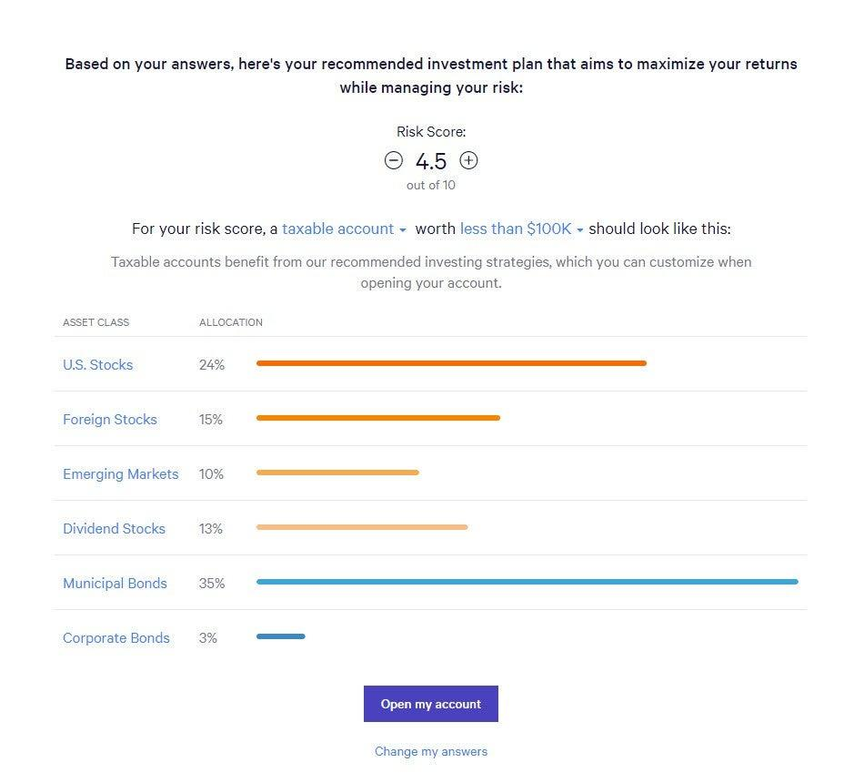

In the digital age, automated investment platforms such as Wealthfront and Betterment have significantly reshaped asset management practices. These platforms utilize sophisticated algorithms to manage investment portfolios, offering a convenient, hands-off approach to wealth growth for both novice and experienced investors. Wealthfront and Betterment, among the forefront of these innovations, are leveraging algorithmic trading strategies to maximize investment efficiency, reduce human error, and enhance decision-making processes.

Algorithmic trading employs computer algorithms to execute strategies rapidly and with precision, based on pre-defined criteria. This method ensures high-speed execution, accuracy, and the ability to manage a large volume of transactions, making it highly suitable for investment platforms seeking to modernize asset management. Wealthfront and Betterment not only manage investments algorithmically but also incorporate features like automated rebalancing and tax-loss harvesting to further optimize portfolios.



As automated investment platforms continue to evolve, understanding how they operate and what distinguishes them becomes crucial. This article examines the specific algorithms Wealthfront and Betterment use, analyzes their platform features and strengths, and considers which scenarios each platform best serves. By comparing these platforms, investors can make informed decisions aligned with their financial goals and preferences, taking advantage of technology to manage their investment portfolios efficiently.

## Table of Contents

## What is Algorithmic Trading?

Algorithmic trading utilizes computer algorithms to execute investment strategies by adhering to predefined criteria. This method offers advantages such as speed and accuracy, and it handles a large volume of transactions efficiently, making it exceptionally suited for modern investment platforms. Automated investment platforms like Wealthfront and Betterment employ algorithmic trading to optimize asset management, automate the process of rebalancing portfolios, and implement tax-loss harvesting strategies.

In essence, algorithmic trading involves the development of mathematical models to generate trading signals. These signals are then used to place buy or sell orders in financial markets, all executed with minimal human intervention. The core of algorithmic trading lies in its ability to systematically follow complex rules that are formulated based on historical data and predictive analytics.

A typical algorithmic trading strategy can be described by a set of components: the data input, the algorithmic logic, and the execution framework. The data input can include historical prices, volumes, or macroeconomic indicators. The algorithm then analyzes this data to predict future market movements. For example, a moving average crossover strategy might be expressed in Python as follows:

```python
import numpy as np
import pandas as pd

data = pd.DataFrame({'price': [50, 51, 52, 50, 49, 48, 47, 48, 49, 50]})
short_window = 3
long_window = 5

data['short_mavg'] = data['price'].rolling(window=short_window, min_periods=1).mean()
data['long_mavg'] = data['price'].rolling(window=long_window, min_periods=1).mean()

data['signal'] = 0
data['signal'][short_window:] = np.where(data['short_mavg'][short_window:] > data['long_mavg'][short_window:], 1, 0)
data['positions'] = data['signal'].diff()

print(data)
```

This Python script sets up a simple moving average crossover strategy, where signals are generated based on the crossover of short-term and long-term moving averages of asset prices. When the short-term moving average surpasses the long-term moving average, a buy signal is triggered, and vice versa. This strategy exemplifies how [algorithmic trading](/wiki/algorithmic-trading) uses mathematical models to automate decision-making processes.

Wealthfront and Betterment leverage these automated processes to balance investor portfolios according to their risk tolerance, time horizon, and investment objectives. Rebalancing is the process of realigning the weightings of assets within a portfolio, which, when done automatically, can ensure that the portfolio maintains the desired level of risk and return characteristics over time.

Additionally, both platforms implement tax-loss harvesting, a technique that strategically sells selected securities at a loss to offset capital gains taxes. This process can be optimized using algorithms to identify loss opportunities and reinvest proceeds efficiently while adhering to regulatory constraints such as the wash-sale rule.

The combination of speed, precision, and the ability to manage complex data makes algorithmic trading an indispensable tool for robo-advisors like Wealthfront and Betterment, ultimately enhancing portfolio performance and tax efficiency for their users.

## Wealthfront Overview

Wealthfront is a leading automated investment platform that offers a fully digital experience for users looking to manage their investments without the need for human intervention. The platform is recognized for its advanced financial planning tools, which provide users with an intuitive and seamless investment experience. Wealthfront utilizes sophisticated algorithms to construct and manage portfolios tailored to the individual goals and risk tolerance of its clients.

One of the distinguishing features of Wealthfront is its wide array of investment options. Unlike many other automated platforms, Wealthfront allows investors to include individual stocks and [cryptocurrency](/wiki/cryptocurrency) assets in their portfolios. This flexibility caters to investors looking for a more personalized investment strategy and those interested in exploring diverse asset classes.

A key aspect of Wealthfront's offering is its automated tax-loss harvesting, a process designed to optimize after-tax returns for investors. By systematically selling securities that have experienced a loss, Wealthfront offsets capital gains and reduces taxable income. This strategy takes advantage of market fluctuations efficiently and can significantly enhance long-term returns for investors.

In addition to tax-loss harvesting, Wealthfront provides daily portfolio monitoring. The platform's algorithms continuously evaluate and adjust portfolios to ensure they align with the set investment strategy and market conditions. This proactive approach to portfolio management helps maintain optimal asset allocation and risk levels, maximizing potential returns while minimizing risk exposure.

Overall, Wealthfront's combination of innovative financial planning tools, extensive investment options, and automated features like tax-loss harvesting and portfolio monitoring makes it a compelling choice for investors seeking a comprehensive and technologically advanced investment platform.

## Betterment Overview

Betterment presents itself as a highly accessible and user-friendly investment platform, particularly advantageous for beginners seeking a simplified investment experience. The platform stands out by blending digital convenience with personalized financial guidance, offering clients the option to incorporate human financial advisor consultations into their strategy. This blend caters to a wide range of investor needs, from basic portfolio management to more intricate financial planning.

At the core of Betterment's services is its algorithmic trading platform, which is designed to maximize portfolio diversification through the use of low-cost, curated exchange-traded funds (ETFs). These ETFs are chosen based on a rigorous selection process to ensure they align with Betterment's investment strategy, emphasizing diversification, risk management, and cost efficiency. The focus on ETFs allows for broad market exposure and is particularly beneficial for investors looking to minimize fees while tapping into a diverse array of assets.

An appealing feature of Betterment is its comprehensive cash management options. Among these, the Cash Reserve account stands out, designed to enhance [liquidity](/wiki/liquidity-risk-premium) and flexibility for investors. This high-yield savings option provides a competitive [interest rate](/wiki/interest-rate-trading-strategies) while maintaining ease of access to funds, making it an attractive choice for individuals seeking to balance investment growth with cash availability.

Betterment’s approach to asset management, highlighted by its strategic use of algorithmic trading and versatile financial products, ensures a tailored investment experience that can adapt to both novice and seasoned investors' evolving financial goals.

## Comparing Wealthfront and Betterment

Both Wealthfront and Betterment are leading automated investment platforms utilizing algorithmic trading to manage client portfolios. While they share common features such as automated portfolio construction and rebalancing, they target different investor segments through their distinct value propositions and functionalities.

Wealthfront caters to investors seeking extensive customization and a wide array of asset options. This platform provides the capability to invest not only in a diverse set of exchange-traded funds (ETFs) but also in individual stocks and sector-specific ETFs, allowing for tailored portfolio design. Wealthfront's advanced features, such as Risk Parity—a strategy that diversifies risk by distributing it equally across various asset classes—and a comprehensive tax optimization mechanism, contribute significantly to maximizing potential returns. Investors with specific financial goals who prioritize control over their investment strategy may find Wealthfront's offerings particularly beneficial.

In contrast, Betterment is ideal for those who prefer a more straightforward investment approach. The platform emphasizes ease of use and simplicity, making it particularly attractive to novice investors who might value a less hands-on strategy. Betterment's key strength lies in its well-diversified portfolios composed primarily of low-cost, curated ETFs. For investors who might occasionally require human financial advice, Betterment also offers the option to consult with certified financial planners for more complex financial planning needs. This hybrid model—blending automated investments with access to human advice—positions Betterment as an excellent choice for individuals who desire a guided investment experience.

In summary, while both platforms provide efficient and optimized management of investment portfolios through algorithmic trading technologies, Wealthfront appeals to those seeking a highly customizable investment experience with diverse asset inclusion. Betterment, on the other hand, serves those preferring a more straightforward, guided approach, with the added benefit of professional human advice when needed. The choice between Wealthfront and Betterment ultimately depends on the specific preferences and investment objectives of the individual investor.

## Portfolio Management and Customization

Wealthfront provides investors with significant customization capabilities, such as Risk Parity and advanced tax optimization, which differentiates it from many competitors. Risk Parity is designed to optimize the risk-reward balance by allocating investments across various asset classes so that each contributes equally to the portfolio's risk. This strategy can be mathematically represented by minimizing the portfolio's variance subject to risk parity constraints, ensuring that each asset class contributes equally to overall risk. The formula for portfolio variance is:

$$
\sigma_p^2 = \sum_{i=1}^{n} \sum_{j=1}^{n} w_i w_j \sigma_{ij}
$$

where $w_i$ and $w_j$ are the weights of the assets in the portfolio, and $\sigma_{ij}$ is the covariance between assets $i$ and $j$.

Betterment, on the other hand, offers Flexible Portfolios that allow investors to adjust the weights of asset classes within their portfolios while still maintaining a diversified strategy. This flexibility enables investors to tailor their portfolios according to their risk tolerance or financial goals. Both Wealthfront and Betterment apply automatic rebalancing, which involves realigning the portfolio's asset allocation to conform with a predetermined strategy. This often happens when the proportion of different assets shifts due to market movements.

For instance, in Python, automatic rebalancing can be illustrated with a simple script to adjust asset weights back to target allocations:

```python
def rebalance_portfolio(current_weights, target_weights, asset_prices):
    current_value = sum(w * p for w, p in zip(current_weights, asset_prices))
    target_value = sum(tw * current_value for tw in target_weights)

    new_weights = [tv / p for tv, p in zip(target_value, asset_prices)]
    return new_weights

current_weights = [0.4, 0.6]
target_weights = [0.5, 0.5]
asset_prices = [100, 150]

adjusted_weights = rebalance_portfolio(current_weights, target_weights, asset_prices)
```

With this approach, any drift from the original allocation due to asset performance is corrected, thus adhering to the desired level of risk and investment strategy. Wealthfront and Betterment both enable investors to benefit from these systematic rebalancing practices, making it easier to achieve consistent investment outcomes over time.

## Fee Structure and Account Minimums

Wealthfront maintains a straightforward and accessible approach to its fee structure, charging a 0.25% annual management fee. This fee is applied to all assets under management and is designed to remain competitive while providing robust, algorithm-driven investment solutions. To open an account with Wealthfront, investors are required to deposit a minimum of $500. This relatively low entry point makes Wealthfront an attractive option for a wide range of investors, including those new to algorithmic investment platforms.

Betterment, on the other hand, offers a slightly more flexible fee model to accommodate different investor needs. The platform also charges a 0.25% annual management fee; however, this fee structure applies only to account balances above $20,000. For investors with smaller portfolios, Betterment provides an alternative: no initial deposit requirement coupled with a $250 minimum monthly deposit, allowing investors to gradually build their investment portfolio without needing significant upfront capital.

Both Wealthfront and Betterment provide competitive fee structures aiming to attract and retain clients through efficient portfolio management at a modest cost. The choice between the two can hinge on an investor's particular financial situation and investment strategy. Investors with enough capital to meet Betterment’s higher threshold might opt for its flexibility, whereas others might find Wealthfront's simpler, lower minimum balance requirement more appealing for their investment needs.

## Security and User Experience

Both Wealthfront and Betterment emphasize strong security measures to protect users' investments and personal information. One of the standard security features they implement is two-[factor](/wiki/factor-investing) authentication (2FA), which adds an extra layer of protection beyond just a password. This system typically requires users to verify their identity through a second medium, such as a text message or authentication app, significantly reducing the risk of unauthorized access to accounts.

In addition to 2FA, both platforms offer insurance on cash accounts. This insurance is provided by the Federal Deposit Insurance Corporation (FDIC) for cash accounts and the Securities Investor Protection Corporation (SIPC) for investment securities, ensuring that user funds are protected within specified limits.

The user experience and interface design of Wealthfront and Betterment are highly regarded, contributing to their overall appeal. Both platforms offer user-friendly mobile applications, which are crucial for modern investors who need the flexibility to manage their portfolios whenever and wherever they choose. The apps are designed to be intuitive, with clear layouts and accessible features that allow users to view their investment performance, make transactions, and adjust their portfolios easily.

User reviews often highlight the high ratings of these applications in terms of ease of use. This is attributed to the platforms' focus on delivering streamlined navigation and providing comprehensive features without overwhelming the user. Whether an investor is a novice or experienced, the interfaces are crafted to cater to a wide array of investment needs.

To sum up, the security protocols and user experience provided by Wealthfront and Betterment make them reliable choices for investors looking for a seamless and safe digital investment environment. Their commitment to security measures and user-friendly design ensures that users can focus on their investment strategies with confidence in the platform's protections and tools.

## Conclusion

In choosing between Wealthfront and Betterment, investors must consider their specific financial goals and preferences for customization versus advisory support. Both Wealthfront and Betterment provide robust algorithmic trading solutions that ensure efficient portfolio management and optimization. Wealthfront might appeal to those who seek extensive investment options and greater control over their portfolios. It offers a broader range of assets, including individual stocks and sector-specific ETFs, and emphasizes customization and advanced tax optimization techniques. 

On the other hand, Betterment caters to investors who prefer simplicity and may benefit from human advisory services. Its platform is designed to be user-friendly, making it an ideal choice for beginners or those who value additional guidance in complex financial planning. The flexibility of accessing human advice, coupled with a focus on diversified portfolios composed of low-cost ETFs, makes Betterment a suitable option for investors looking for a streamlined approach to investment management.

Ultimately, the decision between these platforms comes down to an investor's desired balance between control and convenience. Both platforms have demonstrated their capability to use technology to enhance investing, but the right choice depends on the individual's unique investment objectives and preference for personalization versus straightforward financial management assistance.

## References & Further Reading

[1]: Bergstra, J., Bardenet, R., Bengio, Y., & Kégl, B. (2011). ["Algorithms for Hyper-Parameter Optimization."](https://proceedings.neurips.cc/paper/2011/file/86e8f7ab32cfd12577bc2619bc635690-Paper.pdf) Advances in Neural Information Processing Systems 24.

[2]: ["Advances in Financial Machine Learning"](https://www.amazon.com/Advances-Financial-Machine-Learning-Marcos/dp/1119482089) by Marcos Lopez de Prado

[3]: ["Evidence-Based Technical Analysis: Applying the Scientific Method and Statistical Inference to Trading Signals"](https://www.amazon.com/Evidence-Based-Technical-Analysis-Scientific-Statistical/dp/0470008741) by David Aronson

[4]: ["Machine Learning for Algorithmic Trading"](https://github.com/PacktPublishing/Machine-Learning-for-Algorithmic-Trading-Second-Edition) by Stefan Jansen

[5]: ["Quantitative Trading: How to Build Your Own Algorithmic Trading Business"](https://books.google.com/books/about/Quantitative_Trading.html?id=j70yEAAAQBAJ) by Ernest P. Chan