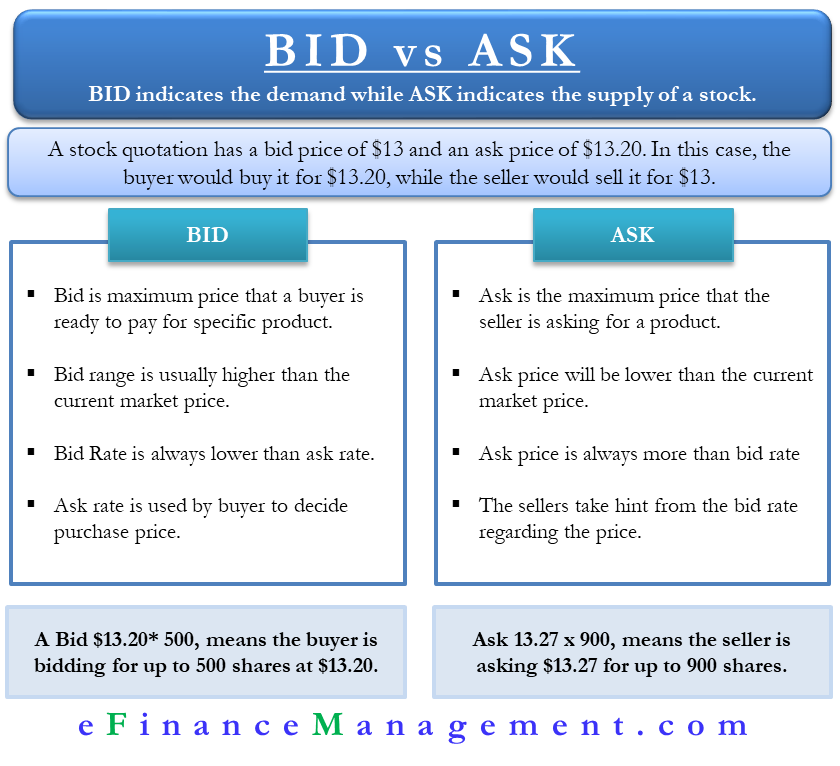

## Table of Contents

## What are Treasury Bills?

Treasury Bills, often called T-Bills, are short-term loans that people give to the government. When you buy a T-Bill, you're lending money to the government for a short time, usually from a few weeks to a year. In return, the government promises to pay you back the full amount you lent, plus a little extra as interest when the T-Bill matures. This makes T-Bills a safe way to invest money because the government is very unlikely to fail to pay you back.

T-Bills are sold at a discount. This means you buy them for less than their face value. For example, you might pay $980 for a $1,000 T-Bill. When it matures, you get the full $1,000 back. The difference between what you paid and what you get back is the interest you earn. T-Bills are popular because they are easy to buy and sell, and they are considered one of the safest investments you can make.

## What is the difference between bid and ask prices?

The bid price is the highest amount someone is willing to pay to buy something right now. It's like when you're selling your old bike and someone says they'll give you $50 for it. That $50 is the bid price. On the other hand, the ask price is the lowest amount someone is willing to sell something for right now. If you see a new bike for sale and the seller says they want $100 for it, that $100 is the ask price.

The difference between the bid and ask prices is called the bid-ask spread. This spread is important because it shows how much the price can change from one trade to the next. If the bid price is close to the ask price, it means people agree more on the value of the item. But if the bid and ask prices are far apart, it might mean people have different ideas about what the item is worth, making it harder to buy or sell quickly.

## How are bid and ask prices determined for Treasury Bills?

Bid and ask prices for Treasury Bills are set by people who want to buy and sell them. When someone wants to buy a T-Bill, they say how much they are willing to pay, which is the bid price. When someone wants to sell a T-Bill, they say the lowest amount they will take, which is the ask price. These prices can change all the time because they depend on what buyers and sellers think the T-Bill is worth at that moment.

The bid and ask prices are influenced by many things, like how much people want T-Bills right now, how safe they think the investment is, and what's happening in the economy. If a lot of people want to buy T-Bills, the bid price might go up because buyers are competing to get them. If not many people want to buy, the bid price might go down. The same goes for the ask price; if sellers think they can get more money, they might raise their ask price, but if they want to sell quickly, they might lower it.

## Why is it important to compare bid and ask prices for Treasury Bills?

It's important to compare bid and ask prices for Treasury Bills because it helps you understand how much you might have to pay to buy one and how much you might get if you want to sell one. If the difference between the bid and ask prices is small, it means you can buy or sell without losing much money. But if the difference is big, you might have to pay more to buy or get less when you sell, which can affect how good of a deal you're getting.

Knowing the bid and ask prices also gives you a sense of how much people want Treasury Bills at that time. If lots of people want them, the bid prices might be high because everyone is trying to buy. If fewer people want them, the ask prices might be lower because sellers are trying to attract buyers. By comparing these prices, you can make smarter choices about when to buy or sell your Treasury Bills.

## What factors influence the bid and ask prices of Treasury Bills?

The bid and ask prices of Treasury Bills are influenced by how much people want them and how much money is available in the market. When a lot of people want to buy Treasury Bills, the bid prices go up because buyers are competing to get them. On the other hand, if fewer people want to buy, the bid prices might go down. The ask prices work the same way; if sellers think they can get more money, they might raise their ask price, but if they want to sell quickly, they might lower it. The overall demand and supply in the market play a big role in setting these prices.

Another important factor is the [interest rate](/wiki/interest-rate-trading-strategies) environment. When interest rates are high, new Treasury Bills might be sold at higher yields, which can make the bid and ask prices of existing T-Bills go down because people might prefer the new ones with better returns. If interest rates are low, the bid and ask prices of existing T-Bills might go up because they become more attractive compared to new ones. Economic conditions also matter; if people think the economy is risky, they might want safer investments like Treasury Bills, pushing up the bid prices.

Lastly, the creditworthiness of the government issuing the T-Bills affects their prices. Since Treasury Bills are backed by the government, if people think the government is less likely to pay back its debts, the bid and ask prices might go down. But if the government is seen as very reliable, the prices might stay high or even increase. All these factors together help determine the bid and ask prices of Treasury Bills.

## How can investors use bid and ask price information to make investment decisions?

Investors can use bid and ask price information to figure out the best time to buy or sell Treasury Bills. By looking at the bid and ask prices, investors can see how much people are willing to pay to buy a T-Bill and how much sellers want for it. If the difference between the bid and ask prices is small, it means the market agrees on the value of the T-Bill, and it's a good time to trade because you won't lose much money on the deal. But if the difference is big, it might be better to wait until the prices get closer together, so you can get a better deal.

The bid and ask prices also tell investors about the demand for Treasury Bills. If lots of people want to buy them, the bid prices will be high because everyone is trying to get them. This could be a good sign to sell if you already own T-Bills, as you might get a good price. On the other hand, if not many people want to buy, the bid prices might be low, which could be a good time to buy if you think the demand will go up later. By watching these prices, investors can make smarter choices about when to buy or sell their Treasury Bills.

## What are the typical bid-ask spreads for Treasury Bills?

The typical bid-ask spread for Treasury Bills is usually very small because they are very popular and traded a lot. This means the difference between what someone is willing to pay to buy a T-Bill and what someone is willing to sell it for is not much. For example, if a T-Bill has a face value of $1,000, the bid price might be $999 and the ask price might be $999.50. This small difference shows that it's easy to buy and sell T-Bills without losing much money.

However, the bid-ask spread can change a bit depending on how much people want T-Bills at that time. If a lot of people want to buy them, the spread might get even smaller because everyone is trying to get them. But if fewer people want to buy, the spread might get a little bigger. Even so, the spreads for Treasury Bills are usually much smaller than for other investments, which makes them a safe and easy choice for investors.

## How does the liquidity of Treasury Bills affect their bid and ask prices?

The liquidity of Treasury Bills, or how easy it is to buy and sell them, affects their bid and ask prices a lot. When Treasury Bills are very liquid, it means lots of people want to buy and sell them all the time. This makes the bid and ask prices very close to each other because there are always buyers and sellers ready to trade. If you want to sell your T-Bill, you can do it quickly without having to lower your price much, and if you want to buy one, you don't have to pay much more than what others are willing to sell for.

On the other hand, if Treasury Bills are less liquid, it means fewer people are trading them. This can make the bid and ask prices move further apart. When you want to sell, you might have to wait longer or lower your price to find a buyer. And when you want to buy, you might have to pay more because there are fewer T-Bills available. So, high liquidity keeps the bid and ask prices close together, making it easier and cheaper to trade Treasury Bills.

## What role do market makers play in setting bid and ask prices for Treasury Bills?

Market makers are important people who help set the bid and ask prices for Treasury Bills. They do this by always being ready to buy and sell T-Bills. When you want to buy a T-Bill, the market maker gives you an ask price, which is the lowest amount they will sell it for. When you want to sell, they give you a bid price, which is the highest amount they will pay to buy it from you. By doing this, market makers make sure there is always someone to trade with, which helps keep the market running smoothly.

Because market makers are always trading, they help keep the difference between the bid and ask prices small. If the bid and ask prices are close together, it's easier for you to buy and sell T-Bills without losing much money. Market makers watch what's happening in the market and change their prices to match what people are willing to pay or sell for. This way, they help make sure the prices are fair and that you can trade your T-Bills whenever you need to.

## How do economic indicators impact the bid and ask prices of Treasury Bills?

Economic indicators like interest rates, inflation, and employment numbers can change how much people want to buy or sell Treasury Bills, which affects their bid and ask prices. When interest rates go up, new Treasury Bills might offer higher returns, so people might want to sell their old ones to buy the new ones. This can make the bid prices for existing T-Bills go down because fewer people want them. On the other hand, if interest rates go down, existing T-Bills with higher returns become more attractive, so their bid prices might go up as more people want to buy them.

Inflation also plays a big role. If people think prices will go up a lot in the future, they might want to buy Treasury Bills to keep their money safe, which can push up the bid prices. But if inflation is low, people might not be as interested in T-Bills, and the bid prices could drop. Employment numbers can affect things too. If more people have jobs and the economy is doing well, people might feel safe investing in riskier things instead of T-Bills, which could lower the bid prices. But if the economy looks shaky, people might want the safety of T-Bills, making their bid prices go up.

## What advanced strategies can traders use to exploit bid-ask spread differences in Treasury Bills?

Traders can use a strategy called "[scalping](/wiki/gamma-scalping)" to make money from small differences in the bid-ask spread of Treasury Bills. Scalping means buying T-Bills at the lower bid price and then quickly selling them at the higher ask price. This works best when the spread is very small, so traders need to watch the market closely and trade often. They might use special computer programs to help them do this fast and make sure they can buy and sell at the right times.

Another strategy is called "[arbitrage](/wiki/arbitrage)," where traders look for price differences between different markets or types of Treasury Bills. For example, if the same T-Bill has a different bid-ask spread on two different trading platforms, a trader can buy it on the platform with the lower ask price and sell it on the platform with the higher bid price. This way, they can make a profit from the difference in prices. Both scalping and arbitrage need traders to be quick and careful, but they can be good ways to make money from small changes in the bid-ask spread.

## How can historical bid and ask price data be used to predict future trends in Treasury Bill markets?

Traders can use historical bid and ask price data to see how Treasury Bill prices have changed over time. By looking at this data, they can find patterns that might help them guess what will happen next. For example, if they see that bid prices usually go up when interest rates drop, they might expect the same thing to happen again if interest rates start to fall. This can help them decide when to buy or sell their T-Bills to make the most money.

Using historical data also helps traders understand how economic indicators like inflation or employment numbers affect bid and ask prices. If they see that bid prices tend to rise when inflation goes up, they can watch for signs of increasing inflation and adjust their trading plans. This way, they can be ready to take advantage of price changes before they happen. By studying the past, traders can make smarter guesses about the future and improve their chances of making good investment decisions.

## What are bid and ask prices and how do they work?

Bid and ask prices are fundamental components of any financial market, serving as the two-way price quotation that facilitates transactions between buyers and sellers. The bid price represents the highest price that a buyer is willing to pay for an asset, while the ask price is the lowest price at which a seller is prepared to sell the asset. This difference, known as the bid-ask spread, is a critical measure of market liquidity and reflects the transaction costs associated with buying or selling the asset.

A narrower bid-ask spread suggests increased market liquidity and efficiency, indicating that there are many buyers and sellers engaged in the market, which leads to more accurate pricing. This environment facilitates smoother transactions and reduces the costs for investors. Conversely, a wide spread may suggest lower liquidity, higher transaction costs, and potentially less market efficiency.

For investors, comprehending the bid-ask spread is crucial because it impacts the total cost of trading. When an investor buys an asset, they generally pay the higher ask price, and when they sell, they usually receive the lower bid price. The spread inherently acts as a cost of trade, making understanding its dynamics essential for executing profitable transactions.

In mathematical terms, the spread (S) can be represented as: 

$$

S = \text{Ask Price} - \text{Bid Price}
$$

Where an efficient market would ideally minimize $S$ to reflect small transaction costs and high [liquidity](/wiki/liquidity-risk-premium).

For computational evaluation, consider implementing a simple Python function to calculate the bid-ask spread:

```python
def calculate_spread(bid_price, ask_price):
    return ask_price - bid_price

# Example usage:
bid = 99.95
ask = 100.05
spread = calculate_spread(bid, ask)
print(f"The bid-ask spread is: {spread}")
```

This simple function can help investors swiftly calculate and understand the spread, aiding in more informed trading decisions. Understanding these basic market mechanics is vital for any investor aiming to navigate the financial markets effectively.

## What is an overview of Treasury Bills?

Treasury Bills, commonly referred to as T-Bills, are a vital component of the short-term investment landscape. These government debt instruments have maturities ranging from a few days up to one year. T-Bills are distinctive in that they are issued at a discount to their face value and do not provide periodic interest payments. Instead, the return for investors comes from the difference between the purchase price and the face value received at maturity. This is a straightforward form of investing where the profit equation is:

$$
\text{Profit} = \text{Face Value} - \text{Purchase Price}
$$

One of the primary attractions of Treasury Bills is their low-risk nature, as they are backed by the full faith and credit of the federal government. This makes them an attractive option for conservative investors seeking wealth preservation. Due to their short maturity periods and government backing, T-Bills are often considered as a benchmark for the risk-free rate in financial analysis.

Understanding the pricing of T-Bills is a key consideration for investors. They are quoted based on their discount rate, which is a function of the difference between the purchase price and the face value. The formula for calculating the discount yield on a Treasury Bill is:

$$
\text{Discount Yield} = \left( \frac{\text{Face Value} - \text{Purchase Price}}{\text{Face Value}} \right) \times \frac{360}{\text{Days Until Maturity}}
$$

The bid-ask spread, which is the difference between the price traders are willing to pay (bid) and the price sellers are willing to accept (ask), is another crucial [factor](/wiki/factor-investing) for Treasury Bill investors. A narrower spread indicates greater market liquidity, making the asset easier to trade without significant loss of value. Investors must consider the bid-ask spread when purchasing or selling T-Bills, as it impacts the overall return by affecting the cost of entering or exiting the market.

Overall, Treasury Bills offer a secure investment vehicle for those seeking low-risk, short-term exposure, while also providing valuable insights into market liquidity through the examination of bid-ask spreads.

## What are Bid and Ask Prices in Treasury Bills?

Treasury Bills (T-Bills) are typically quoted in terms of their yields rather than their direct purchase prices. This can often be a source of confusion for investors, especially when interpreting bid and ask prices. Essentially, the bid yield represents the yield that a buyer is willing to accept, whereas the ask yield is the yield a seller is willing to offer.

When quoted in terms of yield, the bid and ask prices of T-Bills need to be converted into actual dollar values to fully understand the transaction costs or benefits. The relationship between the quoted yield and the price can be described using the following formula:

$$
\text{Price} = \text{Face Value} \times \left(1 - \frac{\text{Discount Yield} \times \text{Days to Maturity}}{360}\right)
$$

Where:
- **Price** is the amount paid to purchase the T-Bill.
- **Face Value** is the amount that will be paid to the holder at maturity.
- **Discount Yield** is the annualized yield based on the discount from the face value, typically quoted as a percentage.
- **Days to Maturity** is the number of days remaining until the T-Bill matures.

For instance, if a T-Bill has a face value of $1,000, a bid yield of 1.5%, and 180 days to maturity, the bid price can be calculated as follows:

$$
\text{Price} = 1000 \times \left(1 - \frac{0.015 \times 180}{360}\right) = 1000 \times (1 - 0.0075) = 1000 \times 0.9925 = 992.50
$$

In practical terms, if investors misinterpret these yields as direct prices, they risk making suboptimal decisions. This misinterpretation can affect the actual costs incurred or profits realized when trading T-Bills. For instance, a higher bid yield than anticipated might suggest a lower than expected price for selling the T-Bill, impacting the perceived return on investment.

Converting yields accurately is crucial for assessing the potential financial outcomes of purchasing or selling T-Bills. Ensuring this clarity can assist investors in making well-informed decisions that align with their financial strategies and objectives.

## What is the relationship between Algorithmic Trading and Treasury Bills?

Algorithmic trading employs sophisticated computer algorithms to execute trades efficiently and accurately, acting on real-time data to capitalize on market opportunities. This method is particularly advantageous for trading Treasury Bills (T-Bills) due to their high liquidity and short-term nature. 

Algorithms in T-Bill trading analyze bid-ask spreads, historical yields, and prevailing market conditions to formulate optimal strategies. The bid-ask spread, the difference between the buying (bid) and selling (ask) price, is a key indicator of market liquidity and efficiency. By assessing the spread, algorithms can identify favorable conditions for executing trades, maximizing profits while minimizing risk.

For T-Bills, which are typically quoted in yield rather than price, algorithms must convert these yields into direct prices to facilitate effective trading. This conversion involves understanding the intricacies of discount yield and bond-equivalent yield. The discount yield $(Y_d)$ can be calculated using the formula:

$$
Y_d = \left(\frac{F - P}{F}\right) \times \left(\frac{360}{t}\right)
$$

where $F$ is the face value, $P$ is the purchase price, and $t$ is the time to maturity in days. 

Applying [algorithmic trading](/wiki/algorithmic-trading) to T-Bills enables participants to execute high-frequency trades, which enhances liquidity and market depth. The algorithms can process vast amounts of data at speeds far beyond human capability, thus offering a competitive edge. This is crucial in a market where rapid changes can significantly influence trading outcomes. 

However, the application of algorithmic trading is not without challenges. Markets can be unpredictable, and algorithms must be meticulously designed to adapt to sudden shifts while maintaining accuracy. If not properly managed, these factors can lead to financial exposure and heightened risk.

The implementation of algorithmic trading in T-Bill markets exemplifies the intersection of technology and finance, providing enhanced capabilities for investors and traders aiming to optimize their investment strategies. This innovative approach does not only increase market efficiency but also offers potential profitability by leveraging subtle market inefficiencies.

## What are Frequently Asked Questions (FAQs)?

### What is the bid-ask spread?

The bid-ask spread is the numerical difference between the bid price and the ask price for a particular financial instrument. The bid price represents the highest amount a buyer is willing to pay, while the ask price is the lowest a seller is willing to accept. The spread is a crucial measure of market liquidity and transaction cost. A smaller spread suggests higher liquidity and lower transaction costs, which is generally favorable for traders and investors. 

### How are Treasury Bills quoted in the market?

Treasury Bills (T-Bills) are quoted in terms of yields rather than direct prices. They are sold at a discount to their face value, and the price reflects the yield, which is essentially the interest investors earn. The quotes typically specify the annualized yield, which can be converted to a price using the formula:

$$
\text{Price} = \text{Face Value} \times \left(1 - \frac{\text{Yield} \times \text{Days to Maturity}}{360}\right)
$$

This conversion is essential for investors to understand the actual cost of purchasing a T-Bill and the potential return upon maturity.

### What role does algorithmic trading play in Treasury Bill transactions?

Algorithmic trading involves using automated systems to execute trades at very high speeds and with precision. In the context of Treasury Bills, algorithmic trading systems can analyze bid-ask spreads, historical yield data, and market conditions to execute trades efficiently. These algorithms help traders optimize strategies by identifying and exploiting small pricing inefficiencies in the T-Bill market. This capability enhances market liquidity and provides a competitive advantage, allowing traders to make more informed decisions swiftly.

### What are the potential risks associated with algorithmic trading in T-Bills?

While algorithmic trading offers significant advantages, it also presents risks. One of the main challenges is maintaining the accuracy and reliability of the algorithms, as errors in programming or data interpretation can lead to substantial financial losses. Market unpredictability is another risk factor; sudden changes in market conditions can render even well-calibrated algorithms ineffective. Additionally, the high-speed nature of algorithmic trading can contribute to market [volatility](/wiki/volatility-trading-strategies), especially if multiple algorithms operate based on similar triggers. Therefore, careful risk management and continuous algorithm monitoring are essential to mitigate these potential hazards.

## References & Further Reading

[1]: Fabozzi, F. J. (Ed.). (2013). ["Handbook of Fixed-Income Securities."](https://www.amazon.com/Handbook-Fixed-Income-Securities-Ninth/dp/1260473899) McGraw-Hill Education.

[2]: Hasbrouck, J. (2007). ["Empirical Market Microstructure: The Institutions, Economics, and Econometrics of Securities Trading."](https://academic.oup.com/book/52241) Oxford University Press.

[3]: Chlistalla, M. (2011). ["High-Frequency Trading: Better than its Reputation?"](https://c.mql5.com/forextsd/forum/168/high-frequency_trading_-_better_than_its_reputation.pdf) Deutsche Bank Research.

[4]: Treynor, J. L. (1981). "Risk and the Theory of Forward Markets." Review of Financial Studies.

[5]: Du, Z., & Zhu, H. (2017). "What is the Optimal Trading Frequency in Financial Markets?" Review of Financial Studies, Oxford University Press.