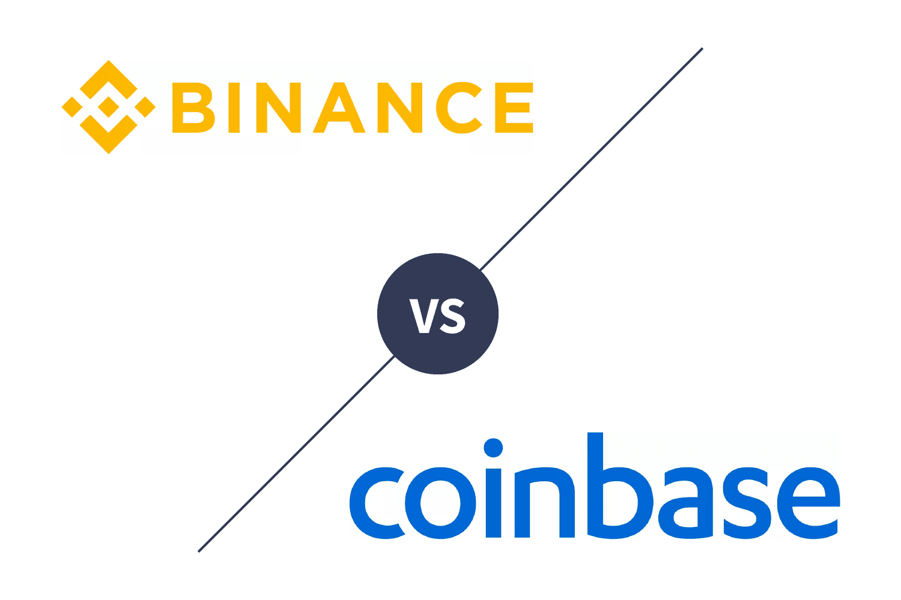

## Table of Contents

## What are Binance and Coinbase?

Binance is a big website where people can buy and sell different kinds of money, like Bitcoin and Ethereum. It started in 2017 and is used by many people all over the world. Binance has a lot of different money options and charges a small fee when you trade. They also have their own special money called Binance Coin (BNB), which you can use on their website.

Coinbase is another popular website where you can trade money like Bitcoin and Ethereum. It started in 2012 and is known for being easy to use, especially for people new to trading. Coinbase also has a special money called Coinbase Earn, where you can learn about new money and earn some for free. They charge a bit more in fees than Binance, but many people like it because it's simple and safe.

## How do Binance and Coinbase differ in terms of user interface and experience?

Binance has a user interface that can feel a bit more complex, especially for beginners. When you first use Binance, you might see a lot of options and information on the screen. This can be good for people who already know about trading and want to do more advanced things. But if you're new to trading, it might take some time to learn how to use everything. Binance also has a mobile app that works well, but it can still feel a bit busy with all the features.

Coinbase, on the other hand, is designed to be easier for people who are new to trading. When you use Coinbase, the website and app are simpler and more straightforward. You can easily see how to buy and sell different kinds of money, and the steps are clear. This makes it a good choice if you're just starting out and want something that's not too confusing. Coinbase also has helpful guides and tips to help you learn as you go.

## What are the fee structures for trading on Binance versus Coinbase?

Binance has lower fees than Coinbase. When you trade on Binance, you pay a fee that can be as low as 0.1% of the amount you're trading. If you use Binance Coin (BNB) to pay the fees, you can get a discount and pay even less. Binance also has different fee levels based on how much you trade. The more you trade, the lower your fees can get. For people who trade a lot, this can save a lot of money over time.

Coinbase has higher fees than Binance. When you trade on Coinbase, the fee can be around 0.5% to 4% of the amount you're trading, depending on how you're paying and what you're trading. If you use Coinbase Pro, which is a more advanced version of Coinbase, the fees can be lower, around 0.5% or less. But for most people who use the regular Coinbase, the fees are higher than what you'd pay on Binance.

## Which cryptocurrencies can be traded on Binance and Coinbase?

Binance has a lot of different cryptocurrencies you can trade. They have popular ones like Bitcoin, Ethereum, and Litecoin, but they also have many others that are not as well-known. This means if you want to trade something new or less common, you might find it on Binance. They keep adding new cryptocurrencies all the time, so there's always something new to try.

Coinbase has fewer cryptocurrencies than Binance, but they still have some of the most popular ones. You can trade Bitcoin, Ethereum, and Litecoin on Coinbase, along with a few others like Bitcoin Cash and Ethereum Classic. Coinbase is good if you want to stick to the well-known cryptocurrencies and don't need a lot of options. They also add new cryptocurrencies sometimes, but not as often as Binance.

## How do the security measures of Binance and Coinbase compare?

Binance takes security very seriously. They use a lot of different ways to keep your money safe. They have something called two-factor authentication, which means you need more than just a password to get into your account. They also keep most of the money in special places called cold storage, which is offline and harder for hackers to get to. Binance has had some problems with security in the past, like a big hack in 2019, but they've been working hard to make things better and safer.

Coinbase also focuses a lot on security. They use two-factor authentication too, and they keep most of the money in cold storage just like Binance. Coinbase has a good reputation for being safe and has not had any big hacks like Binance did. They also have insurance to protect your money if something bad happens. This makes a lot of people feel more comfortable using Coinbase because they trust it to keep their money safe.

## What are the geographic availability and regulatory compliance differences between Binance and Coinbase?

Binance is available in many countries around the world, but it has run into some problems with rules in certain places. Some countries have told Binance that it can't work there because it doesn't follow all the local laws. Binance has been trying to fix this by getting the right licenses and following the rules better. Even though it's not allowed in some places, you can still use Binance if you live somewhere else.

Coinbase is mainly for people in the United States, but it's also available in many other countries. Coinbase follows the rules very closely, especially in the U.S., where it has to follow strict laws about money and trading. This makes Coinbase a good choice if you want to be sure you're using a website that follows all the rules. But because of these rules, Coinbase might not be available in as many places as Binance.

## How do the customer support services of Binance and Coinbase differ?

Binance has customer support, but it can be hard to get help quickly. They have a help center with a lot of information and answers to common questions. If you need to talk to someone, you can send them an email or use their live chat. But sometimes, you might have to wait a long time to get an answer. This can be frustrating if you need help right away. Binance is working on making their customer support better, but for now, it can be a bit slow.

Coinbase tries to make customer support easier and faster. They also have a help center with lots of information. If you need to talk to someone, you can use their email or live chat, and they usually answer faster than Binance. Coinbase also has a phone number you can call if you need to talk to someone right away. This makes it easier to get help when you need it. Overall, Coinbase's customer support is seen as better and quicker than Binance's.

## What advanced trading features does Binance offer that Coinbase does not?

Binance has a lot of advanced trading features that Coinbase doesn't have. One big feature is margin trading, which lets you borrow money to trade more than you have. This can help you make more money if things go well, but it can also be risky. Binance also has futures trading, where you can bet on what the price of a cryptocurrency will be in the future. This is another way to try to make money, but it's also more complicated and risky. Binance also lets you do something called staking, where you can earn more cryptocurrency by holding onto what you already have.

Coinbase doesn't have these advanced features like margin trading, futures trading, or staking. They keep things simpler and safer for people who are new to trading. If you want to do more advanced things, you might need to use Coinbase Pro, which is a different version of Coinbase. But even Coinbase Pro doesn't have as many advanced options as Binance. So, if you're looking for a lot of different ways to trade and make money, Binance might be a better choice for you.

## How do the staking and earning options compare between Binance and Coinbase?

Binance has a lot of ways for you to earn more cryptocurrency through staking and other earning options. Staking on Binance means you can lock up some of your cryptocurrency and earn more of it over time. They have many different cryptocurrencies you can stake, and the rewards can be pretty good. Binance also has something called "Binance Earn," which lets you lend out your cryptocurrency to other people and earn interest on it. This can be a good way to make your money work for you, but it can also be a bit risky.

Coinbase also lets you earn more cryptocurrency, but they have fewer options than Binance. They have a program called "Coinbase Earn," where you can learn about new cryptocurrencies and earn some for free just by watching videos and answering questions. This is a good way to learn and earn at the same time. Coinbase also has staking, but they only let you stake a few cryptocurrencies, like Ethereum and Tezos. The rewards might not be as high as what you can get on Binance, but it's still a way to earn more over time.

## What are the differences in liquidity and trading volume between Binance and Coinbase?

Binance has a lot more liquidity and trading volume than Coinbase. This means that there are more people buying and selling cryptocurrencies on Binance, so it's easier to trade quickly without the price changing too much. Binance is one of the biggest cryptocurrency exchanges in the world, so it has a lot of people using it all the time. This high liquidity is good for people who want to trade a lot or need to buy and sell quickly.

Coinbase has less liquidity and trading volume compared to Binance. It still has a lot of people using it, but not as many as Binance. This means that if you want to trade on Coinbase, you might find it a bit harder to buy or sell quickly, especially if you're trading a lot of money at once. Coinbase is still a good choice for many people, especially those who are new to trading, but if you need a lot of liquidity, Binance might be a better option.

## How do Binance and Coinbase approach decentralized finance (DeFi) and their respective ecosystems?

Binance has a big focus on decentralized finance (DeFi) and has built a lot of tools to help people use it. They have something called Binance Smart Chain, which is like a special place where you can do DeFi stuff. On Binance Smart Chain, you can lend and borrow money, trade in special ways, and earn more cryptocurrency. Binance also has its own version of DeFi called Binance DeFi, which lets you do things like staking and farming to earn more money. They keep adding new ways for people to use DeFi, so it's always growing.

Coinbase also cares about DeFi but in a different way. They don't have their own special chain like Binance, but they let you use some DeFi apps through their website. Coinbase has a part called Coinbase Wallet, which is like a special app where you can connect to different DeFi projects. This way, you can do things like lending, borrowing, and earning rewards. Coinbase is more careful about DeFi and focuses on making it easy and safe for people to try it out, but they don't have as many options as Binance.

## What are the long-term strategic visions of Binance and Coinbase, and how might they impact their future development?

Binance wants to be the biggest and best place for people to trade all kinds of money, not just cryptocurrencies. They plan to keep growing and adding new ways for people to use their website. Binance wants to make it easy for people all over the world to buy, sell, and use different kinds of money. They also want to be a big part of decentralized finance (DeFi) and keep adding new tools and features to help people earn more money. If Binance keeps growing and adding new things, they could become even more popular and used by even more people in the future.

Coinbase also wants to grow and help more people use cryptocurrencies. They focus on making things easy and safe for people, especially those who are new to trading. Coinbase wants to be a trusted place where people can buy and sell cryptocurrencies without worrying too much. They also want to help people learn about and use decentralized finance (DeFi), but they do it in a more careful way. If Coinbase keeps making things simple and safe, they could attract even more people who want to start trading and using cryptocurrencies in the future.

## What is Understanding Algorithmic Trading?

Algorithmic trading, commonly known as algo trading, utilizes pre-programmed computer instructions to automatically execute trades based on predefined criteria. By leveraging technology, traders can enhance the precision and speed of their market transactions. This method effectively mitigates emotional impacts often associated with manual trading, allowing traders to adhere strictly to strategic goals.

Algo trading strategies are often formulated to follow a series of quantitative rules, with a focus on efficiency and accuracy. A few prevalent strategies include:

1. **Volume Weighted Average Price (VWAP)**: The VWAP strategy seeks to execute trades in alignment with the historical trading volume pattern of a given asset. The formula for VWAP is:
$$
   \text{VWAP} = \frac{\sum (\text{Price} \times \text{Volume})}{\sum \text{Volume}}

$$

   This approach ensures trades are distributed throughout the trading session, usually favoring large institutional transactions to minimize market impact.

2. **Time Weighted Average Price (TWAP)**: The TWAP strategy spreads orders evenly over a specified period. By breaking down large buy or sell orders into smaller ones over time, TWAP reduces the immediate impact on market prices and attempts to achieve a price close to the average over the time interval.

3. **Percentage of Volume (POV)**: Also known as Participation Rate strategy, POV involves executing a trade at a rate determined by a percentage of the market volume. This ensures that the order remains proportional to the overall market activity, thereby reducing the risk of substantial market impact.

While these strategies offer significant advantages in trading efficiency and strategy execution, they require a profound comprehension of both technical and market aspects. Algorithmic trading is also not devoid of risks, including potential system failures, algorithmic errors, and market anomalies that could lead to unexpected trading outcomes.

Both Binance and Coinbase accommodate algo trading, although their offerings differ. Binance is particularly notable for its versatile API and advanced trading features, which appeal to experienced algorithmic traders. Coinbase, while offering fewer advanced options, provides a secure and reliable trading environment, catering to traders with simpler algorithmic requirements. Both platforms present APIs that enable programmatic access to trading operations, supporting different levels of customization and complexity tailored to a trader's needs.

In summary, algorithmic trading presents a robust approach for executing trading strategies with precision and reduced emotional interference. However, the complexity of this method necessitates meticulous planning, alongside an understanding of both potential advantages and inherent risks.

## References & Further Reading

[1]: Bergstra, J., Bardenet, R., Bengio, Y., & Kégl, B. (2011). ["Algorithms for Hyper-Parameter Optimization."](https://dl.acm.org/doi/10.5555/2986459.2986743) Advances in Neural Information Processing Systems 24.

[2]: ["Advances in Financial Machine Learning"](https://www.amazon.com/Advances-Financial-Machine-Learning-Marcos/dp/1119482089) by Marcos Lopez de Prado

[3]: ["Evidence-Based Technical Analysis: Applying the Scientific Method and Statistical Inference to Trading Signals"](https://www.amazon.com/Evidence-Based-Technical-Analysis-Scientific-Statistical/dp/0470008741) by David Aronson

[4]: ["Machine Learning for Algorithmic Trading"](https://github.com/stefan-jansen/machine-learning-for-trading) by Stefan Jansen

[5]: ["Quantitative Trading: How to Build Your Own Algorithmic Trading Business"](https://www.amazon.com/Quantitative-Trading-Build-Algorithmic-Business/dp/1119800064) by Ernest P. Chan