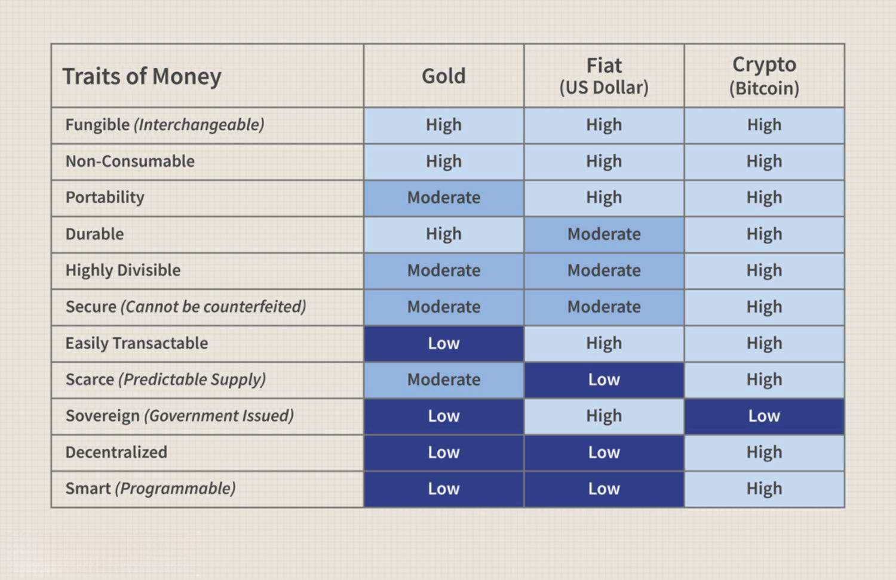

The trading landscape for cryptocurrencies, including Bitcoin and altcoins, has undergone a significant transformation with the introduction of algorithmic trading. This approach utilizes complex algorithms to execute trades at speeds and efficiencies beyond human capability, offering a new dimension to digital currency markets. Initially, Bitcoin, with its substantial market capitalization and widespread recognition, served as the primary entry point for many merchants into the cryptocurrency space. However, the growth of altcoins, which now number in the thousands, provides diverse investment opportunities through various use cases and technologies.

Merchants have recognized the potential of these digital assets to optimize their investment activities through automated trading strategies. Algorithmic trading, by design, reduces human error and emotional bias by adhering strictly to pre-set trading rules, making it an attractive option for both new and experienced market participants. These algorithms can handle vast amounts of market data, making decisions in fractions of a second, which is essential in the highly volatile crypto market.



This article examines the subtleties of trading Bitcoin and altcoins, particularly focusing on the implementation and benefits of algorithmic trading. By understanding these aspects, merchants and traders can better navigate and leverage the emerging technological advancements in the cryptocurrency domain.

## Table of Contents

## Understanding Bitcoin and Altcoins in Trading

Bitcoin has emerged as a significant entry point for merchants venturing into the cryptocurrency market, primarily due to its widespread brand recognition and substantial market capitalization. As the first and most recognized cryptocurrency, Bitcoin's prominence is largely fueled by its pioneering role and its status as a store of value. This recognition is crucial for merchants looking to integrate cryptocurrencies into their trading strategies or payment systems, as Bitcoin is readily accepted across numerous platforms and services.

On the other hand, altcoins—cryptocurrencies other than Bitcoin—present a wider array of investment opportunities. With thousands of coins available, altcoins offer diverse use cases ranging from smart contracts and decentralized applications to privacy-focused transactions. This diversity can be advantageous for merchants seeking to capitalize on niche markets or particular innovations within the blockchain space. For instance, Ethereum, with its robust smart contract functionality, and privacy-centric coins like Monero, exemplify the varied applications that altcoins can support.

For merchants to effectively engage with altcoin trading, evaluating liquidity and trading volume is paramount. Liquidity refers to how quickly an asset can be bought or sold in the market without affecting its price, a critical factor for minimizing the cost of trading and enabling swift execution of trades. Markets with high liquidity typically exhibit tighter bid-ask spreads, reducing the cost associated with entering or exiting positions. 

Trading [volume](/wiki/volume-trading-strategy), on the other hand, indicates the total quantity of an asset traded over a specified period and is indicative of market activity and interest. A higher trading volume generally suggests a more active market, making it easier for merchants to execute large trades without significantly impacting the price. Analyzing both [liquidity](/wiki/liquidity-risk-premium) and volume provides merchants with insights into an altcoin’s trading potential and market stability.

Incorporating these considerations allows merchants to assess the viability of including specific altcoins in their trading strategies. As the [cryptocurrency](/wiki/cryptocurrency) market evolves, merchants who effectively navigate between Bitcoin and altcoins can exploit the broader spectrum of opportunities these digital assets offer, enhancing their trading portfolios and optimizing their investment outcomes.

## Algorithmic Trading: A New Frontier

Algorithmic trading is a method of executing trades that relies on pre-programmed algorithms to determine the optimal conditions and timing for transactions. The primary advantage of this approach lies in its ability to process extensive market data with incredible speed and precision, surpassing human capabilities. By analyzing historical and real-time data, these algorithms can swiftly identify and act upon trading opportunities based on predefined criteria, such as price movements, technical indicators, and market trends.

Merchants who engage in cryptocurrency trading stand to benefit significantly from [algorithmic trading](/wiki/algorithmic-trading), primarily through the automation of complex trading strategies. For instance, rather than manually responding to market fluctuations, merchants can deploy algorithms that execute trades automatically, thereby allowing for consistent implementation of strategies even in volatile market conditions. This not only enhances execution speed and efficiency but also mitigates the risk of emotional trading errors, which can occur when traders make impulsive decisions driven by fear or greed.

A critical component of algorithmic trading is the use of sophisticated mathematical models and rules that guide trading decisions. These models can incorporate various metrics and indicators, such as moving averages, Bollinger Bands, and relative strength index (RSI), to identify trading signals. For example, a simple moving average crossover strategy can be implemented using a basic Python script:

```python
import numpy as np
import pandas as pd

def moving_average_strategy(prices, short_window=50, long_window=200):
    signals = pd.DataFrame(index=prices.index)
    signals['price'] = prices
    signals['short_mavg'] = prices.rolling(window=short_window, min_periods=1).mean()
    signals['long_mavg'] = prices.rolling(window=long_window, min_periods=1).mean()
    signals['signal'] = 0.0

    # Create signals
    signals['signal'][short_window:] = np.where(signals['short_mavg'][short_window:] 
                                                 > signals['long_mavg'][short_window:], 1.0, 0.0)
    signals['positions'] = signals['signal'].diff()

    return signals

# Example usage:
# prices = pd.Series([...]) # Your historical price data here
# signals = moving_average_strategy(prices)
# print(signals)
```

This algorithm calculates short and long moving averages, generating a buy signal when the short average surpasses the long average, indicating a potential upward trend. Such strategies can be further refined by incorporating additional criteria and optimizing parameters through [backtesting](/wiki/backtesting) against historical data.

Furthermore, the advent of [machine learning](/wiki/machine-learning) and [artificial intelligence](/wiki/ai-artificial-intelligence) in algorithmic trading has opened new avenues for predictive analytics, enabling models to evolve and adapt to changing market conditions. This evolution offers merchants an advantage by presenting more accurate forecasts and adaptive trading strategies.

Overall, algorithmic trading presents a powerful tool for merchants seeking to enhance their cryptocurrency trading efficiency, reduce emotional bias, and capitalize on rapid market movements. As the technology and methodology behind algorithmic trading continue to advance, its adoption among merchants is likely to increase, heralding a new era of trading innovation.

## Choosing the Right Algorithmic Trading Platform

When selecting an algorithmic trading platform, merchants must carefully evaluate multiple factors that influence the effectiveness and security of their trading operations. One critical aspect is platform security. Given the digital nature of cryptocurrencies, platforms must implement robust security measures, such as two-[factor](/wiki/factor-investing) authentication (2FA), encryption, and regular security audits, to protect against hacking and fraud.

Ease of use is another important consideration. A user-friendly interface can significantly reduce the learning curve for traders, allowing them to focus on developing and executing their trading strategies rather than navigating complex systems. This is particularly beneficial for merchants new to algorithmic trading, as an intuitive platform can enhance their trading experience.

A platform's support for various cryptocurrencies is also essential. While Bitcoin remains the most popular and widely traded cryptocurrency, the diversity of altcoins presents ample opportunities for traders. Platforms like Binance and Coinbase offer comprehensive tools and a wide range of supported cryptocurrencies, catering to both novice and experienced traders. This variety enables merchants to diversify their portfolios and explore different market segments.

Transaction fees are another crucial factor that can impact profitability. Lower transaction fees can lead to significant cost savings, especially for high-frequency traders. Merchants should compare fee structures across platforms to ensure they choose one that aligns with their trading volume and financial objectives.

Backtesting capabilities are indispensable for refining trading strategies. Robust backtesting allows merchants to simulate trades using historical data, assessing the potential effectiveness of their strategies before deploying them in live markets. This feature helps traders validate their models and make data-driven decisions to maximize returns. Therefore, selecting a platform with advanced backtesting tools is highly recommended for merchants aiming to optimize their algorithmic trades.

In summary, choosing the right algorithmic trading platform involves evaluating security, usability, cryptocurrency support, transaction costs, and backtesting functionalities. Platforms like Binance and Coinbase provide a solid foundation with their comprehensive features, yet merchants must individually assess how a platform aligns with their specific trading needs and objectives.

## Benefits and Challenges of Algorithmic Trading for Merchants

Algorithmic trading offers numerous benefits to merchants engaging in cryptocurrency trading. One significant advantage is the ability to trade continuously throughout the day and night. Unlike manual trading, which is constrained by the trader's availability, algorithmic systems can operate without interruption, seizing opportunities in the market whenever they arise. This 24/7 trading capability is especially crucial in the highly volatile and round-the-clock nature of the cryptocurrency market, where prices can change drastically in short periods.

Enhanced speed and accuracy represent another key benefit. Algorithms can process vast amounts of market data and execute trades at speeds far exceeding human capabilities. This allows for the precise execution of complex strategies, minimizing slippage and maximizing potential profits. Additionally, the systematic nature of algorithmic trading eliminates human emotional biases, such as fear and greed, which often lead to poor decision-making and financial losses.

Despite these benefits, merchants must also contend with several challenges associated with algorithmic trading. One primary concern is the risk of algorithmic errors. These can stem from coding mistakes or unforeseen market conditions that the algorithm is not prepared to handle. Such errors can lead to significant financial losses if not identified and corrected swiftly.

The complexity of setting up and maintaining algorithms also poses a challenge. Developing robust trading algorithms requires a deep understanding of both programming and trading principles. Once deployed, these algorithms must be regularly monitored and updated to adjust to evolving market dynamics, which can be resource-intensive.

Furthermore, the digital nature of algorithmic trading introduces potential security vulnerabilities. Hackers could exploit weaknesses in the trading platform or the algorithm itself, posing a threat to the merchant's financial assets. It is vital for merchants to employ stringent security measures to safeguard their systems and maintain the integrity of their trading activities.

In conclusion, while algorithmic trading offers merchants significant advantages by enhancing trading efficiency and efficacy, it also requires careful management to mitigate associated risks and challenges. By investing in reliable algorithms and robust security protocols, merchants can harness the power of algorithmic trading to optimize their operations in the cryptocurrency market.

## Popular Algorithmic Trading Strategies

Market making, [arbitrage](/wiki/arbitrage), and [trend following](/wiki/trend-following) are some of the most popular algorithmic trading strategies utilized by merchants in the cryptocurrency space. These strategies, backed by robust algorithms, allow traders to capitalize on market opportunities efficiently.

**Market Making:**  
Market making is a strategy where traders place buy and sell orders for a specific asset, profiting from the bid-ask spread. This technique requires a trader to continuously provide liquidity to the market by being ready to buy or sell at any time. Market makers facilitate smooth market transactions and are compensated through the spread between buying and selling prices. This strategy is particularly effective in volatile markets as it leverages price fluctuations to generate profits.

**Arbitrage:**  
Arbitrage involves exploiting the price discrepancies of a single asset across different markets or exchanges. In practice, this means buying an asset at a lower price in one market and simultaneously selling it at a higher price in another, thus [earning](/wiki/earning-announcement) a risk-free profit. Cryptocurrency arbitrage can occur across geographical regions, exchanges, or between derivatives and their underlying assets. Arbitrage algorithms must execute trades rapidly to capture fleeting opportunities, often requiring advanced computing power.

For example, a simple Python script to monitor arbitrage opportunities in two markets might look like this:

```python
import time
import requests

def get_price(exchange):
    # Simulating fetching price from an exchange
    # In practice, use API requests to fetch real-time data
    prices = {
        'exchange1': 30000,
        'exchange2': 30100
    }
    return prices[exchange]

def main():
    while True:
        price1 = get_price('exchange1')
        price2 = get_price('exchange2')

        if price1 < price2:
            print(f"Arbitrage opportunity! Buy at exchange1: ${price1} | Sell at exchange2: ${price2}")
        else:
            print("No arbitrage opportunities at the moment.")

        time.sleep(30)  # pause for 30 seconds before the next check

main()
```

**Trend Following:**  
Trend following strategies rely on analyzing market [momentum](/wiki/momentum) to make trading decisions. These strategies involve identifying and riding the upward or downward trends of an asset's price. Trend following can be automated using technical indicators like moving averages, relative strength index (RSI), or moving average convergence divergence (MACD). The objective is to enter trades in the direction of the trend and [exit](/wiki/exit-strategy) when the trend weakens or reverses.

A simple moving average cross-over strategy implementation in Python might look like this:

```python
import pandas as pd

def simple_moving_average(data, window_size):
    return data.rolling(window=window_size).mean()

def trading_signal(data, short_window, long_window):
    signals = pd.DataFrame(index=data.index)
    signals['short_mavg'] = simple_moving_average(data, short_window)
    signals['long_mavg'] = simple_moving_average(data, long_window)
    signals['signal'] = 0.0
    signals['signal'][short_window:] = np.where(signals['short_mavg'][short_window:] > signals['long_mavg'][short_window:], 1.0, 0.0)
    signals['positions'] = signals['signal'].diff()
    return signals

# Assuming `prices` is a DataFrame with the asset's price history, pass it accordingly
# Example: trading_signal(prices['Close'], short_window=40, long_window=100)
```

These algorithmic trading strategies provide merchants with systematic and disciplined approaches to trading cryptocurrencies. By leveraging the speed and precision of algorithms, traders can optimize their strategies for increased efficiency and potential profitability.

## The Role of Exchanges and Payment Gateways

Exchanges such as Bitget and Gemini play a pivotal role in facilitating algorithmic trading for merchants in the cryptocurrency landscape. These platforms provide the necessary infrastructure for executing high-frequency trades, offering the security and reliability required for automated trading strategies. Bitget and Gemini are equipped with application programming interfaces (APIs) that enable merchants to integrate and execute their algorithmic models efficiently. This level of integration allows for the seamless processing of trades based on pre-established algorithms, reducing manual intervention and increasing the potential for profitable trading.

Payment gateways, like BitPay, further streamline the merchant experience by enabling the acceptance of cryptocurrencies and their conversion to fiat currencies. This functionality is crucial for merchants who wish to integrate cryptocurrency payments into their business operations without exposing themselves to the [volatility](/wiki/volatility-trading-strategies) of the crypto markets. BitPay ensures transactions are processed promptly and can facilitate the automatic conversion of cryptocurrencies into stable fiat currencies, thus preserving the monetary value of sales at the point of transaction.

The choice of exchange or payment service provider is critical in shaping trading efficiency and overall profitability for merchants. Factors such as transaction fees, security protocols, user interface, and the range of supported cryptocurrencies must be considered when selecting an exchange or payment gateway. For example, a higher transaction fee on trades could diminish profits, whereas robust security measures are essential to protect digital assets from potential threats. Moreover, the choice of platform can affect the speed of trade execution—a vital aspect of algorithmic trading, where timing can significantly influence the outcome.

In addition to these considerations, the trading volume and liquidity offered by an exchange like Gemini or Bitget can impact market entry and exit points. High liquidity typically results in tighter bid-ask spreads, thus offering better trading conditions for merchants. By selecting exchanges and payment gateways that align with their trading strategy and business model, merchants can optimize their participation in the cryptocurrency market, making informed decisions that harness the potential of algorithmic trading to its fullest extent.

## Conclusion: Optimizing Trading with Algorithms

Algorithmic trading has deeply revolutionized how merchants participate in the cryptocurrency market. As digital assets continue to proliferate, the use of algorithms in trading offers a sophisticated approach to navigating this complex landscape. By automating trades based on predefined criteria, merchants can significantly enhance their trading tactics and capitalize on the volatile nature of cryptocurrencies.

One of the primary advantages of algorithmic trading lies in its ability to process market data and execute trades with remarkable speed and precision, attributes that are crucial in a market functioning 24/7, like cryptocurrencies. This mechanization minimizes human errors, particularly those born of emotional decision-making, and ensures that trading strategies are adhered to consistently. By relying on data-driven algorithms, merchants can achieve a level of trading discipline difficult to maintain through manual trading.

Moreover, the increasing availability of algorithmic trading platforms and services introduces significant opportunities for profit generation and trading strategy innovation. These platforms equip merchants with advanced tools for backtesting and refining strategies against historical data, ensuring that automated strategies are both robust and responsive to market dynamics before being deployed live. For instance, Python-based libraries like `[backtrader](/wiki/backtrader)` or `Zipline` provide merchants with flexible frameworks for developing and testing trading algorithms.

As the cryptocurrency landscape further evolves, merchants who effectively leverage algorithmic trading stand to benefit from increased efficiency and improved trade execution, laying a foundation for sustainable trading success. The potential for algorithmic trading to adapt to and anticipate market trends ensures that it remains an indispensable part of the savvy merchant's toolkit. With ongoing advancements in technology and trading practices, algorithmic trading is set to remain a pivotal force in optimizing crypto trading activities.

## References & Further Reading

[1]: Bergstra, J., Bardenet, R., Bengio, Y., & Kégl, B. (2011). ["Algorithms for Hyper-Parameter Optimization."](https://dl.acm.org/doi/10.5555/2986459.2986743) Advances in Neural Information Processing Systems 24.

[2]: ["Advances in Financial Machine Learning"](https://www.amazon.com/Advances-Financial-Machine-Learning-Marcos/dp/1119482089) by Marcos Lopez de Prado

[3]: ["Evidence-Based Technical Analysis: Applying the Scientific Method and Statistical Inference to Trading Signals"](https://www.amazon.com/Evidence-Based-Technical-Analysis-Scientific-Statistical/dp/0470008741) by David Aronson

[4]: ["Machine Learning for Algorithmic Trading"](https://github.com/stefan-jansen/machine-learning-for-trading) by Stefan Jansen

[5]: ["Quantitative Trading: How to Build Your Own Algorithmic Trading Business"](https://www.amazon.com/Quantitative-Trading-Build-Algorithmic-Business/dp/1119800064) by Ernest P. Chan