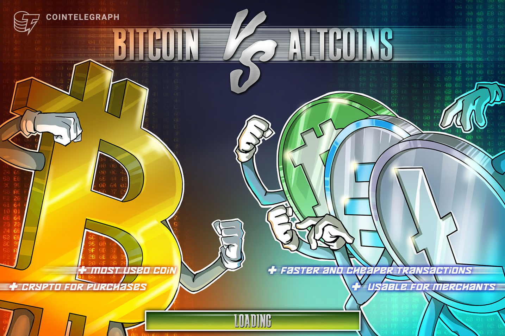

## Table of Contents

## What is Bitcoin and how does it differ from altcoins?

Bitcoin is a type of digital money that you can use to buy things online. It was created in 2009 by someone using the name Satoshi Nakamoto. Unlike regular money from banks, Bitcoin is not controlled by any government or company. Instead, it uses a technology called blockchain, which is like a public record book that keeps track of all Bitcoin transactions. People can send and receive Bitcoin using special computer programs called wallets.

Altcoins are other types of digital money that came after Bitcoin. The term "altcoin" means "alternative coin" because they are alternatives to Bitcoin. There are many altcoins, like Ethereum, Litecoin, and Ripple. Each altcoin has its own features and uses. For example, some altcoins work faster than Bitcoin, or they might be used for different purposes like running smart contracts. While Bitcoin is often seen as digital gold, altcoins can be thought of as trying different things in the world of digital money.

## What are the most popular altcoins used by merchants?

Merchants often use altcoins like Ethereum and Litecoin because they are popular and work well for buying things. Ethereum is known for its speed and low cost, which makes it good for businesses. It also has a technology called smart contracts, which can automatically handle transactions. This means that once certain conditions are met, the payment is sent without needing someone to do it manually. Many online stores and services accept Ethereum because it's easy to use and reliable.

Litecoin is another altcoin that merchants like to use. It's similar to Bitcoin but it works faster and has lower fees. This makes it a good choice for small purchases where you don't want to pay a lot in fees. Many merchants find Litecoin easy to set up and use, so it's popular in places like online shops and even some physical stores. Both Ethereum and Litecoin are widely accepted and help make buying things with digital money easier for everyone.

## How do transaction fees compare between Bitcoin and altcoins for merchants?

Bitcoin transaction fees can be higher than many altcoins. When a merchant uses Bitcoin, they have to pay a fee to get their transaction processed quickly. This fee can change based on how busy the Bitcoin network is. If lots of people are using Bitcoin at the same time, the fees can go up a lot. This can make it more expensive for merchants, especially for small purchases where the fee might be close to the price of the item.

Altcoins like Ethereum and Litecoin often have lower transaction fees. For example, Ethereum's fees are usually less than Bitcoin's, which makes it a good choice for merchants who want to save money on each transaction. Litecoin also has lower fees and faster processing times, which is why many merchants prefer it for everyday purchases. Using altcoins can help merchants keep their costs down and make it easier for customers to buy things without worrying about high fees.

## What is the average transaction speed for Bitcoin versus altcoins?

Bitcoin transactions can take a while to process. On average, it can take about 10 minutes for a Bitcoin transaction to be confirmed on the blockchain. Sometimes, if the network is busy, it might take even longer. This can be a problem for merchants who want to get paid quickly. They might have to wait for several confirmations to make sure the payment is safe, which can add more time.

Altcoins like Ethereum and Litecoin usually process transactions faster. Ethereum transactions can be confirmed in about 15 seconds to a minute, which is much quicker than Bitcoin. Litecoin transactions are even faster, often taking just 2.5 minutes to get confirmed. This makes altcoins a better choice for merchants who need quick payments. The faster speed helps keep things moving smoothly in their business.

## How does the scalability of Bitcoin compare to that of altcoins for merchant transactions?

Bitcoin's scalability can be a challenge for merchants. It can only handle a certain number of transactions per second, about 7. When a lot of people want to use Bitcoin at the same time, it can get slow and the fees can go up. This can make it hard for merchants who need to process a lot of payments quickly and cheaply. Bitcoin's network can get crowded, which means merchants might have to wait longer to get paid or pay more in fees.

Altcoins like Ethereum and Litecoin are often better at handling more transactions. Ethereum can process around 15 to 20 transactions per second, which is more than Bitcoin. Litecoin can handle about 56 transactions per second. This means that merchants using these altcoins can process more payments faster and with lower fees. Because of this, altcoins can be a better choice for merchants who need to scale their business and handle a lot of transactions without slowing down or spending too much on fees.

## What security features do Bitcoin and altcoins offer to merchants?

Bitcoin and altcoins have strong security features to keep merchants safe. Both use something called cryptography, which is like a secret code that protects the money. Every transaction is recorded on a public ledger called the blockchain, which makes it hard for anyone to change or steal the money. Bitcoin's security is well-known because it has been around for a long time and many people trust it. Merchants can use special wallets and tools that add extra layers of protection, like two-[factor](/wiki/factor-investing) authentication, to keep their money safe.

Altcoins like Ethereum and Litecoin also have good security. They use the same kind of cryptography and blockchain technology as Bitcoin. Ethereum has something called smart contracts, which can automatically check that a transaction is safe before it goes through. This can help prevent fraud. Litecoin is similar to Bitcoin but it's faster, which can make it easier for merchants to get their money quickly and safely. Both Bitcoin and altcoins have strong security measures, but it's important for merchants to use the right tools and be careful to stay safe.

## How do the volatility levels of Bitcoin and altcoins impact merchants?

Bitcoin and altcoins can change in value a lot, which is called [volatility](/wiki/volatility-trading-strategies). This can be a big problem for merchants. If a merchant gets paid in Bitcoin or an altcoin, the value of that money might go down before they can change it into regular money. This means they might lose money on each sale. For example, if a merchant sells something for 1 Bitcoin and the price of Bitcoin drops right after, they get less money than they expected. This makes it hard for merchants to know how much they will really earn.

Altcoins can be even more volatile than Bitcoin. This means their prices can change even more quickly and by bigger amounts. For merchants, this can be even riskier. If they accept an altcoin and its value drops a lot, they could lose a lot of money. To deal with this, some merchants change the money they get into regular money right away. Others might charge more if someone pays with a volatile [cryptocurrency](/wiki/cryptocurrency). This way, they can try to protect themselves from the ups and downs of the crypto market.

## What are the merchant adoption rates for Bitcoin compared to altcoins?

Bitcoin has been around longer than most altcoins, so more merchants know about it and accept it. It's seen as a safe choice because it's the most well-known cryptocurrency. Many big companies, like Microsoft and Overstock, accept Bitcoin. This makes it easier for smaller merchants to start using it too. They see that big companies are doing it and feel more comfortable trying it themselves. But, because Bitcoin can be slow and expensive to use, some merchants are still hesitant to accept it for all their sales.

Altcoins like Ethereum and Litecoin are catching up in terms of merchant adoption. They offer faster and cheaper transactions, which can be a big plus for merchants. Some online stores and even physical shops are starting to accept these altcoins. Ethereum is popular because it can do more than just payments, like running smart contracts. Litecoin is liked for its speed and low fees. But, because altcoins are not as well-known as Bitcoin, fewer merchants accept them. Still, as more people learn about them and their benefits, more merchants might start using them.

## How do Bitcoin and altcoins integrate with existing payment systems for merchants?

Bitcoin and altcoins can be added to the payment systems that merchants already use, but it can be a bit tricky. For Bitcoin, there are special tools and services that help merchants accept it. These tools can connect to the merchant's existing payment system, so they can accept Bitcoin along with regular money. Some popular services like BitPay or Coinbase make it easier for merchants to set this up. They handle the Bitcoin part, so the merchant doesn't have to worry about the technical stuff. But, because Bitcoin can be slow and the fees can change a lot, some merchants might need to adjust their systems to handle these issues.

Altcoins like Ethereum and Litecoin also have their own ways to work with existing payment systems. Services like CoinGate or CryptoPay help merchants accept these altcoins. These services can connect to the merchant's current payment system, making it simple to add altcoins as a payment option. Since altcoins often have faster and cheaper transactions, they can be easier for merchants to use. But, because altcoins are not as well-known as Bitcoin, fewer merchants might have the tools set up to accept them. As more people learn about altcoins, more merchants might start using these services to accept them.

## What are the regulatory considerations for merchants using Bitcoin versus altcoins?

Merchants using Bitcoin need to think about rules from the government. Different countries have different laws about using Bitcoin. Some places might say it's okay to use Bitcoin, but they want merchants to report it and pay taxes on it. Other places might have strict rules or even say it's not allowed. Merchants need to check the rules in their country to make sure they're doing everything right. Using Bitcoin can be tricky because the rules can change and it's important to keep up with them.

Altcoins also come with their own set of rules that merchants need to follow. Just like with Bitcoin, the laws can be different in each country. Some altcoins might be treated the same as Bitcoin, while others might have special rules. Merchants need to know which altcoins they can use and what they need to do to follow the law. Because altcoins are newer and less known, the rules can be even more confusing. It's a good idea for merchants to talk to a lawyer or someone who knows about cryptocurrency laws to make sure they're doing everything right.

## How do smart contract capabilities in some altcoins benefit merchants compared to Bitcoin?

Smart contracts in some altcoins like Ethereum can make things easier for merchants. A smart contract is like a special computer program that automatically does what it's supposed to do when certain things happen. For example, if a merchant sells something, the smart contract can check that the buyer paid and then send the item right away. This means the merchant doesn't have to do as much work to make sure everything is done correctly. It can save time and money, and it can also help prevent mistakes or cheating.

Bitcoin doesn't have smart contracts like Ethereum does. This means that merchants using Bitcoin have to do more work to make sure everything goes smoothly. They might need to wait for the payment to be confirmed and then send the item themselves. This can take longer and might cost more. With smart contracts, merchants using altcoins can automate a lot of their business, which can make things run more smoothly and help them grow their business faster.

## What future developments in Bitcoin and altcoins could influence their use by merchants?

In the future, Bitcoin might get better at handling more transactions quickly and cheaply. This could happen with something called the Lightning Network, which is like a fast lane for Bitcoin transactions. If this works well, more merchants might start using Bitcoin because it would be easier and cheaper for them. Also, if more big companies start accepting Bitcoin, it could become even more popular. But, if the rules about using Bitcoin get stricter, it might be harder for merchants to use it.

Altcoins could also change a lot in the future. Some altcoins, like Ethereum, are working on ways to make their networks faster and able to handle more transactions. This could make them even better for merchants who need to process a lot of payments quickly. New altcoins might also come out that are made just for merchants, with special features to help them run their businesses. But, if the rules about altcoins get more confusing or strict, it might make it harder for merchants to use them.

## References & Further Reading

[1]: Bergstra, J., Bardenet, R., Bengio, Y., & Kégl, B. (2011). ["Algorithms for Hyper-Parameter Optimization."](https://dl.acm.org/doi/10.5555/2986459.2986743) Advances in Neural Information Processing Systems 24.

[2]: ["Advances in Financial Machine Learning"](https://www.amazon.com/Advances-Financial-Machine-Learning-Marcos/dp/1119482089) by Marcos Lopez de Prado

[3]: ["Evidence-Based Technical Analysis: Applying the Scientific Method and Statistical Inference to Trading Signals"](https://www.amazon.com/Evidence-Based-Technical-Analysis-Scientific-Statistical/dp/0470008741) by David Aronson

[4]: ["Machine Learning for Algorithmic Trading"](https://github.com/stefan-jansen/machine-learning-for-trading) by Stefan Jansen

[5]: ["Quantitative Trading: How to Build Your Own Algorithmic Trading Business"](https://www.amazon.com/Quantitative-Trading-Build-Algorithmic-Business/dp/1119800064) by Ernest P. Chan