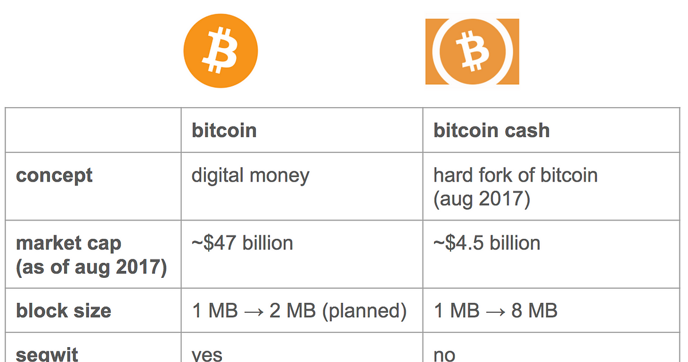

## Table of Contents

## What is Bitcoin?

Bitcoin is a type of digital money that you can use to buy things online. It was created in 2009 by someone using the name Satoshi Nakamoto. Unlike regular money, Bitcoin is not controlled by any government or bank. Instead, it uses a technology called blockchain, which is like a big, public record book that keeps track of all Bitcoin transactions.

People store their Bitcoins in digital wallets, which can be on a computer or a special device. To send Bitcoin to someone else, you use their wallet address, which is a long string of numbers and letters. Bitcoin can be used to buy things like food, clothes, or even a cup of coffee at some places. Its value can go up and down a lot, which makes it different from regular money.

Because Bitcoin is not controlled by any one group, it can be used by people all over the world. This makes it very popular in places where the regular money system is not trusted. However, because it's not controlled, it can also be used for things that are not allowed, like buying illegal items. This is something that people worry about when they talk about Bitcoin.

## What is Bitcoin Cash?

Bitcoin Cash is a type of digital money that came from Bitcoin. It started in 2017 because some people wanted to change how Bitcoin worked. They thought Bitcoin was too slow and expensive to use for everyday buying. So, they made Bitcoin Cash to fix these problems. It works a lot like Bitcoin but can handle more transactions faster and with lower fees.

Just like Bitcoin, Bitcoin Cash uses a technology called blockchain to keep track of all its transactions. This means it's not controlled by any government or bank. People can use Bitcoin Cash to buy things online or send money to others. It's stored in digital wallets, and you can use it at places that accept it. The value of Bitcoin Cash can also go up and down, just like Bitcoin.

## How did Bitcoin Cash originate from Bitcoin?

Bitcoin Cash came from Bitcoin because some people wanted to make changes to how Bitcoin worked. They thought Bitcoin was getting too slow and the fees to use it were too high. So, in 2017, they decided to create a new version of Bitcoin, which they called Bitcoin Cash. This new version was made by making a copy of the Bitcoin blockchain up to a certain point and then continuing it in a different way.

To make Bitcoin Cash, the people who wanted the change did something called a "hard fork." This means they split off from the original Bitcoin and started a new path. After the hard fork, people who owned Bitcoin before the split got the same amount of Bitcoin Cash for free. This way, they could choose to use either Bitcoin or Bitcoin Cash, or both. Bitcoin Cash was designed to handle more transactions faster and with lower fees, making it easier for everyday use.

## What are the main differences between Bitcoin and Bitcoin Cash?

Bitcoin and Bitcoin Cash are similar because they both started from the same place and use the same basic technology called blockchain. They are both types of digital money that you can use to buy things online. They are not controlled by any government or bank, and people store them in digital wallets. Both can be used to send money to others, and their values can go up and down.

The main difference between them is how they handle transactions. Bitcoin Cash was made because some people thought Bitcoin was too slow and the fees were too high. So, they changed Bitcoin Cash to handle more transactions faster and with lower fees. This makes Bitcoin Cash easier to use for everyday buying. Bitcoin, on the other hand, has stayed more focused on being a store of value, like digital gold, and it has a smaller limit on how many transactions it can handle at once.

Because of these differences, Bitcoin and Bitcoin Cash have different communities and goals. Bitcoin is seen more as a long-term investment, while Bitcoin Cash aims to be used more like regular money for daily purchases. These different focuses have led to different paths for each, even though they share the same roots.

## How do the block sizes of Bitcoin and Bitcoin Cash compare?

The main difference between Bitcoin and Bitcoin Cash is the size of their blocks. A block is like a page in the blockchain's record book where transactions are written down. Bitcoin has a block size limit of 1 megabyte (MB). This means that each page can only hold so many transactions, which can slow things down and make fees higher when a lot of people want to use Bitcoin at the same time.

Bitcoin Cash, on the other hand, has a bigger block size limit. It started with a block size of 8 MB, which is eight times bigger than Bitcoin's. Later, it was increased to 32 MB. This bigger block size lets Bitcoin Cash handle more transactions on each page, which makes it faster and cheaper to use. That's why Bitcoin Cash was made, to make digital money easier to use for everyday buying.

## What are the transaction speed and fees like for Bitcoin versus Bitcoin Cash?

Bitcoin and Bitcoin Cash have different speeds and fees because of how big their blocks are. Bitcoin has smaller blocks, so it can only handle a certain number of transactions at a time. When a lot of people want to use Bitcoin, it can get slow and the fees can go up. This happens because people have to wait for their turn, and they might pay more to get their transaction done faster. So, if you want to use Bitcoin to buy something or send money, it might take longer and cost more than you expect.

Bitcoin Cash, on the other hand, has bigger blocks, so it can handle more transactions at once. This makes it faster and cheaper to use. When you want to buy something or send money with Bitcoin Cash, it usually happens quicker and costs less in fees. That's why Bitcoin Cash was made, to make digital money easier to use for everyday things like buying a coffee or paying a friend back.

## How does the mining process differ between Bitcoin and Bitcoin Cash?

The mining process for Bitcoin and Bitcoin Cash is similar because they both use a system called proof of work. Miners use special computers to solve hard math problems. When they solve a problem, they can add a new block of transactions to the blockchain and get rewarded with new coins. This is how new Bitcoins and Bitcoin Cash are made. Both Bitcoin and Bitcoin Cash use the same kind of math problems for mining, but they have different block sizes, which can affect how miners work.

The main difference in mining between Bitcoin and Bitcoin Cash is the block size. Bitcoin has smaller blocks, so miners can only add a certain number of transactions to each block. This can make mining a bit slower and might make miners compete more for the limited space. Bitcoin Cash has bigger blocks, so miners can add more transactions to each block. This can make mining a bit easier and faster because there's more room for transactions. Even though the mining process is similar, these differences can affect how miners choose which coin to mine.

## What are the security considerations for Bitcoin and Bitcoin Cash?

Both Bitcoin and Bitcoin Cash use the same kind of security called proof of work. This means that lots of computers around the world work together to keep the money safe. They do this by solving hard math problems, which makes it very hard for anyone to cheat the system. If someone tries to change the records or steal money, the other computers will notice and stop them. This makes both Bitcoin and Bitcoin Cash secure against attacks.

There are some small differences in security because of the different block sizes. Bitcoin has smaller blocks, so it can be a bit slower but it's been around longer and has a lot of miners working on it. This makes it very secure because there are so many people watching over it. Bitcoin Cash has bigger blocks, which can make it faster but it has fewer miners compared to Bitcoin. Even though it's still secure, some people worry that it might be easier to attack because there are fewer people keeping an eye on it.

## How do the adoption rates and merchant acceptance compare between Bitcoin and Bitcoin Cash?

Bitcoin has been around longer than Bitcoin Cash, so more people know about it and use it. Many big companies and stores accept Bitcoin, like Microsoft, Overstock, and some big websites. Because Bitcoin is more popular, it's easier to find places that take it. People also see Bitcoin as a good long-term investment, which makes more people want to buy and hold it. This has led to a larger community of users and more support from businesses.

Bitcoin Cash, on the other hand, was made to be easier to use for everyday buying. It's not as widely accepted as Bitcoin, but it's growing. Some stores and online shops accept Bitcoin Cash, especially those that want to offer cheaper and faster payments. Because Bitcoin Cash aims to be used more like regular money, it's trying to get more merchants to accept it. But it still has a smaller community and less support compared to Bitcoin.

## What are the future development plans for Bitcoin and Bitcoin Cash?

Bitcoin's future plans focus on making it more secure and easier to use. One big goal is to improve something called the Lightning Network, which is like a fast lane for Bitcoin transactions. This would make buying things with Bitcoin quicker and cheaper. Another plan is to make the whole system more private, so people can use Bitcoin without others knowing too much about what they're doing. Bitcoin also wants to keep being seen as a good long-term investment, like digital gold, so it's working on making it more stable and trustworthy.

Bitcoin Cash wants to become even better for everyday use. Its main goal is to keep making transactions faster and cheaper. They plan to do this by making the blocks even bigger if needed and improving how the system works. Bitcoin Cash also wants to get more people and businesses to use it, so they're working on making it easier for merchants to accept it. They hope to grow their community and become a popular choice for buying things online and in stores.

## How do the philosophies and community support differ between Bitcoin and Bitcoin Cash?

Bitcoin and Bitcoin Cash have different ideas about what digital money should be. Bitcoin's philosophy is about being a store of value, like digital gold. People who support Bitcoin think it should be safe and reliable for the long term. They want Bitcoin to be like a savings account that grows in value over time. The Bitcoin community is big and strong because it's been around for a long time. Many people and businesses believe in Bitcoin and work to make it better.

Bitcoin Cash, on the other hand, wants to be used for everyday buying, like regular money. Its philosophy is to make transactions fast and cheap so people can use it to buy things easily. The Bitcoin Cash community is smaller but very focused on making it easier for people to use. They work on getting more stores and websites to accept Bitcoin Cash, hoping to make it a common way to pay for things. While the community is not as big as Bitcoin's, it's very dedicated to its goal of making digital money useful for daily life.

## What are the investment and market performance trends for Bitcoin versus Bitcoin Cash?

Bitcoin has been around longer and is more popular, so it tends to have higher value and more people trading it. Its price can go up and down a lot, but many people see it as a good long-term investment. Over the years, Bitcoin's value has grown a lot, and it's seen as a safe place to put money, like digital gold. Because so many people believe in Bitcoin, it has a big market and lots of trading, which can make it more stable than other digital money. But, because it's so popular, big changes in the market can affect its price a lot.

Bitcoin Cash was made to be easier to use for everyday buying, but it doesn't have as many people using it or trading it as Bitcoin. Its price can also go up and down, but it usually doesn't go as high as Bitcoin. Bitcoin Cash is seen more as a way to spend money quickly and cheaply, not as a long-term investment. Because it's not as popular, its market can be smaller and more affected by fewer people trading it. This can make its price more unpredictable, but it still has a place in the world of digital money for people who want to use it for buying things.

## What are the differences between Bitcoin and Bitcoin Cash in algorithmic trading?

Evaluating the [liquidity](/wiki/liquidity-risk-premium) and market depth of Bitcoin and Bitcoin Cash is crucial for understanding their roles in algorithmic trading. Bitcoin, being the first cryptocurrency, enjoys the highest market liquidity and depth due to its widespread usage and recognition. This makes it an attractive asset for algorithmic traders who require the ability to execute large orders without significantly impacting the market price. Bitcoin Cash, although less liquid compared to Bitcoin, still offers substantial liquidity owing to its position as a prominent cryptocurrency. However, its market depth might be smaller, affecting the execution of sizable trades.

Volatility is a key [factor](/wiki/factor-investing) in formulating algorithmic trading strategies for both Bitcoin and Bitcoin Cash. Bitcoin typically exhibits significant price volatility, providing opportunities for traders to profit from price swings through various strategies like mean reversion and [momentum](/wiki/momentum)-based trading. The average percentage returns and the standard deviation of returns for Bitcoin can be mathematically described as:

$$
\text{Average Return} = \frac{1}{n} \sum_{i=1}^{n} \frac{P_{i+1} - P_i}{P_i}
$$

$$
\text{Standard Deviation} = \sqrt{\frac{1}{n-1} \sum_{i=1}^{n} (\frac{P_{i+1} - P_i}{P_i} - \text{Average Return})^2}
$$

where $P_i$ is the price on day $i$, and $n$ is the total number of trading days sampled. Bitcoin Cash, known for lower transaction fees and faster processing times, often experiences less volatility compared to Bitcoin, possibly due to its smaller market size and different use cases as a medium of exchange rather than a store of value.

Exchanges supporting Bitcoin and Bitcoin Cash differ in trading pairs, impacting algorithmic trading strategies. Bitcoin is universally available across all major exchanges, often paired with fiat currencies like USD, EUR, and JPY, as well as other cryptocurrencies such as Ethereum and Tether. Bitcoin Cash is accessible on many exchanges but might have fewer fiat trading pairs, which can influence trading strategies that rely on currency conversions.

Profitability in algorithmic trading for Bitcoin and Bitcoin Cash is influenced by the inherent characteristics of each cryptocurrency. Bitcoin's high volatility can yield significant returns but also increases risk, necessitating advanced risk management strategies. Bitcoin Cash, with its lower transaction costs and speedier confirmations, might be better suited for high-frequency trading algorithms that capitalize on minor price discrepancies.

The long-term implications of algorithmic trading on Bitcoin and Bitcoin Cash include potential impacts on their value perception. Excessive algorithmic trading could lead to higher short-term volatility, affecting market stability. Moreover, as algorithmic trading becomes more prevalent, it may contribute to increased efficiency and liquidity in the markets of both Bitcoin and Bitcoin Cash, potentially enhancing their attractiveness to traditional financial institutions and retail investors alike. Nonetheless, algorithmic trading also brings challenges such as the risk of flash crashes and the need for robust regulatory frameworks to ensure fair trading practices.

## References & Further Reading

[1]: Antonopoulos, A. M. (2017). ["Mastering Bitcoin: Unlocking Digital Cryptocurrencies"](https://books.google.com/books/about/Mastering_Bitcoin.html?id=IXmrBQAAQBAJ) (2nd ed.). O'Reilly Media.

[2]: Chan, E. (2009). ["Algorithmic Trading: Winning Strategies and Their Rationale"](https://github.com/ftvision/quant_trading_echan_book). Wiley.

[3]: Nakamoto, S. (2008). ["Bitcoin: A Peer-to-Peer Electronic Cash System"](https://nakamotoinstitute.org/library/bitcoin/). Bitcoin.org.

[4]: Jansen, S. (2018). ["Hands-On Machine Learning for Algorithmic Trading"](https://www.amazon.com/Hands-Machine-Learning-Algorithmic-Trading/dp/178934641X). Packt Publishing.

[5]: Popper, N. (2015). ["Digital Gold: Bitcoin and the Inside Story of the Misfits and Millionaires Trying to Reinvent Money"](https://www.amazon.com/Digital-Gold-Bitcoin-Millionaires-Reinvent/dp/006236250X). Harper.