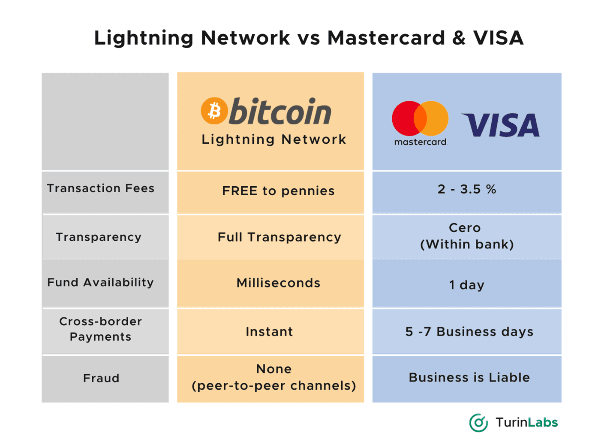

## Table of Contents

## What is Bitcoin and how does it work?

Bitcoin is a type of digital money that you can use to buy things online. It was created in 2009 by someone using the name Satoshi Nakamoto. Unlike regular money, Bitcoin is not controlled by any government or bank. Instead, it uses something called a blockchain, which is like a big public record book that keeps track of all Bitcoin transactions. This makes it secure and transparent because everyone can see the transactions, but they can't see who is making them.

When you want to use Bitcoin, you need a digital wallet to store it. You can get Bitcoin by buying it from special websites called exchanges, or you can earn it by using your computer to help keep the Bitcoin network running, which is called mining. When you want to send Bitcoin to someone, you use their digital wallet address, and the transaction gets added to the blockchain. Once it's on the blockchain, it can't be changed, which makes it very secure. This way, Bitcoin can be used to buy things or be saved like regular money, but it's all done over the internet.

## What is a credit card and how does it work?

A credit card is a type of card that lets you borrow money from a bank to buy things. When you use a credit card, you're not using your own money right away. Instead, the bank pays for what you buy, and you have to pay the bank back later. You can use a credit card to buy things online, in stores, or even to get cash from an ATM. Every month, the bank sends you a bill that shows how much you spent and how much you need to pay back.

When you pay back what you spent, you can pay the whole amount or just a part of it. If you don't pay the whole amount, the bank will charge you interest, which is extra money you have to pay for borrowing. Credit cards also come with a limit, which is the most money you can borrow at one time. Using a credit card can be helpful because it lets you buy things even if you don't have the money right then, but it's important to pay back what you owe to avoid paying a lot in interest.

## How do Bitcoin transactions differ from credit card transactions in terms of processing time?

Bitcoin transactions usually take longer to process than credit card transactions. When you send Bitcoin, the transaction needs to be verified by the Bitcoin network. This involves miners checking the transaction and adding it to the blockchain, which can take anywhere from 10 minutes to an hour or more, depending on how busy the network is and how much you pay in transaction fees. If you want your transaction to be processed faster, you can pay a higher fee, but there's still no guarantee it will happen quickly.

Credit card transactions, on the other hand, are usually processed much faster. When you use your credit card to buy something, the transaction is sent to the bank that issued your card. The bank then checks if you have enough credit and if the transaction looks safe. This usually happens in just a few seconds, so you can finish your purchase quickly. Sometimes, if the transaction is big or looks suspicious, it might take a bit longer, but it's still much faster than Bitcoin transactions.

In summary, Bitcoin transactions can take from minutes to hours to process, while credit card transactions are usually done in seconds. The difference comes from how each system works: Bitcoin needs the whole network to agree on the transaction, while credit cards rely on a single bank's approval.

## What are the fees associated with Bitcoin transactions compared to credit card transactions?

Bitcoin transaction fees can vary a lot. They depend on how busy the Bitcoin network is and how fast you want your transaction to be processed. If you want your Bitcoin to be sent quickly, you might have to pay a higher fee. On average, Bitcoin transaction fees can range from a few cents to a few dollars. The fee goes to the miners who help verify and add your transaction to the blockchain. If you're okay with waiting longer, you can choose a lower fee, but it might take hours or even days for your transaction to go through.

Credit card transaction fees are usually more predictable. When you use a credit card, there are several fees involved. The merchant, or the store where you're buying something, pays a fee to the bank that issued your card. This fee is often around 2% to 3% of the total purchase amount. There might also be a small fee for the payment network, like Visa or Mastercard, which is usually a few cents. As a cardholder, you might not see these fees directly, but they can affect the prices of things you buy. Sometimes, if you pay your credit card bill late, you'll have to pay extra fees and interest, which can add up quickly.

## How do the security features of Bitcoin compare to those of credit cards?

Bitcoin has some unique security features that make it different from credit cards. When you use Bitcoin, your transactions are recorded on the blockchain, which is a public ledger that everyone can see. This makes it hard for anyone to change or fake a transaction because the whole network needs to agree on it. You also use a private key to sign your transactions, which is like a secret code that only you know. If you keep your private key safe, it's very hard for someone else to spend your Bitcoin. However, if you lose your private key or it gets stolen, you could lose your Bitcoin forever because there's no bank to help you get it back.

Credit cards have their own set of security features. When you use a credit card, the bank that issued your card checks each transaction to make sure it's safe. If someone steals your card or your card information, you can call the bank and they can stop the card from being used. Credit cards also have things like chip technology and two-[factor](/wiki/factor-investing) authentication to make them harder to use fraudulently. If someone does use your card without permission, the bank can usually help you get your money back. The downside is that if someone gets your card information, they might be able to make purchases before you notice, but the bank's security measures help protect you from losing too much money.

## What level of anonymity do Bitcoin transactions offer compared to credit card transactions?

Bitcoin transactions offer more anonymity than credit card transactions, but they're not completely private. When you use Bitcoin, your transactions are recorded on the blockchain, which is a public record. This means anyone can see the transactions, but they can't see your name or personal information. Instead, they see digital wallet addresses, which are like long codes. If you use a new address for each transaction and don't link it to your real identity, it's hard for others to know it's you. However, if someone finds out which wallet address belongs to you, they can see all the transactions linked to that address.

Credit card transactions are less anonymous because they're directly linked to your personal information. When you use a credit card, the bank knows who you are and keeps a record of your purchases. Stores also get some of your information when you buy something. This makes it easier for others to track what you're buying and where you're spending your money. While credit cards have some privacy protections, they don't offer the same level of anonymity as Bitcoin, especially if you're careful about how you use your Bitcoin wallet addresses.

## How does the global acceptance of Bitcoin compare to that of credit cards?

Credit cards are widely accepted all over the world. You can use them in many stores, online shops, and even to get cash from ATMs. Big companies like Visa and Mastercard work with banks and stores in many countries, so it's easy to use your credit card almost anywhere. If you travel to a different country, you can still use your card to buy things, as long as the store accepts it. This makes credit cards a convenient way to pay for things no matter where you are.

Bitcoin, on the other hand, is not as widely accepted. Some online stores and a few physical stores might take Bitcoin, but it's not as common as credit cards. You can use Bitcoin to buy things on special websites or from businesses that support it, but many places still don't accept it. The number of places accepting Bitcoin is growing, but it's still much less than the number of places that take credit cards. If you want to use Bitcoin to buy something, you might need to check first to see if the store accepts it.

## What are the environmental impacts of Bitcoin mining versus the operations of credit card companies?

Bitcoin mining uses a lot of energy. To mine Bitcoin, people use powerful computers that need a lot of electricity to solve hard math problems. This helps keep the Bitcoin network secure, but it also means that mining can use as much electricity as a whole country. This high energy use can lead to more pollution, especially if the electricity comes from burning coal or other dirty fuels. Some people are trying to use cleaner energy like solar or wind power for mining, but right now, the environmental impact of Bitcoin mining is a big concern.

Credit card companies, on the other hand, don't use as much energy directly. They mostly use computers and servers to handle transactions and keep track of money. While these do use electricity, it's a lot less than what Bitcoin mining needs. However, credit card companies do have other impacts on the environment. They use a lot of plastic to make the cards, and they need to send out paper bills and statements. Also, when people travel to use their cards or go to banks, it can add to pollution from cars and planes. So, while credit card companies have less direct energy use, they still have some environmental effects.

## How do chargebacks and refunds work differently with Bitcoin versus credit cards?

When you use a credit card, you can ask for a chargeback if something goes wrong with your purchase. A chargeback is when the bank takes the money back from the store and puts it back into your account. You might ask for a chargeback if you didn't get what you paid for, or if you see a charge on your card that you don't recognize. The store might not like chargebacks because they have to pay fees and they lose the money. But for you, it's a way to get your money back if something goes wrong.

With Bitcoin, chargebacks are not possible. Once you send Bitcoin to someone, it's like giving them cash. You can't take it back because the transaction is recorded on the blockchain, and it can't be changed. If you want a refund, you have to ask the person or store you bought from to send the Bitcoin back to you. They don't have to do it, so it's riskier. If you're buying from someone you don't trust, you might lose your money if they don't give you a refund.

## What are the regulatory differences affecting Bitcoin and credit card transactions around the world?

Credit cards are regulated by governments and banks all over the world. Each country has rules about how credit cards can be used, how much interest can be charged, and what banks have to do to keep your money safe. For example, in the United States, there are laws like the Truth in Lending Act that make sure banks tell you clearly about fees and interest rates. In Europe, there are rules like the Payment Services Directive that protect you if something goes wrong with your card. These regulations help keep credit card transactions safe and fair for everyone.

Bitcoin, on the other hand, is not as tightly regulated. Because it's not controlled by any one country or bank, the rules can be different everywhere. Some countries, like Japan, have made laws to help protect people who use Bitcoin. But other places, like China, have banned it or made it hard to use. This can make it confusing for people who want to use Bitcoin because the rules might change depending on where they are. Overall, Bitcoin is less regulated than credit cards, which can make it riskier but also more flexible.

## How do the scalability solutions for Bitcoin transactions compare to those for credit card networks?

Bitcoin has some challenges with handling a lot of transactions quickly. To fix this, people have come up with different ideas. One idea is called the Lightning Network, which lets people send Bitcoin to each other off the main blockchain. This makes transactions faster and cheaper. Another idea is to make the blocks in the blockchain bigger so they can hold more transactions, but this can make the network slower and harder to use. Bitcoin is still working on these solutions to make it easier for more people to use it every day.

Credit card networks, like Visa and Mastercard, are already good at handling a lot of transactions. They have been around for a long time and have big systems that can process thousands of transactions every second. They use things like chip technology and secure networks to make sure transactions happen quickly and safely. Credit card companies keep updating their systems to handle even more transactions as more people use them. This makes credit cards a reliable way to pay for things, even when a lot of people are using them at the same time.

## What future technological developments might impact the relative advantages of Bitcoin and credit card transactions?

In the future, new technology could make Bitcoin easier and faster to use. One idea is called "sharding," which would split the blockchain into smaller pieces so more transactions can happen at the same time. Another idea is to use quantum computing to make the network more secure and faster. If these technologies work out, Bitcoin could become as quick and easy to use as credit cards. This would make it more popular for everyday buying and might even make it cheaper to send Bitcoin around the world.

Credit card companies are also working on new technology to stay ahead. They're looking at things like blockchain to make their transactions even safer and faster. They might also use [artificial intelligence](/wiki/ai-artificial-intelligence) to spot fraud better and make sure your money is safe. If credit card companies keep improving, they could stay the main way people pay for things. But if Bitcoin gets better too, people might start using it more often, especially if it becomes cheaper and easier to use than credit cards.

## What are the advantages and disadvantages in financial trading?

In financial trading, both credit cards and Bitcoin present distinct advantages and disadvantages that traders should consider.

Credit cards are widely accepted and known for their transactional speed. They provide convenience and the ability to complete transactions quickly across numerous platforms. However, they often come with substantial transaction fees and potential interest charges, which can add up significantly, particularly when trading frequently. These costs can be expressed mathematically as:

$$
\text{Total Cost} = \sum(\text{Transaction Fees}) + \sum(\text{Interest Charges})
$$

This equation highlights the cumulative effect of fees and interest over multiple transactions, which can diminish profit margins.

On the other hand, Bitcoin transactions offer the advantage of privacy and potential cost savings. With Bitcoin, traders can execute transactions with typically lower fees compared to credit cards, largely due to the lack of intermediaries. However, the [volatility](/wiki/volatility-trading-strategies) of Bitcoin's value poses a significant risk, as the value of Bitcoin can fluctuate drastically in short periods. This volatility can impact the transaction's value unpredictably, necessitating careful risk management strategies. For example, Python code could be used to track and analyze Bitcoin's price volatility:

```python
import numpy as np
def calculate_volatility(prices):
    log_returns = np.diff(np.log(prices))
    volatility = np.std(log_returns) * np.sqrt(len(log_returns))
    return volatility

prices = [50000, 51000, 49500, 52000, 50000]
volatility = calculate_volatility(prices)
print(f"Bitcoin Volatility: {volatility}")
```

Furthermore, regulatory risks associated with Bitcoin can also pose challenges, as governmental policies or restrictions can impact its trading and acceptance.

Ultimately, the choice between credit cards and Bitcoin depends on individual priorities such as cost efficiency, security, anonymity, and ease of use. Traders need to evaluate these factors based on their personal financial strategies and the prevailing market conditions. For those who prioritize privacy and lower costs, Bitcoin may be more appealing, whereas those who value interoperability and widespread acceptance might prefer credit cards. 

Effective evaluation of payment methods requires a comprehensive understanding of each option's attributes and risks, helping traders align their choices with their strategic objectives.

## References & Further Reading

[1]: Catalini, C., & Gans, J. S. (2016). ["Some Simple Economics of the Blockchain."](https://www.nber.org/system/files/working_papers/w22952/w22952.pdf) National Bureau of Economic Research.

[2]: Nakamoto, S. (2008). ["Bitcoin: A Peer-to-Peer Electronic Cash System."](https://nakamotoinstitute.org/library/bitcoin/) Whitepaper.

[3]: Visa. (2023). ["How Visa Works."](https://www.investopedia.com/how-visa-makes-money-4799098) Official Visa USA website.

[4]: Narayanan, A., Bonneau, J., Felten, E., Miller, A., & Goldfeder, S. (2016). ["Bitcoin and Cryptocurrency Technologies: A Comprehensive Introduction."](https://press.princeton.edu/books/hardcover/9780691171692/bitcoin-and-cryptocurrency-technologies) Princeton University Press.

[5]: Lowi, C. (2020). ["Algorithmic Trading and DMA: An Introduction to Direct Access Trading Strategies."](https://www.amazon.com/Algorithmic-Trading-DMA-introduction-strategies/dp/0956399207) Best Textbooks.