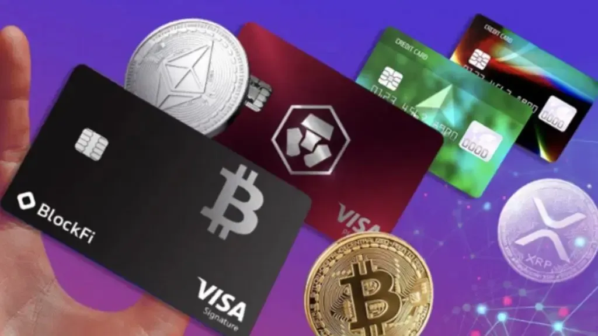

## Table of Contents

## What is a Bitcoin debit card and how does it work?

A Bitcoin debit card is a type of card that lets you spend your Bitcoin easily, just like you would use a regular debit card. You can use it to buy things online or in stores where regular debit cards are accepted. The card is linked to your Bitcoin wallet, so when you make a purchase, the amount in Bitcoin is taken from your wallet and converted to the local currency of the place where you're shopping.

When you use a Bitcoin debit card, the process is simple. First, you load Bitcoin into your card's linked wallet. When you want to buy something, you swipe or tap your card at the checkout. The card company then converts the amount you're spending from Bitcoin to the local currency, like dollars or euros, and the transaction goes through. It's a convenient way to use your Bitcoin without having to convert it to cash first.

## What are the key features to look for in a Bitcoin debit card?

When choosing a Bitcoin debit card, it's important to look at a few key features. First, consider the fees. Some cards charge you every time you use them, while others might have monthly fees or fees for converting Bitcoin to local currency. It's a good idea to pick a card with low fees so you keep more of your money. Another thing to check is where the card can be used. Some cards work at lots of places around the world, while others might only work in certain countries or stores.

Also, think about how easy it is to use the card. A good Bitcoin debit card should have a simple app or website where you can check your balance, load Bitcoin, and see your transaction history. Security is another big feature to look for. Make sure the card has strong security measures like two-[factor](/wiki/factor-investing) authentication to keep your Bitcoin safe. Finally, consider if the card offers any rewards or cashback. Some cards give you a little bit of money back when you spend, which can be a nice bonus.

## How can I get a Bitcoin debit card and what are the requirements?

To get a Bitcoin debit card, you need to find a company that offers them. You can search online for companies like BitPay, Wirex, or Crypto.com. Once you choose a company, you'll need to sign up on their website or app. You'll have to provide some personal information like your name, address, and sometimes a photo ID to meet the company's requirements. After you're approved, you can order the card, which might take a few days to arrive.

The requirements for getting a Bitcoin debit card are pretty simple. Most companies ask you to be at least 18 years old. You'll need to have a valid government-issued ID, like a driver's license or passport, to prove who you are. Some companies might also ask for proof of address, like a utility bill or bank statement. It's important to follow the company's rules and provide all the information they ask for, so you can get your card and start using it to spend your Bitcoin.

## Which Bitcoin debit cards are available in 2024?

In 2024, there are several Bitcoin debit cards available that you can use to spend your Bitcoin easily. Some popular options include BitPay, which lets you use your Bitcoin at millions of places around the world. Another good choice is the Wirex card, which not only works with Bitcoin but also with other cryptocurrencies. Crypto.com also offers a card that gives you rewards when you spend your Bitcoin, making it a nice option if you want to get something back for your purchases.

These cards all have different features, so it's important to pick the one that fits your needs. BitPay is known for its low fees and wide acceptance, making it a good choice if you want to use your card in many places without spending too much on fees. Wirex is great if you have different cryptocurrencies and want to use them all with one card. Crypto.com's card is popular because it offers cashback rewards, which can be a nice bonus if you spend a lot. No matter which card you choose, make sure to check the fees, where it can be used, and any rewards it offers before you decide.

## What are the fees associated with using Bitcoin debit cards?

When you use a Bitcoin debit card, you might have to pay different kinds of fees. One common fee is the transaction fee, which is charged every time you use the card to buy something. This fee can be a flat amount or a percentage of your purchase. Another fee you might see is the conversion fee, which is charged when your Bitcoin is changed into the local currency, like dollars or euros. Some cards also have monthly fees, which you have to pay just for having the card, even if you don't use it.

The fees can vary a lot depending on which Bitcoin debit card you choose. For example, BitPay charges a 1% fee for converting Bitcoin to local currency and a 3% fee for transactions made in a currency different from the one the card is set to. Wirex has a 1% fee for converting Bitcoin and no monthly fee, but it might charge you for ATM withdrawals. Crypto.com's fees depend on which tier of their card you have; the higher tiers have lower fees but might require you to hold more of their [cryptocurrency](/wiki/cryptocurrency). It's a good idea to check the fee structure of each card before you decide which one to get, so you know exactly what you'll be paying.

## How do Bitcoin debit cards compare to traditional debit cards?

Bitcoin debit cards and traditional debit cards both let you spend money easily, but they work a bit differently. With a traditional debit card, you spend money directly from your bank account. You can use it at stores, online, and at ATMs to get cash. The money comes out of your account in the local currency, like dollars or euros. Traditional debit cards are widely accepted, and you don't usually have to worry about conversion fees because you're spending the same currency that's in your account.

On the other hand, a Bitcoin debit card lets you spend Bitcoin, which is a type of cryptocurrency. When you use a Bitcoin debit card, the card company converts your Bitcoin into the local currency at the time of purchase. This can be handy if you have Bitcoin and want to use it to buy things without first changing it to cash. However, using a Bitcoin debit card might come with extra fees, like conversion fees and transaction fees, which can make it more expensive than using a traditional debit card. Also, Bitcoin debit cards might not be accepted everywhere traditional debit cards are, so it's good to check where you can use them before you get one.

## What are the security features of Bitcoin debit cards?

Bitcoin debit cards have several security features to keep your money safe. One important feature is two-factor authentication (2FA), which means you need to enter a code sent to your phone or email to log in or make a transaction. This makes it harder for someone else to use your card if they know your password. Another security measure is encryption, which protects your information when you use the card online. Many cards also use chip and PIN technology, which is more secure than the old magnetic stripe cards, making it harder for people to steal your card information.

In addition to these, Bitcoin debit card companies often monitor your account for any strange activity. If they see something unusual, like a big purchase you don't normally make, they might freeze your card and ask you to confirm the transaction. This helps stop fraud before it happens. Some cards also let you set spending limits or lock your card from the app if you lose it, giving you more control over your money and helping keep it safe.

## How do different Bitcoin debit cards handle transaction speeds and limits?

Different Bitcoin debit cards handle transaction speeds and limits in their own ways. For example, BitPay usually processes transactions quickly, often within seconds, which is great if you want to use your card for everyday purchases. They also let you spend up to $10,000 per day, which is a pretty high limit. On the other hand, Wirex might take a bit longer to process transactions, sometimes up to a few minutes, but they still offer a good experience. Wirex has a daily spending limit of around $5,000, which is lower than BitPay but still enough for most people's needs.

Crypto.com's transaction speeds can vary depending on which tier of their card you have. The higher tiers, which you get by holding more of their cryptocurrency, usually have faster transaction times. Their daily spending limits also change with the tier, ranging from $2,000 to $100,000. This means you can pick a card that fits how much you want to spend and how fast you need the transactions to go through. Each card has its own balance between speed and limits, so it's good to think about what's most important to you when choosing one.

## What are the global acceptance rates of various Bitcoin debit cards?

Bitcoin debit cards are becoming more popular, but they are not accepted everywhere like regular debit cards. BitPay is one of the most widely accepted Bitcoin debit cards. You can use it at millions of places around the world, including big stores and online shops. This makes BitPay a good choice if you want to use your Bitcoin in a lot of different places. Wirex is also pretty widely accepted, but it might not work at as many places as BitPay. You can still use it in many countries and at many stores, but it's a bit less common than BitPay.

Crypto.com's card acceptance can vary depending on which tier of their card you have. The higher tiers are usually accepted at more places, but even the basic tiers work at a lot of shops and online. However, Crypto.com's card might not be as widely accepted as BitPay or Wirex. Overall, while Bitcoin debit cards are getting more popular, they still might not work at every store or online shop where you can use a regular debit card. It's a good idea to check where each card is accepted before you decide which one to get.

## How do Bitcoin debit cards integrate with different cryptocurrency wallets?

Bitcoin debit cards usually work well with different cryptocurrency wallets. When you get a Bitcoin debit card, you link it to your Bitcoin wallet. This means you can move Bitcoin from your wallet to the card easily. Some cards work with lots of different wallets, so you can use the one you like best. For example, BitPay lets you link their card to many popular wallets like Coinbase, Blockchain.com, or your own private wallet. This makes it easy to spend your Bitcoin no matter where you keep it.

Different cards might have different ways to connect with wallets. Wirex, for instance, has its own app where you can keep your Bitcoin and other cryptocurrencies. You can move your Bitcoin into the Wirex wallet and then use the card to spend it. Crypto.com also has its own app and wallet, but you can also link their card to other wallets. No matter which card you choose, it's important to make sure it works well with your favorite wallet so you can spend your Bitcoin without any trouble.

## What advanced features do some Bitcoin debit cards offer for expert users?

Some Bitcoin debit cards offer advanced features that can be really helpful for expert users. For example, some cards let you use different cryptocurrencies, not just Bitcoin. This means you can spend Ethereum, Litecoin, or other digital currencies with the same card. Another cool feature is the ability to set up recurring payments. This can be useful if you want to automatically pay for things like subscriptions or bills using your Bitcoin. Some cards also offer the option to set custom spending limits, so you can control how much you spend in different ways.

In addition, some Bitcoin debit cards come with advanced security options. For instance, you might be able to set up multi-signature wallets, where more than one person needs to approve a transaction before it goes through. This can be great for businesses or people who want extra security. Some cards also offer detailed transaction history and analytics, so you can keep track of your spending and see where your money is going. These features make Bitcoin debit cards a powerful tool for expert users who want more control and flexibility with their cryptocurrency.

## How do regulatory environments affect the use of Bitcoin debit cards in different countries?

The rules about using Bitcoin debit cards can be different in every country. Some countries have strict rules that make it hard to use these cards. For example, they might need you to give a lot of personal information or they might not let you use Bitcoin at all. This can make it tough to get a Bitcoin debit card or use it in certain places. In other countries, the rules might be more relaxed, so it's easier to use these cards. But even in these places, the rules can change, so it's important to check what's allowed where you live.

Also, the way banks and stores accept Bitcoin debit cards can change because of these rules. In some countries, many shops and ATMs might take these cards, but in others, only a few places might accept them. This can affect how useful a Bitcoin debit card is for you. If you travel a lot, you need to know the rules in different countries to use your card without any problems. Always check the latest rules before you try to use your Bitcoin debit card anywhere.

## What role do Bitcoin Debit Cards play in bridging the gap between fiat and cryptocurrency?

Bitcoin debit cards are pivotal in integrating cryptocurrencies into everyday financial transactions, helping bridge the gap between digital and traditional currencies. These cards facilitate the conversion of Bitcoin and other cryptocurrencies into fiat money at the point of sale, which significantly enhances the practical usability of digital assets in everyday shopping experiences.

### Functionality of Bitcoin Debit Cards

Bitcoin debit cards operate similarly to traditional debit cards but tap into cryptocurrency wallets rather than standard bank accounts. When a user makes a transaction, the card automatically converts the specified amount of cryptocurrency into the equivalent fiat currency, like USD, EUR, or GBP, thus enabling purchases at any merchant accepting card payments. This process typically involves real-time conversion, ensuring the transaction aligns with the current cryptocurrency exchange rate.

A simple illustration of how this conversion works can be seen in the following equation:

$$
\text{Fiat Amount} = \text{Crypto Amount} \times \text{Exchange Rate}
$$

This straightforward conversion allows users to bypass the manual exchange process, thereby offering seamless transaction experiences.

### Leading Providers

Numerous financial service providers offer Bitcoin debit cards, each with distinctive features aimed at maximizing user benefits. Providers such as Crypto.com, Coinbase, BitPay, and Wirex are widely recognized in the market for their robust services. These companies offer cards with varying levels of rewards, transaction fees, and compatibility with different cryptocurrencies, catering to a diverse market of crypto users.

- **Crypto.com** offers a range of cards with different levels of benefits, including cash-back rewards.
- **Coinbase**, a reputable exchange, provides its cardholders with the convenience of using multiple cryptocurrencies.
- **BitPay** focuses on competitive fees and extensive merchant acceptance.
- **Wirex** supports multiple cryptocurrencies and emphasizes easy conversion and reward systems.

### Benefits

The main advantage of Bitcoin debit cards is convenience. They allow users to spend cryptocurrencies easily, without needing to conduct conversions manually. Furthermore, these cards generally come with additional features such as cash-back rewards, which provide an incentive for frequent use. The conversion process at the point of sale resolves any potential delays, enabling the use of digital currency even for small, everyday purchases.

### Limitations and Drawbacks

Despite these advantages, Bitcoin debit cards are not without drawbacks. Transaction fees can vary significantly between providers and may erode the value of small transactions. Security is another important consideration; while providers employ encryption and security protocols, users must be vigilant against potential hacks or unauthorized access to their funds. 

Moreover, transaction limits can restrict the amount users can spend or withdraw in a given period, potentially impacting their flexibility in using these cards for high-value purchases. Regulatory uncertainties around cryptocurrency transactions also present a challenge, with some jurisdictions imposing restrictions that can affect card usage.

### Conclusion

Bitcoin debit cards are a revolutionary tool that propels the integration of cryptocurrencies into everyday financial systems. By offering a straightforward and efficient way to use digital assets for common transactions, they not only enhance user experience but also broaden the accessibility of cryptocurrencies. Nevertheless, users must navigate the challenges of fees, security, and regulatory landscapes carefully to maximize the benefits these cards offer.

## References & Further Reading

[1]: Corbet, S., Lucey, B., Peat, M., & Vigne, S. (2018). ["Bitcoin Futures: What use are they?"](https://www.sciencedirect.com/science/article/pii/S016517651830291X) Economics Letters, 172, 23-27.

[2]: Narayanan, A., Bonneau, J., Felten, E., Miller, A., & Goldfeder, S. (2016). ["Bitcoin and Cryptocurrency Technologies: A Comprehensive Introduction"](https://press.princeton.edu/books/hardcover/9780691171692/bitcoin-and-cryptocurrency-technologies) Princeton University Press.

[3]: Antonopoulos, A. M. (2018). ["Mastering Bitcoin: Unlocking Digital Cryptocurrencies"](https://books.google.com/books/about/Mastering_Bitcoin.html?id=IXmrBQAAQBAJ) (2nd ed.). O'Reilly Media.

[4]: Tapscott, D., & Tapscott, A. (2016). ["Blockchain Revolution: How the Technology Behind Bitcoin and Other Cryptocurrencies Is Changing the World"](https://dl.acm.org/doi/10.5555/3051781) Portfolio.

[5]: Mougayar, W. (2016). ["The Business Blockchain: Promise, Practice, and Application of the Next Internet Technology"](https://books.google.com/books/about/The_Business_Blockchain.html?id=CEsPDAAAQBAJ) Wiley.

[6]: Nakamoto, S. (2008). ["Bitcoin: A Peer-to-Peer Electronic Cash System."](https://nakamotoinstitute.org/library/bitcoin/) Bitcoin.org.

[7]: Peters, G. W., & Panayi, E. (2016). ["Understanding Modern Banking Ledgers through Blockchain Technologies: Future of Transaction Processing and Smart Contracts on the Internet of Money"](https://link.springer.com/content/pdf/10.1007/978-3-319-42448-4_13.pdf) in Banking Beyond Banks and Money.

[8]: Chiu, J., & Koeppl, T. V. (2017). ["The Economics of Cryptocurrencies – Bitcoin and Beyond."](https://papers.ssrn.com/sol3/papers.cfm?abstract_id=3048124) Bank of Canada Staff Working Paper 2017-38.