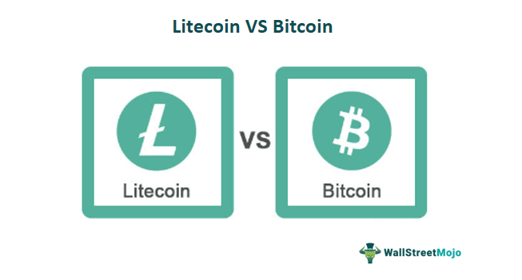

## Table of Contents

## What are Bitcoin and Litecoin?

Bitcoin is a type of digital money that you can use to buy things online. It was created in 2009 by someone using the name Satoshi Nakamoto. Unlike regular money, Bitcoin is not controlled by any government or bank. Instead, it uses a special technology called blockchain to keep track of all transactions. People store their Bitcoin in digital wallets and can send it to others over the internet. Bitcoin is popular because it lets people make payments without needing a bank, but it can also be risky because its value can go up and down a lot.

Litecoin is another type of digital money, similar to Bitcoin, but it was created to be faster and easier to use. It was started in 2011 by Charlie Lee. Like Bitcoin, Litecoin uses blockchain technology, but it processes transactions more quickly and with lower fees. This makes it a good choice for everyday purchases. Litecoin is often seen as a test ground for new technologies that might later be used by Bitcoin. While it's not as well-known as Bitcoin, Litecoin is still used by many people around the world for buying things and trading.

## Who created Bitcoin and Litecoin, and when were they launched?

Bitcoin was created by someone using the name Satoshi Nakamoto. No one knows for sure who this person or group of people really is. Bitcoin was launched in 2009. It was the first digital money that used blockchain technology to keep track of transactions without needing a bank or government.

Litecoin was created by Charlie Lee, who used to work at Google. He wanted to make a digital money that was faster and cheaper to use than Bitcoin. Litecoin was launched in 2011. It's similar to Bitcoin but works a bit differently, making it easier for everyday use.

## What are the main differences between Bitcoin and Litecoin?

Bitcoin and Litecoin are both digital currencies that use blockchain technology, but they have some important differences. One big difference is how fast they process transactions. Bitcoin can take about 10 minutes to confirm a transaction, while Litecoin is much quicker, usually taking around 2.5 minutes. This makes Litecoin better for everyday purchases because you don't have to wait as long for your payment to go through. Another difference is the total amount of each currency that will ever exist. Bitcoin has a limit of 21 million coins, while Litecoin has a limit of 84 million coins. This means there will be more Litecoins in the world than Bitcoins.

Another difference between Bitcoin and Litecoin is how they are mined. Mining is the process of adding new transactions to the blockchain and getting rewarded with new coins. Bitcoin uses a mining method called SHA-256, which is very hard and requires a lot of computer power. Litecoin uses a different method called Scrypt, which is easier and can be done with less powerful computers. This makes it easier for more people to mine Litecoin. Also, Litecoin often tries out new technology ideas before Bitcoin does, so it can be seen as a testing ground for new features that might later be added to Bitcoin.

## How does the total supply of Bitcoin compare to Litecoin?

Bitcoin and Litecoin have different total supplies. Bitcoin will only ever have 21 million coins. This limit was set by Bitcoin's creator, Satoshi Nakamoto, to make sure that Bitcoin stays valuable because there can't be too many of them. Once all 21 million Bitcoins are mined, no more will be made.

Litecoin, on the other hand, will have a total of 84 million coins. This is four times more than the total supply of Bitcoin. Charlie Lee, the creator of Litecoin, decided on this number to allow for more coins to be used for everyday transactions. So, while Bitcoin aims to be scarce and valuable, Litecoin focuses on being more plentiful and easier to use for regular buying and selling.

## What are the block generation times for Bitcoin and Litecoin?

Bitcoin takes about 10 minutes to generate a new block. A block is like a group of transactions that get added to the blockchain. This time is important because it helps keep the Bitcoin network secure and stable. If the blocks were made too fast, the network could get overwhelmed, and if they were too slow, it would take too long for transactions to be confirmed.

Litecoin is faster than Bitcoin when it comes to making new blocks. It only takes about 2.5 minutes to generate a new block. This shorter time makes Litecoin better for everyday purchases because you don't have to wait as long for your payment to go through. The faster block time is one of the main reasons why Litecoin is seen as more suitable for regular use than Bitcoin.

## How do the mining algorithms of Bitcoin and Litecoin differ?

Bitcoin uses a mining algorithm called SHA-256. This algorithm is very hard and needs a lot of computer power to solve the math problems that help add new transactions to the blockchain. Because it's so hard, people often use special machines called ASICs (Application-Specific Integrated Circuits) to mine Bitcoin. These machines are made just for mining and are very good at it, but they also use a lot of electricity. The difficulty of SHA-256 means that only people with these powerful machines can really mine Bitcoin effectively.

Litecoin uses a different mining algorithm called Scrypt. Scrypt was made to be easier on computers and to let more people mine without needing special machines. It uses more memory than SHA-256, which makes it harder for ASICs to be as effective. This means that regular computers can still mine Litecoin, although ASICs for Scrypt do exist. The idea behind Scrypt was to keep mining more open to everyone, not just those who can afford expensive equipment.

## What are the transaction speed and fees like for Bitcoin versus Litecoin?

Bitcoin transactions can take longer to process and often have higher fees than Litecoin. It usually takes about 10 minutes for a Bitcoin transaction to be confirmed, and during busy times, the fees can go up a lot. This is because many people want to use the Bitcoin network, and miners choose transactions with higher fees to process first. So, if you want your Bitcoin transaction to go through quickly, you might have to pay more.

Litecoin transactions are faster and usually cheaper. It takes about 2.5 minutes for a Litecoin transaction to be confirmed, which is much quicker than Bitcoin. The fees for Litecoin are also lower, making it a better choice for everyday purchases. Because Litecoin can handle transactions faster and at a lower cost, it's more popular for people who want to use digital money for regular buying and selling.

## How do Bitcoin and Litecoin handle scalability and network congestion?

Bitcoin and Litecoin both face challenges with scalability and network congestion, but they handle these issues differently. Bitcoin's network can get very busy, especially when a lot of people want to use it at the same time. This can lead to slow transaction times and high fees. To help with this, Bitcoin has tried solutions like the Lightning Network, which is a way to process transactions off the main blockchain. This can make things faster and cheaper, but it's still being worked on and not everyone uses it yet.

Litecoin, on the other hand, is designed to handle transactions more quickly and with lower fees than Bitcoin. Its faster block time of 2.5 minutes helps reduce congestion because transactions get confirmed faster. Litecoin also uses the same kind of solutions as Bitcoin, like the Lightning Network, but because it's less busy, these solutions work better for Litecoin. This makes Litecoin a good choice for people who want to use digital money without waiting a long time or paying high fees.

## What is the market cap and adoption rate of Bitcoin compared to Litecoin?

Bitcoin has a much bigger market cap than Litecoin. Market cap is the total value of all the coins that exist. Bitcoin's market cap is usually in the hundreds of billions of dollars, while Litecoin's is usually in the billions. This big difference shows that Bitcoin is seen as more valuable and is used more often. More people know about Bitcoin, and it's accepted by more businesses and used in more places around the world. This makes Bitcoin the leader in the world of digital money.

Litecoin's market cap is smaller, but it still has a good number of people using it. Litecoin is often used by people who want a digital money that's faster and cheaper than Bitcoin. It's not as well-known as Bitcoin, but it's still popular among people who know about digital money. Litecoin is accepted by some businesses and is used for everyday buying and selling, but not as much as Bitcoin. Even though it's smaller, Litecoin is important in the world of digital money because it helps test new ideas that might be used by Bitcoin later.

## How do Bitcoin and Litecoin differ in terms of privacy and security features?

Bitcoin and Litecoin both use blockchain technology, which is very secure because it keeps a record of every transaction that can't be changed. But Bitcoin has some extra tools for privacy and security. For example, Bitcoin has something called SegWit, which helps make transactions faster and cheaper, and also improves security. Bitcoin also has the Lightning Network, which lets people make private transactions off the main blockchain. This can make Bitcoin more private and secure, but it's still new and not everyone uses it yet.

Litecoin also uses blockchain and has many of the same security features as Bitcoin. It also uses SegWit and the Lightning Network, just like Bitcoin. But because Litecoin is less busy than Bitcoin, these tools work better and can make Litecoin faster and cheaper to use. Litecoin doesn't have as many extra privacy tools as Bitcoin, but it's still very secure. Both Bitcoin and Litecoin are good at keeping your money safe, but Bitcoin has a few more options for people who want extra privacy.

## What are the future development plans for Bitcoin and Litecoin?

Bitcoin's future development plans focus on making it easier and faster to use. One big plan is to keep working on the Lightning Network, which helps people make quick and cheap transactions off the main blockchain. This can make Bitcoin better for everyday buying and selling. Another plan is to improve something called the Taproot upgrade, which makes transactions more private and efficient. Bitcoin developers also want to make it easier for more people to use Bitcoin, like making it work better on phones and other devices. These changes can help Bitcoin grow and be used by more people around the world.

Litecoin's future plans are similar to Bitcoin's but with some differences. Litecoin wants to keep being a place where new ideas can be tested before they're used by Bitcoin. For example, Litecoin will keep working on the Lightning Network to make transactions even faster and cheaper. Litecoin also wants to add more ways to use it for everyday things, like paying for stuff online or in stores. Because Litecoin is less busy than Bitcoin, it can try out new ideas more easily. This can help Litecoin stay useful and popular, even if it's not as big as Bitcoin.

## How do expert opinions vary on the long-term potential of Bitcoin versus Litecoin?

Experts have different opinions about the long-term potential of Bitcoin and Litecoin. Many experts think Bitcoin has a bright future because it's the most well-known and widely used digital money. They believe Bitcoin could become a regular part of the world's money system, used by more people and businesses. Some even think it could be a good way to keep money safe from inflation, like a digital version of gold. But not everyone agrees. Some experts worry that Bitcoin's slow transaction times and high fees could stop it from being used for everyday buying and selling.

On the other hand, Litecoin is seen by some experts as a good choice for everyday use because it's faster and cheaper than Bitcoin. They think Litecoin could be used more for regular purchases, like buying things online or in stores. But because Litecoin is not as well-known or widely used as Bitcoin, some experts think it might not grow as big. They see Litecoin as more of a helper to Bitcoin, testing new ideas that could later be used by Bitcoin. Overall, while Bitcoin is seen as the leader with more potential for big growth, Litecoin is valued for its practical use in daily life.

## References & Further Reading

[1]: Bergstra, J., Bardenet, R., Bengio, Y., & Kégl, B. (2011). ["Algorithms for Hyper-Parameter Optimization."](https://papers.nips.cc/paper/4443-algorithms-for-hyper-parameter-optimization) Advances in Neural Information Processing Systems 24.

[2]: ["Advances in Financial Machine Learning"](https://www.amazon.com/Advances-Financial-Machine-Learning-Marcos/dp/1119482089) by Marcos Lopez de Prado

[3]: ["Evidence-Based Technical Analysis: Applying the Scientific Method and Statistical Inference to Trading Signals"](https://www.amazon.com/Evidence-Based-Technical-Analysis-Scientific-Statistical/dp/0470008741) by David Aronson

[4]: ["Machine Learning for Algorithmic Trading"](https://github.com/stefan-jansen/machine-learning-for-trading) by Stefan Jansen

[5]: ["Quantitative Trading: How to Build Your Own Algorithmic Trading Business"](https://www.amazon.com/Quantitative-Trading-Build-Algorithmic-Business/dp/1119800064) by Ernest P. Chan