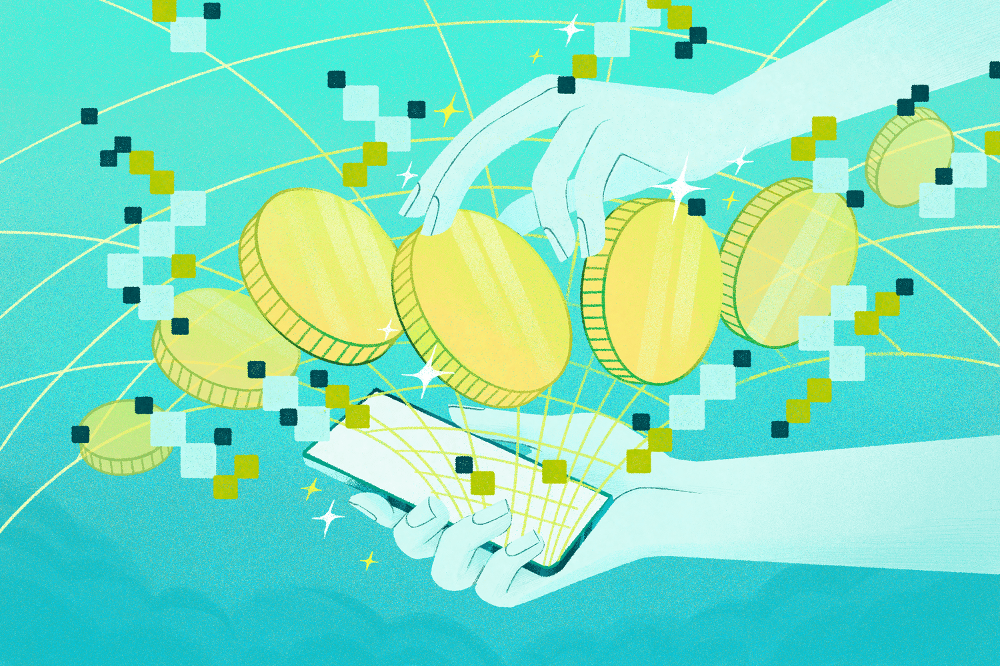

## Table of Contents

## What is a Bitcoin wallet and why is it necessary?

A Bitcoin wallet is like a digital bank account for your Bitcoin. It's a software program that helps you store, send, and receive Bitcoin. Just like you need a wallet to keep your cash safe, a Bitcoin wallet keeps your Bitcoin secure and helps you manage your transactions.

Having a Bitcoin wallet is necessary because it gives you control over your Bitcoin. Without a wallet, you wouldn't be able to use your Bitcoin to buy things or send it to other people. The wallet also keeps your Bitcoin safe with special codes called private keys, which only you should know. This way, no one else can use your Bitcoin without your permission.

## What are the different types of Bitcoin wallets available in October 2024?

In October 2024, there are several types of Bitcoin wallets to choose from, each designed for different needs and levels of security. The most common types are software wallets, hardware wallets, and paper wallets. Software wallets are apps or programs you can download on your computer or smartphone. They are easy to use and good for everyday transactions. Hardware wallets are small devices that store your Bitcoin offline, making them very secure. They are great if you want to keep your Bitcoin safe from hackers. Paper wallets are just pieces of paper with your Bitcoin information printed on them. They are simple but can be risky if not stored properly.

Another type of wallet is the online wallet, also known as a web wallet. These wallets are managed by a third party and can be accessed through a website. They are convenient because you can use them from any device with an internet connection, but they can be less secure because you have to trust the company managing the wallet. Lastly, there are multi-signature wallets, which require more than one private key to authorize a transaction. These are useful for businesses or groups where more than one person needs to approve spending. Each type of wallet has its own pros and cons, so choosing the right one depends on your needs for convenience, security, and control over your Bitcoin.

## How do hardware wallets compare to software wallets in terms of security and convenience?

Hardware wallets are very secure because they store your Bitcoin on a small device that doesn't connect to the internet. This means hackers can't get to your Bitcoin easily. You have to plug the device into your computer to use it, and it's like having a safe for your Bitcoin. But, hardware wallets can be less convenient because you need to [carry](/wiki/carry-trading) the device with you and plug it in every time you want to use your Bitcoin.

Software wallets are easier to use because they are apps on your phone or computer. You can quickly send and receive Bitcoin without needing any extra devices. They are great for everyday use because they are so convenient. However, software wallets are less secure because they are connected to the internet, which makes them more vulnerable to hackers. So, you have to be careful and use strong passwords and other security measures to keep your Bitcoin safe.

## What are the top 5 Bitcoin wallets recommended for beginners in October 2024?

In October 2024, the top 5 Bitcoin wallets recommended for beginners are the Ledger Nano S Plus, Trezor Model T, Coinbase Wallet, Exodus, and Electrum. The Ledger Nano S Plus and Trezor Model T are hardware wallets that are great for beginners because they are easy to set up and use. They keep your Bitcoin very safe because they are not connected to the internet. The Ledger Nano S Plus is known for its user-friendly interface, while the Trezor Model T has a touchscreen that makes it easy to navigate.

On the other hand, Coinbase Wallet, Exodus, and Electrum are software wallets that are also good for beginners. Coinbase Wallet is an app that you can download on your phone, and it's easy to use because it's made by Coinbase, a well-known company. Exodus is another user-friendly app that lets you manage not just Bitcoin but other cryptocurrencies too. Electrum is a bit more advanced but still good for beginners who want to learn more about Bitcoin. It's been around for a long time and is trusted by many people. Each of these wallets has its own features, but they all help beginners get started with Bitcoin easily and safely.

## How do the transaction fees vary among different Bitcoin wallets?

Transaction fees for Bitcoin can be different depending on which wallet you use. Some wallets let you choose how much you want to pay for a transaction. For example, with wallets like Electrum, you can set the fee yourself. If you pick a low fee, your transaction might take longer to go through, but it will cost less. If you pick a higher fee, your transaction will go through faster. Wallets like Coinbase Wallet and Exodus might set the fee for you, and it can change based on how busy the Bitcoin network is at that time.

Hardware wallets like Ledger Nano S Plus and Trezor Model T don't charge fees themselves, but they use software wallets to send Bitcoin, so the fees depend on the software you use with them. For example, if you use the Ledger Live app with your Ledger Nano S Plus, it will suggest a fee based on the network's current conditions. The same goes for Trezor Model T, where the fee is set by the software you use to manage your transactions. So, even though the hardware wallet itself doesn't charge a fee, the software you use with it will affect how much you pay.

## What are the key features to look for when choosing a Bitcoin wallet?

When choosing a Bitcoin wallet, it's important to think about how easy it is to use. A good wallet should have a simple interface that lets you send and receive Bitcoin without any trouble. It should also have clear instructions and good customer support to help you if you get stuck. Another thing to consider is whether the wallet works on the devices you use, like your phone or computer. Some wallets are apps you can download, while others are websites you can use from any device. Make sure the wallet you pick is easy for you to use every day.

Security is also really important when [picking](/wiki/asset-class-picking) a Bitcoin wallet. You want a wallet that keeps your Bitcoin safe from hackers. Hardware wallets are great for this because they store your Bitcoin offline, so it's harder for anyone to steal it. Software wallets are easier to use but can be riskier because they're connected to the internet. Look for wallets that use strong security features like two-[factor](/wiki/factor-investing) authentication and encryption to keep your Bitcoin safe. Also, consider if the wallet lets you back up your Bitcoin, so you don't lose it if something goes wrong. By thinking about ease of use and security, you can find a wallet that works well for you.

## How do mobile wallets compare to desktop wallets in terms of usability and security?

Mobile wallets are really easy to use because you can carry them in your pocket and use them wherever you go. They are like apps on your phone that let you send and receive Bitcoin quickly. You can use them to pay for things or check your Bitcoin balance anytime. But, because they are always connected to the internet, they can be a bit less safe than desktop wallets. You need to be careful and use strong passwords and other security features to keep your Bitcoin safe on your phone.

Desktop wallets are usually a bit harder to use than mobile wallets because you need to be at your computer to use them. They are programs you download on your computer, and they might take a bit more time to set up. But, desktop wallets can be more secure because they are not always connected to the internet. This makes it harder for hackers to get to your Bitcoin. Still, you need to keep your computer safe with good antivirus software and strong passwords to make sure your Bitcoin stays safe.

## What advanced security features are available in top Bitcoin wallets in October 2024?

In October 2024, top Bitcoin wallets come with many advanced security features to keep your Bitcoin safe. Hardware wallets like the Ledger Nano S Plus and Trezor Model T use something called a secure chip. This chip makes it really hard for hackers to get to your Bitcoin. They also have a feature called a PIN code, which you need to enter every time you want to use your wallet. This stops someone else from using your wallet if they find it. Another cool feature is the recovery phrase, which is a list of words that you can use to get your Bitcoin back if you lose your wallet.

Software wallets like Coinbase Wallet and Exodus also have strong security features. They use two-factor authentication, which means you need to enter a code from your phone every time you log in. This makes it much harder for someone else to get into your wallet. They also use encryption to keep your Bitcoin information safe. Some software wallets even let you set up something called multi-signature, where more than one person needs to agree before you can send Bitcoin. This is great for businesses or groups that want to make sure no one can spend the Bitcoin without permission.

## How do the backup and recovery options differ among leading Bitcoin wallets?

In October 2024, leading Bitcoin wallets have different ways to back up and recover your Bitcoin. Hardware wallets like the Ledger Nano S Plus and Trezor Model T use a recovery phrase, which is a list of words you write down when you set up your wallet. If you lose your wallet or it gets damaged, you can use this phrase to get your Bitcoin back on a new wallet. This is really important because if you lose your wallet and don't have the recovery phrase, you could lose your Bitcoin forever. Software wallets like Coinbase Wallet and Exodus also use recovery phrases, but they might give you other options too, like letting you save your wallet data to the cloud or on your computer. This can be easier, but you need to make sure the backup is safe because if someone else gets it, they could steal your Bitcoin.

Some software wallets, like Electrum, let you make multiple backups in different places, so if one backup gets lost or damaged, you still have others. This can be really helpful if you're worried about losing your Bitcoin. Also, some wallets, like Coinbase Wallet, have a feature where you can recover your wallet using your phone number or email, which can be easier than remembering a long recovery phrase. But, this means you have to trust the company with your information. Each wallet has its own way of helping you back up and recover your Bitcoin, so it's important to pick one that fits your needs and keeps your Bitcoin safe.

## What are the integration capabilities of Bitcoin wallets with other financial services?

Bitcoin wallets can connect with other financial services to make it easier to use your Bitcoin. For example, some wallets let you link your bank account or credit card so you can buy Bitcoin directly from the wallet. This is really helpful because you don't need to go to another website to buy Bitcoin. Some wallets also let you use your Bitcoin to pay for things at stores or online shops. They might work with payment services like PayPal or Square, so you can use your Bitcoin just like you use regular money.

Another way Bitcoin wallets can connect with other services is through trading platforms. Some wallets let you trade your Bitcoin for other cryptocurrencies or even for regular money. This can be done right from the wallet, so you don't need to move your Bitcoin to another place to trade it. Some wallets also work with financial apps that help you keep track of your money. These apps can show you how much Bitcoin you have along with your other money, so you can see your whole financial picture in one place. This makes it easier to manage your money and plan for the future.

## How do different Bitcoin wallets handle privacy and anonymity?

Different Bitcoin wallets handle privacy and anonymity in various ways. Some wallets, like hardware wallets such as the Ledger Nano S Plus and Trezor Model T, focus on keeping your Bitcoin safe but don't do much to hide who you are. They use private keys to keep your Bitcoin secure, but if you use them to send Bitcoin, anyone can see where the Bitcoin is going. Software wallets like Coinbase Wallet and Exodus might ask for your name and other personal information when you sign up. This means they know who you are, and they might share this information with others if they have to. But, they also have settings that let you control how much information you share when you send Bitcoin.

Other wallets, like Electrum, offer more privacy features. Electrum lets you use something called Tor, which hides your internet connection and makes it harder for people to see what you're doing. It also lets you use different addresses for each transaction, so it's harder for others to track where your Bitcoin is going. Some wallets even let you mix your Bitcoin with other people's Bitcoin, so it's harder to tell which Bitcoin is yours. This is called a mixing service, and it can help keep your transactions private. But, using these privacy features can sometimes make your transactions take longer or cost more in fees.

## What are the latest trends and future developments expected in Bitcoin wallet technology by the end of 2024?

By the end of 2024, Bitcoin wallet technology is expected to focus a lot on making wallets easier to use and more secure. Many new wallets will have better user interfaces that make it simple for anyone to send and receive Bitcoin. They will also have more ways to keep your Bitcoin safe, like using biometric security, where you can use your fingerprint or face to unlock your wallet. Another big trend is the use of multi-signature wallets, which need more than one person to agree before sending Bitcoin. This can be really helpful for businesses or families who want to make sure no one can spend the Bitcoin without permission.

Another important development will be better integration with other financial services. More wallets will let you buy Bitcoin directly from your bank account or credit card, making it easier to get started with Bitcoin. They will also work better with payment services, so you can use your Bitcoin to pay for things just like you use regular money. Some wallets will even connect with trading platforms, so you can trade your Bitcoin for other cryptocurrencies or regular money right from your wallet. This will make managing your Bitcoin a lot more convenient and help more people use it every day.

## References & Further Reading

[1]: Antonopoulos, A. M. (2017). ["Mastering Bitcoin: Unlocking Digital Cryptocurrencies."](https://books.google.com/books/about/Mastering_Bitcoin.html?id=IXmrBQAAQBAJ) O'Reilly Media.

[2]: Narayanan, A., Bonneau, J., Felten, E., Miller, A., & Goldfeder, S. (2016). ["Bitcoin and Cryptocurrency Technologies."](https://press.princeton.edu/books/hardcover/9780691171692/bitcoin-and-cryptocurrency-technologies) Princeton University Press.

[3]: Bonneau, J., Miller, A., Clark, J., Narayanan, A., Kroll, J. A., & Felten, E. W. (2015). ["SoK: Research Perspectives and Challenges for Bitcoin and Cryptocurrencies."](https://ieeexplore.ieee.org/document/7163021) 2015 IEEE Symposium on Security and Privacy.

[4]: Lopez de Prado, M. (2018). ["Advances in Financial Machine Learning."](https://www.amazon.com/Advances-Financial-Machine-Learning-Marcos/dp/1119482089) Wiley.

[5]: Jansen, S. (2020). ["Machine Learning for Algorithmic Trading: Predictive Models to Extract Signals from Market and Alternative Data for Systematic Trading Strategies with Python."](https://www.amazon.com/Machine-Learning-Algorithmic-Trading-alternative/dp/1839217715) Packt Publishing.

[6]: Kharif, O. (2019). ["The Evolution of Cryptocurrency Trading."](https://papers.ssrn.com/sol3/papers.cfm?abstract_id=3477513) Bloomberg.

[7]: Vigna, P., & Casey, M. J. (2016). ["The Age of Cryptocurrency: How Bitcoin and Digital Money Are Challenging the Global Economic Order."](https://dl.acm.org/doi/10.5555/2717097) St. Martin’s Griffin.