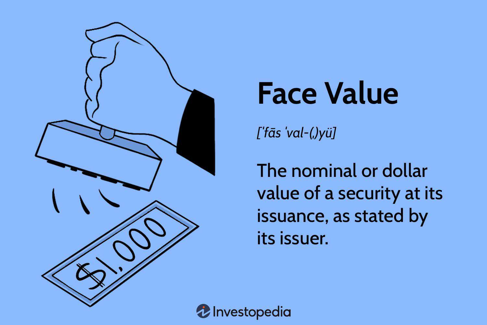

Bonds are a fundamental component of investment portfolios, serving as essential tools for both individual and institutional investors. They provide a means for governments and corporations to raise capital while offering investors a reliable income stream through interest payments. The effectiveness of bond investment strategies relies heavily on a comprehensive understanding of the face value, market price, and various pricing mechanisms associated with bonds.

The face value, also referred to as the par value of a bond, represents the amount the issuer commits to repay upon maturity. It forms the basis for calculating the bond's periodic interest payments, which are often fixed and steady throughout the bond's tenure. In contrast, the market price of a bond is far less predictable and can exhibit considerable volatility. It is influenced by an array of factors including current interest rates, prevailing economic conditions, the issuer's creditworthiness, and the time remaining until maturity.



Successfully navigating the bond market requires keen insight into these elements, as they collectively influence the dynamics of pricing and valuation. Additionally, the growing role of algorithmic trading in bond markets brings another layer of complexity. Modern trading algorithms utilize sophisticated mathematical models to optimize trading decisions rapidly, exploiting even minor short-term inefficiencies in bond pricing.

Investors who grasp the interplay of these various components are better equipped to make informed decisions. By understanding both static and dynamic aspects of bonds, along with the transformative impact of technology in trading, market participants can optimize their strategies and adapt to shifting economic landscapes.

## Table of Contents

## Understanding Bond Face Value

Bond face value, also known as par value, is the nominal sum that the bond issuer commits to repay to the bondholder upon the bond's maturity date. Generally expressed in monetary terms, this fixed amount is prominently stated on the bond certificate when the bond is issued. The face value serves as a crucial reference point for the calculation of interest payments, commonly known as coupon payments, provided to the bondholder throughout the life of the bond.

The calculation of interest payments relies directly on the bond's face value. Typically, bond issuers set a coupon rate, representing a percentage of the face value, which defines the annual interest payments to the bondholder. For example, if a bond with a face value of $1,000 has a coupon rate of 5%, the bondholder can expect to receive $50 in interest payments annually.

Unlike the market price, the face value of a bond remains static over the bond's lifespan. The face value does not fluctuate in response to changing economic conditions, interest rates, or the creditworthiness of the issuer, providing stability and predictability for the bondholder regarding the principal repayment at maturity. This static nature distinguishes face value from market price—a variable figure subject to various influential factors within financial markets.

Understanding bond face value is essential for investors, as it lays the groundwork for assessing the bond's yield, evaluating interest income, and comparing different bonds within an investment portfolio. By focusing on the face value, investors can make informed decisions when purchasing bonds and planning for future financial returns.

## Exploring Market Price of Bonds

The market price of a bond is a dynamic figure influenced by multiple factors, which can cause significant fluctuations over time. Unlike the fixed face value, the market price reflects current economic conditions and market perceptions. One primary [factor](/wiki/factor-investing) affecting the market price of a bond is current interest rates. When interest rates rise, the present value of a bond's future cash flows decreases, leading to a decline in its market price. Conversely, when interest rates fall, the market price of a bond tends to increase. This inverse relationship can be mathematically represented using the bond pricing formula:

$$
P = \frac{C}{(1 + r)^1} + \frac{C}{(1 + r)^2} + \cdots + \frac{C + F}{(1 + r)^n}
$$

where $P$ is the bond price, $C$ is the annual coupon payment, $r$ is the discount rate (reflecting current interest rates), $F$ is the face value, and $n$ is the number of years to maturity.

The credit rating of the bond issuer also plays a crucial role in determining the market price. Bonds issued by entities with high credit ratings are perceived as lower risk, leading investors to accept lower yields and driving up the market price. Alternatively, a downgrade in credit rating might increase perceived risk, consequently lowering the bond's market price.

Time to maturity is another significant factor influencing bond pricing. Bonds with longer maturities are generally more sensitive to [interest rate](/wiki/interest-rate-trading-strategies) changes, which can result in greater market price [volatility](/wiki/volatility-trading-strategies) compared to bonds nearing their maturity date.

Investors closely monitor the market price of bonds as it serves as an indicator of potential returns and inherent risks. A bond trading at a price below its face value (discount) may offer higher yield opportunities, whereas one trading at a premium might indicate lower future returns. Investors use metrics like yield to maturity (YTM) to assess these potential returns, ensuring they make informed investment decisions based on the fluctuating market price.

## Factors Influencing Bond Prices

Interest rates play a critical role in determining bond prices, demonstrating an inverse relationship. When interest rates rise, new bonds are issued with higher yields, making existing bonds with lower yields less attractive. Consequently, the market price of existing bonds falls to align their yields with new issues. Conversely, if interest rates decrease, existing bonds with higher yields become more attractive, leading to an increase in their market prices.

Credit ratings significantly influence bond prices by affecting investors’ perception of risk. Bonds issued by entities with higher credit ratings are considered more secure, thus warranting higher prices due to lower perceived default risk. In contrast, bonds with lower credit ratings are riskier, prompting investors to demand higher yields, which decreases their market price.

Market conditions and [liquidity](/wiki/liquidity-risk-premium) are also central to bond pricing dynamics. In efficient markets, bonds are more easily traded, reflecting their true market value promptly. High liquidity allows for quick buying and selling, which stabilizes prices. However, in illiquid markets, bond prices may be more volatile, and their market value may deviate from their intrinsic value due to the higher transaction costs and the difficulty in finding buyers or sellers. Consequently, during periods of financial stress, liquidity constraints can lead to significant price fluctuations and act as a risk amplifier. 

Overall, understanding these factors is essential for making informed investment decisions in bond markets.

## Comparing Face Value and Market Price

The face value of a bond, also known as its par value, is the fixed amount that the bond issuer promises to pay the bondholder upon maturity. This figure remains constant throughout the life of the bond, serving as the basis for calculating periodic interest payments, also known as coupon payments. These payments are typically a percentage of the face value, which stays unchanged regardless of market conditions.

In contrast, the market price of a bond reflects its current value as determined by trading activity in financial markets. Unlike face value, the market price is highly dynamic, influenced by a variety of factors, including prevailing interest rates, the creditworthiness of the issuer, and overall market conditions.

The divergence between face value and market price occurs because bonds are traded in secondary markets where demand and supply dynamics come into play. When interest rates rise, newer bonds enter the market offering higher yields, making existing bonds with lower yields less attractive. Consequently, the market price of these older bonds tends to decrease, often trading below face value, a situation termed as trading at a discount. Conversely, when interest rates fall, existing bonds with higher yields become more desirable, driving their market prices above the face value, referred to as trading at a premium.

Understanding the interplay between face value and market price is crucial for investors as it helps manage risks and anticipate potential returns. For instance, purchasing a bond when its market price is below face value can offer higher yield opportunities, as long as the issuer's credit risk remains acceptable. Conversely, buying a bond at a premium might be worth considering if interest rates are expected to keep falling, increasing the bond's attractiveness.

Investors often leverage the yield to maturity (YTM) to compare the attractiveness of bonds with differing market prices. The YTM represents the internal rate of return on a bond, assuming it is held until maturity and that all coupon and principal payments are made as scheduled. Mathematically, YTM can be expressed by solving the following equation for $r$:

$$
P = \sum_{t=1}^{n} \frac{C}{(1+r)^t} + \frac{F}{(1+r)^n}
$$

where $P$ is the current market price, $C$ is the coupon payment, $F$ is the face value, and $n$ is the number of periods until maturity.

Comparison between face value and market price aids in the assessment of risk-return trade-offs, enabling informed bond trading decisions. This knowledge allows investors to optimize their bond portfolios by balancing risk exposure while seizing potential opportunities influenced by interest rate fluctuations and market sentiment.

## Impact of Interest Rates on Bond Prices

Interest rates significantly influence bond prices and yield, impacting both market valuation and investors' strategies. When interest rates rise, existing bonds with lower interest payments become less attractive compared to new issues offering higher rates. Consequently, the market price of these older bonds tends to decrease. Conversely, when interest rates fall, existing bonds with higher fixed rates become more valuable, driving their market prices up.

This relationship can be understood better through the concept of bond yield, particularly yield to maturity (YTM). Calculating YTM provides insight into the return an investor can expect if a bond is held until it matures, factoring in the current market price, the face value, interest payments, and time to maturity. The YTM equation is:

$$

\text{YTM} = \frac{C + \frac{F - P}{n}}{\frac{F + P}{2}} 
$$

where:
- $C$ is the annual coupon payment
- $F$ is the face value
- $P$ is the current market price
- $n$ is the number of years to maturity

This formula shows the inverse relationship between bond prices and yield. As market interest rates increase, bonds need to offer higher yields to be competitive, leading to a decrease in their market price. Conversely, if rates decrease, yields fall, and prices rise.

Investors can use this understanding of interest rate effects to forecast potential volatility in bond pricing. For instance, in a rising interest rate environment, they might look to invest in shorter-duration bonds to minimize price volatility. Conversely, during periods of falling rates, longer-duration bonds may provide better returns.

The impact of interest rates on bonds demonstrates the need for investors to remain agile. Understanding these dynamics is essential to optimize portfolios and align them with economic trends, ensuring both risk management and return optimization in a fluctuating interest rate landscape.

## The Role of Algorithmic Trading in Bond Markets

Algorithmic trading has become a key component of modern bond markets, employing mathematical models and computer algorithms to execute trades at speeds and efficiencies unattainable by traditional methods. The primary advantage of [algorithmic trading](/wiki/algorithmic-trading) is its ability to exploit inefficiencies in bond pricing, resulting in optimized trade execution and cost reduction. 

These automated systems are designed to analyze various market conditions, identify trading opportunities, and execute buy or sell orders rapidly. By processing vast amounts of data in real time, algorithmic trading can identify patterns and trends that may not be immediately apparent to human traders. This rapid decision-making ability allows for more precise and timely actions, which are critical in the fast-paced financial markets where timing can significantly impact profit margins.

Algorithmic trading plays a crucial role in risk management by using sophisticated models to predict potential market movements and adjust trading strategies accordingly. This capability allows traders to manage exposure to adverse price fluctuations more effectively, ensuring that the portfolio remains aligned with the investor’s risk preferences. For example, an algorithm might be programmed to automatically [exit](/wiki/exit-strategy) a position if the market conditions begin to suggest an upward trend in interest rates, which could negatively affect bond prices.

Moreover, algorithmic trading increases market liquidity by facilitating a higher [volume](/wiki/volume-trading-strategy) of transactions with greater speed and efficiency. The presence of algorithms in the market means there is a continuous flow of buy and sell orders, which helps narrow the bid-ask spreads and reduces the cost of trading for all market participants. Enhanced liquidity benefits the entire market by making it easier for participants to enter and exit positions without causing significant price shifts.

The growing popularity of algorithmic trading in bond markets is largely driven by advancements in technology. The evolution of computing power and data analytics enables more sophisticated algorithmic strategies to be deployed. For instance, [machine learning](/wiki/machine-learning) techniques can be incorporated into algorithms to improve their decision-making capabilities over time based on historical trade data. This capability transforms trading strategies to be more adaptive and resilient to changing market conditions.

One example of a simple algorithmic trading strategy can be highlighted using a basic moving average crossover strategy implemented in Python:

```python
# Import necessary libraries
import pandas as pd
import numpy as np

# Load bond price data into a DataFrame
data = pd.read_csv('bond_prices.csv')

# Calculate moving averages
data['MA50'] = data['Close'].rolling(window=50).mean()
data['MA200'] = data['Close'].rolling(window=200).mean()

# Generate buy/sell signals
data['Signal'] = np.where(data['MA50'] > data['MA200'], 1, 0)
data['Position'] = data['Signal'].diff()

# Print buy/sell signals
print(data[['Close', 'MA50', 'MA200', 'Signal', 'Position']].dropna())
```

In this example, the algorithm generates buy signals when the 50-day moving average crosses above the 200-day moving average, indicating a potential upward trend, and sell signals when it crosses below. Although simplistic, this illustrates how algorithms can utilize quantitative methods to make data-driven trading decisions.

As technology continues to advance, the role of algorithmic trading in bond markets is expected to grow further, providing enhanced tools for traders to navigate complex market environments and improve overall trade performance.

## Conclusion

Understanding the intricate dynamics between bond face value, market price, and the various influencing factors is essential for investors aiming to succeed in bond markets. The face value represents the nominal amount to be repaid upon maturity, providing a benchmark for calculating interest payments. Meanwhile, the market price reflects the bond’s current value influenced by external conditions such as interest rates, credit ratings, and market liquidity.

Adaptability to evolving economic landscapes is crucial for market participants. Interest rates, for instance, exhibit an inverse relationship with bond prices; as rates increase, bond prices typically decline, affecting yield and overall market valuation. Investors must remain vigilant to these shifts to navigate potential volatility successfully.

Furthermore, as technology continues to transform financial markets, incorporating algorithmic trading strategies becomes increasingly pivotal. Algorithmic trading uses sophisticated mathematical models to execute rapid trading decisions, allowing investors to capitalize on pricing inefficiencies, manage risk effectively, and enhance market liquidity. By embracing these technological advancements, investors can maintain a competitive edge in the ever-evolving bond markets.

By staying informed about these dynamics, investors can better anticipate market movements, manage risk, and enhance their portfolios' performance. Strategic utilization of available information and technologies equips investors with the necessary tools to make informed decisions, ultimately optimizing their portfolios and thriving in complex bond markets.

## References & Further Reading

[1]: Fabozzi, F. J. (2007). ["Fixed Income Analysis."](https://books.google.com/books/about/Fixed_Income_Analysis.html?id=lujLawVLS3YC) John Wiley & Sons.

[2]: Mishkin, F. S. (2018). ["The Economics of Money, Banking, and Financial Markets."](https://www.pearsonhighered.com/assets/preface/0/1/3/4/0134855388.pdf) Pearson.

[3]: ["Interest Rate Markets: A Practical Approach to Fixed Income."](https://onlinelibrary.wiley.com/doi/book/10.1002/9781119200949) by Siddhartha Jha.

[4]: ["Bond Markets, Analysis, and Strategies."](https://books.google.com/books/about/Bond_Markets_Analysis_and_Strategies_ten.html?id=bQpNEAAAQBAJ) by Frank J. Fabozzi.

[5]: ["Algorithmic Trading: Winning Strategies and Their Rationale."](https://www.amazon.com/Algorithmic-Trading-Winning-Strategies-Rationale-ebook/dp/B00CY5HC0U) by Ernie Chan.