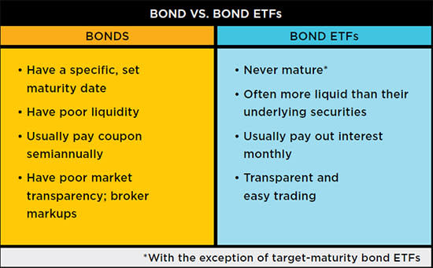

## Table of Contents

## What are bond funds and how do they work?

Bond funds are a type of investment where many people pool their money together to buy a collection of bonds. Bonds are like loans that you give to a government or a company, and in return, they pay you back with interest over time. When you invest in a bond fund, you're not buying a single bond, but a share in a fund that owns many different bonds. This helps spread out the risk because if one bond doesn't do well, the others might still perform okay.

Bond funds work by collecting money from investors and using it to buy a variety of bonds. The fund is managed by professionals who decide which bonds to buy and sell. The interest payments from these bonds are then shared among the investors in the fund, usually paid out as dividends. The value of the bond fund can go up or down based on how the bonds in the fund are doing, but generally, bond funds are seen as less risky than stocks because they tend to be more stable.

## What are bond ETFs and how do they work?

Bond ETFs, or Exchange Traded Funds, are a type of investment that lets you buy a bunch of bonds all at once. They work a lot like bond funds, but you can buy and sell them on a stock exchange, just like you would with a stock. This means you can trade them throughout the day at the current market price, which can be more convenient than traditional bond funds.

When you invest in a bond [ETF](/wiki/etf-trading-strategies), your money goes into a big pool that's used to buy a variety of bonds. The ETF is managed by professionals who choose which bonds to include. The interest these bonds earn gets shared with everyone who owns a piece of the ETF, usually paid out as dividends. Bond ETFs can be a good way to spread out risk because they hold many different bonds, and they can be easier to buy and sell than individual bonds.

## What are the main differences between bond funds and bond ETFs?

Bond funds and bond ETFs both let you invest in a bunch of bonds at once, but they work a bit differently. Bond funds are like a big pot of money from many investors that's used to buy bonds. You can only buy or sell shares of the fund at the end of the day, based on the fund's value at that time. Bond ETFs, on the other hand, are traded on a stock exchange, so you can buy or sell them anytime during the day, just like you would with a stock.

Another difference is how they handle prices. The price of a bond fund is set at the end of the day and is based on the total value of all the bonds in the fund. Bond ETFs, however, have prices that can change throughout the day, based on what people are willing to pay for them on the stock exchange. This can make bond ETFs a bit more flexible if you want to trade quickly.

Both bond funds and bond ETFs have professional managers who pick the bonds to buy, and both pay out the interest they earn to investors. But if you like being able to trade during the day and see price changes in real-time, bond ETFs might be better for you. If you're okay with waiting until the end of the day to buy or sell, and you want a more stable price, bond funds could be the way to go.

## How do the costs and fees compare between bond funds and bond ETFs?

Bond funds and bond ETFs both have costs and fees, but they can be different. Bond funds often have what's called an expense ratio, which is a yearly fee based on a percentage of the money you have in the fund. This fee pays for the fund's management and other costs. Some bond funds might also have sales charges, known as loads, which you pay when you buy or sell the fund. These fees can add up and affect how much money you make from your investment.

Bond ETFs usually have an expense ratio too, but it's often lower than what you find with bond funds. This is because ETFs are usually set up to track an index, which can be less expensive to manage. Instead of loads, bond ETFs might have trading fees, which are costs you pay every time you buy or sell the ETF on the stock exchange. These fees can be small, but if you trade a lot, they can add up. So, while bond ETFs might save you money on yearly fees, you need to watch out for trading costs.

In the end, the costs and fees for bond funds and bond ETFs can make a big difference in what you earn. Bond funds might be cheaper if you plan to hold onto them for a long time and don't mind the higher yearly fees. But if you like to trade often and want to keep your yearly costs down, bond ETFs could be a better choice. It's always a good idea to look at the specific fees for any fund or ETF you're thinking about to see which one fits your needs and budget best.

## What are the liquidity differences between bond funds and bond ETFs?

Bond funds and bond ETFs have different levels of [liquidity](/wiki/liquidity-risk-premium). Liquidity means how easy it is to buy or sell something without affecting its price. Bond funds are less liquid because you can only buy or sell them at the end of the day. This means if you want to get your money out of a bond fund, you have to wait until the market closes, and you'll get the price that's set at that time.

Bond ETFs, on the other hand, are more liquid. You can buy or sell them anytime during the trading day on a stock exchange, just like stocks. This means if you need your money quickly, you can sell your bond ETF shares right away at the current market price. This flexibility can be really helpful if you need to make quick changes to your investments.

So, if you like being able to get your money out fast and trade during the day, bond ETFs might be better for you. But if you're okay with waiting until the end of the day and want a more stable price, bond funds could be the way to go.

## How do bond funds and bond ETFs handle reinvestment of dividends?

Both bond funds and bond ETFs pay out dividends from the interest they earn on the bonds they hold. When you get these dividends, you have a choice. You can take the money and use it however you want, or you can choose to reinvest it. Reinvesting means you use the dividend money to buy more shares of the fund or ETF. This can help your investment grow over time because you're adding more shares without spending extra money.

The way you reinvest dividends can be a bit different between bond funds and bond ETFs. With bond funds, many of them have an automatic dividend reinvestment plan. This means if you choose to reinvest, the fund will automatically use your dividends to buy more shares of the fund at the end of the day. Bond ETFs usually don't have this automatic plan. If you want to reinvest your dividends from a bond ETF, you'll need to do it yourself. You can use the dividend money to buy more ETF shares during the trading day, but you have to make the trade yourself.

## What are the tax implications of investing in bond funds versus bond ETFs?

When you invest in bond funds or bond ETFs, you need to think about taxes. Both types of investments can give you dividends, which are payments from the interest the bonds earn. These dividends are usually taxed as regular income, just like money you earn from a job. But the tax rate can be different depending on where you live and how much money you make. Also, if you sell your shares in a bond fund or ETF and make a profit, that's called a capital gain. Capital gains can be taxed too, but the rate might be lower than the rate for regular income.

There's a small difference in how bond funds and bond ETFs handle taxes. Bond funds might give you more taxable events because they often buy and sell bonds more often than ETFs. This can lead to more capital gains distributions, which you have to pay taxes on. Bond ETFs, on the other hand, usually track an index and don't trade as much, so they might have fewer taxable events. But remember, if you sell your bond ETF shares and make a profit, you'll still have to pay capital gains tax on that profit. So, while bond ETFs might be a bit more tax-efficient, both types of investments will have tax implications you need to think about.

## How does the transparency of holdings compare between bond funds and bond ETFs?

Bond ETFs are usually more transparent than bond funds. This means it's easier to see what bonds are in an ETF. Most bond ETFs have to tell you exactly what they own every day. This can help you know exactly what you're investing in and make better choices.

Bond funds, on the other hand, don't have to be as open about what they own. They usually only tell you what they hold a few times a year. This can make it harder to know exactly what's in your investment. If you like to know exactly what you're investing in, bond ETFs might be a better choice for you.

## What are the minimum investment requirements for bond funds and bond ETFs?

Bond funds often have a minimum investment amount that you need to start with. This can be different for each fund, but it's usually between $1,000 and $3,000. Some funds might let you start with less if you agree to put in more money over time. If you want to invest in bond funds, you need to check the minimum amount for the specific fund you're interested in.

Bond ETFs don't have a minimum investment amount in the same way. Since they trade on stock exchanges like stocks, you can buy as many or as few shares as you want, as long as you can afford the price of one share. This can make bond ETFs easier to start investing in, especially if you don't have a lot of money to begin with. Just remember, you might need to pay a small fee each time you buy or sell ETF shares.

## How do bond funds and bond ETFs perform in different market conditions?

Bond funds and bond ETFs can behave differently depending on what's happening in the market. When interest rates go up, the value of the bonds in both funds and ETFs usually goes down. This is because new bonds being issued will have higher interest rates, making older bonds with lower rates less attractive. But bond funds might feel this change more because they often buy and sell bonds more often. This can lead to more ups and downs in their value. Bond ETFs, which usually track an index, might be a bit more stable because they don't trade as much.

In times when the market is shaky or there's a lot of uncertainty, both bond funds and bond ETFs can be a safe place to put your money. They're generally seen as less risky than stocks because they give you regular interest payments. But bond ETFs might be easier to sell quickly if you need your money, because you can trade them during the day. Bond funds, on the other hand, might take longer to sell because you can only trade them at the end of the day. So, depending on what's happening in the market, both can be good choices, but they might react a bit differently.

## What are the strategies for managing a portfolio of bond funds versus bond ETFs?

When managing a portfolio of bond funds, it's important to think about your long-term goals and how much risk you're okay with. Bond funds can be good if you want to hold onto your investments for a while because they often have a set price at the end of the day. You can choose different types of bond funds, like those that focus on government bonds or corporate bonds, to spread out your risk. Keep an eye on the fees too, because they can eat into your returns over time. Also, since bond funds give you dividends, you might want to set up automatic reinvestment to grow your investment without adding more money.

With bond ETFs, you have more flexibility because you can buy and sell them anytime during the day. This can be helpful if you need to make quick changes to your portfolio or if you want to take advantage of short-term market movements. Like with bond funds, you can pick different kinds of bond ETFs to spread out your risk. But remember, trading bond ETFs often can lead to higher costs from trading fees. So, if you're planning to hold them for a long time, try to keep trading to a minimum. Also, since bond ETFs might have fewer taxable events, they can be a bit more tax-efficient, which can be good for managing your overall tax situation.

## How can advanced investors use bond funds and bond ETFs for tactical asset allocation?

Advanced investors can use bond funds and bond ETFs to make quick changes to their portfolios based on what's happening in the market. This is called tactical asset allocation. For example, if they think interest rates are going to go up, they might sell some of their bond funds or ETFs that have bonds with longer times until they pay back, because those bonds will lose value faster when rates rise. Or, if they think the economy is going to get shaky, they might buy more bond funds or ETFs to have a safer place for their money. Bond ETFs are especially good for this because you can trade them during the day, which lets you react quickly to news or changes in the market.

Another way advanced investors can use bond funds and ETFs for tactical asset allocation is by adjusting how much risk they're taking. They might move money between different types of bond funds or ETFs, like switching from high-risk, high-reward corporate bonds to safer government bonds. This can help them balance their portfolio's risk and reward. Since bond ETFs are often more tax-efficient and have lower fees, they might choose ETFs over funds if they're making a lot of changes to their portfolio. By using these strategies, advanced investors can try to get better returns and manage their risk better in different market conditions.

## References & Further Reading

[1]: Ben-David, I., Franzoni, F. A., & Moussawi, R. (2014). ["Do ETFs Increase Volatility?"](https://www.jstor.org/stable/26656025) The Journal of Finance, 69(6), 2489-2530.

[2]: Madhavan, A. N. (2016). ["Exchange-traded funds, market structure and the flash crash."](https://www.tandfonline.com/doi/abs/10.2469/faj.v68.n4.6) Financial Analysts Journal, 66(6), 20-35.

[3]: Hasbrouck, J. (2003). ["Intraday Price Formation in U.S. Equity Index Markets."](https://onlinelibrary.wiley.com/doi/10.1046/j.1540-6261.2003.00609.x) The Review of Financial Studies, 16(1), 329-373.

[4]: BlackRock. (2020). ["The role of bond ETFs in fixed income portfolios."](https://www.blackrock.com/us/financial-professionals/investments/products/bond-etfs)

[5]: Bouchey, P., & Pojarliev, M. (2018). ["How to Incorporate Active Management into Your Portfolio."](https://news.harvard.edu/gazette/story/2019/09/study-shows-that-students-learn-more-when-taking-part-in-classrooms-that-employ-active-learning-strategies/) Financial Analysts Journal, 74(3), 4-11.

[6]: Lopez de Prado, M. (2018). ["Advances in Financial Machine Learning"](https://www.amazon.com/Advances-Financial-Machine-Learning-Marcos/dp/1119482089) Wiley Finance.