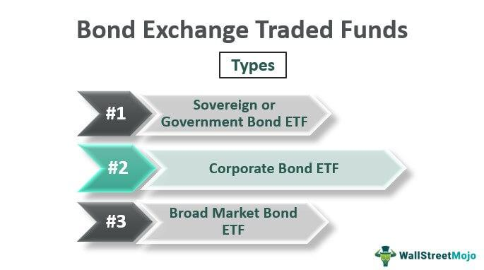

Understanding investment choices in today's financial landscape poses a challenge, especially given the sheer variety of options available to investors. This complexity is particularly evident in the realm of fixed-income investments, where two popular investment vehicles are bond exchange-traded funds (ETFs) and bond funds. Both options offer distinct features and benefits, making it essential for investors to understand their differences and similarities. Bond ETFs and bond funds cater to investors looking for diversification and steady income, yet they operate differently in terms of management style, trading mechanisms, and cost structures.

This article aims to explore these two investment options comprehensively, providing insights into their unique characteristics and performance aspects. Furthermore, the application of algorithmic trading, a modern approach leveraging technology to optimize trading efficiency and manage risks, will also be discussed in the context of these bond investments. This analysis is designed to assist investors, whether seasoned or new, in making informed decisions that align with their investment goals and risk tolerance.



A robust understanding of bond ETFs and bond funds is crucial for optimizing investment strategies. By evaluating these tools, investors can better structure their portfolios, achieve diversification, and potentially enhance portfolio performance. The article will provide a detailed comparison to help investors navigate these complex choices, ensuring that their investment strategies are both well-informed and tailored to their specific financial objectives.

## Table of Contents

## Understanding Bond ETFs and Bond Funds

Bond Exchange-Traded Funds (ETFs) and bond funds are two investment vehicles that provide investors with exposure to a diversified portfolio of bonds. Despite serving a similar purpose, they differ significantly in structure, trading, and management.

Bond ETFs are traded on exchanges much like individual stocks. They are designed to replicate the performance of a specified bond index. This replication typically involves passive management, where the ETF aims to match the index's composition and returns. One key feature of bond ETFs is their intraday trading capability. Investors can buy and sell shares at market prices throughout the trading day, providing flexibility and liquidity. The prices fluctuate based on supply and demand, as well as changes in the underlying bond index.

Bond funds, commonly referred to as mutual funds, deviate from this model by offering active management. Professional fund managers are responsible for selecting the bonds within the fund's portfolio, with the objective of outperforming a benchmark index. This active management approach can lead to higher expense ratios. Unlike bond ETFs, bond fund shares are not traded on exchanges. Instead, investors buy or redeem shares directly from the fund at the end of each trading day, based on the fund's net asset value (NAV).

Both investment options provide diversification benefits by spreading investment across various bonds. However, they differ in terms of management style, trading flexibility, and cost structures. Bond ETFs generally offer cost efficiency due to lower management fees associated with passive management. In contrast, bond funds may be suitable for investors who seek active management and are willing to pay higher fees for the potential of achieving superior returns.

By understanding these differences and operational characteristics, investors can better assess which investment type aligns with their strategy and financial goals.

## Key Differences Between Bond ETFs and Bond Funds

Bond ETFs (Exchange-Traded Funds) and bond funds, which primarily include mutual funds, both serve as vehicles for investing in a broad array of bonds, yet they possess distinct characteristics that impact their suitability for different investor strategies.

Firstly, one of the most noticeable distinctions is how these instruments are priced and traded. Bond ETFs are traded on exchanges similarly to stocks, providing real-time pricing throughout the trading day. This feature allows investors the flexibility to buy and sell ETFs at any time the market is open, generally at more attractive costs due to low bid-ask spreads. In contrast, bond funds, such as mutual funds, are priced at the end of each trading day based on the net asset value (NAV) of the underlying assets. This means that all buy or sell orders are executed at this end-of-day price, resulting in less immediacy in transactions.

Another critical difference lies in cost efficiency and management styles. ETFs are typically passively managed, aiming to replicate the performance of a specific bond index. This passive strategy often results in lower management fees and expense ratios compared to actively managed bond funds, which require more intensive oversight and strategic adjustments by fund managers. Active management in bond funds can be beneficial for investors looking for specific strategy implementations that might not be achievable through index tracking alone, though this comes at the cost of higher fees.

Tax implications also diverge significantly between these two investment forms. Bond ETFs tend to offer greater tax efficiency, primarily due to their lower turnover rate compared to mutual funds. The in-kind creation and redemption mechanism used by ETFs helps minimize capital gains distributions by offsetting sales with purchases. Conversely, mutual funds can incur more frequent taxable events since portfolio rebalancing often triggers realized capital gains, which are distributed to shareholders.

Ultimately, these different structural and operational attributes mean that investors must critically assess their personal financial goals, trading strategy, and risk tolerance when choosing between bond ETFs and bond funds. For investors prioritizing cost efficiency, tax considerations, and trading flexibility, bond ETFs might present a more appealing option. Meanwhile, those valuing the potential for active management and tailored investment strategies might consider bond funds despite the associated higher expenses. Understanding these differences ensures a well-informed decision-making process tailored to meet specific investment objectives.

## Algorithmic Trading in Bond Investments

Algorithmic trading refers to the use of automated systems which leverage complex algorithms to execute trading strategies. These automated processes are particularly relevant in the context of bond ETFs (Exchange-Traded Funds), where they can facilitate improvements in trade execution and risk management. By automating trades, algorithms can rapidly respond to market conditions and execute orders based on predefined criteria, allowing for enhanced precision and reduced latency in executing trades.

One primary advantage of [algorithmic trading](/wiki/algorithmic-trading) in bond ETFs is the improvement in [liquidity](/wiki/liquidity-risk-premium). Liquidity refers to the ease with which an asset can be bought or sold in a market without affecting its price. Algorithms can interact with electronic trading platforms to identify the most liquid trading opportunities, thus minimizing the market impact and allowing for better trade execution. Traders can also leverage algorithms to execute large orders by breaking them into smaller trades, thereby reducing the risk of adversely affecting the market price.

Algorithmic trading can also lead to significant cost reductions. By automating trading activities, the need for manual intervention is minimized, which reduces transaction costs. Moreover, algorithms can take advantage of price discrepancies across different markets to execute trades at the most favorable rates. This kind of [arbitrage](/wiki/arbitrage) is only possible through the use of sophisticated algorithmic models that can process and respond to market data at high speeds.

Furthermore, algorithmic trading strategies are instrumental in optimizing returns from bond [ETF](/wiki/etf-trading-strategies) trading. By quickly analyzing data, algorithms can identify profitable trading opportunities based on patterns or trends that might not be immediately apparent to human traders. Strategies such as mean reversion, [statistical arbitrage](/wiki/statistical-arbitrage), and [momentum](/wiki/momentum) trading are commonly applied in algorithmic trading to enhance returns.

Despite these benefits, algorithmic trading in bond investments is not without its challenges. One potential drawback is the reliance on technology, which can be vulnerable to technical failures or market conditions that the algorithms were not designed to handle. Additionally, the increased competition from other algorithmic trading systems can erode potential profit margins, especially in highly liquid markets.

Implementing algorithmic trading requires significant investment in technology and expertise. Investors need to have robust systems capable of handling large volumes of data and executing orders at the desired speed. There is also a need for a strong regulatory framework to ensure that the use of algorithms does not lead to market manipulation or other unethical practices.

In conclusion, while algorithmic trading offers numerous advantages for bond ETF investors, such as improved liquidity, reduced costs, and optimized returns, it is critical to be aware of its potential drawbacks and ensure proper systems and controls are in place. As technology and markets continue to evolve, algorithmic trading will likely play an increasingly pivotal role in the dynamics of bond investment strategies.

## Practical Tips for Investors

When selecting between bond ETFs and bond funds, investors should prioritize their investment goals and risk tolerance. Bond ETFs, traded like stocks, offer real-time pricing and typically lower fees due to their passive management style. In contrast, bond funds, actively managed by fund managers, might [carry](/wiki/carry-trading) higher expense ratios, but potentially provide returns aligned with specific strategies. This dichotomy underscores the importance of evaluating associated costs and management styles when making investment decisions.

Transparency is crucial when comparing these investment types. Bond ETFs generally afford more transparency as they publish their holdings daily, allowing investors to be informed of the underlying assets continuously. Conversely, bond funds might disclose holdings less frequently, potentially introducing an information lag.

For those venturing into ETFs, employing algorithmic trading strategies can offer a competitive advantage. Automated trading can enhance execution, manage risks, and optimize returns effectively. By leveraging algorithms, investors can swiftly react to market movements, thereby minimizing human error and emotional bias. Here's a basic outline of an algorithmic strategy using Python:

```python
import pandas as pd
import numpy as np

# Sample data
price_data = pd.DataFrame({'Time': pd.date_range(start='1/1/2023', periods=100, freq='D'),
                           'Price': np.random.randn(100).cumsum() + 100})

# Simple moving average strategy
# Buy signal when short-term moving average crosses above long-term
short_window = 20
long_window = 50

signals = pd.DataFrame(index=price_data.index)
signals['Price'] = price_data['Price']
signals['Short_MA'] = price_data['Price'].rolling(window=short_window, min_periods=1).mean()
signals['Long_MA'] = price_data['Price'].rolling(window=long_window, min_periods=1).mean()
signals['Signal'] = 0.0
signals['Signal'][short_window:] = np.where(signals['Short_MA'][short_window:] > signals['Long_MA'][short_window:], 1.0, 0.0)
signals['Positions'] = signals['Signal'].diff()

print(signals.tail())
```

Regularly monitoring market trends also aids in anticipating market fluctuations that might impact bond markets and personal portfolios. Economic indicators such as [interest rate](/wiki/interest-rate-trading-strategies) changes, inflation rates, and global economic events can influence bond prices. Staying informed allows investors to adjust their strategies proactively.

Lastly, consulting with a financial advisor can provide tailored advice that aligns with an investor's unique profile. A professional can offer insights into how different investment vehicles can meet specific financial objectives, considering both current market conditions and individual risk tolerance.

By aligning investment choices with personal financial goals and staying informed about market dynamics, investors can make strategic decisions that enhance long-term portfolio performance.

## Conclusion

Both bond ETFs and bond funds present investors with distinct advantages and disadvantages, making the choice between them highly contingent upon personal investment goals and strategies. Bond ETFs offer the flexibility of trading like stocks, which allows real-time pricing and potentially lower fees, due to their typically passive management style. In contrast, bond funds are often actively managed, which might appeal to investors seeking a tailored approach but generally come with higher expense ratios.

Algorithmic trading, an emerging trend in financial markets, can significantly improve trading efficiency, especially with bond ETFs. By utilizing automated processes and sophisticated algorithms, investors can enhance trade execution, manage risks better, and respond to rapid market movements with greater agility.

To navigate the complexities of bond investments, it's essential for investors to conduct thorough research and understand the intrinsic characteristics of both bond ETFs and bond funds. Recognizing these distinctions allows investors to craft a well-diversified portfolio that aligns with their risk tolerance and financial objectives.

Moreover, staying informed and continuously adapting to market changes are crucial for successful investing. In an ever-evolving financial landscape, maintaining a learning attitude is beneficial to adapt investment strategies that can result in favorable long-term outcomes. By combining knowledge of bond investment vehicles with strategic algorithmic trading approaches, investors can maximize their potential for robust portfolio performance.

## References & Further Reading

[1]: Ben-David, I., Franzoni, F. A., & Moussawi, R. (2014). ["Do ETFs Increase Volatility?"](https://www.jstor.org/stable/26656025) The Journal of Finance, 69(6), 2489-2530.

[2]: Madhavan, A. N. (2016). ["Exchange-traded funds, market structure and the flash crash."](https://www.tandfonline.com/doi/abs/10.2469/faj.v68.n4.6) Financial Analysts Journal, 66(6), 20-35.

[3]: Hasbrouck, J. (2003). ["Intraday Price Formation in U.S. Equity Index Markets."](https://onlinelibrary.wiley.com/doi/10.1046/j.1540-6261.2003.00609.x) The Review of Financial Studies, 16(1), 329-373.

[4]: BlackRock. (2020). ["The role of bond ETFs in fixed income portfolios."](https://www.blackrock.com/us/financial-professionals/investments/products/bond-etfs)

[5]: Bouchey, P., & Pojarliev, M. (2018). ["How to Incorporate Active Management into Your Portfolio."](https://news.harvard.edu/gazette/story/2019/09/study-shows-that-students-learn-more-when-taking-part-in-classrooms-that-employ-active-learning-strategies/) Financial Analysts Journal, 74(3), 4-11.

[6]: Lopez de Prado, M. (2018). ["Advances in Financial Machine Learning"](https://www.amazon.com/Advances-Financial-Machine-Learning-Marcos/dp/1119482089) Wiley Finance.