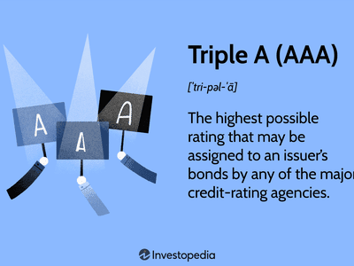

## Table of Contents

## What are bond ratings and why are they important?

Bond ratings are grades given to bonds by special companies called rating agencies. These grades tell investors how safe or risky a bond is. The ratings are usually letters, like AAA, AA, A, BBB, and so on. AAA is the best and means the bond is very safe, while lower ratings mean the bond is riskier. The rating agencies look at things like how likely the company or government that issued the bond is to pay back the money they borrowed.

Bond ratings are important because they help investors decide which bonds to buy. If a bond has a high rating, like AAA, investors feel more confident that they will get their money back with interest. This makes the bond more attractive and often means the bond issuer doesn't have to offer as much interest to attract buyers. On the other hand, if a bond has a low rating, investors might want a higher interest rate to take on the extra risk. This way, bond ratings help keep the bond market working smoothly by giving everyone clear information about the risks involved.

## What do the ratings AA+ and Aa1 represent?

AA+ is a rating given by Standard & Poor's (S&P) and Fitch Ratings. It means the bond is very safe and has a high quality. It's just a little bit below the top rating of AAA. When a bond gets an AA+ rating, it shows that the company or government that issued the bond is very likely to pay back the money they borrowed, but there might be a tiny bit more risk than with a AAA bond.

Aa1 is a rating given by Moody's, another rating agency. It's also a very high quality rating, just below Moody's top rating of Aaa. An Aa1 rating means the bond is very safe, and the issuer is expected to pay back the money with only a small chance of problems. Both AA+ and Aa1 ratings tell investors that these bonds are strong choices, but they are slightly less secure than the very top-rated bonds.

## Who assigns the AA+ rating and who assigns the Aa1 rating?

The AA+ rating is given by Standard & Poor's (S&P) and Fitch Ratings. These are two big companies that look at bonds and decide how safe they are. When they give a bond an AA+ rating, it means the bond is really good and safe, but just a tiny bit less safe than the very best AAA rating. People who want to buy bonds look at these ratings to help them decide if the bond is a good choice.

The Aa1 rating is given by Moody's, which is another big company that rates bonds. When Moody's gives a bond an Aa1 rating, it means the bond is very safe too, but it's a little bit below their top rating of Aaa. Investors use this rating to understand how likely it is that they will get their money back if they buy the bond. Both AA+ and Aa1 ratings help people feel more confident about buying these bonds.

## How do the methodologies of rating agencies differ when assigning AA+ and Aa1 ratings?

Standard & Poor's (S&P) and Fitch Ratings use a similar approach to assign the AA+ rating. They look at things like how much money the company or government has, how well they manage their money, and how likely they are to pay back what they borrowed. They also consider the economy and any risks that might affect the bond issuer. If everything looks good but there's just a tiny bit of risk, they might give the bond an AA+ rating. This means the bond is very safe, but not quite as safe as the top AAA rating.

Moody's uses a bit different method to give the Aa1 rating. They also check the financial health of the bond issuer, but they might weigh some factors differently. Moody's looks at the ability of the issuer to pay back the money, the stability of their income, and how much debt they have. If everything is strong but there's a small chance of problems, Moody's might rate the bond Aa1. This is their way of saying the bond is very safe, just a little less safe than their top Aaa rating. Even though the methods are different, both ratings mean the bonds are high quality and a good choice for investors.

## What are the key differences between the AA+ and Aa1 ratings?

The AA+ rating is given by Standard & Poor's (S&P) and Fitch Ratings, while the Aa1 rating comes from Moody's. Both ratings mean the bonds are very safe and high quality, but they are just a tiny bit below the very top ratings of AAA and Aaa, respectively. The difference in the ratings is mostly about who gives them, because S&P, Fitch, and Moody's are different companies with their own ways of looking at bonds.

Even though AA+ and Aa1 both show that a bond is very safe, the way these ratings are decided can be a bit different. S&P and Fitch might focus a bit more on the overall financial health and the economy when they decide on an AA+ rating. Moody's, on the other hand, might pay closer attention to how stable the bond issuer's income is and how much debt they have when they give an Aa1 rating. So, while the ratings are similar, the specific things each agency looks at can vary a little bit.

## How do AA+ and Aa1 ratings impact the interest rates of bonds?

When a bond gets an AA+ rating from Standard & Poor's or Fitch, or an Aa1 rating from Moody's, it means the bond is very safe. Because the bond is seen as a good choice, the company or government that issued it doesn't have to offer as much interest to get people to buy it. Investors feel more confident about getting their money back, so they are okay with a lower [interest rate](/wiki/interest-rate-trading-strategies) compared to riskier bonds.

Even though AA+ and Aa1 ratings are both high quality, they are just a little bit below the top ratings. This tiny difference can still affect the interest rate. A bond with an AA+ or Aa1 rating might have to offer a slightly higher interest rate than a bond with the very best rating, like AAA or Aaa, to attract investors. But it will still have a lower interest rate than bonds with lower ratings, which are seen as riskier.

## What are the investment implications of choosing a bond rated AA+ versus Aa1?

Choosing a bond rated AA+ by Standard & Poor's or Fitch is very similar to choosing one rated Aa1 by Moody's. Both ratings mean the bond is very safe and a good choice for investors. If you buy a bond with an AA+ or Aa1 rating, you can feel pretty confident that the company or government that issued the bond will pay you back with interest. This means you might not get as much interest as you would with a riskier bond, but it's a safer way to invest your money.

The main thing to remember is that while AA+ and Aa1 ratings are almost the same, they come from different rating agencies. So, if you're looking at bonds with these ratings, you might want to check if one agency's rating seems a bit more trustworthy to you or if one bond has a slightly better rating from another agency. But overall, whether you choose an AA+ bond or an Aa1 bond, you're [picking](/wiki/asset-class-picking) a high-quality investment that's less likely to run into problems.

## Can you provide examples of bonds that have been rated AA+ and Aa1?

A bond that has been rated AA+ by Standard & Poor's is the Apple Inc. bond issued in 2020. Apple is a big company that makes phones and computers, and they borrowed money by selling bonds. Because Apple is a strong company with lots of money, S&P gave their bond an AA+ rating, which means it's very safe for people who buy it. They can feel good about getting their money back with interest.

Another example is a bond from the Government of Canada, which was rated Aa1 by Moody's. The Canadian government sells bonds to borrow money for things like building roads and schools. Moody's looked at how the Canadian government manages its money and decided that their bond is very safe, so they gave it an Aa1 rating. This tells investors that it's a good choice because the government is likely to pay back the money they borrowed.

## How have AA+ and Aa1 ratings historically performed in terms of default risk?

Bonds rated AA+ by Standard & Poor's or Fitch, and Aa1 by Moody's, have a very low risk of default. This means that the companies or governments that issue these bonds almost always pay back the money they borrowed, along with the interest they promised. Historically, these high ratings mean that investors can feel safe because the chance of not getting their money back is very small. For example, over the years, only a tiny percentage of bonds with these ratings have ever failed to pay back investors.

Looking at the data, AA+ and Aa1 rated bonds have shown strong performance when it comes to avoiding defaults. Studies and historical records show that these ratings are a good sign that the bond is safe. While nothing is guaranteed in investing, bonds with these ratings have a much better track record than bonds with lower ratings. This is why many investors choose them when they want a safer place to put their money.

## What are the sector-specific considerations for bonds rated AA+ versus Aa1?

When looking at bonds rated AA+ by Standard & Poor's or Fitch, and Aa1 by Moody's, it's important to think about the sector the bond comes from. Different sectors can have different risks and strengths. For example, bonds from the technology sector, like those from Apple, might get an AA+ rating because tech companies often have a lot of money and good management. But they can still face risks from fast changes in technology or competition. On the other hand, government bonds, like those from the Government of Canada with an Aa1 rating, are seen as very safe because governments have the power to raise taxes or print money to pay back their debts. However, they can still face risks from economic problems or political changes.

Another thing to consider is how different sectors handle their money. For instance, utility companies, which provide services like electricity or water, might get an AA+ or Aa1 rating because they have steady income from customers. This makes them less risky because they can count on that money to pay back their bonds. But they can still face challenges from regulations or natural disasters. In contrast, bonds from the energy sector, like oil and gas companies, might also get these high ratings if they are financially strong. However, they face bigger risks from changes in oil prices or environmental regulations. So, even with the same high rating, the sector a bond comes from can affect how safe it really is.

## How do global economic conditions affect the stability of AA+ and Aa1 ratings?

Global economic conditions can change how safe bonds with AA+ and Aa1 ratings seem to be. When the world economy is doing well, these bonds usually stay very safe. People and companies have more money, so they can pay back their loans easily. This makes investors feel good about buying these bonds because they think they'll get their money back with interest. But if the world economy starts to have problems, like a big recession, even these high-rated bonds can face more risk. Companies might have less money coming in, and governments might struggle to pay their bills. This can make investors worry more about getting their money back, even if the bond has a high rating.

Even though AA+ and Aa1 ratings are meant to show that a bond is very safe, big changes in the global economy can shake things up. For example, if there's a financial crisis, like the one in 2008, rating agencies might look at these bonds again and decide to lower their ratings if they think the risks are bigger now. Also, things like trade wars or big changes in interest rates can make the economy less predictable. This might not change the ratings right away, but it can make investors more careful about buying these bonds. So, while AA+ and Aa1 ratings are a good sign of safety, global economic conditions can still affect how stable these bonds really are.

## What advanced analytical tools can investors use to compare bonds with AA+ and Aa1 ratings?

Investors can use advanced tools like bond yield calculators to compare bonds with AA+ and Aa1 ratings. These calculators help figure out how much money a bond will make over time. By putting in the bond's price, interest rate, and how long it lasts, the calculator shows the bond's yield. This makes it easier to see if an AA+ bond might give a little more or less return than an Aa1 bond. Another tool is a risk assessment model, which looks at how safe the bond is based on things like the economy and the company's money situation. These models can show if one bond might be a bit riskier than the other, even if they both have high ratings.

Another helpful tool is a bond comparison software that lets investors look at different bonds side by side. This software can show the ratings, interest rates, and how the bonds have done in the past. It can also take into account things like how the bond's price might change if interest rates go up or down. By using this software, investors can see all the important details about AA+ and Aa1 bonds in one place and decide which one might be a better fit for their money.

## References & Further Reading

[1]: Bergstra, J., Bardenet, R., Bengio, Y., & Kégl, B. (2011). ["Algorithms for Hyper-Parameter Optimization."](https://papers.nips.cc/paper/4443-algorithms-for-hyper-parameter-optimization) Advances in Neural Information Processing Systems 24.

[2]: ["Advances in Financial Machine Learning"](https://www.amazon.com/Advances-Financial-Machine-Learning-Marcos/dp/1119482089) by Marcos Lopez de Prado

[3]: Moody's Investors Service. (2019). ["Rating Methodology: Global Corporate Finance."](https://ratings.moodys.com/api/rmc-documents/65543)

[4]: ["Evidence-Based Technical Analysis: Applying the Scientific Method and Statistical Inference to Trading Signals"](https://www.amazon.com/Evidence-Based-Technical-Analysis-Scientific-Statistical/dp/0470008741) by David Aronson

[5]: ["Machine Learning for Algorithmic Trading"](https://github.com/stefan-jansen/machine-learning-for-trading) by Stefan Jansen

[6]: Standard & Poor's. (2016). ["Guide to Credit Rating Essentials: What are Credit Ratings and How Do They Work?."](https://www.spglobal.com/ratings/_division-assets/pdfs/guide-to-credit-rating-essentials.pdf)

[7]: ["Quantitative Trading: How to Build Your Own Algorithmic Trading Business"](https://www.amazon.com/Quantitative-Trading-Build-Algorithmic-Business/dp/1119800064) by Ernest P. Chan