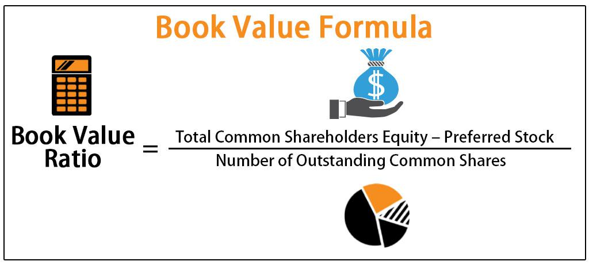

In the complex world of finance and investment, understanding key accounting terms like carrying value and book value is crucial. These terms frequently surface in discussions about asset valuation, financial statements, and investments. Carrying value represents the net value of an asset or liability as recorded on a company's balance sheet, after accounting for depreciation, amortization, or impairment. Book value, on the other hand, traditionally refers to the historical cost of an asset minus accumulated depreciation or amortization. Both of these measures are essential for investors and analysts when evaluating a company's financial health and making informed decisions regarding its asset management strategies.

Algorithmic trading, which leverages computer algorithms to execute trading strategies, relies heavily on precise data, including accounting figures such as carrying and book values. These values aid in developing quantitative models that can forecast asset performance, allowing traders to identify potentially undervalued or overvalued stocks. As algorithmic trading continues to gain momentum, a firm grasp of these accounting foundations can significantly enhance trading strategies, offering insights that inform investment choices and portfolio management.



This article aims to demystify carrying value and book value and explore their respective roles in algorithmic trading. By understanding these essential accounting terms, investors and financial professionals can better appreciate their impact on asset valuation, financial stability, and strategic decision-making in today's market.

## Table of Contents

## Understanding Carrying Value and Book Value

Carrying value and book value are fundamental concepts in accounting, frequently used to evaluate the worth of assets on a company’s financial statements. Despite being used interchangeably at times, each term has its distinct significance.

Carrying value, often known as the net book value, is the net amount at which an asset is presented on the balance sheet after adjustment for any accumulated depreciation or amortization. Mathematically, it can be represented as:

$$
\text{Carrying Value} = \text{Original Cost} - \text{Accumulated Depreciation}
$$

This value is crucial for accounting as it provides a snapshot of an asset’s depreciated worth at a given time. It reflects the amount that the company expects to realize from the continued use or eventual sale of the asset.

On the other hand, book value typically represents the historical cost of an asset, which is the original purchase price minus any accumulated depreciation or impairment losses. For tangible assets, this computation might include depreciation, while for intangible assets, it includes amortization. Thus, book value offers insight into how much investment remains in an asset since its acquisition. The formula for book value is similarly defined as:

$$
\text{Book Value} = \text{Historical Cost} - \text{Accumulated Depreciation/Amortization}
$$

The distinction between carrying value and book value may appear subtle, but both values play a pivotal role in financial assessment and asset management. They serve as indicators of the asset's value recorded on financial statements, thereby aiding in analyzing a company’s financial health. By scrutinizing these values, investors and analysts can gauge the standing of assets over time, enhancing an understanding of their potential return on investment and maintenance of value.

## The Role of Carrying Value and Book Value in Financial Statements

Carrying value and book value are essential components of financial statements, fundamentally influencing the perceived worth of a company's assets. These accounting concepts aid investors and analysts in determining whether assets are overvalued or undervalued, directly informing their investment decisions. By comprehending how these values are integrated into financial statements, stakeholders can better assess a company's financial health and operational performance.

The carrying value of an asset, also known as its net book value, represents the original cost of the asset minus any accumulated depreciation or amortization. This value is listed on the balance sheet and reflects the asset's depreciated cost, contributing to the overall assessment of a company's asset base. In financial statements, this provides a pragmatic approach to asset valuation by accounting for the reduction in the asset's utility over time.

Book value, meanwhile, traditionally signifies the net asset value of a company, calculated by subtracting total liabilities from total assets. This figure provides an overarching view of what the business' equity is worth as recorded on the [books](/wiki/algo-trading-books), offering crucial insights into the fundamental valuation of a firm. For example, the book value per share is determined by dividing the company’s total book value by the number of outstanding shares, serving as a useful comparison metric against the market price of the stock.

In evaluating financial statements, the carrying value and book value support a comprehensive understanding of a company's capital structure and asset management. Analysts use these figures to identify discrepancies between the book value and market value, highlighting potential investment opportunities or risks. Such analysis plays a vital role in financial decision-making, offering clarity into the historical cost and depreciation trajectory of assets.

Additionally, these accounting values guide auditors and regulators in assessing the accuracy and reliability of financial reporting. By verifying that carrying values and book values are consistent with accounting standards and principles, they ensure that the financial statements accurately represent the company's economic conditions and transactions.

In summary, the careful consideration of carrying value and book value in financial statements is indispensable for precise financial analysis. These values not only depict the devaluation of assets over time but also establish a foundational understanding for evaluating a company's financial stability and investment potential. The alignment of these accounting metrics within balance sheets provides clarity and transparency, crucial for making informed strategic investment decisions.

## Impact on Investment Strategies

The distinction between carrying value and book value is pivotal in identifying potential investment opportunities. Investors frequently analyze these values in comparison to the market value of an asset, aiming to uncover stocks that are undervalued. The rationale behind this is straightforward: if the market value is significantly lower than the carrying or book value, the asset might be undervalued, indicating a potential buy opportunity.

Book value per share (BVPS) is a crucial metric used for assessing stock prices. It is calculated by dividing the total book value of a company by the number of outstanding shares. The formula is:

$$
\text{BVPS} = \frac{\text{Total Shareholder's Equity} - \text{Preferred Equity}}{\text{Total Outstanding Shares}}
$$

This metric provides investors with a measure of the net asset value attributed to each share, potentially guiding investment decisions. When the market price of a stock is below its book value per share, it may indicate that the stock is undervalued, possibly presenting a buying opportunity for investors inclined towards value investing strategies.

These valuations are critical for long-term value investing strategies, which focus on purchasing securities that appear underpriced by some form of [fundamental analysis](/wiki/fundamental-analysis). Value investors, such as those following the principles of Benjamin Graham and Warren Buffett, often seek stocks that trade for less than their intrinsic values. The carrying and book values serve as tools to ascertain this intrinsic value, aiding in identifying discrepancies between market valuation and fundamental valuation.

In summary, understanding the nuances and implications of carrying value and book value equips investors with the ability to discern undervalued investments, thereby enhancing their portfolio's potential for long-term growth.

## Integration of Accounting Values in Algorithmic Trading

Algorithmic trading is a field that capitalizes on the strengths of technology and finance to execute trades more efficiently than humans. An integral part of this efficiency is the reliance on precise accounting values, such as book and carrying values, which are critical to constructing robust trading algorithms. These values provide a comprehensive view of a company's financial standing and help in making informed decisions tailored to the dynamic nature of financial markets.

Book value represents the historical cost of an asset minus accumulated depreciation, and it serves as a foundational component in asset valuation. Carrying value, on the other hand, is the current value at which an asset is reported on the balance sheet, after accounting for depreciation and amortization. In [algorithmic trading](/wiki/algorithmic-trading), both these accounting values are indispensable for several reasons.

First, these values are used to fine-tune trading algorithms, ensuring they are in sync with true asset worth. Algorithms employ book and carrying values to assess asset valuation discrepancies, comparing these to market prices to identify potential trading opportunities. This quantitative assessment enables traders to recognize undervalued or overvalued assets effectively. For example, if an asset’s carrying value is significantly lower than its market value, an algorithm might trigger a buy decision based on strategic thresholds defined in the model.

Secondly, historical cost data and depreciation patterns embedded in book values provide predictive insights into future asset returns. Algorithms incorporating these accounting elements can model and forecast financial trends more reliably, bolstering the predictive accuracy of trading decisions. This aspect is crucial for developing models that anticipate movements based on historical pricing patterns and financial health indicators derived from book values.

Moreover, accurate accounting data is a prerequisite for the success of quantitative models used in algorithmic trading. These models rely heavily on the integrity and precision of financial inputs to execute hundreds or thousands of trades in fractions of a second. The reliability of accounting data, therefore, has a direct impact on the performance of these trading systems. Errors in accounting values can lead to inaccurate trading strategies, resulting in substantial financial loss.

In practical implementations, coding languages like Python are frequently utilized to develop these algorithmic strategies. Python libraries such as Pandas and NumPy can handle large datasets of accounting values, facilitating efficient data manipulation and analysis. Here's a simple Python example to illustrate the calculation of a book value:

```python
import pandas as pd

# Sample Data: Asset's historical cost and annual depreciation
data = {'Asset': ['Asset-A'],
        'Historical_Cost': [100000],
        'Annual_Depreciation': [5000],
        'Years_Depreciated': [8]}

df = pd.DataFrame(data)

# Calculate Book Value
df['Book_Value'] = df['Historical_Cost'] - (df['Annual_Depreciation'] * df['Years_Depreciated'])

print(df[['Asset', 'Book_Value']])
```

This code snippet calculates the book value by subtracting the accumulated depreciation from the asset's historical cost, showcasing how accounting data can be integrated into algorithmic processes. 

In conclusion, the integration of accounting values like carrying and book values into algorithmic trading models facilitates precise asset valuation and enhances the decision-making process in trading systems. The fusion of rigorous accounting data with cutting-edge trading algorithms represents a significant advancement in the way financial markets operate.

## Real-World Applications and Examples

Many firms use book value as a foundational metric when assessing potential mergers and acquisitions (M&A). In M&A, the book value provides a tangible reference point for evaluating a target company's net asset value. This metric serves as a benchmark for determining the appropriateness of an acquisition price. For instance, when a company purchases another company, the book value of assets is compared to the purchase price to assess whether the transaction provides a premium or discount on the assets acquired.

Carrying value is particularly significant in asset management where the focus is on effective depreciation monitoring. Asset managers rely on carrying values to track how assets depreciate over time, ensuring accurate reporting and provision for replacement or repair costs. Carrying value plays a crucial role in the insight it provides into how asset value diminishes, which is essential for long-term asset management strategies. For example, consider a manufacturing firm utilizing machinery and equipment: understanding the carrying value of these assets helps in forecasting future investment needs for maintenance or upgrades.

In the context of algorithmic trading, investment firms integrate book value and carrying value into their trading strategies for stock selection. These accounting metrics help inform algorithms on stock valuations relative to their historical and current market performances. Quantitative trading strategies often leverage these values to predict stock performance and make real-time trading decisions. For example, an algorithm could be programmed to favor stocks trading below their book value, assuming potential undervaluation. A Python snippet that demonstrates the selection of such stocks might appear as follows:

```python
import pandas as pd

# Sample data frame with market value and book value
data = {'Ticker': ['ABC', 'DEF', 'GHI'],
        'Market_Value': [150, 80, 120],
        'Book_Value': [100, 100, 110]}

df = pd.DataFrame(data)

# Identify stocks trading below their book value
undervalued_stocks = df[df['Market_Value'] < df['Book_Value']]
print(undervalued_stocks)
```

Real-world examples from leading companies illustrate the practical implications of these values on financial strategies. For instance, the technology giant Apple, Inc., with its substantial asset base, meticulously monitors carrying values for efficient capital allocation and investment in innovation. On the M&A front, companies such as Berkshire Hathaway asses the book value of potential acquisitions to align investments with intrinsic value principles. These activities underscore the strategic importance of carrying and book values in shaping robust financial strategies and ensuring informed decision-making across the business landscape.

## Common Misconceptions and Clarifications

A prevalent misconception in finance is the assumption that a higher book value automatically indicates greater asset worth. This is misleading because book value, typically calculated as the historical cost of an asset minus accumulated depreciation, does not account for current market conditions or potential asset appreciation. For instance, an asset might have appreciated significantly in value since its acquisition, yet this appreciation would not be reflected in its book value. Consequently, investors relying solely on book value could underestimate the asset's true economic worth.

Understanding the distinction and application of book value in different contexts is essential for accurate financial analysis. It's important to recognize that book value serves as a measure of how much an asset is recorded for accounting purposes, rather than an indication of its market price. Market conditions, demand, and economic factors can cause significant deviations between book value and an asset's fair market value.

Another widespread misunderstanding involves the interchangeable use of book value and market value. Market value is determined by the price at which an asset or security could be bought or sold in a current transaction between willing parties, factoring in all available information and market sentiment. In contrast, book value is an accounting figure that remains static until adjusted for new transactions, depreciation, or impairments. Using these values interchangeably without acknowledging their differences can lead to investment errors. For example, an investor might believe a stock is undervalued if its market price is below its book value, without considering that the market price may reflect forward-looking factors and broader market expectations.

To avoid such misconceptions, investors should consider both book and market values in tandem with comprehensive financial analyses that include current market conditions, asset [liquidity](/wiki/liquidity-risk-premium), and potential growth. This holistic approach can provide a more accurate appraisal and better inform decisions. As such, refining investment strategies necessitates a clear understanding of both metrics and an awareness of their respective limitations.

## Conclusion

Grasping the concepts of carrying value and book value is essential for investors, especially those using algorithmic trading. These accounting terms are foundational in understanding asset valuation and financial stability. Carrying value, the net amount at which an asset appears on a balance sheet, and book value, generally the historical cost minus depreciation, offer critical insights into a company's financial health.

For investors, knowing the difference between these values and the market value can illuminate investment opportunities. For instance, comparing book value per share ($BVPS$) with current market prices can identify potentially undervalued stocks. Python code tools and algorithms often leverage precise accounting data such as book and carrying values to execute trading strategies with enhanced precision.

```python
def bvps(total_equity, preferred_equity, total_shares):
    return (total_equity - preferred_equity) / total_shares

total_equity = 500000
preferred_equity = 50000
total_shares = 10000

print(f"Book Value Per Share: {bvps(total_equity, preferred_equity, total_shares):.2f}")
```

With algorithmic trading gaining traction, the accuracy and timeliness of financial data have become paramount. Investors and finance professionals equipped with a nuanced understanding of carrying and book values are better positioned to make strategic decisions, ensuring that their approaches align with the current financial landscape. Consequently, these concepts are not merely technical jargon but pivotal tools that fortify investment strategies in modern finance.

## References & Further Reading

[1]: ["Financial Statement Analysis and Security Valuation"](https://www.amazon.com/Financial-Statement-Analysis-Security-Valuation/dp/0073379662) by Stephen Penman

[2]: ["Valuation: Measuring and Managing the Value of Companies"](https://www.amazon.com/Valuation-Measuring-Managing-Companies-Finance/dp/1119610885) by McKinsey & Company

[3]: Damodaran, A. (2012). ["Investment Valuation: Tools and Techniques for Determining the Value of Any Asset."](https://books.google.com/books/about/Investment_Valuation.html?id=5SRHAAAAQBAJ) 

[4]: ["Asset Management: A Systematic Approach to Factor Investing"](https://academic.oup.com/book/3342) by Andrew Ang

[5]: Kasilingam, R., & Jayabal, G. (2008). ["Value Investing in Indian Stock Market."](https://journals.sagepub.com/doi/abs/10.1177/0971890720090202) ICFAI Journal of Applied Finance.