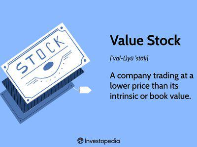

## Table of Contents

## What is book value and how is it calculated?

Book value is the total value of a company's assets minus its liabilities, as recorded on its balance sheet. It represents what shareholders would theoretically receive if a company were to liquidate all its assets and pay off all its debts. This figure is important for investors because it gives them an idea of what the company is worth from an accounting standpoint.

To calculate book value, you start by adding up the value of all the company's assets. These can include things like cash, inventory, property, and equipment. Then, you subtract the total amount of the company's liabilities, which are its debts and obligations. The result is the book value, also known as shareholders' equity. For example, if a company has assets worth $1 million and liabilities of $600,000, its book value would be $400,000.

## What is intrinsic value and how is it determined?

Intrinsic value is what something is really worth, not just what it's listed for or what people think it's worth. It's like the true value of a company or an item, looking at all the things that affect its worth, not just what's written down. For a company, intrinsic value tries to figure out what the business is really worth by looking at things like how much money it makes, how fast it's growing, and what risks it faces.

To find the intrinsic value, people use different ways to guess what the future will be like for the company. One common way is called discounted cash flow (DCF) analysis. This method tries to predict all the money the company will make in the future and then figures out what that money is worth today. It's a bit like saying, "If I'm going to get $100 next year, how much is that worth to me right now?" People also look at other things like how the company compares to others in its industry and what the overall economy is doing. It's not an exact science, so different people might come up with different numbers for the same company.

## Why is it important to compare book value and intrinsic value?

Comparing book value and intrinsic value is important because it helps investors understand if a company is a good buy or not. Book value is like a snapshot of what the company is worth on paper, based on its balance sheet. It tells you what shareholders might get if the company sold everything and paid off all its debts. But, book value doesn't tell the whole story. It doesn't show how well the company is doing or what it might be worth in the future. That's where intrinsic value comes in. Intrinsic value tries to guess what the company is really worth by looking at things like its profits, growth, and risks.

By comparing these two values, investors can see if a company's stock is priced right. If the intrinsic value is a lot higher than the book value, it might mean the company is doing well and could be a good investment. On the other hand, if the book value is higher than the intrinsic value, it might mean the company isn't doing as well as its balance sheet suggests. This comparison helps investors make smarter choices about where to put their money, by giving them a fuller picture of a company's worth.

## How do book value and intrinsic value differ in their use for investors?

Book value and intrinsic value are both important for investors, but they tell different stories about a company. Book value is like a simple math problem. You take everything the company owns, subtract what it owes, and that's the book value. It's useful because it shows what shareholders might get back if the company sold everything and paid off its debts. But book value doesn't look at how the company is doing right now or what it might do in the future. It's just a snapshot of the past.

Intrinsic value, on the other hand, tries to guess what the company is really worth by looking at all sorts of things. It considers how much money the company makes, how fast it's growing, and what risks it might face. Intrinsic value is like trying to predict the future, so it's more complicated and less exact than book value. But it's important because it can help investors see if a company's stock is a good deal or not. If the intrinsic value is higher than the price of the stock, it might be a good time to buy.

Investors use both values to make smart choices. Book value gives a clear, easy-to-understand number that's good for a quick check. Intrinsic value, while harder to figure out, gives a deeper look at what the company might be worth down the road. By comparing these two, investors can get a better idea of whether a company's stock is priced right and if it's a good investment.

## Can you provide an example of a company where book value and intrinsic value significantly differ?

Let's talk about Amazon. Amazon's book value is not very high compared to how big and successful the company is. If you look at Amazon's balance sheet, you'll see a lot of stuff like warehouses, computers, and cash. But after you subtract all the money Amazon owes, like loans and bills, the book value isn't that impressive. It's because a lot of what makes Amazon valuable isn't on the balance sheet. Things like its brand, its huge customer base, and its ability to keep growing and making money are not counted in book value.

On the other hand, Amazon's intrinsic value is much higher. If you try to guess what Amazon is really worth by looking at how much money it makes, how fast it's growing, and what risks it faces, you'll see a big difference. Amazon makes a lot of money from its online store, from services like Amazon Web Services, and from other businesses it's getting into. It keeps growing and finding new ways to make money. So, when you add all that up and try to figure out what Amazon might be worth in the future, the intrinsic value is a lot higher than the book value. This shows why investors might think Amazon's stock is a good buy, even if the book value doesn't look that great.

## What are the limitations of using book value as a measure of a company's worth?

Book value has some big problems when you use it to figure out how much a company is worth. It only looks at what's on the balance sheet, like buildings, machines, and cash, minus what the company owes. But it doesn't count important things like the company's brand, how happy its customers are, or how good its workers are. These things can make a company worth a lot more than what's written down. Also, book value uses old prices for things like buildings and machines. If those things are worth more now, the book value won't show that.

Another problem with book value is it doesn't tell you anything about how the company is doing right now or what it might do in the future. It's just a snapshot of the past. If a company is making a lot of money and growing fast, that won't show up in the book value. So, if you only look at book value, you might think a company isn't worth much, even if it's doing really well. That's why smart investors use other ways, like looking at intrinsic value, to get a better idea of what a company is really worth.

## How does the concept of intrinsic value vary across different valuation models?

Intrinsic value can be figured out in different ways, and each way looks at different things. One common way is called discounted cash flow (DCF) analysis. This method tries to guess all the money a company will make in the future and then figures out what that money is worth today. It's like saying, "If I'm going to get $100 next year, how much is that worth to me right now?" But DCF needs you to make a lot of guesses about the future, so different people might come up with different numbers for the same company. Another way is to compare the company to others in its industry. This method looks at things like how much money the company makes compared to its stock price and sees if it's a good deal or not.

Another model for finding intrinsic value is the dividend discount model (DDM). This one is used for companies that pay dividends to their shareholders. It tries to guess what all those future dividends are worth today. It's like DCF, but it only looks at dividends instead of all the money the company makes. Each of these models has its own way of looking at a company, and they all have their own problems. For example, DCF needs a lot of guesses about the future, and DDM only works well for companies that pay dividends. So, the idea of intrinsic value can change a lot depending on which model you use and what you think about the company's future.

## What role does market perception play in the discrepancy between book value and intrinsic value?

Market perception can make a big difference between a company's book value and its intrinsic value. Book value is just what's written down on the balance sheet, like how much the company's stuff is worth minus what it owes. But intrinsic value tries to guess what the company is really worth by looking at things like how much money it makes and how it might do in the future. Market perception is what people think about the company, and it can change the intrinsic value a lot. If people think a company is doing great and will keep doing well, they might be willing to pay more for its stock, making the intrinsic value higher than the book value.

For example, if a company like Tesla is seen as a leader in electric cars and new technology, people might think it's worth a lot more than what's shown on its balance sheet. Even if Tesla's book value isn't that high, the market might think its intrinsic value is much higher because of its future potential. On the other hand, if a company is seen as old-fashioned or struggling, people might not want to pay much for its stock, making the intrinsic value lower than the book value. So, market perception can really change how much people think a company is worth, and that's why there can be a big difference between book value and intrinsic value.

## How can an investor use the difference between book value and intrinsic value to make investment decisions?

An investor can use the difference between book value and intrinsic value to figure out if a company's stock is a good buy or not. Book value is what the company is worth on paper, just looking at its stuff minus what it owes. Intrinsic value tries to guess what the company is really worth by thinking about how much money it might make in the future and other important things. If the intrinsic value is a lot higher than the book value, it might mean the company is doing well and could be a good investment. But if the book value is higher than the intrinsic value, it might mean the company isn't doing as well as its balance sheet suggests.

By comparing these two values, an investor can see if the market thinks the company is worth more or less than what's written down. If the market thinks the company will do great things in the future, the intrinsic value will be higher, and the stock might be a good buy. But if people think the company isn't going to do well, the intrinsic value will be lower, and the investor might want to stay away. This comparison helps investors make smarter choices about where to put their money, by giving them a fuller picture of what a company might be worth.

## What are some advanced methods to estimate intrinsic value more accurately?

One advanced way to guess a company's intrinsic value more accurately is by using a method called Monte Carlo simulation. This method tries to predict the future by running a lot of different scenarios. It's like playing a game many times to see all the different ways it could go. By doing this, you can see how likely it is that the company will make a certain amount of money in the future. This helps you figure out what the company might be worth, even if the future is hard to predict. But it's a bit tricky because you need to know a lot about the company and the market to set up the right scenarios.

Another way is to use real options valuation. This method looks at the company like it's a bunch of choices or "options." For example, a company might have the option to start a new project or to expand into a new market. By figuring out what these options are worth, you can get a better idea of the company's total value. It's like looking at all the different things the company could do and adding up their value. This can be really helpful for companies that are always changing and growing, but it's also complicated because you need to understand how to value these options correctly.

## How do changes in accounting standards affect the comparison between book value and intrinsic value?

Changes in accounting standards can mess up the comparison between book value and intrinsic value. Book value is just what's written down on the balance sheet, like how much the company's stuff is worth minus what it owes. If the rules for how to write down stuff change, the book value can change too. For example, if new rules say you have to value your buildings differently, that can make the book value go up or down. But these changes don't always mean the company is worth more or less in the real world. So, the difference between book value and intrinsic value can get bigger or smaller just because of new accounting rules.

Intrinsic value, on the other hand, tries to guess what the company is really worth by looking at how much money it might make in the future and other important things. Changes in accounting standards usually don't change the intrinsic value directly, because intrinsic value looks at things like profits and growth, not just what's on the balance sheet. But if the new rules make the company's profits look different, that could change how people guess the intrinsic value. So, when accounting standards change, it's important for investors to keep an eye on both book value and intrinsic value to see if the difference between them is because of the new rules or because the company's real worth has changed.

## Can you discuss a case study where understanding the difference between book value and intrinsic value led to a successful investment strategy?

One good example of using the difference between book value and intrinsic value for a successful investment is Warren Buffett's investment in American Express in the 1960s. At that time, American Express was going through a tough time because of a big scandal that made people lose trust in the company. The book value of American Express didn't look too good because it showed the company's stuff minus what it owed, and the scandal made it seem like the company was worth less. But Warren Buffett saw that the intrinsic value of American Express was much higher. He knew that the company had a strong brand and a lot of loyal customers, things that weren't counted in the book value. So, he bought a lot of American Express stock when it was cheap, believing that the company would recover and its real worth would go back up.

Buffett's bet paid off big time. As American Express fixed its problems and got back the trust of its customers, its stock price went up a lot. The intrinsic value, which looked at things like the company's future profits and its strong brand, turned out to be much higher than the book value. By understanding this difference, Buffett was able to buy the stock when it was undervalued and make a huge profit when the market realized the company's true worth. This shows how looking at both book value and intrinsic value can help investors find good deals and make smart investment choices.

## What is the understanding of Book Value?

Book value represents the net asset value of a company as documented in its financial statements. It is a fundamental metric calculated by subtracting a company's total liabilities from its total tangible assets. This mathematical representation provides a straightforward snapshot of a company's financial standing, and can be expressed as follows:

$$
\text{Book Value} = \text{Total Tangible Assets} - \text{Total Liabilities}
$$

This calculation aids investors in assessing whether a stock may be undervalued when compared to its current market price. If the market price is significantly lower than the book value per share, it might suggest that the stock is undervalued, potentially presenting an investment opportunity. 

While book value offers valuable insights into a company's financial health, it has limitations. One major limitation is that it does not incorporate intangible assets such as brand value, intellectual property, and goodwill, which can be significant components of a company's true asset base. Furthermore, book value does not reflect a company’s potential for future growth, as it is primarily based on historical costs recorded on the balance sheet. Therefore, although book value is useful for evaluating the financial foundation of a company, investors may need to consider additional factors such as future [earning](/wiki/earning-announcement) potentials and market conditions for a comprehensive assessment.

Despite its limitations, the concept of book value remains integral to financial analysis, particularly when used in conjunction with other fundamental metrics. It provides a foundational understanding that assists in evaluating a company’s stability and operational efficiency, serving as a critical tool for both traditional analysts and those integrating automated trading strategies.

## What is Exploring Intrinsic Value?

Intrinsic value is a fundamental concept in financial analysis, representing the present worth of a company's anticipated future earnings. This valuation seeks to determine a company's true worth, beyond simply its current market price, aiding investors in making informed decisions over the long term.

Intrinsic value often relies on methodologies such as the Discounted Cash Flow (DCF) analysis and the Dividend Discount Model (DDM). These approaches require the estimation of future cash flows or dividends and discounting them back to their present value using a suitable discount rate. For instance, the DCF formula can be expressed as:

$$

DCF = \sum \frac{CF_t}{(1 + r)^t}
$$

where $CF_t$ represents the cash flow in year $t$, and $r$ denotes the discount rate. Accurately selecting the discount rate and projecting future cash flows are crucial components of this analysis.

Beyond these methods, intrinsic value takes into account various factors such as macroeconomic conditions, industry trends, and company-specific growth potential. This comprehensive approach enables the estimation of long-term value, considering variables like market competition, technological advancements, and regulatory changes that might influence the company's future performance.

By comparing intrinsic value to current market prices, investors can identify discrepancies that present potential investment opportunities. A stock trading below its intrinsic value might be considered undervalued, suggesting a possible future price increase as the market corrects itself. Conversely, a stock trading above its intrinsic value may be overvalued, indicating a potential price decline.

The application of intrinsic value in investment strategies is essential for evaluating the underlying factors driving a company's future success or failure. It encourages a holistic view of financial standing, encompassing more than immediate market conditions and promoting informed decision-making in portfolio management.

## What are Financial Analysis and Valuation Metrics?

Financial analysis is pivotal in assessing a company's value and evaluating its investment potential. It encompasses a variety of metrics that provide comprehensive insights into different aspects of a company's performance.

Key among these metrics are the Price-to-Earnings (P/E) ratio, Return on Equity (ROE), and Earnings Per Share (EPS). The P/E ratio is calculated as:

$$
\text{P/E Ratio} = \frac{\text{Market Price per Share}}{\text{Earnings per Share (EPS)}}
$$

This ratio helps identify how much investors are willing to pay per dollar of earnings, serving as a crucial indicator for comparing the value of companies within the same industry.

Return on Equity (ROE) assesses a company's efficiency in generating profits from shareholders' equity. It is computed as:

$$
\text{ROE} = \frac{\text{Net Income}}{\text{Shareholders' Equity}}
$$

A higher ROE indicates effective management and profitable growth, beneficial for potential investors evaluating company leadership and performance.

Earnings Per Share (EPS) is another fundamental metric related to a company's profitability. It is the portion of a company's profit allocated to each outstanding share of common stock, calculated as:

$$
\text{EPS} = \frac{\text{Net Income} - \text{Preferred Dividends}}{\text{Weighted Average Shares Outstanding}}
$$

EPS provides insight into a company's profitability on a per-share basis, allowing for straightforward comparisons across different investment opportunities.

These metrics, alongside the calculations of book value and intrinsic value, are integral to financial analysis. By providing a detailed picture of a company's market worth and future potential, these formulas and metrics facilitate strategic investment decisions.

Incorporation of these metrics into advanced analytical tools further refines investment approaches. For instance, Python offers robust libraries, such as Pandas for data manipulation and Matplotlib for visualization, enabling analysts to develop precise financial models:

```python
import pandas as pd
import matplotlib.pyplot as plt

# Example data
data = {'Price': [120, 150], 'EPS': [5, 7]}
df = pd.DataFrame(data)

# Calculate P/E Ratio
df['P/E Ratio'] = df['Price'] / df['EPS']

# Plotting the P/E Ratio for comparison
plt.figure(figsize=(8, 4))
plt.bar(df.index, df['P/E Ratio'], color='blue')
plt.xlabel('Company')
plt.ylabel('P/E Ratio')
plt.title('P/E Ratio Comparison')
plt.show()
```

This capability to integrate precise financial metrics into decision-making tools helps analysts and investors make informed choices, optimizing portfolios and enhancing overall market strategy.

## References & Further Reading

Graham, B. (2003). "The Intelligent Investor: The Definitive Book on Value Investing" offers a foundational perspective on value investing, emphasizing the importance of understanding a company's intrinsic value. This work is essential for investors looking to apply [fundamental analysis](/wiki/fundamental-analysis) to their decision-making process.

Damodaran, A. (2002). "Investment Valuation: Tools and Techniques for Determining the Value of Any Asset" provides comprehensive methodologies for valuing various assets. The book covers a range of approaches including Discounted Cash Flow (DCF) and Dividend Discount Models (DDM), enabling investors to assess intrinsic values accurately.

Chan, E. (2009). "Quantitative Trading: How to Build Your Own Algorithmic Trading Business" explores the integration of quantitative methods in trading strategies. This resource is valuable for those interested in developing and implementing algorithmic trading systems that can leverage valuation metrics for decision-making.

De Prado, M. L. (2018). "Advances in Financial Machine Learning" investigates the intersection of [machine learning](/wiki/machine-learning) and finance. This book is particularly relevant for modern traders looking to enhance their strategies using advanced algorithms and data analysis techniques.

Additional online resources and financial analysis platforms offer further insights into integrating valuation techniques with trading strategies. Websites containing financial APIs, such as Alpha Vantage and Quandl, provide access to extensive datasets that are indispensable when developing and testing algorithmic models. Moreover, platforms like Bloomberg Terminal facilitate in-depth market analysis by delivering comprehensive financial information, aiding in both the calculation and application of book and intrinsic values. These resources are crucial for those seeking to optimize their investment strategies through the use of technology and financial acumen.

