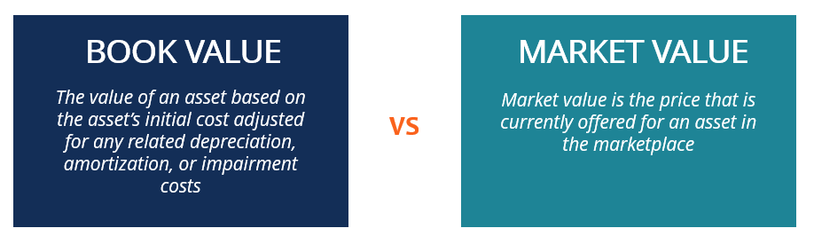

## Table of Contents

## What is book value?

Book value is the total value of a company's assets minus its liabilities, as shown on its balance sheet. It's like figuring out how much a company would be worth if it had to sell everything it owns and pay off all its debts. This number is important because it gives investors an idea of what the company is really worth, beyond just its stock price.

Sometimes, book value can be different from market value, which is what people are willing to pay for the company's stock. If the stock price is lower than the book value per share, it might mean the stock is a good deal. But, book value doesn't always tell the whole story because it doesn't include things like the company's reputation or future earning potential.

## What is market value?

Market value is what people are willing to pay for something at a certain time. For a company, it's usually the total value of all its stock. If you add up the price of every share of a company's stock, you get its market value. This number can change every day because stock prices go up and down based on what people think the company is worth.

Market value can be very different from book value. Book value is like a snapshot of what the company owns minus what it owes, but market value is more about what people believe the company could be worth in the future. If lots of people think a company will do well, its market value can be much higher than its book value. But if people are worried about the company, its market value might be lower.

## How is book value calculated?

Book value is calculated by taking the total value of a company's assets and subtracting its liabilities. Assets are things the company owns, like buildings, equipment, and money in the bank. Liabilities are what the company owes, like loans and bills. So, if a company has assets worth $1 million and liabilities of $300,000, its book value would be $700,000.

To find the book value per share, you divide the total book value by the number of shares the company has. For example, if the book value is $700,000 and the company has 100,000 shares, the book value per share would be $7. This number can be useful for investors to compare with the stock's market price and decide if the stock is a good buy.

## How is market value determined?

Market value is decided by what people are willing to pay for something at a certain time. For a company, it's the total value of all its stock. If you add up the price of every share of a company's stock, you get its market value. This number changes every day because stock prices go up and down based on what people think about the company.

Lots of things can affect market value. News about the company, like if they made more money than expected or if they got a new CEO, can make people want to buy or sell the stock. The economy can also change how people feel about investing. If people are worried about the future, they might not want to pay as much for stocks, which can lower the market value. But if everyone is feeling good about the economy, the market value can go up because people are willing to pay more.

## Why might book value and market value differ?

Book value and market value can be different because they look at a company's worth in different ways. Book value is like a snapshot of what the company owns minus what it owes. It's based on the numbers in the company's balance sheet, which are the costs of things like buildings and equipment, minus any debts. This number is more about the past and what the company has right now.

Market value, on the other hand, is what people are willing to pay for the company's stock at a certain time. It's influenced by what people think about the company's future. If people believe the company will do well and make more money, they might pay more for its stock, making the market value higher than the book value. But if people are worried about the company or the economy, they might not want to pay as much, so the market value could be lower.

These differences show that book value is more about what the company has right now, while market value is more about what people think the company could be worth in the future. That's why a company's market value can be much higher or lower than its book value, depending on what investors believe about its future prospects.

## What does a higher book value than market value indicate?

When a company's book value is higher than its market value, it means that the company's assets minus its debts are worth more than what people are willing to pay for its stock right now. This situation can suggest that the stock might be a good deal because you're getting more value for your money than what the market is currently pricing it at.

However, a higher book value compared to market value doesn't always mean the stock is a great buy. It could also mean that people are worried about the company's future. They might think the company won't make as much money as it used to, or they might be concerned about other problems. So, while a higher book value can be a sign of a good deal, it's important to look at other things too, like the company's future plans and the overall economy.

## What does a higher market value than book value suggest?

When a company's market value is higher than its book value, it means people are willing to pay more for the company's stock than what the company's assets are worth after subtracting its debts. This often shows that people believe the company will do well in the future. They think the company will make more money or grow, so they're happy to pay more for the stock now.

But, a higher market value compared to book value doesn't always mean everything is great. It could also mean that people are a bit too excited about the company and might be expecting too much. If the company doesn't meet these high expectations, the stock price could drop. So, while a higher market value can be a good sign, it's important to look at other things too, like the company's plans and how the economy is doing.

## How can investors use book value and market value in their analysis?

Investors can use book value and market value to understand if a stock is a good deal or not. Book value shows what the company is worth on paper, by subtracting its debts from its assets. If the market value, which is the total price of all the company's stock, is lower than the book value, it might mean the stock is undervalued. This could be a good sign for investors looking for a bargain, because they're paying less for the stock than what the company's assets are worth.

On the other hand, if the market value is higher than the book value, it means people are willing to pay more for the stock than what the company's assets are worth. This can show that investors are hopeful about the company's future and think it will make more money or grow. But, it's important to be careful because if the market value is much higher than the book value, it might mean people are too excited and expecting too much. So, investors should look at other things too, like the company's plans and the economy, to make a smart choice.

## What are the limitations of using book value for valuation?

Book value is not always the best way to figure out what a company is worth. One reason is that book value only looks at the company's assets and debts as they are written down on the balance sheet. But these numbers might not show the real value of things like buildings or machines, which can go up or down over time. Also, book value doesn't include important things like the company's brand name or how good its employees are, which can be really valuable but don't show up on the balance sheet.

Another problem with using book value is that it doesn't tell you about the company's future. It's just a snapshot of what the company has right now. Investors care a lot about whether a company will make more money in the future, but book value doesn't help with that. So, if you only look at book value, you might miss out on understanding how the company could grow or face challenges ahead.

## What are the limitations of using market value for valuation?

Market value can be a tricky way to figure out what a company is worth because it changes all the time. It goes up and down based on what people think and feel about the company, not just on facts. If people are excited about the company's future, they might pay more for its stock, making the market value go up. But if they're worried or unsure, they might not want to pay as much, and the market value can drop. This means that market value can be affected by things like news, rumors, or even the general mood of the economy, which don't always show the true value of the company.

Another problem with using market value is that it can be influenced by things that don't really have to do with the company itself. For example, if everyone is feeling good about the stock market and buying lots of stocks, the market value of a company might go up, even if nothing has changed about the company's actual business. On the other hand, if there's a big economic problem, people might sell their stocks and the market value can go down, even if the company is doing well. So, while market value is important, it's not always the best way to understand what a company is really worth.

## How do accounting standards affect book value?

Accounting standards are like the rules that companies follow when they write down their numbers on the balance sheet. These rules decide how a company figures out the value of its stuff, like buildings and machines, and how it counts its debts. Because different countries or organizations can have different rules, the book value of a company can change depending on which set of rules they use. For example, one rule might say you can only write down what you paid for a building, while another rule might let you guess what the building is worth now. This means that the same company could have different book values just because it follows different rules.

These rules also affect how a company deals with things that are hard to put a price on, like its brand name or special knowledge. Some accounting standards let companies write these things down on their balance sheet, while others don't. If a company can include these "intangible assets" in its book value, the number will be higher. But if it can't, the book value will be lower. So, when investors look at book value, they need to think about which accounting rules the company is using, because it can make a big difference in what the numbers show.

## How do market conditions influence market value?

Market conditions can really change how much people are willing to pay for a company's stock, which is its market value. If the economy is doing well and people feel good about their money, they might want to buy more stocks. This can make the market value of a company go up because more people are willing to pay more for its shares. On the other hand, if the economy is not doing well or there's a lot of uncertainty, people might be scared to invest. They might sell their stocks, which can make the market value go down because fewer people want to buy.

Sometimes, big news or events can also affect market conditions and change a company's market value. For example, if a company announces it made a lot more money than people thought, its stock price might go up because people get excited and want to buy more shares. But if there's bad news, like a new law that might hurt the company's business, people might sell their stocks, and the market value can drop. So, market value is not just about the company itself but also about what's happening around it in the world.

## What is the process of decoding market value?

Market value, commonly referred to as market capitalization, denotes the aggregate value of a company's outstanding shares in the financial market. This metric is pivotal as it reflects investor sentiment and market perception of a company's potential, with the prevailing share price serving as a crucial determinant. The calculation of market value is straightforward: it is the product of the current share price and the total number of outstanding shares. Mathematically, it is expressed as:

$$
\text{Market Value} = \text{Share Price} \times \text{Total Outstanding Shares}
$$

This value is inherently more volatile than book value owing to its dependence on stock prices, which can fluctuate widely due to investor sentiment, news releases, market conditions, and economic indicators. Consequently, market value can rapidly adjust in response to changes in investor perceptions and broader market trends.

To illustrate the variability between market value and book value, consider a scenario where a company's innovative product launch generates positive media coverage, boosting investor confidence. As investor demand for the stock increases, the share price rises, thereby elevating the market value significantly above the book value. Conversely, a company might experience a regulatory setback that results in plummeting investor confidence and a subsequent decline in its market value, potentially dipping below its book value.

These variations highlight the dynamic nature of market value as a reflection of real-time market sentiment, in contrast to the relatively stable book value, which is anchored in historical financial data. Understanding the nuances between these two metrics provides investors and traders with a more nuanced view of a company's financial health and potential investment value.

## What are the key differences between book value and market value?

Book value and market value are two distinct measures used to evaluate the worth of a company, each serving unique roles in financial analysis. Book value is derived from the company's balance sheet, representing the net value of a company's assets minus liabilities. It is calculated using the formula:

$$
\text{Book Value} = \text{Total Assets} - \text{Total Liabilities}
$$

Since it relies on accounting data, book value offers a historical view of a company's worth and tends to remain stable over time, reflecting the tangible assets held by the company.

Market value, or market capitalization, is determined by the stock market and is calculated by multiplying the share price by the total number of outstanding shares. Unlike book value, market value fluctuates based on investor perceptions, market trends, and overall economic conditions. This value offers a current snapshot of what investors are willing to pay for a company’s equity, influenced by expectations of the company's future growth and profitability.

Key differences arise between these two metrics due to the nature of their calculation and the information they convey:

1. **Data Source and Stability**: Book value is an accounting measure based on historical data and is relatively stable, whereas market value is dynamic and influenced by market conditions and investor sentiment.

2. **Scenarios of Divergence**: When book value exceeds market value, it often indicates a potential undervaluation of the company's stock. This could occur in scenarios where investors are pessimistic about the company’s future prospects despite its substantial tangible assets. Conversely, when market value surpasses book value, it may suggest the stock is overvalued or that investors anticipate strong future growth potential.

3. **Investment Strategy Implications**: The relationship between book and market values is critically assessed using the price-to-book (P/B) ratio. This ratio is calculated as:

$$
\text{P/B Ratio} = \frac{\text{Market Price per Share}}{\text{Book Value per Share}}
$$

A P/B ratio less than 1 might indicate that the stock is undervalued, as the market price is below the book value. On the other hand, a high P/B ratio could suggest overvaluation, yet it might also point to a company with excellent growth prospects and high investor confidence.

Investors and algorithmic traders utilize these differences to craft strategies, balancing these metrics with other financial indicators to assess a company's true economic value and potential investment returns. Understanding the implications of these values aids in making informed decisions, whether for long-term investments or short-term trading opportunities.

## References & Further Reading

[1]: Penman, S. H. (2013). "Financial Statement Analysis and Security Valuation." McGraw-Hill Education. This book provides a comprehensive understanding of financial statement analysis and valuation, essential for grasping concepts like book value.

[2]: Fabozzi, F. J., Drake, P. P. (2020). ["The Theory and Practice of Investment Management: Asset Allocation, Valuation, Portfolio Construction, and Strategies."](https://onlinelibrary.wiley.com/doi/book/10.1002/9781118267028) John Wiley & Sons. This reference covers various investment management strategies, including valuation methodologies relevant to market value and book value.

[3]: ["Advanced Financial Risk Management: Tools and Techniques for Integrated Credit Risk and Interest Rate Risk Management"](https://www.wiley.com/en-us/Advanced+Financial+Risk+Management%3A+Tools+and+Techniques+for+Integrated+Credit+Risk+and+Interest+Rate+Risk+Managements+-p-9780470821268) by Donald R. Van Deventer, Kenji Imai, Mark Mesler. It explores the integration of different financial metrics in risk management and investment strategies.

[4]: Aswath Damodaran. (2012). ["Investment Valuation: Tools and Techniques for Determining the Value of Any Asset."](https://books.google.com/books/about/Investment_Valuation.html?id=5SRHAAAAQBAJ) John Wiley & Sons. Damodaran's work is pivotal in understanding the valuation of assets, including book and market value distinctions.

[5]: Hull, J.C. (2018). ["Risk Management and Financial Institutions."](https://books.google.com/books/about/Risk_Management_and_Financial_Institutio.html?id=1J1QDwAAQBAJ) Wiley. This book provides insights into financial risk management, including the use of market value in risk assessments.

[6]: ["Financial Modelling and Asset Valuation with Excel"](https://books.google.com/books/about/Financial_Modelling_and_Asset_Valuation.html?id=gBHWCm7tNW0C) by Elizabeth Baldwin. This book offers practical exercises in financial modeling, including concepts relevant to book and market value used in algorithmic trading.