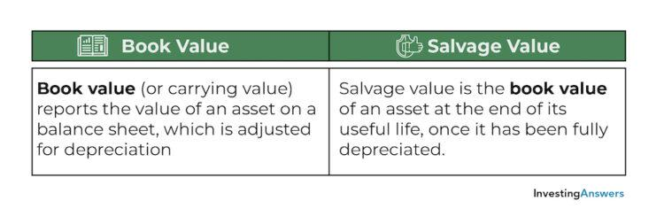

In finance, understanding key financial metrics is essential for both seasoned investors and newcomers. With the advancement of analytical tools and technologies, investors are required to be well-versed in financial terminology to effectively evaluate market opportunities and mitigate risks. Among the multitude of financial metrics, book value and salvage value stand out for their significant roles in providing insights into asset management and company valuation.

Book value is an indicator of a company's net asset value, determined by subtracting total liabilities from total assets. It serves as a snapshot of a company's financial health as reported on its balance sheet, offering valuable insight into its economic stability and asset utilization. By comparing the book value with a company's market price, investors can assess whether a stock is undervalued or overvalued, thereby guiding investment decisions and strategies. The importance of book value is heightened by its integration into traditional valuation methods as well as its adoption in modern trading technologies.



Salvage value, on the other hand, represents the estimated residual value of an asset at the end of its useful life. It plays a critical role in calculating depreciation over time, which is a vital aspect of financial statement preparation. Businesses rely on salvage value estimates to plan asset replacement schedules and to determine appropriate tax deductions, thereby influencing strategic financial planning.

As the financial industry evolves, these metrics have increasingly found their applications in algorithmic trading strategies. Algorithmic trading, which uses computerized systems to execute trades based on predefined rules and patterns, can incorporate book value and salvage value into its models to potentially enhance the efficacy of trading decisions. Understanding these terms is crucial in enhancing the accuracy of financial analysis and optimizing decision-making processes.

This article will explore these concepts in depth, discussing their applications and implications within the scope of modern trading environments. By mastering these financial terms, investors can better navigate the complexities of the financial markets and improve their investment outcomes.

## Table of Contents

## Understanding Book Value

Book value is a vital financial metric that reflects a company's net asset value. It is calculated by subtracting total liabilities from total assets. This calculation provides a clear picture of a company's financial health, as represented on its balance sheet. The formula for book value is expressed as:

$$
\text{Book Value} = \text{Total Assets} - \text{Total Liabilities}
$$

This straightforward computation allows investors to gauge whether a stock is undervalued or overvalued by comparing the book value with the market price of the stock. If the market price of a company's stock is lower than its book value per share, it may indicate that the stock is undervalued and could potentially offer a profitable investment opportunity. Conversely, if the market price exceeds the book value, the stock might be considered overvalued.

Book value serves as a cornerstone in traditional valuation methods, such as the price-to-book (P/B) ratio, which contrasts the market price of a stock with its book value per share. The P/B ratio is calculated using the formula:

$$
\text{P/B Ratio} = \frac{\text{Market Price per Share}}{\text{Book Value per Share}}
$$

This ratio provides insights into how the market perceives the value of a company relative to its book value, offering investors a tool for making informed decisions.

In modern trading environments, the significance of book value extends beyond conventional analysis. With the advent of [algorithmic trading](/wiki/algorithmic-trading), book value is integrated into sophisticated trading strategies. Algorithms can be programmed to execute trades based on conditions related to the book value, facilitating timely and objective decision-making. For instance, an algorithm may be designed to trigger a purchase when a stock's market price drops below its book value by a predetermined percentage.

Furthermore, the accuracy of book value assessments is paramount for investors and analysts. It is important to consider factors such as accounting practices and asset revaluation, which can impact the reported book value. Despite these nuances, book value remains a key indicator of intrinsic worth and financial stability.

Overall, understanding and utilizing book value in financial analysis is essential for investors aiming to make well-informed decisions. This metric not only aids in evaluating potential investments but also provides a foundation for integrating financial data into dynamic trading strategies.

## Exploring Salvage Value

Salvage value is defined as the anticipated residual value of an asset once it completes its useful life span. This measure is instrumental in accounting, as it plays a fundamental role in determining an asset's depreciation over its effective operating period. Depreciation refers to the allocation of an asset's cost over its useful life, and accurately estimating salvage value ensures that financial statements offer a realistic view of asset values and associated costs.

From an accounting perspective, salvage value is used in several depreciation methods, including the straight-line method, diminishing balance method, and units of production method. For example, in the straight-line depreciation method, the formula for annual depreciation is expressed as:

$$
\text{Annual Depreciation Expense} = \frac{\text{Cost of Asset} - \text{Salvage Value}}{\text{Useful Life of Asset}}
$$

This formula demonstrates how salvage value reduces the depreciable base of the asset, consequently influencing the periodic depreciation expense recorded in financial statements.

Additionally, salvage value has practical implications for businesses. By assessing the expected salvage values of their assets, companies can plan for future asset replacements and maintain efficient operations. This foresight enables businesses to strategically time the investment of capital resources, ensuring continuity of operations and optimal allocation of financial resources.

Salvage value also holds significance for tax considerations. Many tax jurisdictions allow businesses to use depreciation as a non-cash expense that can be deducted from taxable income. Accurately estimating salvage value thus ensures the correct calculation of depreciation expenses, which in turn impacts taxable income and tax liabilities. Properly accounting for asset salvage value is vital in optimizing a company’s tax strategy and financial planning.

In summary, salvage value is integral to financial reporting and strategic asset management. It assists in accurately calculating depreciation, aligning asset replacement strategies with financial planning, and optimizing tax deductions through precise accounting practices.

## Book Value vs. Salvage Value

Book value and salvage value are fundamental concepts in financial analysis, each serving a distinct purpose in evaluating a company's financial position. 

Book value represents the net asset value of a company as recorded on its balance sheet. It is calculated by subtracting total liabilities from total assets. This metric is crucial for investors when determining a company's net worth and assessing whether a company's stock is undervalued or overvalued. When a stock's market price is below its book value, it may indicate that the stock is undervalued, making it potentially attractive to investors seeking opportunities for growth or value investing. Book value is integral to traditional valuation methods and continues to hold significance in modern trading technologies, serving as a foundational metric in financial analysis.

On the other hand, salvage value refers to the estimated residual value of an asset at the end of its useful life. This value plays a pivotal role in the process of calculating depreciation. Depreciation spreads the cost of a tangible asset over its useful life, reflecting the asset's decreasing value over time. The formula for straight-line depreciation, which incorporates salvage value, is given by:

$$
\text{Depreciation Expense} = \frac{\text{Cost of Asset} - \text{Salvage Value}}{\text{Useful Life of the Asset}}
$$

Businesses use salvage value in determining depreciation schedules, managing asset replacement schedules, and optimizing tax deductions. By accurately estimating salvage value, companies can better plan capital expenditures and manage their financial statements.

While both book value and salvage value are essential in understanding a company's financial health, they cater to different aspects of financial analysis. Book value provides insight into a company's overall net worth and is typically used for equity valuation and investment decisions. In contrast, salvage value is significant for assessing the value of individual physical assets over time and plays a critical role in financial reporting and tax planning.

Understanding the distinctions between book value and salvage value is crucial for making informed decisions regarding investment strategies and asset management. Each value offers unique insights that, when combined, provide a comprehensive view of a company's financial stability and operational efficiency.

## Incorporating Financial Terms into Algorithmic Trading

Algorithmic trading utilizes financial metrics like book value and salvage value to craft strategies that are executed based on predefined rules. These metrics serve as critical inputs for algorithms engineered to identify and exploit market opportunities. Book value, which represents the net asset value of a company, and other financial ratios help traders discern potential investments by highlighting under or overvalued stocks.

An algorithm can systematically scan the market for discrepancies between the book value and the market price of securities. For instance, a trading algorithm might look for stocks trading at a significant discount to their book value, suggesting they are undervalued, and trigger buy signals. Conversely, if a stock is trading well above its book value, the algorithm might interpret it as overvalued and trigger sell signals.

Beyond book value, salvage value also plays a role in algorithmic strategies, particularly in contexts involving asset-heavy sectors. By quantifying the residual value of an asset post-depreciation, salvage value aids in understanding the replacement cost dynamics and potential sale value which an algorithm might [factor](/wiki/factor-investing) into its decision-making process.

Python is a commonly used language in algorithmic trading due to its libraries like Pandas and NumPy for handling large datasets, and libraries like QuantLib and TA-Lib for financial analyses. Here is a simple example illustrating the concept in Python:

```python
import yfinance as yf  # For more datasets, visit: https://paperswithbacktest.com/datasets

def identify_undervalued_stocks(ticker_list):
    undervalued_stocks = []

    for ticker in ticker_list:
        stock = yf.Ticker(ticker)
        book_value = stock.info['bookValue']
        market_price = stock.info['currentPrice']

        if market_price < book_value:
            undervalued_stocks.append((ticker, market_price, book_value))

    return undervalued_stocks

# Example usage
tickers = ["AAPL", "MSFT", "GOOGL"]
undervalued = identify_undervalued_stocks(tickers)
print("Undervalued stocks:", undervalued)
```

This script checks a list of stock tickers, retrieves their current market prices and book values, and identifies stocks that are potentially undervalued. By automating this process, traders can swiftly spot investment opportunities with a focus on value investing principles, thus enhancing their trading efficiency.

In summary, integrating financial metrics like book value and salvage value into algorithmic trading provides a foundation for advanced investment strategies. This approach not only improves the speed and accuracy of trading decisions but also aligns with traditional financial analysis principles to maximize returns.

## Conclusion

Mastering financial terms like book value and salvage value is crucial for optimizing trading strategies. Understanding these concepts allows investors and traders to evaluate a company's net worth and the potential recovery of asset investments at the end of their useful life, thereby enhancing traditional investment strategies.

Book value, calculated by subtracting total liabilities from total assets, provides a clear indication of a company’s financial position, helping to identify undervalued or overvalued stocks. In contrast, salvage value is essential for accurately determining depreciation and making informed decisions about asset management and replacement schedules. Together, these metrics serve as foundational elements in the financial analysis process.

Incorporating these terms into algorithmic trading strategies offers additional benefits. By utilizing algorithms that monitor fluctuations in book and salvage value, traders can devise rules that automatically trigger trading actions. This allows for faster, data-driven decisions, increasing the likelihood of capturing profitable opportunities in the market. For example, an algorithm might be programmed in Python to initiate a buy order if the market price of a stock falls below its book value by a specific percentage:

```python
def check_buy_signal(book_value, market_price, threshold=0.1):
    """
    Check if the market price is below the book value by a specified threshold.

    :param book_value: The book value of the stock
    :param market_price: The current market price of the stock
    :param threshold: The percentage threshold
    :return: Boolean indicating whether to buy or not
    """
    return market_price < (book_value * (1 - threshold))

# Example usage
book_value = 100  # Example book value
market_price = 85  # Example market price

if check_buy_signal(book_value, market_price):
    print("Initiate Buy Order")
else:
    print("No Buy Signal")
```

By integrating concepts like book value and salvage value into financial analyses, investors and traders can improve their decision-making processes and achieve better financial outcomes. These metrics not only bolster traditional investment approaches but also provide a robust framework for developing sophisticated algorithmic trading methodologies, ultimately leading to more efficient market participation and greater financial gains.

## References & Further Reading

[1]: ["Financial Statement Analysis and Security Valuation"](https://www.amazon.com/Financial-Statement-Analysis-Security-Valuation/dp/0071254323) by Stephen H. Penman

[2]: ["Valuation: Measuring and Managing the Value of Companies"](https://www.amazon.com/Valuation-Measuring-Managing-Companies-Finance/dp/1119610885) by McKinsey & Company Inc.

[3]: ["Investment Valuation: Tools and Techniques for Determining the Value of Any Asset"](https://archive.org/details/investmentvaluat0000damo_n6k9) by Aswath Damodaran

[4]: ["Principles of Corporate Finance"](https://www.amazon.com/Principles-Corporate-Finance-Richard-Brealey/dp/0077404890) by Richard Brealey, Stewart Myers, and Franklin Allen

[5]: ["Python for Finance: Mastering Data-Driven Finance"](https://www.amazon.com/Python-Finance-Mastering-Data-Driven/dp/1492024333) by Yves Hilpisch