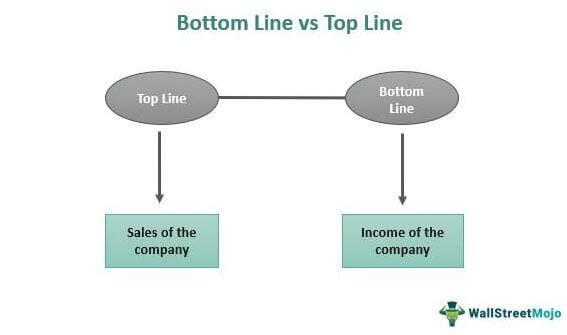

The landscape of financial performance analysis is multifaceted, encompassing various metrics essential for understanding a company's health and potential. Among these metrics, top-line growth and bottom-line growth are critical indicators frequently examined by investors and analysts to assess company performance.

Top-line growth, often regarded as a measure of a company's revenue generation capabilities, provides insight into the effectiveness of its sales strategies and market reach. It serves as an indicator of a company's ability to attract and retain customers through successful marketing campaigns, new product launches, or strategic acquisitions. Conversely, bottom-line growth reflects a company's profitability by measuring net income after all expenses, taxes, and costs are deducted from revenue. This growth is pivotal for understanding the financial efficiency and cost management strategies implemented by the company.



The advent of algorithmic trading has introduced a new dimension to how financial growth strategies are executed and analyzed. Algorithmic trading employs complex algorithms to make trading decisions at speeds and frequencies beyond human capabilities. By optimizing trade strategies, reducing transaction costs, and mitigating risks, algo trading can significantly enhance financial performance.

This article aims to explain the distinctions between top-line and bottom-line growth and explore the contributions of algorithmic trading to financial performance enhancement. By providing a comprehensive understanding of these concepts, we shed light on their implications for corporate strategy and underscore their importance for building competitive advantages in today's dynamic financial environment.

## Table of Contents

## Overview of Top-Line Growth

Top-line growth refers to an increase in a company's gross sales or revenue, serving as a direct indicator of its market reach and the effectiveness of its sales strategies. This growth can be attributed to several key factors, including successful marketing campaigns, new product launches, increased pricing, or strategic acquisitions.

1. **Marketing Campaigns**: Effective marketing strategies can significantly enhance a company's visibility and attractiveness to potential customers, leading to increased sales. This may involve targeted advertising, promotions, or partnerships that expand the customer base.

2. **New Product Launches**: Introducing new products or services can create additional revenue streams. Companies often research market demands to innovate and capitalize on unmet needs, thus driving sales growth.

3. **Increased Pricing**: Companies may opt to increase the prices of their existing products or services, provided that the market demand is price inelastic. This strategy can lead to higher revenue, assuming the sales volume remains stable.

4. **Strategic Acquisitions**: Acquiring other companies can quickly expand a company's market share and customer base. Such acquisitions are pursued not only to enhance revenue but also to leverage synergies between companies, potentially opening new channels for growth.

Top-line growth effectively captures how well a company can attract and retain its customers. However, it does not account for components related to cost efficiency. For instance, a company may experience significant top-line growth due to increased sales, but this could be offset by higher marketing or production costs, affecting overall profitability.

Examples of companies achieving top-line growth are often seen in those expanding into new markets or diversifying their product lines. For example, a company like Amazon has continuously increased its revenue by entering international markets and diversifying its product offerings beyond [books](/wiki/algo-trading-books) to include electronics, clothing, and digital streaming services. Similarly, firms that diversify into related industries can drive top-line growth by building on existing capabilities and reaching broader audience segments.

Top-line growth is a critical component of financial performance analysis, providing valuable insights into the company's ability to drive sales and expand its market presence. However, comprehensive assessments of financial health must consider both top-line and, importantly, bottom-line factors to provide a complete picture of corporate performance.

## Understanding Bottom-Line Growth

Bottom-line growth represents the net income or profit a company earns after deducting all associated expenses, taxes, and costs from its revenue. This metric is a crucial indicator of a company's profitability and operational efficiency. Net income is calculated as follows:

$$
\text{Net Income} = \text{Revenue} - \text{Expenses} - \text{Taxes} - \text{Costs}
$$

Management often prioritizes enhancing bottom-line growth by implementing strategies aimed at cost reduction and improved operational efficiency. Key approaches include cost-cutting measures, which may involve downsizing or reallocating resources to optimize the use of inputs and enhance production processes. This often leads to increased profit margins by reducing unnecessary expenditure.

Improving production efficiency is another essential strategy that involves optimal utilization of technology and resources to enhance output without proportionally increasing costs. Companies may invest in automation and advanced technology to streamline processes and reduce labor costs, thereby contributing to bottom-line growth.

Optimizing supply chains also plays a significant role in enhancing profit margins. By negotiating better terms with suppliers and reducing bottlenecks in the supply process, companies can decrease the cost of goods sold, thus boosting the net income.

A robust bottom line is crucial for sustaining a company’s profitability over the long term. It enables corporations to provide returns to shareholders in the form of dividends or stock buybacks, enhancing investor confidence and supporting share price growth. This financial health is necessary for companies to invest in future growth opportunities and maintain competitive advantage in the market.

## Top-Line vs. Bottom-Line Growth: Key Differences

The top line and bottom line represent fundamental aspects of a company's financial performance. However, they highlight different facets. The top line refers to the gross revenue and serves as an indicator of revenue generation and market engagement. Essentially, it reflects how successfully a company can attract customers and expand its market presence. Companies typically prioritize top-line growth when aiming to increase their market share and improve consumer engagement. Strategies for top-line expansion include entering new markets, launching new products, or increasing marketing efforts to boost sales.

On the other hand, the bottom line indicates the net income or profit, calculated by subtracting all expenses, including operating costs, taxes, interest, and other liabilities, from total revenue. This metric reveals the company's profitability and highlights its efficiency in managing costs and resources. Bottom-line growth primarily showcases a company's financial health, focusing on strategies like cost management and operational efficiency. Techniques such as streamlining operations, reducing waste, and improving supply chain logistics are essential to enhancing the bottom line.

While top-line growth is necessary for gaining market traction, bottom-line growth ensures sustainability and profitability by focusing on efficiency and expense management. Both types of growth are crucial for a company’s long-term success as they provide different perspectives on financial performance. Balancing revenue generation with cost control is key to maximizing profitability and achieving a competitive edge in the marketplace.

## The Role of Algo Trading in Financial Performance

Algorithmic trading, or algo trading, has transformed financial markets by utilizing computer algorithms to execute orders rapidly and efficiently at speeds unattainable by human traders. This trading method has significantly influenced financial performance and strategic planning within firms. 

Algo trading enhances financial performance by optimizing trade strategies through precise and rapid order executions. Algorithms can analyze complex datasets and patterns to make informed decisions about the timing, price, and quantity of trades. This ability increases trading success probabilities and ensures that trades are executed at optimal conditions. For example, statistical [arbitrage](/wiki/arbitrage) strategies analyze price discrepancies across different markets or assets, enabling capitalizing on transient market inefficiencies.

A critical advantage of [algorithmic trading](/wiki/algorithmic-trading) is the reduction in transaction costs. By automating the trading process, firms can minimize human errors and inefficiencies associated with manual trading. This cost efficiency is achieved through strategies like [market making](/wiki/market-making), where algorithms provide [liquidity](/wiki/liquidity-risk-premium) to the market by continuously placing buy and sell orders, [earning](/wiki/earning-announcement) the bid-ask spread as profit.

Risk mitigation is another area where algo trading demonstrates substantial benefits. Algorithms can continuously monitor market conditions and adjust trading strategies in real-time, enabling firms to quickly respond to [volatility](/wiki/volatility-trading-strategies) and unforeseen market events. An example includes the use of dynamic hedging strategies, where options pricing models are employed to protect against adverse price movements in underlying assets.

To effectively leverage algo trading, companies require sophisticated technology infrastructure and advanced analytics capabilities. Efficient financial data management and processing are vital, given the massive volumes of data involved. For instance, firms utilize [machine learning](/wiki/machine-learning) models to predict asset price movements based on historical data patterns. Below is a simple example of implementing a basic algorithmic trading strategy using Python:

```python
import pandas as pd
import numpy as np

# Load financial data
data = pd.read_csv('financial_data.csv')

# Calculate moving averages
short_window = 40
long_window = 100

signals = pd.DataFrame(index=data.index)
signals['price'] = data['Close']
signals['short_mavg'] = data['Close'].rolling(window=short_window, min_periods=1, center=False).mean()
signals['long_mavg'] = data['Close'].rolling(window=long_window, min_periods=1, center=False).mean()

# Generate signals
signals['signal'] = 0.0
signals['signal'][short_window:] = np.where(signals['short_mavg'][short_window:] > signals['long_mavg'][short_window:], 1.0, 0.0)
signals['positions'] = signals['signal'].diff()

print(signals.head())
```

This code calculates two moving averages of asset prices and generates buy/sell signals based on their crossovers, demonstrating a fundamental strategy used in algorithmic trading named Moving Average Crossover.

In conclusion, algorithmic trading has become a cornerstone in enhancing financial performance, offering substantial advantages through optimized strategies, reduced costs, and robust risk management. The strategic use of algorithms continues to provide firms with a competitive edge in the dynamic financial markets.

## Case Studies: Application of Growth Strategies and Algo Trading

Amazon and Apple, as global industry powerhouses, have consistently demonstrated robust top-line and bottom-line growth by implementing distinctive strategies tailored to their respective market environments. 

### Amazon: Market Expansion and Product Diversification

Amazon's revenue growth has been significantly propelled through strategic market expansion and product diversification. The company has continually penetrated new geographic markets, such as India and parts of Southeast Asia, capitalizing on the digital commerce boom. Amazon's approach to expanding its footprint includes tailoring its offerings to suit local preferences and economic conditions, which enhances customer acquisition and retention. 

Moreover, product diversification has played a pivotal role in Amazon's top-line growth. Beyond its traditional e-commerce platform, Amazon has invested in a wide array of businesses, including cloud computing with Amazon Web Services (AWS), digital streaming with Prime Video, and smart devices with products like the Amazon Echo. Each of these ventures not only creates new revenue streams but also reinforces the core marketplace by drawing a larger customer base and increasing overall consumer engagement. This strategy reflects a multiplying effect on revenue generation, where various segments contribute synergistically to the company's top-line results.

### Apple: Innovation and Supply Chain Efficiency

Apple's focus on innovation, alongside rigorous supply chain efficiency, underscores its continued profitability and strong bottom-line growth. Innovation is at the heart of Apple’s strategy, as evidenced by its consistent release of groundbreaking products such as the iPhone, iPad, and Apple Watch. By prioritizing high-quality, user-centric design and integrating cutting-edge technology, Apple cultivates a loyal customer base willing to pay premium prices for its products, thereby enhancing its profit margins.

Furthermore, Apple's supply chain management exemplifies efficiency and scalability, crucial for maintaining profitability. The company employs strategies such as just-in-time inventory management, strategic supplier partnerships, and an emphasis on cost-effective manufacturing practices. These strategies minimize costs and improve operational efficiency, enabling Apple to sustain high profit margins. Additionally, Apple's ability to scale production quickly in response to demand fluctuations helps mitigate risks associated with inventory surplus or deficit, ensuring streamlined operations and reduced wastage.

### Algorithmic Trading: Enhancing Financial Performance

Algorithmic trading offers companies a sophisticated method to fine-tune financial performance and manage investment portfolios with precision. Enterprises employing algo trading utilize advanced mathematical models and data analytics to execute trades at optimal times, maximizing returns and minimizing risks. By automating trading decisions based on real-time market data, algo trading can reduce transaction costs and improve liquidity management.

A notable example of successful algo trading implementation is seen in large financial institutions and hedge funds, which deploy these systems to manage extensive portfolios and achieve superior returns. These institutions employ complex algorithms that [factor](/wiki/factor-investing) in diverse variables such as market volatility, historical price patterns, and predicted economic changes, allowing them to swiftly adapt to market trends and exploit temporary inefficiencies. 

Companies that integrate algo trading with their financial strategies benefit from enhanced decision-making agility and a competitive edge in financial markets. The ongoing evolution in machine learning and data processing technologies continues to refine these algorithms, offering even greater accuracy and efficiency in trade execution.

## Conclusion

Understanding the nuances of top-line and bottom-line growth is essential for investors and corporate decision-makers. These metrics provide critical insights into a company's market performance and operational efficiency. Balancing these growth strategies is crucial for maximizing shareholder value.

Integrating algorithmic trading capabilities with traditional growth strategies can significantly enhance a company's financial performance and competitive advantage. Algorithmic trading, with its ability to execute trades swiftly and efficiently, allows companies to exploit market opportunities and optimize trading strategies in real time. By minimizing transaction costs and mitigating risks, algorithmic trading contributes to more effective financial management.

Companies should aim to balance revenue generation and cost management to achieve sustainable growth. A company's ability to expand its revenue base while maintaining rigorous cost controls ensures profitability and long-term viability. This balance not only maximizes shareholder value but also provides the foundation for strategic and financial agility.

Navigating the complex financial landscape requires continuous adaptation. Companies must remain attuned to market trends, regulatory changes, and technological advancements. Leveraging cutting-edge technology, like advanced data analytics and automation, provides a strategic advantage, enabling companies to respond dynamically to evolving conditions.

In summary, understanding the distinctions and interplay between top-line and bottom-line growth, when aligned with algorithmic trading strategies, offers a comprehensive approach to enhancing financial performance. These efforts are vital for sustaining a competitive edge in today's fast-paced and ever-changing financial environment.

## References & Further Reading

[1]: Bergstra, J., Bardenet, R., Bengio, Y., & Kégl, B. (2011). ["Algorithms for Hyper-Parameter Optimization."](https://papers.nips.cc/paper/4443-algorithms-for-hyper-parameter-optimization) Advances in Neural Information Processing Systems 24.

[2]: ["Advances in Financial Machine Learning"](https://www.amazon.com/Advances-Financial-Machine-Learning-Marcos/dp/1119482089) by Marcos Lopez de Prado

[3]: ["Evidence-Based Technical Analysis: Applying the Scientific Method and Statistical Inference to Trading Signals"](https://www.amazon.com/Evidence-Based-Technical-Analysis-Scientific-Statistical/dp/0470008741) by David Aronson

[4]: ["Machine Learning for Algorithmic Trading"](https://github.com/stefan-jansen/machine-learning-for-trading) by Stefan Jansen

[5]: ["Quantitative Trading: How to Build Your Own Algorithmic Trading Business"](https://www.amazon.com/Quantitative-Trading-Build-Algorithmic-Business/dp/1119800064) by Ernest P. Chan