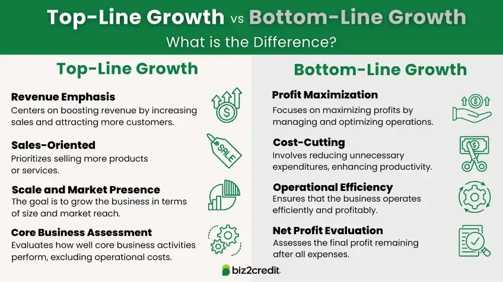

## Table of Contents

## What is bottom-line growth?

Bottom-line growth refers to the increase in a company's net income or profit over time. It's called the "bottom line" because it's the last number on a company's income statement, showing what remains after all expenses, taxes, and costs have been subtracted from total revenue. When a company experiences bottom-line growth, it means they are making more money than they were before, which is a sign of financial health and success.

This growth can come from various strategies, such as increasing sales, reducing costs, or improving efficiency. For example, a company might launch a new product that becomes popular, leading to higher sales and, in turn, higher profits. Alternatively, they might find ways to cut down on production costs, which would also boost their bottom line. Ultimately, bottom-line growth is important because it shows that a company is not just growing in size, but also becoming more profitable.

## What is top-line growth?

Top-line growth is about making more money from sales. It's called "top line" because it's the first number you see on a company's income statement, showing how much money the company made from selling its products or services. When a company has top-line growth, it means they are selling more than they did before. This can happen if they get more customers, sell more to existing customers, or raise their prices.

Top-line growth is important because it shows that a company is getting bigger. But, it doesn't tell the whole story. Just because a company is selling more doesn't mean they are making more profit. They might have higher costs or other expenses that eat into their profits. So, while top-line growth is good, it's also important to look at the bottom line to see if the company is really doing better.

## How do you calculate bottom-line growth?

To calculate bottom-line growth, you need to know the net income of a company for two different time periods, like two years in a row. First, find out the net income for the more recent year. Then, find out the net income for the earlier year. Subtract the earlier year's net income from the more recent year's net income. This gives you the increase in net income. To find the percentage of growth, divide this increase by the earlier year's net income and then multiply by 100.

For example, if a company had a net income of $100,000 last year and $120,000 this year, the increase in net income would be $120,000 - $100,000 = $20,000. To find the percentage growth, you would divide $20,000 by $100,000, which equals 0.2. Multiply 0.2 by 100 to get a 20% bottom-line growth. This means the company's profit grew by 20% from last year to this year.

## How do you calculate top-line growth?

To calculate top-line growth, you need to know the total revenue of a company for two different time periods, like two years in a row. First, find out the total revenue for the more recent year. Then, find out the total revenue for the earlier year. Subtract the earlier year's total revenue from the more recent year's total revenue. This gives you the increase in revenue. To find the percentage of growth, divide this increase by the earlier year's total revenue and then multiply by 100.

For example, if a company had total revenue of $500,000 last year and $600,000 this year, the increase in revenue would be $600,000 - $500,000 = $100,000. To find the percentage growth, you would divide $100,000 by $500,000, which equals 0.2. Multiply 0.2 by 100 to get a 20% top-line growth. This means the company's sales grew by 20% from last year to this year.

## Why is bottom-line growth important for a business?

Bottom-line growth is important for a business because it shows that the company is making more profit. When a business's bottom line grows, it means they have more money left after paying all their costs. This extra money can be used to grow the business, like opening new stores or making new products. It can also be used to pay back loans, invest in new technology, or even give more money back to the owners or shareholders. A growing bottom line is a sign that the business is doing well and is on a healthy financial path.

Another reason bottom-line growth is important is that it helps a business stay strong during tough times. If the economy goes bad or if there are unexpected costs, a company with a strong bottom line can handle these challenges better. They have more money saved up to cover these costs without hurting their operations. This financial stability makes the business more attractive to investors and lenders, who are more likely to support a company that is making more profit. In short, bottom-line growth not only shows current success but also builds a foundation for future stability and growth.

## Why is top-line growth important for a business?

Top-line growth is important for a business because it shows that the company is selling more of its products or services. When a company's top line grows, it means they are making more money from sales. This is a good sign because it shows that more people want what the company is offering. It could mean the company is getting more customers, selling more to the customers they already have, or raising their prices. All of these things help the company make more money.

Having top-line growth is also important because it can lead to other good things for the business. When a company sells more, they might be able to buy things in bigger amounts, which can save them money. They might also be able to spend more on advertising or new products, which can help them keep growing. Even though top-line growth doesn't always mean the company is making more profit right away, it's a key part of building a successful business over time.

## Can a company have high top-line growth but low bottom-line growth? Why?

Yes, a company can have high top-line growth but low bottom-line growth. This happens when the company is selling more products or services, but the costs of making or selling those products are going up a lot too. For example, if a company has to pay more for the materials they use to make their products, or if they have to spend a lot more on advertising to get those extra sales, their profits might not grow as much as their sales.

Another reason this can happen is if the company is selling more but at lower prices. Sometimes, to get more customers, a company might lower their prices. This can lead to higher sales, but if the price is too low, the company might not make much more profit. So, even though the top line looks good because they are selling more, the bottom line might not grow as much because the profit per sale is smaller.

## How do different industries prioritize bottom-line versus top-line growth?

Different industries prioritize bottom-line and top-line growth in different ways based on what's important for their business. For example, tech companies often focus a lot on top-line growth. They want to grow their sales fast because they think this will help them become leaders in their market. They might spend a lot of money to get more customers, even if it means their profits don't grow as fast. They believe that if they can get big fast, they'll make a lot of money in the future.

On the other hand, industries like manufacturing or retail might focus more on bottom-line growth. These businesses often have tight profit margins, so they need to make sure they are making a good profit on every sale. They might work hard to keep their costs down and make sure every product they sell makes them money. For them, growing profits is more important than just growing sales because it helps them stay stable and successful over time.

## What strategies can a company use to improve its bottom-line growth?

A company can improve its bottom-line growth by finding ways to make more money from each sale. One way to do this is by raising prices if customers are willing to pay more. Another way is by selling more to the customers they already have, like offering them new products or services that go well with what they already buy. They can also try to get new customers, but they need to make sure it doesn't cost too much to get these new customers. If a company can make more money from each sale without spending a lot more, their profits will go up.

Another strategy is to cut costs. This can mean finding cheaper ways to make their products, like using less expensive materials or finding a new supplier that charges less. It can also mean spending less on things like rent, utilities, or advertising. Sometimes, companies can make their operations more efficient, like using machines or technology to do work faster and with fewer mistakes. When a company can make their products or services for less money, they keep more of the money they make from sales, which helps their bottom line grow.

Balancing these strategies is key. A company needs to think about how raising prices or cutting costs might affect their customers. If prices go up too much, customers might buy less or go to a different company. If costs are cut too much, the quality of the product or service might go down, and customers might not be happy. So, a company needs to find the right balance to make sure they are making more profit without losing customers.

## What strategies can a company use to improve its top-line growth?

A company can improve its top-line growth by finding ways to sell more of its products or services. One way to do this is by getting more customers. They can do this by advertising more, offering special deals, or expanding to new places where people might want to buy their products. Another way is by selling more to the customers they already have. This can mean offering new products that go well with what they already sell or making it easier for customers to buy more, like with loyalty programs or bundle deals. If a company can increase the number of sales, their top line will grow.

Another strategy is to raise prices. If customers are willing to pay more for the products or services, the company can make more money from each sale. But they need to be careful because if prices go up too much, customers might buy less or go to a different company. So, it's important to find the right balance. Sometimes, companies can also improve their top line by making their products or services better or different from what others offer. This can attract more customers and help the company stand out in the market, leading to more sales and a higher top line.

## How do economic conditions affect the focus on bottom-line versus top-line growth?

Economic conditions can change how a company thinks about growing its top line or bottom line. In good times, when people have more money to spend, companies might focus more on top-line growth. They might try to sell more by advertising a lot or offering new products. They think that if they can get more sales now, they will make more profit later. But in bad times, when people are not spending as much, companies might focus more on their bottom line. They might try to cut costs and make sure they are making a profit on every sale, even if they are not selling as much.

During a recession, companies often look at their bottom line more closely. They want to make sure they can still make money even if sales are down. They might cut back on spending, like reducing staff or finding cheaper ways to make their products. This helps them stay strong and keep going until the economy gets better. On the other hand, in a booming economy, companies might be more willing to spend money to grow their top line. They might invest in new stores, new products, or more advertising to get more customers and increase sales.

## What are the long-term implications of focusing solely on either bottom-line or top-line growth?

Focusing only on bottom-line growth can help a company stay strong and make more profit in the short term. By cutting costs and making sure every sale makes money, a company can keep going even when times are tough. But if a company only thinks about the bottom line, they might miss out on chances to grow bigger. They might not spend enough on new products or advertising to get more customers. Over time, this can make the company smaller and less able to compete with others. It's like saving money but not investing in the future.

On the other hand, focusing only on top-line growth can make a company bigger and more well-known. By selling more and getting more customers, a company can become a leader in its market. But if a company only thinks about the top line, they might spend too much money trying to grow. They might not make enough profit on each sale, and if they can't keep growing, they could run into money problems. It's like trying to grow fast without making sure you have enough money to keep going. In the long run, a company needs to find a balance between growing sales and making profits to stay healthy and successful.

## What is Understanding Bottom-Line Growth?

Bottom-line growth represents the net income or profit a company earns after deducting all associated expenses, taxes, and costs from its revenue. This metric is a crucial indicator of a company's profitability and operational efficiency. Net income is calculated as follows:

$$
\text{Net Income} = \text{Revenue} - \text{Expenses} - \text{Taxes} - \text{Costs}
$$

Management often prioritizes enhancing bottom-line growth by implementing strategies aimed at cost reduction and improved operational efficiency. Key approaches include cost-cutting measures, which may involve downsizing or reallocating resources to optimize the use of inputs and enhance production processes. This often leads to increased profit margins by reducing unnecessary expenditure.

Improving production efficiency is another essential strategy that involves optimal utilization of technology and resources to enhance output without proportionally increasing costs. Companies may invest in automation and advanced technology to streamline processes and reduce labor costs, thereby contributing to bottom-line growth.

Optimizing supply chains also plays a significant role in enhancing profit margins. By negotiating better terms with suppliers and reducing bottlenecks in the supply process, companies can decrease the cost of goods sold, thus boosting the net income.

A robust bottom line is crucial for sustaining a company’s profitability over the long term. It enables corporations to provide returns to shareholders in the form of dividends or stock buybacks, enhancing investor confidence and supporting share price growth. This financial health is necessary for companies to invest in future growth opportunities and maintain competitive advantage in the market.

## References & Further Reading

[1]: Bergstra, J., Bardenet, R., Bengio, Y., & Kégl, B. (2011). ["Algorithms for Hyper-Parameter Optimization."](https://papers.nips.cc/paper/4443-algorithms-for-hyper-parameter-optimization) Advances in Neural Information Processing Systems 24.

[2]: ["Advances in Financial Machine Learning"](https://www.amazon.com/Advances-Financial-Machine-Learning-Marcos/dp/1119482089) by Marcos Lopez de Prado

[3]: ["Evidence-Based Technical Analysis: Applying the Scientific Method and Statistical Inference to Trading Signals"](https://www.amazon.com/Evidence-Based-Technical-Analysis-Scientific-Statistical/dp/0470008741) by David Aronson

[4]: ["Machine Learning for Algorithmic Trading"](https://github.com/stefan-jansen/machine-learning-for-trading) by Stefan Jansen

[5]: ["Quantitative Trading: How to Build Your Own Algorithmic Trading Business"](https://www.amazon.com/Quantitative-Trading-Build-Algorithmic-Business/dp/1119800064) by Ernest P. Chan