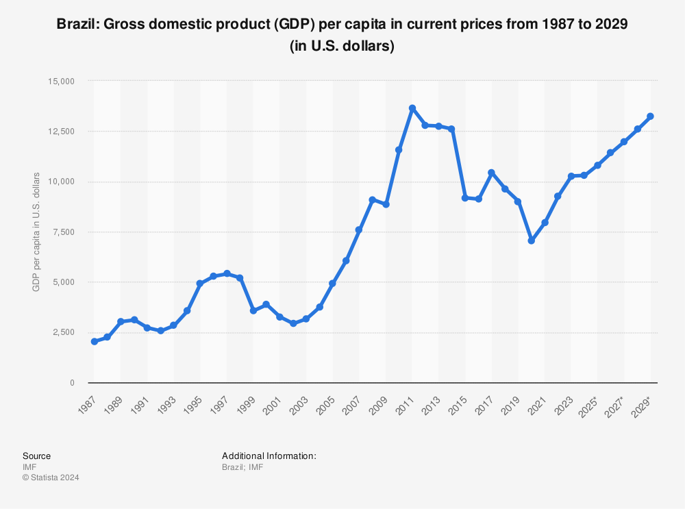

## Table of Contents

## What is GDP and how is it calculated?

GDP, or Gross Domestic Product, is the total value of all goods and services produced within a country's borders in a specific time period, usually a year. It's like adding up everything that people buy, from cars and food to haircuts and movies, to see how much the country's economy is worth. GDP helps us understand how well a country's economy is doing and how it's growing over time.

To calculate GDP, economists use one of three main methods. The first method is the production approach, where they add up the value of all goods and services produced by different industries. The second method is the income approach, where they add up all the income earned by people and businesses, like wages, profits, and taxes. The third method is the expenditure approach, where they add up all the spending by households, businesses, and the government on goods and services. All these methods should give the same total GDP, but they look at it from different angles.

## What is GDP per capita and why is it important?

GDP per capita is a way to measure how much money a country makes for each person living there. It's calculated by taking the total GDP of a country and dividing it by the number of people who live there. So, if a country has a GDP of $1 trillion and 100 million people, the GDP per capita would be $10,000 per person. This number helps us understand the average wealth or income of people in that country.

GDP per capita is important because it gives us a better idea of how well-off people are in a country. Just looking at the total GDP doesn't tell us much about individual lives. For example, a country might have a high GDP, but if it has a lot of people, the GDP per capita might be lower, meaning people might not be as rich as the total GDP suggests. By comparing GDP per capita across different countries, we can see which countries have higher living standards and which ones might need more help to improve the lives of their citizens.

## What are the current GDP figures for Brazil?

Brazil's GDP for the year 2022 was about $1.6 trillion. This number tells us how much money was made from all the things people bought and sold in Brazil that year. It's a big number because Brazil is a big country with a lot of people and a lot of businesses.

GDP per capita for Brazil in 2022 was around $7,500. This means that if you divided all the money made in Brazil by the number of people living there, each person would get about $7,500. This helps us see how rich or poor people in Brazil are on average. It's useful to compare this number with other countries to see how Brazil is doing compared to them.

## How has Brazil's GDP changed over the past decade?

Over the past decade, Brazil's GDP has gone through some ups and downs. In 2013, Brazil's GDP was around $2.2 trillion, but then it started to fall. By 2016, it had dropped to about $1.8 trillion because of a big economic crisis. Things got better after that, and by 2020, the GDP was back up to about $1.4 trillion. But then, the COVID-19 pandemic hit, and the GDP fell again to around $1.3 trillion in 2020. Since then, it's been slowly climbing back up, reaching about $1.6 trillion in 2022.

When we look at GDP per capita, the story is similar but tells us more about how much money each person in Brazil had over the years. In 2013, the GDP per capita was about $11,000, but by 2016, it had dropped to around $8,700 because of the economic crisis. It started to recover, reaching about $6,700 in 2020, but the pandemic caused it to dip again. By 2022, the GDP per capita had climbed back to around $7,500. These numbers show that while Brazil's economy has been growing again, the average wealth per person is still below what it was a decade ago.

## What are the current GDP per capita figures for Brazil?

Brazil's GDP per capita for the year 2022 was around $7,500. This number tells us how much money each person in Brazil would get if we divided all the money made in the country by the number of people living there. It's a way to see how rich or poor people in Brazil are on average.

This number is important because it helps us understand how well people in Brazil are doing compared to people in other countries. For example, if another country has a higher GDP per capita, it might mean that people there have more money to spend on things they need and want. By looking at Brazil's GDP per capita, we can see that while the country's economy is growing, the average wealth per person is still not as high as it was a few years ago.

## How does Brazil's GDP per capita compare to other countries in Latin America?

Brazil's GDP per capita in 2022 was about $7,500. This number is in the middle when you compare it to other countries in Latin America. For example, countries like Chile and Uruguay have higher GDP per capita, with Chile around $16,000 and Uruguay around $15,000. These countries are doing better in terms of how much money each person has on average.

On the other hand, some countries in Latin America have lower GDP per capita than Brazil. For example, Bolivia has a GDP per capita of around $3,500, and Honduras is even lower at about $2,500. This means that people in these countries have less money on average than people in Brazil. So, while Brazil's GDP per capita is not the highest in the region, it's still better than many of its neighbors.

## What are the main sectors contributing to Brazil's GDP?

The main sectors that help make up Brazil's GDP are agriculture, industry, and services. Agriculture is really important because Brazil grows a lot of stuff like soybeans, beef, and coffee. These products are sold all over the world, bringing in a lot of money. Industry is also big, with things like mining, oil, and making cars and airplanes. Brazil has lots of natural resources that help these industries grow.

Services are the biggest part of Brazil's economy. This includes things like banking, shopping, and tourism. People in Brazil spend a lot of money on these services, which helps the economy grow. Even though agriculture and industry are important, it's the service sector that makes the most money for Brazil's GDP.

## How do regional disparities within Brazil affect its GDP and GDP per capita?

Regional disparities within Brazil have a big impact on its GDP and GDP per capita. Some parts of Brazil, like the Southeast, are richer and have more businesses and industries. This means they contribute more to the country's total GDP. Cities like São Paulo and Rio de Janeiro have lots of factories, offices, and shops, so they make a lot of money. On the other hand, regions like the Northeast and parts of the North are poorer and have fewer jobs and businesses. This means they don't add as much to Brazil's GDP.

These differences also affect GDP per capita. In richer regions, people have more money on average, so the GDP per capita is higher. For example, in the Southeast, the GDP per capita might be much higher than the national average. But in the Northeast, where people have less money, the GDP per capita is lower. This shows that even though Brazil's total GDP might be growing, not everyone in the country is getting richer at the same rate. The gaps between rich and poor regions can make it harder for the whole country to grow and develop evenly.

## What economic policies have influenced Brazil's GDP growth in recent years?

In recent years, Brazil's GDP growth has been influenced by different economic policies. One big policy was the "New Fiscal Regime" started in 2016. This policy was all about controlling how much the government spends and making sure they don't spend more than they have. By keeping spending under control, the government hoped to make the economy more stable and help businesses grow. This helped Brazil's GDP start to recover after a big drop in 2015 and 2016.

Another important policy was the "Plano Safra" which helps farmers. This plan gives farmers loans and other help to grow more food and sell it around the world. Since agriculture is a big part of Brazil's economy, helping farmers has a big impact on GDP growth. Also, the government has been trying to make it easier for businesses to start and grow by cutting taxes and making rules simpler. These policies have helped Brazil's economy grow a bit, but there are still challenges because of things like the COVID-19 pandemic and global economic changes.

## How do inflation and currency value impact Brazil's GDP and GDP per capita?

Inflation and the value of Brazil's currency, the real, can have a big impact on the country's GDP and GDP per capita. When inflation goes up, it means that the prices of things like food, clothes, and services are getting higher. This can make it harder for people to buy what they need, which can slow down the economy. If people are spending less, businesses might sell less and make less money, which can lower the GDP. Also, if inflation is high, it can make the value of the real go down compared to other countries' money. This can make it more expensive for Brazil to buy things from other countries, which can also hurt the economy.

The value of the real can also affect GDP and GDP per capita in other ways. If the real gets weaker, it can be good for some parts of the economy like exports. When the real is weaker, things made in Brazil become cheaper for people in other countries to buy. This can help businesses that sell things abroad, like farmers and manufacturers, to make more money and boost GDP. But a weaker real can also make it more expensive for Brazil to import things it needs, like machines and technology, which can slow down growth. So, the balance between inflation and the value of the real is really important for how well Brazil's economy does and how much money each person in the country has on average.

## What are the projections for Brazil's GDP and GDP per capita in the next five years?

Over the next five years, experts think that Brazil's GDP will keep growing but not super fast. They guess it might grow by about 2% to 3% each year. This growth will come from more people buying things, businesses doing better, and the government spending money on big projects. But, there are things that could make it harder for Brazil to grow, like problems with money from other countries or if the world's economy gets worse. So, while Brazil's GDP is expected to get bigger, it's not going to jump up really quickly.

For GDP per capita, the story is a bit different. If Brazil's population keeps growing, the extra money from GDP growth might not make each person much richer. Experts think that GDP per capita might go up by about $200 to $300 each year. This means that over five years, each person in Brazil might have around $1,000 to $1,500 more on average. But, this depends a lot on how well the economy does and if the government can help people in poorer areas get richer too. So, while things are expected to get a bit better for people in Brazil, it will be a slow climb.

## How do international trade and global economic conditions affect Brazil's GDP and GDP per capita?

International trade and global economic conditions have a big impact on Brazil's GDP and GDP per capita. When Brazil sells things like soybeans, beef, and iron ore to other countries, it brings in a lot of money. If the world wants more of these things, Brazil's economy can grow faster because it makes more money from selling them. But if other countries start buying less, Brazil's GDP can go down because it's not making as much money from trade. Also, if the world's economy is doing well, more countries might buy things from Brazil, which helps the GDP grow. But if there's a global economic crisis, like what happened during the COVID-19 pandemic, Brazil's GDP can drop because fewer people around the world are buying things.

Global economic conditions also affect how much each person in Brazil has, which is the GDP per capita. If Brazil's economy is growing because of good trade, the extra money can help people get richer. But if the world's economy is struggling, Brazil's GDP per capita might not go up as much or could even go down. Things like the value of the Brazilian real compared to other countries' money also matter. If the real gets weaker, it can help Brazil sell more things abroad, but it can also make it more expensive to buy things from other countries, which can affect how much money each person has. So, what happens in the rest of the world can really change how well people in Brazil are doing.

## What is the understanding of GDP and GDP Per Capita?

Gross Domestic Product (GDP) is a critical metric used to evaluate the economic performance of a country. It represents the total monetary value of all goods and services produced within a nation's borders over a specific period, typically annually or quarterly. GDP is instrumental in providing a comprehensive overview of a nation's economic health, influencing government policy, investment decisions, and economic planning. A high GDP typically indicates a prosperous economy with robust industrial, service, and agricultural sectors. There are three main methods to calculate GDP: 

1. **Production Approach**: This method estimates GDP by adding the value of all final goods and services produced, subtracting the value of intermediate goods to avoid double counting.

2. **Income Approach**: Here, GDP is calculated by summing total compensation to employees, gross profits for incorporated and non-incorporated firms, and taxes less subsidies on production and imports.

3. **Expenditure Approach**: This is the most common method, calculated as:
$$
   \text{GDP} = C + I + G + (X - M)

$$
   where $C$ is consumer spending, $I$ is investment by businesses and households, $G$ is government spending, and $(X - M)$ is net exports (exports minus imports).

While GDP offers a snapshot of economic dynamism, it doesn't account for population size. This limitation is addressed through GDP per capita, which divides the GDP by the total population, providing insights into the average economic output per person. The formula for GDP per capita is:

$$
\text{GDP per capita} = \frac{\text{GDP}}{\text{Population}}
$$

GDP per capita is crucial in assessing the average income and standard of living within a country. High GDP per capita suggests that the country not only produces a significant value of goods and services but also that the benefits of economic production are available to more individuals within the population. It is essential in evaluating economic well-being and comparing wealth distribution across different nations and periods.

The significance of GDP per capita becomes evident when compared to GDP. While GDP measures the overall economic activity, GDP per capita provides a more detailed view of individual prosperity and helps identify income disparities. For instance, a country with a high GDP but a large population might have a lower GDP per capita, indicating potential challenges in wealth distribution and standard of living. Conversely, a nation with a modest GDP but a smaller population might boast a higher GDP per capita, reflecting more equal distribution of economic resources and potentially higher living standards.

In conclusion, both GDP and GDP per capita serve as fundamental tools in economic analysis. They offer different, yet complementary perspectives on economic performance. Policymakers, economists, and investors rely on these metrics to shape economic strategies, address socio-economic challenges, and foster sustainable growth.

## References & Further Reading

[1]: ["OECD Economic Surveys: Brazil 2020"](https://www.oecd.org/en/publications/oecd-economic-surveys-brazil-2020_250240ad-en.html), OECD Publishing. This report provides a comprehensive overview of Brazil's economic performance, including GDP and structural challenges.

[2]: ["The Brazilian Economy: Growth and Development"](https://books.google.com/books/about/The_Brazilian_Economy.html?id=Vq_2EAAAQBAJ) by Werner Baer. A detailed exploration of Brazil's economic history, including the role of primary sectors in GDP.

[3]: Williamson, P. J., & Zeng, M. (2009). ["Value-for-Money Strategies for Recessionary Times: Winning in Emerging Markets"](https://hbr.org/2009/03/value-for-money-strategies-for-recessionary-times), Harvard Business Review. This article discusses economic strategies in emerging markets like Brazil.

[4]: ["Trading and Exchanges: Market Microstructure for Practitioners"](https://www.amazon.com/Trading-Exchanges-Market-Microstructure-Practitioners/dp/0195144708) by Larry Harris. Useful for understanding the role of algorithmic trading in financial markets.

[5]: Menezes, R. L., & Santos, P. (2021). ["Algorithmic Trading in Brazil: A Market Efficiency Perspective"](https://pubmed.ncbi.nlm.nih.gov/33974019/), Journal of Economic Interaction and Coordination. This paper examines the impact of algorithmic trading on Brazilian market efficiency.