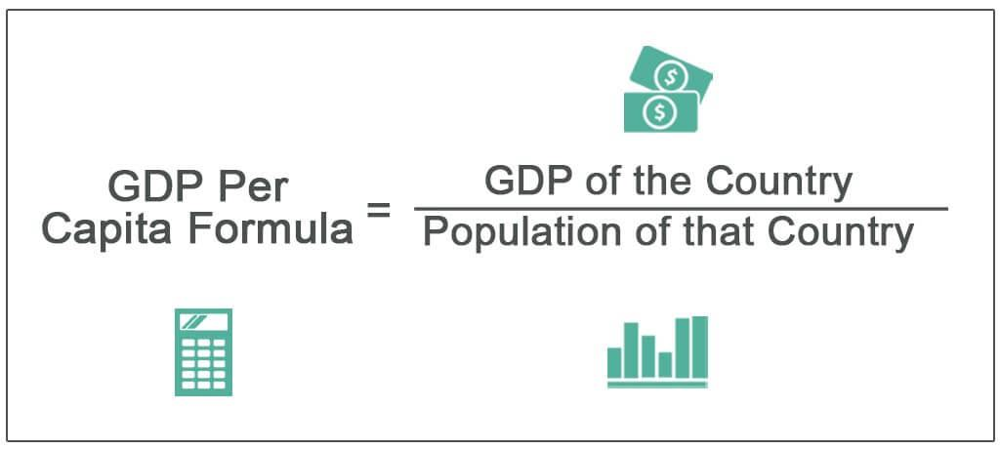

The Brazilian economy stands as a dominant force in South America, regularly securing a position among the globe's largest economies. Its influence is not merely regional but extends to substantial participation on the world stage. Evaluating Brazil's economic prowess requires a fundamental understanding of Gross Domestic Product (GDP) and GDP per capita. GDP serves as an aggregate measure of a nation's total economic output and is critical for gauging economic health and growth. GDP per capita, on the other hand, divides the GDP by the population, providing insight into individual prosperity, and offering a tangible metric for the standard of living and wealth distribution within the country.

Analyzing Brazil's GDP allows for a comprehensive assessment of its economic sectors, which include agriculture, industry, and services. Furthermore, the integration of algorithmic trading within Brazil's financial markets highlights how modern technological advancements are becoming intertwined with traditional economic analyses. This article tackles the exploration of Brazil's GDP, dissects its main economic contributors, and scrutinizes the insertion of algorithmic trading in the broader financial playground. Readers will gain insights into Brazil's economic standing through crucial SEO keywords: 'GDP per capita Brazil economy GDP comparison algo trading'.

## Table of Contents

## Understanding GDP and GDP Per Capita

Gross Domestic Product (GDP) is a critical metric used to evaluate the economic performance of a country. It represents the total monetary value of all goods and services produced within a nation's borders over a specific period, typically annually or quarterly. GDP is instrumental in providing a comprehensive overview of a nation's economic health, influencing government policy, investment decisions, and economic planning. A high GDP typically indicates a prosperous economy with robust industrial, service, and agricultural sectors. There are three main methods to calculate GDP: 

1. **Production Approach**: This method estimates GDP by adding the value of all final goods and services produced, subtracting the value of intermediate goods to avoid double counting.

2. **Income Approach**: Here, GDP is calculated by summing total compensation to employees, gross profits for incorporated and non-incorporated firms, and taxes less subsidies on production and imports.

3. **Expenditure Approach**: This is the most common method, calculated as:
$$
   \text{GDP} = C + I + G + (X - M)

$$
   where $C$ is consumer spending, $I$ is investment by businesses and households, $G$ is government spending, and $(X - M)$ is net exports (exports minus imports).

While GDP offers a snapshot of economic dynamism, it doesn't account for population size. This limitation is addressed through GDP per capita, which divides the GDP by the total population, providing insights into the average economic output per person. The formula for GDP per capita is:

$$
\text{GDP per capita} = \frac{\text{GDP}}{\text{Population}}
$$

GDP per capita is crucial in assessing the average income and standard of living within a country. High GDP per capita suggests that the country not only produces a significant value of goods and services but also that the benefits of economic production are available to more individuals within the population. It is essential in evaluating economic well-being and comparing wealth distribution across different nations and periods.

The significance of GDP per capita becomes evident when compared to GDP. While GDP measures the overall economic activity, GDP per capita provides a more detailed view of individual prosperity and helps identify income disparities. For instance, a country with a high GDP but a large population might have a lower GDP per capita, indicating potential challenges in wealth distribution and standard of living. Conversely, a nation with a modest GDP but a smaller population might boast a higher GDP per capita, reflecting more equal distribution of economic resources and potentially higher living standards.

In conclusion, both GDP and GDP per capita serve as fundamental tools in economic analysis. They offer different, yet complementary perspectives on economic performance. Policymakers, economists, and investors rely on these metrics to shape economic strategies, address socio-economic challenges, and foster sustainable growth.

## Brazil's Economic Landscape

As of 2023, Brazil stands as a pivotal economic entity in South America, leveraging its diversified economic sectors to maintain a robust Gross Domestic Product (GDP). The Brazilian economy is chiefly bolstered by three primary sectors: agriculture, industry, and services.

### Key Economic Sectors

1. **Agriculture**: Brazil is one of the largest agricultural producers in the world, with vast lands dedicated to the cultivation of soybeans, sugarcane, coffee, and corn. In 2023, the agricultural sector continues to contribute significantly to the country's GDP, supported by advancements in agricultural technologies and sustainable practices.

2. **Industry**: The industrial sector, encompassing manufacturing, mining, and construction, plays a crucial role in Brazil's economy. The country is rich in natural resources, including iron ore and crude oil, positioning it as a prominent exporter. The manufacturing sub-sector, particularly in automotive and aerospace industries, is pivotal to the industrial output.

3. **Services**: The services sector is the largest contributor to Brazil's GDP, encompassing finance, telecommunications, and trade. The rise of digital services and fintech innovations has bolstered this sector's growth trajectory, positioning Brazil as a leader in South American service industries.

### Economic Statistics

In 2023, Brazil's GDP is estimated to be approximately $2.0 trillion USD, with a GDP per capita close to $9,500 USD. These figures illustrate an upward economic trend, driven by strategic investments and a focus on enhancing productivity across various sectors.

### Comparison with Other Major Economies

When comparing Brazil's economy to other major economies, it ranks as the largest in South America and the eighth largest globally. However, its GDP per capita remains lower than that of developed economies, highlighting disparities in wealth distribution and challenging the country to focus on inclusive economic strategies.

Brazil's economic performance is often juxtaposed with other BRICS nations (Russia, India, China, and South Africa). While Brazil shares similarities with these countries in terms of emerging market status and rapid industrialization, its economic structure and challenges, such as inflation and infrastructure deficits, present unique opportunities for growth and development.

### Conclusion

In conclusion, Brazil's economic landscape in 2023 is marked by a dynamic interplay of agriculture, industry, and services. Understanding Brazil's GDP and GDP per capita provides insight into its economic health and potential for future growth. As Brazil continues to integrate into global markets, strategic development and technological integration, such as [algorithmic trading](/wiki/algorithmic-trading), will be essential in maintaining economic competitiveness and sustainability.

## Sources of Brazil’s GDP

Brazil's Gross Domestic Product (GDP) is primarily derived from a diverse range of economic activities. The four main sectors contributing to Brazil's GDP are agriculture, mining, manufacturing, and services, each playing a significant role in defining the country's economic landscape.

### Agriculture

The agricultural sector in Brazil is a critical component of its economy, characterized by its vast output of various crops. Brazil is one of the world's largest producers of coffee, soybeans, sugarcane, and beef. The country’s expansive arable land and favorable climate conditions facilitate robust agricultural production. Agriculture not only supports domestic consumption but also underpins Brazil's export economy, with soybeans being one of the key exports. In 2022, Brazil's agribusiness was responsible for approximately 27% of the country's GDP, underscoring its importance in the national economy.

### Mining

Brazil possesses a wealth of natural resources, positioning mining as a significant income source. The country is a top producer of minerals such as iron ore, gold, and bauxite. Iron ore, in particular, is a major export product, with China being its largest market. The mining industry contributes significantly to Brazil’s GDP and is a key driver of industrial growth. The global demand for these resources solidifies their value in the international market, thereby enhancing Brazil's economic stature.

### Manufacturing

Manufacturing is another vital sector, encompassing the production of automobiles, steel, petrochemicals, and durable goods. Brazil's industrial base is one of the most advanced in Latin America, contributing to around 20% of the GDP. The country’s manufacturing industry benefits from its domestic natural resources, such as iron and oil, and its extensive workforce. The automotive industry, represented by major international companies operating local plants, is a particularly prominent manufacturing subsector.

### Services

The services sector is the largest contributor to Brazil's GDP, accounting for over 60%. This sector includes industries such as finance, telecommunications, retail, and tourism. The growth of urbanization in Brazil over recent decades has spurred the expansion of service-oriented businesses. Additionally, technological advancements and a growing middle class have fostered the development of sophisticated financial and telecommunications services across the country.

### Trade Relations with China and the USA

Brazil's export and import activities are pivotal in shaping its economic framework. China and the USA remain Brazil's foremost trading partners. In recent years, Brazil has exported a significant [volume](/wiki/volume-trading-strategy) of commodities to China, including soybeans, iron ore, and [crude oil](/wiki/crude-oil). The trade relationship with China is driven by China's growing industrial demands and need for raw materials. Conversely, imports from China include electronic and mechanical products, complementing Brazil's manufacturing needs.

Trade with the USA encompasses a diverse range of goods. Brazil exports automobiles, aircraft, and steel to the USA, while it imports chemicals, machinery, and equipment. The bilateral trade agreements with these nations not only fortify Brazil's position in international trade but also offer opportunities for technological exchange and economic collaboration. 

Overall, the combination of diverse economic activities and robust trade partnerships contributes to Brazil's GDP, reinforcing its role as a major player in the global economy.

## Role of Algorithmic Trading in Brazil

Algorithmic trading, often referred to as algo trading, involves the use of computer programs to automate trading strategies. These algorithms execute pre-programmed instructions, accounting for variables such as timing, price, and volume, with the aim of generating greater profits at a speed and frequency that is impossible for human traders. In global financial markets, the rise of algorithmic trading has been notable, contributing to increased market efficiency and [liquidity](/wiki/liquidity-risk-premium) while reducing transaction costs.

In Brazil, algorithmic trading has been steadily integrated into the financial markets. The São Paulo Stock Exchange (B3) has seen significant growth in automated trading, aligning with global trends towards greater reliance on technology in trading. The availability of high-speed internet and enhancements in computational technologies has facilitated this transition, making it more accessible to domestic and international traders.

The advantages of algorithmic trading in Brazil's financial market are considerable. It enhances market liquidity, allowing for quicker transactions and narrower bid-ask spreads, which can improve pricing efficiency. It also aids in risk management, as algorithms can execute pre-determined risk mitigation strategies swiftly. Furthermore, algorithmic trading can analyze large datasets quickly, providing traders with real-time insights to inform better decision-making.

However, there are also challenges and potential drawbacks associated with the rise of algorithmic trading in Brazil. Market [volatility](/wiki/volatility-trading-strategies) can be exacerbated by automated systems that may amplify rapid buying or selling trends, potentially leading to flash crashes. The complexity of these algorithms also poses a risk, as errors in coding or execution can result in significant losses. Moreover, the concentration of trading power among a few high-frequency trading firms could lead to market manipulation concerns and reduced competitiveness for smaller traders.

In balancing these pros and cons, the Brazilian financial regulatory framework has increasingly focused on establishing guidelines that ensure the fair and transparent operation of algorithmic trading. Continued collaboration between market participants and regulators is crucial in navigating the complexities associated with algo trading, leveraging its benefits while mitigating its risks for the Brazilian economy.

## Comparison of Brazil’s Economy with Other Nations

Brazil's economy, as one of the largest in the world, offers a fascinating subject for comparison with both other developing and developed nations. The two primary metrics commonly used in these comparisons are Gross Domestic Product (GDP) and GDP per capita. These indicators provide insights into the overall economic size and the average economic output per person, respectively.

**GDP and GDP Per Capita in Comparative Analysis**

When comparing economies, GDP measures the total value of goods and services produced over a specific time period within a country. It is a crucial indicator of economic health and global economic standing. GDP per capita, on the other hand, divides the GDP by the population, providing an average economic output per person. It is useful for assessing the standard of living and overall prosperity of a nation's residents.

For Brazil, GDP and GDP per capita can highlight both strengths and areas for potential improvement. Brazil's GDP, being significant on a global scale, indicates a large and diverse economy. However, when divided by its population, the GDP per capita reveals more about individual prosperity—often showing less impressive results compared to smaller or more developed nations with fewer people but high per-person output.

For example, in 2022, Brazil's GDP ranked among the top ten globally, making it a significant player in the world economy. However, its GDP per capita lagged behind nations such as the United States, Germany, and even some smaller economies like South Korea, due to its large population and uneven wealth distribution.

**Implications for Brazil's Economic Strategies**

The comparative analysis of GDP and GDP per capita with other nations holds several implications for Brazil's future economic strategies. Recognizing the gap between total GDP and GDP per capita indicators implies a need for policies that not only stimulate economic growth but also ensure equitable distribution of wealth. This means investing in education, infrastructure, and healthcare to enhance productivity and the quality of life.

Moreover, as Brazil stands out in agriculture and mining, focusing on value-added industries and developing sectors such as technology and services could generate higher GDP per capita figures. Lessons from more developed economies that Brazil might consider include nurturing innovation ecosystems, improving regulatory environments, and investing in human capital.

Tailoring economic strategies to improve GDP per capita could help Brazil focus on increasing the productivity of its labor force. Leveraging advancements in technology, such as algorithmic trading in financial markets, can enhance economic efficiency, offering an edge in the global marketplace. 

In conclusion, comparing Brazil's economy with other nations using GDP and GDP per capita is vital for crafting informed policies aimed at sustainable development. The insights gained from such comparisons can guide Brazil towards pathways that reduce inequality and enhance overall economic prosperity.

## Challenges and Opportunities

Brazil's economy faces several pressing challenges, one of which is inflation. Historically, Brazil has struggled with fluctuating inflation rates, which can erode purchasing power and destabilize the economy. Recent efforts by the Brazilian government and central bank have focused on implementing monetary policies to control inflation. However, external factors, such as global commodity prices and exchange rate volatility, continue to pose risks. 

Economic inequality is another significant issue. Despite being one of the largest economies in the world, Brazil has a high level of income inequality. According to the World Bank, the Gini coefficient, a measure of income inequality, indicates a wide income disparity compared to other nations. This inequality is not only a social concern but also an impediment to economic growth, as it can limit access to education and job opportunities for a significant portion of the population.

On the opportunity side, Brazil has significant potential for growth, particularly in technology and global market integration. The country's burgeoning tech sector, especially fintech, presents substantial opportunities. Digital banking, online retail, and payment platforms have seen impressive growth, driven by high mobile phone penetration and a young, tech-savvy population. Brazil's geographic size and vast natural resources also present opportunities for expanding its role in global trade, particularly with key partners like China and the United States.

Algorithmic trading could play a crucial role in enhancing Brazil’s economic efficiency. By implementing sophisticated trading algorithms, financial markets can become more efficient, transparent, and liquid. These systems can process vast datasets quickly, identifying patterns and executing trades at speeds beyond human capability. For Brazil, algorithmic trading could reduce transaction costs, improve market stability, and attract foreign investment.

To leverage algorithmic trading effectively, Brazil must focus on enhancing its technological infrastructure and regulatory framework. Encouraging investment in high-speed internet and data analytics capabilities will be essential. Additionally, putting in place robust regulations to monitor algorithmic trading activities can prevent potential market abuses and ensure financial stability. By harnessing these technologies, Brazil can bolster its financial markets, giving its economy a competitive edge on the global stage. 

Overall, while Brazil faces several economic challenges, particularly inflation and inequality, there are notable opportunities for growth. By fostering developments in technology and global market integration, and effectively incorporating algorithmic trading, Brazil can enhance its economic resilience and promote sustainable growth.

## Conclusion

Brazil's economic performance and potential are significantly shaped by its GDP and GDP per capita metrics. As one of South America's largest economies, Brazil showcases a diverse industrial portfolio encompassing agriculture, mining, manufacturing, and services. The country's GDP provides a quantitative snapshot of its economic output, while GDP per capita offers a nuanced view of wealth distribution and living standards among its population.

Algorithmic trading represents a key opportunity for Brazil to enhance its financial competitiveness. By leveraging technology to execute trades with speed and precision, algorithmic trading can introduce greater efficiency in Brazilian markets, potentially reducing transaction costs and enhancing liquidity. This technological integration could attract more international investment and support Brazil's aspirations for economic advancement.

Strategic planning is imperative for Brazil to achieve sustainable economic development. Balancing economic growth with social welfare and environmental sustainability will require comprehensive policies and innovation-driven strategies. Embracing both traditional and modern economic practices, such as fostering technological adoption in financial markets, positions Brazil to capitalize on emerging opportunities, mitigate economic challenges, and navigate the complexities of a globalized economy.

## References & Further Reading

[1]: ["OECD Economic Surveys: Brazil 2020"](https://www.oecd.org/en/publications/oecd-economic-surveys-brazil-2020_250240ad-en.html), OECD Publishing. This report provides a comprehensive overview of Brazil's economic performance, including GDP and structural challenges.

[2]: ["The Brazilian Economy: Growth and Development"](https://books.google.com/books/about/The_Brazilian_Economy.html?id=Vq_2EAAAQBAJ) by Werner Baer. A detailed exploration of Brazil's economic history, including the role of primary sectors in GDP.

[3]: Williamson, P. J., & Zeng, M. (2009). ["Value-for-Money Strategies for Recessionary Times: Winning in Emerging Markets"](https://hbr.org/2009/03/value-for-money-strategies-for-recessionary-times), Harvard Business Review. This article discusses economic strategies in emerging markets like Brazil.

[4]: ["Trading and Exchanges: Market Microstructure for Practitioners"](https://www.amazon.com/Trading-Exchanges-Market-Microstructure-Practitioners/dp/0195144708) by Larry Harris. Useful for understanding the role of algorithmic trading in financial markets.

[5]: Menezes, R. L., & Santos, P. (2021). ["Algorithmic Trading in Brazil: A Market Efficiency Perspective"](https://pubmed.ncbi.nlm.nih.gov/33974019/), Journal of Economic Interaction and Coordination. This paper examines the impact of algorithmic trading on Brazilian market efficiency.