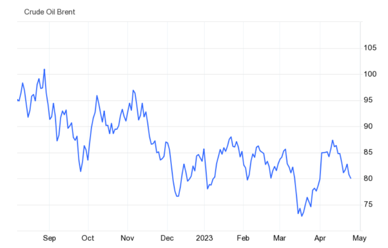

In commodities trading, oil stands out as a particularly dynamic and globally relevant market. Central to this market are Brent Crude and West Texas Intermediate (WTI), two primary oil benchmarks that play a key role in setting prices within their respective territories. Brent Crude serves primarily as the benchmark for pricing in Europe, Africa, and the Middle East, whereas WTI is the main standard for the American oil market.

The advent of algorithmic trading has initiated a significant transformation in how traders engage with oil markets. This method employs automated systems and pre-programmed instructions to execute trades at unprecedented speeds and volumes, making real-time data-driven decision-making a reality. Traders and institutions leverage algorithmic trading to enhance market responsiveness and capitalize on even the smallest price differentials, thereby optimizing trading strategies and improving efficiency.



This article seeks to offer a thorough comparison between Brent Crude and WTI, examining their distinct characteristics, the market dynamics that influence their pricing, and the ways technological advancements like algorithmic trading are shaping the future of oil trading. Understanding these elements is vital for navigating the ever-evolving landscape of global oil markets.

## Table of Contents

## Understanding Brent Crude and WTI: The Basics

Brent Crude and West Texas Intermediate (WTI) are two primary benchmarks used to value oil in international markets. Their significance stems from their widespread use in pricing, structural characteristics, and market influence.

Brent Crude originates from the North Sea, encompassing oil fields located in the United Kingdom and Norway. As a key determinant of oil prices across Europe, Africa, and the Middle East, Brent serves as the primary global oil benchmark. The blend comprises oil extracted from different fields, including Brent, Forties, Oseberg, and Ekofisk (BFOE). Its role as a marker in international oil trade is attributed to its light and sweet nature—features that reduce refining costs and enhance gasoline production efficiency.

WTI, sourced predominantly from oil fields in Texas, Louisiana, and North Dakota, is the benchmark for [crude oil](/wiki/crude-oil) pricing in the United States. Known for its exceptionally low sulfur content and light density, WTI is highly suited for refining into gasoline and other petroleum products. The geographical centering of WTI within the United States market makes it a critical indicator of domestic oil prices.

Both benchmarks are categorized as 'light' and 'sweet', indicating their low density (measured in degrees API) and low sulfur content. API gravity is a measure of how heavy or light a petroleum liquid is compared to water; oils with an API gravity higher than 10 are lighter and less dense than water. Brent Crude typically exhibits an API gravity around 38.06 degrees, while WTI is slightly lighter, with an API gravity of approximately 39.6 degrees. Their low sulfur content, commonly below 0.5%, is desirable for refining processes, minimizing the need for extensive sulfur removal.

Despite their similarities, the choice between Brent and WTI often reflects geographical and market-specific requirements. Brent is generally more indicative of global oil price trends due to its extensive reach and the diverse array of trading actors involved. Conversely, WTI's relevance is predominantly confined to the North American market, where U.S. domestic production, consumption patterns, and pipeline infrastructure play significant roles.

In summary, Brent Crude and WTI are pivotal in global and regional oil pricing structures. Their distinctive properties and market applications underscore their importance in the complex ecosystem of oil trading. Understanding these benchmarks is essential for navigating the nuances of the oil market.

## Key Differences Between Brent Crude and WTI

Brent Crude and West Texas Intermediate (WTI) are two leading benchmarks in global oil pricing, and understanding their key differences is crucial for traders and investors in the oil markets. Both benchmarks have characteristics that significantly influence their respective markets and pricing mechanisms.

A fundamental difference between Brent Crude and WTI is their geographical origin. Brent Crude is extracted from several oil fields in the North Sea, specifically located between the United Kingdom and Norway. This offshore extraction method tends to result in lower transportation costs, as oil can be shipped directly to major refinery hubs worldwide through sea routes. The ability to transport via sea can mitigate logistical challenges and costs, offering a significant advantage in terms of flexibility and distribution.

On the other hand, WTI is primarily sourced from oil fields located in the interior regions of the United States, including Texas, Louisiana, and North Dakota. Its landlocked position necessitates a more complex transportation network involving pipelines, rail, and trucks to deliver oil to refineries, thereby increasing logistical expenses. U.S. infrastructure, including pipeline capacity and storage facilities, plays a pivotal role in influencing WTI's market dynamics and pricing structure.

Market sensitivity to geopolitical events also distinguishes Brent Crude from WTI. Brent is particularly susceptible to geopolitical tensions and disruptions that can affect supply routes in Europe, Africa, and the Middle East. These regions are critical for oil production and exportation, meaning that any geopolitical instability can lead to significant price fluctuations in Brent Crude. Consequently, Brent often serves as a barometer for broader geopolitical risks affecting global oil supplies.

Conversely, WTI is more impacted by factors within the U.S. market, such as domestic production levels, regulatory changes, and infrastructure constraints. The rise of shale oil production in the U.S. has significantly influenced WTI pricing by increasing supply and altering market dynamics. Infrastructure bottlenecks or changes in export policies can also exert downward or upward pressure on WTI prices, reflecting the domestic nature of its supply chain.

The price differential, often referred to as the Brent-WTI spread, can serve as an important market signal. This differential reflects various factors, including transportation costs, geopolitical risks, and production levels in both benchmarks' respective regions. For traders, observing the fluctuations in the Brent-WTI spread provides insights into potential [arbitrage](/wiki/arbitrage) opportunities and helps in formulating strategies to hedge against price [volatility](/wiki/volatility-trading-strategies). Factors such as global events, changes in production patterns, and demand forecasts contribute to the ebb and flow of these price differentials, emphasizing the interconnectedness of global oil markets.

## The Role of Algorithmic Trading in Oil Markets

Algorithmic trading, often referred to as algo trading, employs automated, pre-programmed trading commands to execute orders with high speed and precision in the financial markets, including oil markets. This technology leverages real-time data analytics, allowing traders to respond swiftly to market fluctuations, which is crucial for maintaining a competitive advantage.

In oil markets, including those of Brent Crude and West Texas Intermediate (WTI), algo trading enables traders to exploit minute price differentials and inherent volatility for maximized gain. By analyzing historical and current data, these algorithms can engage in arbitrage opportunities, particularly between Brent and WTI price differentials, thereby optimizing trade outcomes. This process is facilitated by mathematical models and statistical techniques designed to predict optimal buy and sell points.

The integration of [artificial intelligence](/wiki/ai-artificial-intelligence) (AI) and [machine learning](/wiki/machine-learning) into [algorithmic trading](/wiki/algorithmic-trading) systems has further refined the capacity for predictive price movement analysis and strategic trade optimization. Machine learning algorithms can learn from vast datasets, identifying patterns that human traders might overlook. Python, often used for developing such algorithms, offers libraries like Scikit-learn and TensorFlow that are instrumental in model training and real-time trading simulations.

For example, an algorithm may use regression analysis or time series forecasting to predict future oil price movements. A simple Python script implementing a basic linear regression model might look like this:

```python
import numpy as np
from sklearn.linear_model import LinearRegression

# Sample dataset of past oil prices and another variable (like stock level or previous day price)
X = np.array([[1], [2], [3], [4], [5]])  # Independent variable
y = np.array([10, 12, 15, 18, 20])      # Dependent variable, e.g., oil prices

# Training the model
model = LinearRegression().fit(X, y)

# Predicting future oil price
future_X = np.array([[6]])
predicted_price = model.predict(future_X)
print(f"Predicted Price: {predicted_price[0]}")
```

Despite the numerous advantages presented by algorithmic trading, it entails challenges that necessitate robust technical infrastructure, including reliable real-time data feeds and comprehensive risk management protocols. Market participants must ensure low-latency data access and deploy effective system security measures to prevent unauthorized access and system failures.

Efficient risk management strategies are pivotal in mitigating potential losses that can arise from unpredictable market events or system errors. Algorithms need to be rigorously backtested using historical data to validate their predictive accuracy and refine their operational logic before any live deployment in financial trading.

Overall, while algorithmic trading brings efficiency and speed to oil markets, traders must balance technological reliance with vigilant oversight to address potential system limitations and market risks.

## Impact of Market Dynamics on Trading Strategies

Market dynamics such as geopolitical tensions, supply and demand shifts, and technological advancements are essential factors shaping oil prices. These factors dictate trading strategies for both Brent Crude and West Texas Intermediate (WTI), requiring traders to account for variables like market accessibility and price volatility.

Geopolitical tensions often lead to fluctuations in oil supply, causing price changes that traders must navigate. For instance, unrest in oil-producing regions may disrupt production, leading to decreased supply and higher prices. Conversely, resolutions or increased stability can lead to a more stable supply and affect pricing differently. Such conditions necessitate adaptable trading strategies to mitigate risk and capitalize on market movements.

Supply and demand shifts also significantly influence oil prices. Changes in global economic conditions, such as emerging markets increasing their energy consumption, can drive demand up. Conversely, economic downturns might lead to decreased demand. Supply-side developments, like new oil field discoveries or shifts in OPEC production quotas, directly impact prices, affecting traders' strategies.

Technological advancements, especially in extraction and drilling techniques, influence supply dynamics. The ability to extract oil more efficiently can affect overall market supply, impacting both Brent and WTI prices. Furthermore, technology in trading—such as algorithmic trading—enables traders to respond to real-time data, adjusting strategies instantaneously to account for sudden market changes or anomalies.

Traders often employ different strategies for Brent and WTI, leveraging their understanding of these dynamics. For instance, Brent, with its exposure to the geopolitically volatile regions of the Middle East, may be approached with strategies that hedge against geopolitical risk. Alternatively, WTI, more influenced by U.S. domestic factors, might be traded with a focus on American economic indicators and infrastructure developments.

Algorithms play a crucial role in adjusting trading strategies in real-time. By analyzing live market data, algorithms can detect deviations from expected price patterns or identify opportunities for arbitrage and rapid entry or [exit](/wiki/exit-strategy) from positions. This ability to react swiftly is vital for dealing with the inherent volatility of oil markets.

The Brent-WTI price differential is a critical tool for traders employing arbitrage or hedging strategies. This differential reflects the market's current sentiments and reactions to global events, enabling traders to exploit price disparities between the two benchmarks. Specifically, a wider spread may indicate varying regional supply constraints or demand pressures, providing arbitrage opportunities.

Understanding these market dynamics allows traders to position themselves effectively within the volatile oil trading landscape. By staying informed about geopolitical, supply, and technological trends, and by leveraging advanced trading algorithms, traders can optimize their portfolios to manage risks and capitalize on market opportunities. This comprehensive awareness and adaptability are crucial for maintaining a competitive edge in trading Brent Crude and WTI.

## Future Trends in Brent Crude, WTI, and Algo Trading

Algorithmic trading is poised to play an increasingly significant role in oil markets as technology advances. The integration of advanced data analytics and machine learning models is set to enhance both the predictability and efficiency of trading practices. Machine learning algorithms, particularly those employing neural networks and [reinforcement learning](/wiki/reinforcement-learning), can analyze patterns within large datasets, offering predictions on oil price movements with greater accuracy. For example, these models can incorporate historical price data, supply chain information, and geopolitical events to optimize trading strategies.

The global energy landscape is shifting with the rise of renewable energy sources, and this transition may affect the demand dynamics for Brent Crude and WTI. As countries move toward cleaner energy solutions, the relative demand for these oil benchmarks may alter, influencing both price and market behavior. This potential shift necessitates that traders consider the broader energy transition in their strategies, incorporating past and projected energy trends into their models.

Regulatory and environmental considerations will significantly shape oil trading strategies in the future. Stricter regulations on carbon emissions and other environmental impacts could affect production costs and, by extension, the pricing of Brent and WTI. Traders need to stay informed about policy changes and develop algorithms that can adapt to new regulations efficiently.

To thrive in this evolving landscape, traders will need to employ more sophisticated algorithms and maintain diversified portfolios. The development of hybrid models that integrate multiple approaches, such as combining [fundamental analysis](/wiki/fundamental-analysis) with quantitative techniques, may provide a competitive edge. Additionally, diversifying across assets and markets can mitigate risks associated with volatility and regulatory shifts. 

In summary, as algorithmic trading expands its footprint in the oil markets, traders who leverage advanced technologies while adapting to regulatory and environmental changes will be better positioned to succeed. Staying agile and responsive to the changing energy landscape will be key in navigating future challenges in Brent Crude and WTI trading.

## Conclusion

Understanding the differences between Brent Crude and West Texas Intermediate (WTI) is crucial for traders aiming to maximize their effectiveness in the oil markets. These two major benchmarks shape global pricing dynamics, and being well-versed in their characteristics allows traders to make informed decisions tailored to specific market conditions. For example, Brent Crude, sourced from the North Sea, serves as the primary benchmark for European and African markets, while WTI, originating from U.S. oil fields, is the staple for American market analysis. Key distinctions such as their extraction locations and market sensitivities have significant implications for pricing and trading strategies.

Algorithmic trading emerges as a transformative force in these markets, providing traders with the ability to execute high-frequency trades with precision. By leveraging algorithms, traders can interpret vast data sets in real-time, capturing subtle price movements and optimizing their strategies accordingly. This technology empowers traders by offering a competitive advantage through speed and accuracy, enabling them to navigate fluctuations in the oil markets with effectiveness that manual trading simply cannot match.

As both energy and technology landscapes continue to change, staying informed of the latest trends and updates becomes paramount. The rise of renewable energy sources and evolving regulations introduce new variables that could affect the demand and pricing structures of Brent and WTI. Traders who continuously adapt to these changes, integrating sophisticated algorithmic tools and diverse portfolios, will be better positioned to maintain their edge in the marketplace.

By combining a thorough understanding of market fundamentals with advanced trading technologies, traders can proficiently manage the intricacies of oil trading. This blend of knowledge and technology allows for effective risk management and strategic positioning essential for success. Ultimately, a proactive and adaptive approach will be crucial, ensuring that traders can sustain competitiveness in the lively and ever-changing domain of Brent Crude and WTI trading.

## References & Further Reading

[1]: Geman, H. (2005). ["The United States Oil Fund and WTI Crude Oil Prices: Cointegrated or Simply Correlated?"](https://onlinelibrary.wiley.com/doi/abs/10.1002/fut.22184?af=R) The Journal of Futures Markets, 25(2), 100-115.

[2]: Dunsby, A., Peters, D., & Pripis, R. (2008). ["Brent/WTI: A crude oil spread from production to financial markets,"](https://pmc.ncbi.nlm.nih.gov/articles/PMC9756000/) The Journal of Futures Markets, 28(5), 521-536.

[3]: Kaminski, V. (2010). ["Crude Oil Prices in the 21st Century: Speculative Bubble?"](https://www.researchgate.net/publication/369126964_An_analysis_of_crude_oil_prices_in_the_last_decade_2011-2020_With_deep_learning_approach) Energy Policy, 39(10), 5906-5916.

[4]: Avellaneda, M., & Lee, J. (2010). ["Statistical Arbitrage in the U.S. Equities Market,"](https://papers.ssrn.com/sol3/papers.cfm?abstract_id=1153505) Quantitative Finance, 10(1), 1-22.

[5]: Narayan, P. K., & Zheng, X. (2010). ["Quantile causality between oil and stock markets,"](https://www.scirp.org/reference/referencespapers?referenceid=2378795) Energy Economics, 33(5), 956-963.

[6]: ["Algorithmic Trading and DMA: An introduction to direct access trading strategies"](https://www.amazon.com/Algorithmic-Trading-DMA-introduction-strategies/dp/0956399207) by Barry Johnson

[7]: ["The Black Swan: The Impact of the Highly Improbable"](https://en.wikipedia.org/wiki/The_Black_Swan:_The_Impact_of_the_Highly_Improbable) by Nassim Nicholas Taleb

[8]: ["Energy Trading and Investing: Trading, Risk Management and Structuring Deals in the Energy Market,"](https://www.amazon.com/Energy-Trading-Investing-Management-Structuring/dp/1259835383) by Davis W. Edwards