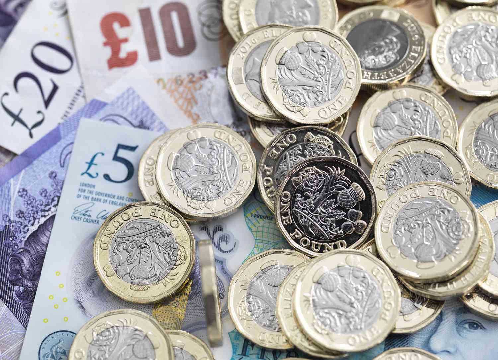

Forex trading, a dynamic and constantly shifting arena, places significant emphasis on the U.S. dollar (USD) and British pound (GBP) as pivotal benchmarks. The currency strength between these two major economies not only influences global financial markets but also shapes the strategies employed by traders worldwide. As traders seek to optimize their opportunities in this vibrant market, the use of algorithmic trading, or algo trading, has gained notable traction. Algo trading is celebrated for its capacity to handle extensive datasets and execute trades under optimal conditions, thus providing a refined edge for contemporary traders.

The prowess of the USD against the GBP is an area of considerable interest. A variety of economic and geopolitical factors underpin the USD's strength, and it is essential for traders to grasp these elements to make informed decisions. Moreover, the potential of algorithmic trading in this context cannot be understated. By harnessing sophisticated algorithms, traders are able to interpret vast amounts of data and adjust their trading strategies in real-time, thereby capitalizing on opportunities as they arise.



For traders dealing with currency pairs such as USD/GBP, it is imperative to comprehend the intricate dynamics at play. From macroeconomic policies to interest rate differentials, each factor can sway the market, making a profound understanding of these nuances crucial. As the forex market continues to evolve, leveraging the precision and speed afforded by algorithmic trading strategies will likely become increasingly crucial in maintaining a competitive edge.

## Table of Contents

## Factors Influencing U.S. Dollar Strength

The U.S. dollar (USD) remains a dominant force in global foreign exchange markets, owing to several pivotal factors.

The role of the USD as the world's primary reserve currency provides it with inherent strength. Central banks and financial institutions worldwide hold significant portions of their foreign exchange reserves in USD, underscoring its global trust and stability. This demand for dollars supports its value and reduces exchange rate volatility against other currencies.

Economic indicators such as interest rates, inflation, and macroeconomic policies play critical roles in determining the valuation of the USD. The Federal Reserve, as the central bank of the United States, influences these factors through its monetary policy decisions. An example is the setting of interest rates: when the Federal Reserve raises interest rates, the USD often appreciates because higher rates provide greater returns on investments denominated in dollars, thus attracting foreign capital.

$$
\text{USD\ strength} \approx \frac{\text{Interest\ Rate\ (US)}}{\text{Interest\ Rate\ (Foreign)}}
$$

Inflation rates also have a notable impact on the USD's strength. Lower inflation rates in the U.S., compared to other countries, generally bolster the USD's purchasing power and attractiveness as an investment.

Geopolitical events are another influential [factor](/wiki/factor-investing). In times of global uncertainty or financial instability, investors typically seek the safety of the USD. This phenomenon, often referred to as the "flight to safety," can drive up the demand for the dollar, thus enhancing its strength relative to other currencies.

Additionally, recent trends such as deglobalization and shifting trade policies have impacted the historical performance of the dollar. The U.S.'s stance on trade agreements and tariffs can influence its currency by affecting trade balances and international investor sentiment. For example, protectionist policies may strengthen the dollar by reducing imports but could also weaken long-term growth prospects, affecting the currency's valuation.

In summary, the interplay of these factors—reserve currency status, economic indicators, geopolitical dynamics, and trade policies—continually shapes the strength and performance of the U.S. dollar on the world stage.

## Understanding the British Pound's Volatility

The British pound (GBP) is a prominent currency in [forex](/wiki/forex-system) trading, known for its historical significance and [volatility](/wiki/volatility-trading-strategies). A primary factor contributing to the pound's fluctuations is political events, with Brexit standing out as a critical influence. The referendum in 2016 led to substantial exchange rate movements, driven by uncertainties surrounding the UK's future trade relationships and economic policies. Such political uncertainties can compound market volatility, causing sudden shifts in currency valuation due to changes in investor sentiment and risk assessments.

The Bank of England (BoE) plays a crucial role in determining the pound's value through its monetary policies, particularly interest rates. For instance, the central bank's decisions regarding [interest rate](/wiki/interest-rate-trading-strategies) adjustments directly affect currency strength by influencing capital flows. Higher interest rates generally attract foreign investment, increasing demand for the GBP, while lower rates may have the opposite effect.

Moreover, the UK's economic outlook significantly impacts the pound's volatility. With Brexit altering the landscape of trade relations, the future economic environment remains a subject of speculation. This uncertainty can lead to increased volatility, as markets respond to news and developments related to trade negotiations and agreements. Factors such as the trade balance and agreements with major partners like the European Union affect market confidence and GBP trajectories.

Comparative economic indicators, including gross domestic product (GDP) growth and employment rates, further influence the pound's valuation. Strong GDP growth and low unemployment rates typically boost confidence in a currency, increasing its value as compared to others. In contrast, economic downturns or unfavourable employment data can weaken the pound, as investors seek more stable or higher-yielding alternatives.

Although the British pound remains a strong currency historically, it faces contemporary challenges that impact its exchange rate. These challenges include adapting to a new economic reality post-Brexit, evolving trade policies, and adjusting to global economic shifts. Consequently, traders and investors must closely monitor these factors to understand GBP's dynamic landscape and make informed decisions in the forex market.

## Algo Trading in Forex Markets

Algorithmic trading, often referred to as algo trading, plays a significant role in the forex markets by leveraging advanced mathematical models and computational technology to execute trades at optimal terms automatically. In the context of foreign exchange, algo trading is particularly advantageous due to the financial market's 24-hour operation and the complexity inherent in trading currency pairs.

In forex markets, conditions change rapidly and are influenced by a multitude of factors, including geopolitical events, economic data releases, and central bank policies. Algorithms help traders manage these complexities by processing vast amounts of data in real-time. They can analyze multiple data streams simultaneously, such as price trends, historical patterns, and market news, which enables them to identify trading opportunities that may not be immediately visible to human traders.

Furthermore, algo trading minimizes the role of human emotions in trading decisions. Emotional trading often leads to impulsive decisions which can adversely affect trading outcomes. By adhering to pre-defined, logic-based rules, algorithms enhance discipline and consistency in trading strategies. This is particularly important in volatile markets where quick and unemotional decision-making can significantly influence profitability.

One of the primary benefits of [algorithmic trading](/wiki/algorithmic-trading) in forex is its ability to leverage currency-strength theories in real-time market conditions. For example, an algorithm might track the Relative Strength Index (RSI) of the USD and GBP to predict movements in the USD/GBP currency pair. This systematic approach allows traders to act on quantitative data rather than qualitative intuition.

The process of algo trading can be illustrated with a simple Python code snippet that implements a basic moving average crossover strategy, a common algo trading strategy in forex:

```python
import pandas as pd

# Load historical exchange rate data
data = pd.read_csv('forex_data.csv')

# Calculate moving averages
data['SMA50'] = data['Close'].rolling(window=50).mean()
data['SMA200'] = data['Close'].rolling(window=200).mean()

# Generate buy/sell signals
data['Signal'] = 0
data['Signal'][50:] = np.where(data['SMA50'][50:] > data['SMA200'][50:], 1, -1)

# Calculate positions
data['Position'] = data['Signal'].shift()

# Print the data with signals
print(data[['Close', 'SMA50', 'SMA200', 'Signal', 'Position']])
```

In this code, we calculate 50-day and 200-day simple moving averages (SMA) on the closing prices of a forex pair. The strategy triggers a "buy" signal when the 50-day SMA crosses above the 200-day SMA and a "sell" signal in the opposite case. The algorithm processes these signals to take positions in the market, eliminating human bias.

Overall, algorithmic trading is a sophisticated methodology that, when applied correctly, can provide traders with a competitive edge in the forex markets. It enables the identification and execution of high-probability trade setups with precision and efficiency, ultimately contributing to more effective and profitable trading strategies.

## Strategies for Trading USD/GBP Using Algorithms

To effectively trade the USD/GBP currency pair using algorithms, several strategic approaches can be applied, taking advantage of technology and financial insights.

### Interest Rate Differentials

Interest rate differentials between the United States and the United Kingdom are critical in determining the flow of capital between these two economies, influencing the USD/GBP exchange rate. An algorithmic trading strategy can be developed to monitor and react to changes in these differentials. For instance, when the interest rate in the US is higher than in the UK, this could lead to USD appreciation due to increased demand for USD-denominated assets. Traders can program their algorithms to enter buy positions on the USD/GBP pair when a favorable interest rate differential is detected. Such algorithms can be structured using if-else decision rules based on interest rate data.

### Machine Learning for Trend Prediction

Incorporating [machine learning](/wiki/machine-learning) models to predict short-term trends in exchange rates is a powerful strategy. Algorithms like neural networks or support vector machines can be trained on historical exchange rate data to identify patterns and predict future movements. For example, a Long Short-Term Memory (LSTM) [neural network](/wiki/neural-network) can be employed to forecast exchange rates by learning from sequential patterns in past data. This approach allows traders to make informed predictive trades.

```python
import numpy as np
import pandas as pd
from sklearn.preprocessing import MinMaxScaler
from keras.models import Sequential
from keras.layers import LSTM, Dense

# Example of training an LSTM model for predicting USD/GBP movement
data = pd.read_csv('usd_gbp_historical_data.csv')
scaler = MinMaxScaler(feature_range=(0, 1))
scaled_data = scaler.fit_transform(data['exchange_rate'].values.reshape(-1, 1))

model = Sequential()
model.add(LSTM(units=50, return_sequences=True, input_shape=(60, 1)))
model.add(LSTM(units=50))
model.add(Dense(units=1))
model.compile(optimizer='adam', loss='mean_squared_error')

# Training the model
X_train = []
y_train = []
for i in range(60, len(scaled_data)):
    X_train.append(scaled_data[i-60:i, 0])
    y_train.append(scaled_data[i, 0])
X_train, y_train = np.array(X_train), np.array(y_train)
X_train = np.reshape(X_train, (X_train.shape[0], X_train.shape[1], 1))

model.fit(X_train, y_train, epochs=20, batch_size=32)
```

### Backtesting Methods

Backtesting is essential to evaluate the effectiveness of trading strategies using historical data. By simulating trades based on past exchange rates, traders can assess the performance of their algorithms under different market conditions. This process involves running algorithms on historical data while tracking key metrics such as risk-adjusted returns and drawdowns.

Backtesting frameworks like Zipline or Backtrader in Python can be employed to test the robustness of algorithmic strategies before deploying them in live markets.

### Risk Management Protocols

The implementation of risk management protocols within trading algorithms helps to mitigate potential losses in unforeseen market conditions. Algorithms can integrate stop-loss orders, position sizing, and portfolio diversification strategies to limit exposure to risky positions. Efficient risk management ensures that capital is preserved, allowing traders to withstand market volatility.

### Combining Fundamental and Technical Analysis

A balanced trading strategy benefits from the integration of both fundamental and technical analysis. Algorithmic systems can be designed to analyze economic indicators such as GDP growth, employment data, and geopolitical events alongside technical indicators like moving averages, RSI, and MACD. This comprehensive approach ensures that trades are aligned with overall market sentiment and fundamental economic health.

Overall, leveraging algorithmic strategies for trading the USD/GBP pair can enhance decision-making processes, improve trade execution, and optimize returns, provided that traders remain vigilant about maintaining and adapting their strategies to ever-changing market conditions.

## Conclusion

The interplay between the U.S. dollar (USD) and the British pound (GBP) is a crucial focal point in global forex markets. Understanding the factors influencing each currency’s strength is essential for traders aiming to make informed decisions. Various elements, such as economic indicators and geopolitical events, significantly impact currency valuation, requiring traders to continually assess and adapt their strategies.

Algorithmic trading emerges as a sophisticated solution to manage these complexities. By processing vast amounts of data at speeds unattainable by human traders, algorithms provide a competitive edge through their ability to execute trades with precision and speed. This advantage is particularly evident in high-volatility markets, where rapid movements demand swift responses.

However, developing effective algo-driven strategies necessitates a deep understanding of economic indicators, market trends, and quantitative analysis. Key economic factors, including interest rates, inflation, and GDP growth, should be continuously monitored to enhance predictive models. Furthermore, integrating quantitative analysis allows for the [backtesting](/wiki/backtesting) of strategies, ensuring robustness against historical data and potential market conditions.

As the forex market continuously evolves, leveraging technology like algorithmic trading becomes integral for maintaining competitiveness. Traders equipped with the right technological tools can adapt more efficiently to market changes, optimizing their strategies to maximize returns while managing risks. As algorithms advance, they offer unprecedented opportunities for innovation in trading strategies, making mastery of these tools invaluable for modern forex traders.

## References & Further Reading

[1]: Bergstra, J., Bardenet, R., Bengio, Y., & Kégl, B. (2011). ["Algorithms for Hyper-Parameter Optimization."](https://papers.nips.cc/paper/4443-algorithms-for-hyper-parameter-optimization) Advances in Neural Information Processing Systems 24.

[2]: ["Advances in Financial Machine Learning"](https://www.amazon.com/Advances-Financial-Machine-Learning-Marcos/dp/1119482089) by Marcos Lopez de Prado.

[3]: ["Evidence-Based Technical Analysis: Applying the Scientific Method and Statistical Inference to Trading Signals"](https://www.amazon.com/Evidence-Based-Technical-Analysis-Scientific-Statistical/dp/0470008741) by David Aronson.

[4]: ["Machine Learning for Algorithmic Trading"](https://github.com/stefan-jansen/machine-learning-for-trading) by Stefan Jansen.

[5]: ["Quantitative Trading: How to Build Your Own Algorithmic Trading Business"](https://www.amazon.com/Quantitative-Trading-Build-Algorithmic-Business/dp/1119800064) by Ernest P. Chan.