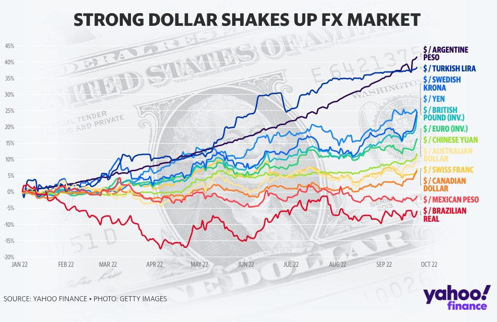

## Table of Contents

## What is the British Pound and how is it used?

The British Pound, also known as the pound sterling, is the official currency of the United Kingdom. It is represented by the symbol £ and is used in England, Scotland, Wales, and Northern Ireland. The British Pound is one of the oldest currencies still in use today and is also used in some British territories and dependencies, like the Falkland Islands and Gibraltar.

People in the UK use the British Pound to buy things like food, clothes, and other goods and services. You can use pounds in the form of coins and banknotes, or you can use electronic methods like bank transfers and credit cards. The value of the pound can change compared to other currencies, which can affect the cost of things when traveling or doing business with other countries.

## What is the U.S. Dollar and how is it used?

The U.S. Dollar is the official money used in the United States. It is also called the American Dollar. It is shown by the symbol $ and is used all over the country, including places like New York, California, and Texas. The U.S. Dollar is also used in some other places like Puerto Rico and Ecuador. It is one of the most important currencies in the world and many countries use it for buying and selling things with other countries.

People in the U.S. use dollars to buy things they need, like food, clothes, and toys. You can use dollars as coins and paper money, or you can use them electronically with bank cards and online payments. The value of the dollar can go up or down compared to other countries' money. This can make things more or less expensive when traveling or doing business with other countries.

## How do exchange rates between the British Pound and U.S. Dollar work?

Exchange rates between the British Pound and the U.S. Dollar tell you how much one currency is worth compared to the other. If you want to change your British Pounds into U.S. Dollars, the exchange rate will tell you how many dollars you get for each pound. For example, if the exchange rate is 1 British Pound = 1.25 U.S. Dollars, then for every pound you have, you will get 1.25 dollars. These rates change all the time because of things like how well the countries' economies are doing, interest rates, and what people think will happen in the future.

When you travel from the UK to the U.S., you need to use U.S. Dollars. If the exchange rate is good, you might get more dollars for your pounds, which means you can buy more things in the U.S. But if the rate is bad, you get fewer dollars, and things might be more expensive. The same thing happens when people in the U.S. want to buy things from the UK. They need to change their dollars into pounds, and the exchange rate will affect how much they can buy.

## What factors influence the strength of the British Pound against the U.S. Dollar?

The strength of the British Pound compared to the U.S. Dollar is affected by many things. One big thing is how well the UK's economy is doing. If the UK's economy is growing and doing well, people might think the pound will be worth more, so they want to buy it. This makes the pound stronger. Another thing that matters is interest rates. If the UK has higher interest rates than the U.S., people might move their money to the UK to get more interest, which can make the pound stronger. Also, things like political events, like elections or big decisions like leaving the European Union, can change what people think about the pound and make it stronger or weaker.

Another factor is how much other countries want to buy things from the UK. If a lot of countries want to buy UK products, they need to use pounds, which can make the pound stronger. The opposite can happen if fewer countries want to buy from the UK. Also, the overall mood of people around the world can play a part. If people are feeling good about the world economy, they might be more willing to invest in pounds, making it stronger. But if they are worried, they might not want to take the risk, which can make the pound weaker against the dollar.

## What are the historical trends in the GBP/USD exchange rate?

The GBP/USD exchange rate has changed a lot over the years. A long time ago, in the early 1900s, the British Pound was worth a lot more than the U.S. Dollar. One pound could buy about 5 dollars. This was because the UK was a big power with a strong economy. But over time, the U.S. became more powerful and its economy grew a lot. By the 1980s, the pound and the dollar were about equal. Sometimes the pound was worth a bit more, and sometimes the dollar was worth a bit more.

In more recent times, the GBP/USD rate has been up and down. In the early 2000s, one pound could buy about 2 dollars. But then, big things happened, like the 2008 financial crisis and the UK's vote to leave the European Union in 2016. These events made the pound weaker. After the Brexit vote, the pound dropped a lot and one pound was worth less than 1.20 dollars for a while. Since then, the rate has moved around but usually stays between 1.20 and 1.40 dollars per pound. These changes show how the world's economy and big events can affect the value of money.

## How does the economic performance of the UK affect the British Pound's strength?

The way the UK's economy does can really change how strong the British Pound is. If the UK's economy is doing well, growing and making more money, people might think the pound will be worth more in the future. They want to buy pounds now to use them later, which makes the pound stronger. On the other hand, if the UK's economy is not doing so well, maybe because people are losing jobs or businesses are not making as much money, people might not want to buy pounds. This can make the pound weaker.

Also, things like how much people in other countries want to buy things from the UK can affect the pound. If a lot of countries want UK products, they need to use pounds to buy them, which can make the pound stronger. But if fewer countries want to buy from the UK, there's less need for pounds, which can make it weaker. Overall, the health of the UK's economy plays a big part in deciding how strong the British Pound is compared to other currencies like the U.S. Dollar.

## How does the economic performance of the U.S. affect the U.S. Dollar's strength?

The way the U.S. economy is doing can really change how strong the U.S. Dollar is. If the U.S. economy is doing well, with lots of people working and businesses making more money, people might think the dollar will be worth more in the future. They want to buy dollars now to use them later, which makes the dollar stronger. But if the U.S. economy is not doing so well, maybe because people are losing jobs or businesses are not making as much money, people might not want to buy dollars. This can make the dollar weaker.

Also, things like how much other countries want to buy things from the U.S. can affect the dollar. If a lot of countries want U.S. products, they need to use dollars to buy them, which can make the dollar stronger. But if fewer countries want to buy from the U.S., there's less need for dollars, which can make it weaker. Overall, the health of the U.S. economy plays a big part in deciding how strong the U.S. Dollar is compared to other currencies like the British Pound.

## What role do interest rates play in the GBP/USD exchange rate?

Interest rates set by the central banks in the UK and the U.S. can change how strong the British Pound is compared to the U.S. Dollar. If the UK's interest rates go up and they are higher than in the U.S., people might want to move their money to the UK to get more interest. This makes more people want to buy pounds, which can make the pound stronger against the dollar. On the other hand, if the U.S. has higher interest rates than the UK, people might want to move their money to the U.S. instead, making the dollar stronger and the pound weaker.

The difference in interest rates between the two countries can also affect how people think about the future of each currency. If people think the UK's interest rates will stay high for a long time, they might keep buying pounds, keeping it strong. But if they think the U.S. will have higher rates soon, they might start buying dollars instead, which can make the dollar stronger against the pound. So, interest rates are a big part of what makes the GBP/USD exchange rate go up or down.

## How do political events and stability impact the strength of the British Pound and U.S. Dollar?

Political events and how stable a country is can really change the value of its money. For the British Pound, big political events like the Brexit vote in 2016 made a lot of people worried. They thought the UK leaving the European Union might hurt the economy, so they didn't want to buy pounds. This made the pound weaker against the U.S. Dollar. If a country has a lot of political problems or changes, like new leaders or big policy shifts, people might think it's risky to invest there, which can also make the currency weaker.

For the U.S. Dollar, political events and stability also matter a lot. If there's a big election or a change in government, people might worry about what will happen to the economy. If they think the new policies might not be good for business or might cause problems, they might not want to buy dollars, making the dollar weaker. But if the U.S. seems stable and people think the government is doing a good job, more people might want to buy dollars, making the dollar stronger. So, both the British Pound and the U.S. Dollar can go up or down because of what's happening in politics.

## What are the implications of a strong or weak British Pound for UK exports and imports?

When the British Pound is strong, it means that it can buy more of other countries' money. This makes UK exports, like cars or food, more expensive for people in other countries because they need more of their money to buy the same amount of pounds. So, a strong pound can make it harder for UK businesses to sell their things to other countries. But, on the other hand, a strong pound makes imports, like electronics or clothes from other countries, cheaper for people in the UK. They can buy more things from other countries with the same amount of pounds.

When the British Pound is weak, it means that it can buy less of other countries' money. This makes UK exports cheaper for people in other countries because they need less of their money to buy the same amount of pounds. So, a weak pound can help UK businesses sell more things to other countries. But, a weak pound makes imports more expensive for people in the UK. They need more pounds to buy the same things from other countries, which can make things like food or technology more costly.

## How can investors use GBP/USD exchange rate forecasts to make informed decisions?

Investors can use GBP/USD exchange rate forecasts to help them decide when to buy or sell British Pounds or U.S. Dollars. If the forecast says the pound will get stronger, investors might want to buy pounds now, hoping to sell them later for more dollars. On the other hand, if the forecast says the pound will get weaker, investors might want to sell their pounds now, before they lose value. By looking at these forecasts, investors can try to make money by buying low and selling high.

These forecasts are made by looking at things like how well the UK and U.S. economies are doing, interest rates, and big events like elections or trade deals. Investors need to keep an eye on these things because they can change the forecasts. It's important to remember that forecasts are not always right, so investors should be careful and maybe not put all their money into one thing. By using these forecasts as a guide, investors can make smarter choices about when to trade their money.

## What advanced trading strategies can be used to capitalize on fluctuations in the GBP/USD exchange rate?

One advanced trading strategy that investors can use is called "[carry](/wiki/carry-trading) trade." This means borrowing money in a country with low interest rates, like the U.S., and then using that money to buy a currency from a country with higher interest rates, like the UK. If the GBP/USD exchange rate stays the same or gets better, the investor can make money from the difference in interest rates. But, this strategy can be risky because if the pound gets weaker, the investor might lose money.

Another strategy is called "range trading." This is when investors look at the GBP/USD exchange rate over time and see that it usually stays between two numbers, like 1.20 and 1.40. They can buy pounds when the rate is low, near 1.20, and then sell them when the rate goes up to 1.40. This way, they can make money from the small ups and downs of the exchange rate. But, if the rate suddenly moves a lot outside of this range, the investor could lose money.

A third strategy is "[trend following](/wiki/trend-following)." This means watching the GBP/USD exchange rate to see if it's going up or down over time. If the rate is going up, investors might keep buying pounds, hoping it will keep going up. If the rate is going down, they might keep selling pounds, hoping to buy them back later for less. This strategy can be good if the trend keeps going, but it can be bad if the trend suddenly changes direction.

## What factors influence the strength of the U.S. Dollar?

The U.S. dollar (USD) remains a dominant force in global foreign exchange markets, owing to several pivotal factors.

The role of the USD as the world's primary reserve currency provides it with inherent strength. Central banks and financial institutions worldwide hold significant portions of their foreign exchange reserves in USD, underscoring its global trust and stability. This demand for dollars supports its value and reduces exchange rate [volatility](/wiki/volatility-trading-strategies) against other currencies.

Economic indicators such as interest rates, inflation, and macroeconomic policies play critical roles in determining the valuation of the USD. The Federal Reserve, as the central bank of the United States, influences these factors through its monetary policy decisions. An example is the setting of interest rates: when the Federal Reserve raises interest rates, the USD often appreciates because higher rates provide greater returns on investments denominated in dollars, thus attracting foreign capital.

$$
\text{USD\ strength} \approx \frac{\text{Interest\ Rate\ (US)}}{\text{Interest\ Rate\ (Foreign)}}
$$

Inflation rates also have a notable impact on the USD's strength. Lower inflation rates in the U.S., compared to other countries, generally bolster the USD's purchasing power and attractiveness as an investment.

Geopolitical events are another influential [factor](/wiki/factor-investing). In times of global uncertainty or financial instability, investors typically seek the safety of the USD. This phenomenon, often referred to as the "flight to safety," can drive up the demand for the dollar, thus enhancing its strength relative to other currencies.

Additionally, recent trends such as deglobalization and shifting trade policies have impacted the historical performance of the dollar. The U.S.'s stance on trade agreements and tariffs can influence its currency by affecting trade balances and international investor sentiment. For example, protectionist policies may strengthen the dollar by reducing imports but could also weaken long-term growth prospects, affecting the currency's valuation.

In summary, the interplay of these factors—reserve currency status, economic indicators, geopolitical dynamics, and trade policies—continually shapes the strength and performance of the U.S. dollar on the world stage.

## References & Further Reading

[1]: Bergstra, J., Bardenet, R., Bengio, Y., & Kégl, B. (2011). ["Algorithms for Hyper-Parameter Optimization."](https://papers.nips.cc/paper/4443-algorithms-for-hyper-parameter-optimization) Advances in Neural Information Processing Systems 24.

[2]: ["Advances in Financial Machine Learning"](https://www.amazon.com/Advances-Financial-Machine-Learning-Marcos/dp/1119482089) by Marcos Lopez de Prado.

[3]: ["Evidence-Based Technical Analysis: Applying the Scientific Method and Statistical Inference to Trading Signals"](https://www.amazon.com/Evidence-Based-Technical-Analysis-Scientific-Statistical/dp/0470008741) by David Aronson.

[4]: ["Machine Learning for Algorithmic Trading"](https://github.com/stefan-jansen/machine-learning-for-trading) by Stefan Jansen.

[5]: ["Quantitative Trading: How to Build Your Own Algorithmic Trading Business"](https://www.amazon.com/Quantitative-Trading-Build-Algorithmic-Business/dp/1119800064) by Ernest P. Chan.