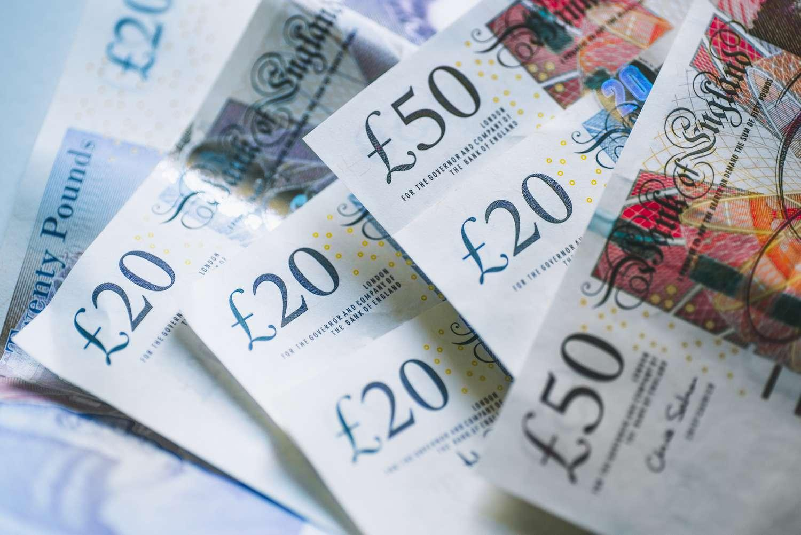

In the dynamic world of forex trading, the US Dollar (USD) and British Pound (GBP) stand as two of the most prominent currencies. Both currencies are not only central to global finance but also play a critical role in the forex markets due to their economic significance and liquidity. The USD enjoys the status of being the world’s most traded currency and the primary global reserve currency. It serves as a benchmark in the foreign exchange market and is closely watched by traders and policymakers alike. Conversely, the GBP, although originating from a smaller economy than the US, is notable for its historical legacy and its relatively high valuation compared to many other currencies.

This article aims to explore the comparative aspects of USD and GBP in the context of algorithmic trading—a modern trading method that leverages automated processes and data-driven decisions to execute trades. Algorithmic trading has transformed how traders approach forex markets, offering efficiency and precision that manual trading cannot match. Algorithmic systems can parse large datasets and make split-second trading decisions based on pre-defined criteria, minimizing human error and emotional bias.



Individuals engaging in algorithmic forex trading are keen to understand the myriad factors that influence the movements of USD and GBP, such as economic indicators, interest rates, and geopolitical events. By examining these aspects, traders can employ algorithms to effectively capitalize on currency movements, thereby maximizing gains. The effective use of algorithmic trading strategies is crucial, as it allows traders to navigate the complexities of the forex market successfully. Understanding these elements is essential for traders aiming to maximize gains amidst the ebb and flow of global financial dynamics, making algorithmic trading an indispensable tool in the arsenal of modern traders.

## Table of Contents

## Understanding the US Dollar and British Pound

The United States Dollar (USD) and the British Pound Sterling (GBP) are pivotal currencies in the global forex market, each with unique roles and characteristics. The USD holds the distinction of being the world's most traded currency and functions as the global reserve currency, a status reinforced by robust economic performance and widespread acceptance in international transactions. Factors contributing to the dominance of the USD include its liquidity, stability, and the economic might of the United States. It serves as the standard currency for commodities such as oil, which underpins its role as a global economic barometer.

On the other hand, the GBP often commands a higher value than the USD, influenced by the economic strategies and monetary policies of the United Kingdom. Despite the UK's smaller economic size compared to the US, the GBP's value reflects historical prestige and a perception of financial stability. However, the GBP trades less frequently than the USD, a byproduct of its more limited role in global trade and investment.

The valuation of these currencies is deeply intertwined with historical ties, economic policies, and global trade relationships. The USD's global reserve currency status is a legacy of the Bretton Woods Agreement and the aftermath of World War II, which established the US as an economic superpower. Meanwhile, the GBP has a historical legacy as a leading world currency, recollecting its past dominance during the British Empire. Both currencies are heavily influenced by economic indicators, such as GDP growth rates, inflation, and employment figures, as well as by political developments. For instance, changes in US Federal Reserve interest rates can have immediate impacts on the USD's exchange rate. Similarly, fiscal policies and geopolitical events, such as Brexit, markedly affect the GBP's valuation.

Analyzing the comparative strengths and weaknesses of the USD and GBP allows traders and economists to assess their performance across various economic climates. The USD exhibits resilience and is often viewed as a safe haven currency, especially during geopolitical uncertainties or financial crises. Conversely, the GBP’s performance is more susceptible to domestic political changes and economic policies, making it more volatile in times of internal uncertainty, such as the recent Brexit negotiations.

Understanding these factors is critical for strategic trading and economic forecasting, enabling market participants to better anticipate and react to currency movements in an ever-evolving global economy.

## Algorithmic Trading: An Overview

Algorithmic trading involves the use of sophisticated computer programs to execute trades under optimal market conditions set by pre-determined criteria. This technological approach leverages the power of automation to enhance trading strategies in various financial markets, including [forex](/wiki/forex-system). Algorithms are designed to process vast amounts of data rapidly, allowing traders to identify profitable trading opportunities with precision and consistency, while significantly reducing the probability of human error.

In the forex market, [algorithmic trading](/wiki/algorithmic-trading) excels in its ability to manage the inherent variability of currency rates. Forex rates are influenced by numerous factors, such as economic indicators, geopolitical events, and market speculation. Algorithms can quickly analyze these influences through comprehensive datasets, distinguishing patterns and trends that might be overlooked by manual trading methods.

To implement algorithmic trading in forex, a typical strategy might include statistical and [machine learning](/wiki/machine-learning) models to forecast currency trends. For instance, regression models can be employed to predict future price movements based on historical data. A simple linear regression model in Python could be utilized as follows:

```python
import numpy as np
from sklearn.linear_model import LinearRegression

# Example historical exchange rate data
exchange_rates = np.array([[1.30, 1.32], [1.32, 1.33], [1.33, 1.31], [1.31, 1.34]])
X = exchange_rates[:, 0].reshape(-1, 1)  # Previous exchange rate
y = exchange_rates[:, 1]  # Current exchange rate

# Initialize and fit the model
model = LinearRegression()
model.fit(X, y)

# Predict future rates
next_rate = np.array([[1.34]])
predicted_rate = model.predict(next_rate)
print(f"Predicted exchange rate: {predicted_rate[0]}")
```

In this example, past exchange rates are used to predict future values, demonstrating how algorithms can assist traders in making informed decisions.

Algorithmic trading systems can also effectively manage risks by automatically executing buy or sell orders based on price thresholds or stop-loss limits. This capability ensures trades are executed swiftly, reducing potential losses due to sudden market shifts. In conclusion, algorithmic trading transforms the forex trading landscape by offering a data-driven, efficient, and reliable means of managing the complexities of currency fluctuations.

## Factors Influencing Currency Movements

Exchange rate dynamics between the US Dollar (USD) and British Pound (GBP) are influenced by several critical factors: a country's economic performance, interest rates, and political stability. These variables drive the currency valuation and play a significant role in forming trading strategies, including algorithmic trading.

### Economic Performance

The economic performance of the United States and the United Kingdom significantly impacts the relative value of their currencies. Key indicators such as Gross Domestic Product (GDP), employment rates, manufacturing output, and consumer spending provide gauges of economic health. For instance, robust GDP growth in the U.S. might lead to expectations of [interest rate](/wiki/interest-rate-trading-strategies) hikes, thereby making the USD more attractive to investors. As algorithms analyze these economic indicators, they can predict potential currency movements for informed trading decisions.

### Interest Rates

Interest rates are a pivotal component driving exchange rates. Central banks, such as the Federal Reserve in the U.S. and the Bank of England in the UK, adjust interest rates to control inflation and stabilize the economy. Higher interest rates typically lead to an appreciation of the currency as they offer better returns on investments denominated in that currency. Hence, algorithmic systems often monitor announcements from these central banks to anticipate currency fluctuations.

### Political Stability

Political stability, or the lack thereof, is another influential [factor](/wiki/factor-investing). The USD often benefits from its status as a global safe haven, meaning it is preferred during periods of geopolitical tension or economic uncertainty. This status can lead to increased demand for the dollar, sustaining its value even amid domestic challenges.

Conversely, the GBP has faced unique challenges post-Brexit. UK-specific factors, such as negotiations surrounding Brexit and changes in fiscal policy, directly impact its valuation. For instance, unexpected developments in Brexit negotiations could lead to heightened [volatility](/wiki/volatility-trading-strategies) in the GBP/USD exchange rate, a risk that algorithmic strategies need to manage.

### Implications for Algorithmic Trading

Understanding these factors is crucial for creating effective trading algorithms. Algorithms that integrate economic indicators, interest rate predictions, and political developments can more accurately model currency movements. This knowledge allows traders to refine their strategies, anticipating shifts and optimizing entry and [exit](/wiki/exit-strategy) points for trades. Effective algorithms not only incorporate historical data but also adapt to real-time changes in these underlying factors, providing an edge in fast-moving forex markets.

## Developing Strategies for USD/GBP Algo Trading

Successful algorithmic trading strategies for the USD/GBP currency pair rely on a meticulous integration of technical indicators and macroeconomic factors. By leveraging these elements, traders can enhance the accuracy and effectiveness of their trading algorithms.

Technical indicators, such as moving averages, Relative Strength Index (RSI), and Bollinger Bands, provide insights into potential market trends and reversals. For instance, a commonly used strategy involves the implementation of moving average crossovers. When a short-term moving average crosses above a long-term moving average, it may signal a buy opportunity; conversely, when it crosses below, it could indicate a sell signal. Incorporating these indicators into an algorithm allows for systematic decision-making without emotional bias.

Moreover, the significance of macroeconomic factors cannot be overstated. Economic indicators such as GDP growth rates, unemployment data, and interest rate changes can profoundly impact the valuation of currencies. For example, a favorable shift in the UK’s economic outlook, evidenced by rising GDP growth or improved labor market conditions, might strengthen the GBP. Algorithms can be designed to adjust trading positions based on the release of such economic data, ensuring they are responsive to real-time market conditions.

Backtesting is a crucial component of effective algorithmic strategy development. By simulating a trading strategy using historical market data, traders can assess its performance and identify weaknesses. This process involves tweaking parameters and variables to optimize the strategy within historical contexts, thereby improving its predictive power for future market conditions. For instance, in Python, [backtesting](/wiki/backtesting) can be executed using libraries such as Backtrader or PyAlgoTrade. Here is a simple example of how backtesting can be structured using Backtrader:

```python
import backtrader as bt

class MovingAverageStrategy(bt.Strategy):
    params = (('short_period', 20), ('long_period', 50),)

    def __init__(self):
        self.short_ma = bt.indicators.SimpleMovingAverage(self.data.close, period=self.params.short_period)
        self.long_ma = bt.indicators.SimpleMovingAverage(self.data.close, period=self.params.long_period)

    def next(self):
        if self.short_ma > self.long_ma:
            self.buy()
        elif self.short_ma < self.long_ma:
            self.sell()

data = bt.feeds.GenericCSVData(dataname='usd_gbp_historical.csv')
cerebro = bt.Cerebro()
cerebro.addstrategy(MovingAverageStrategy)
cerebro.adddata(data)
cerebro.run()
cerebro.plot()
```

Risk management is integral to protecting investments against adverse market conditions. Strategies like setting stop-loss orders, which automatically close a position at a predetermined price, can mitigate potential losses during volatile periods. Traders often use the Value at Risk (VaR) metric to quantify potential losses within a specified confidence interval. By estimating the maximum expected loss over a defined period, algorithms can adjust positions to ensure exposure remains within acceptable limits. This systematic approach helps maintain the robustness of trading strategies in the face of unpredictable market fluctuations.

In conclusion, by combining rigorous backtesting with robust risk management and an informed selection of technical indicators and macroeconomic inputs, traders can build highly effective algorithmic strategies for the USD/GBP currency pair.

## Tools and Technologies in Algorithmic Trading

In the field of algorithmic trading, the selection of tools and technologies plays a critical role in the effective implementation of trading strategies. Two of the most widely used platforms are MetaTrader and cTrader. MetaTrader, particularly MetaTrader 4 (MT4) and MetaTrader 5 (MT5), offers robust features for developing and deploying trading algorithms, known as Expert Advisors (EAs), and provides a rich environment for technical analysis and trading automation. Similarly, cTrader offers advanced algorithmic trading capabilities through its cAlgo platform, allowing traders to develop automated strategies using C#.

The integration of machine learning (ML) and [artificial intelligence](/wiki/ai-artificial-intelligence) (AI) into algorithmic trading is transforming how traders predict market movements. These technologies analyze vast datasets to uncover patterns and trends that may not be immediately visible to human traders. For instance, predictive models such as neural networks or decision trees can be employed to forecast currency prices by examining historical data and identifying potential factors affecting price shifts.

Here's a simple example of how a machine learning algorithm could be implemented to predict GBP/USD currency movements using Python:

```python
from sklearn.ensemble import RandomForestClassifier
from sklearn.model_selection import train_test_split
import pandas as pd

# Load historical forex data
data = pd.read_csv('forex_data.csv')

# Preprocess data
features = data.drop(['Target'], axis=1)
target = data['Target']

# Split data into training and testing sets
X_train, X_test, y_train, y_test = train_test_split(features, target, test_size=0.3, random_state=42)

# Train Random Forest model
model = RandomForestClassifier()
model.fit(X_train, y_train)

# Make predictions on test data
predictions = model.predict(X_test)
```

In addition to these modeling techniques, real-time data feeds and analytics are crucial components in executing timely and informed trades. The ability to access updated market information, including bid/ask prices, trading volumes, and macroeconomic indicators, enables traders to react swiftly to market changes. Platforms like Bloomberg Terminal and Thomson Reuters Eikon provide comprehensive access to financial market data and news, facilitating informed decision-making.

By leveraging these platforms and technologies, traders are equipped to capitalize on algorithmic trading opportunities, navigate market complexity, and optimize their trading strategies effectively.

## Challenges and Considerations

Algorithmic trading presents several challenges that traders and developers must navigate to maintain successful strategies. One notable issue is the potential for programming errors. These errors, often rooted in code inaccuracies or logical fallacies, can lead to unintended trades and significant financial losses. As algorithmic strategies are highly dependent on the integrity of their coding, ensuring robust testing and validation of algorithms before deployment is crucial.

Market unpredictability is another formidable challenge. Financial markets are inherently volatile, and unforeseen events such as geopolitical tensions, economic data releases, or sudden changes in investor sentiment can lead to rapid price swings. Algorithms must be designed with the flexibility to adapt to such changes, incorporating features such as stop-loss orders or machine learning models that can dynamically adjust to evolving conditions.

Regulatory changes also pose significant impacts on algorithmic trading strategies. Financial regulators around the world periodically update trading rules to enhance market stability, prevent fraud, or align with technological advancements. Staying abreast of these changes is essential for traders to ensure compliance and avoid penalties that could adversely affect their trading operations.

To counter these challenges, developers must engage in continuous optimization of their algorithms. This includes regular backtesting using updated historical data to identify potential weaknesses or areas for improvement. Optimization might also involve refining algorithms to improve trade execution speed, enhance predictive accuracy, or better integrate risk management protocols.

A Python-based algorithmic trading script commonly uses libraries such as *pandas* for data manipulation and *numpy* for numerical operations. Here's a simplistic example to illustrate a backtesting process:

```python
import pandas as pd
import numpy as np

# Sample historical data
data = pd.DataFrame({
    'Date': pd.date_range(start='1/1/2022', periods=5, freq='D'),
    'USD_GBP': [0.75, 0.76, 0.74, 0.77, 0.78]
})
data.set_index('Date', inplace=True)

# Simple moving average strategy
data['SMA_3'] = data['USD_GBP'].rolling(window=3).mean()

# Trading signal
data['Signal'] = np.where(data['USD_GBP'] > data['SMA_3'], 1, 0)

# Backtest performance
data['Returns'] = data['USD_GBP'].pct_change()
data['Strategy_Returns'] = data['Signal'].shift(1) * data['Returns']

cumulative_returns = (1 + data['Strategy_Returns']).cumprod() - 1
print(cumulative_returns)
```

In conclusion, developing and maintaining robust algorithmic trading strategies necessitates careful attention to programming accuracy, adapting to market unpredictability, remaining compliant with regulations, and ongoing optimization to sustain performance amidst changing conditions.

## The Future of USD/GBP Algorithmic Trading

As technology progresses, the landscape of USD/GBP algorithmic trading is poised for significant transformation. The integration of artificial intelligence (AI) and big data analytics is set to enhance the precision and dependability of algorithmic trading strategies. AI's ability to process vast amounts of data and uncover patterns autonomously can lead to more refined trading algorithms. Machine learning models, such as neural networks and decision trees, analyze historical data to forecast currency trends and improve predictive accuracy.

Moreover, big data analytics provides traders with comprehensive insights into market behavior. By harnessing real-time data from various sources—economic indicators, social media sentiment, and geopolitical events—traders can make informed decisions swiftly. This predictive capability becomes crucial in the volatile forex market, where minute fluctuations can lead to substantial financial outcomes.

To maintain competitiveness in this evolving market, traders need to adapt to these technological advancements. Continuous learning and adaptation are essential, as the integration of novel technologies necessitates understanding their complexities and applications in forex trading. Competency in programming languages like Python, which is extensively used for developing algorithmic trading models, is becoming increasingly important. For instance, using a Python script, traders can automate the data extraction and analysis process:

```python
import pandas as pd
import numpy as np

# Sample data processing for forex trading
data = pd.read_csv('forex_data.csv')
data['moving_average'] = data['exchange_rate'].rolling(window=50).mean()

# Simple prediction model using moving average
data['signal'] = np.where(data['exchange_rate'] > data['moving_average'], 1, 0)
```

This script demonstrates how traders can process and analyze exchange rate data to generate trading signals based on a moving average, a common technical indicator. 

Furthermore, the growing adoption of cloud computing facilitates access to powerful computational resources at a lower cost. This accessibility allows traders to backtest and optimize algorithms more efficiently, ensuring robustness against diverse market conditions.

As the algorithmic trading of USD/GBP continues to evolve, traders who embrace technological innovations and cultivate a deep understanding of AI and big data analytics will be well-positioned to harness new opportunities in the forex market.

## Conclusion

Understanding the dynamics between the US Dollar (USD) and the British Pound (GBP) is crucial for traders employing algorithmic strategies in the forex market. These currencies are shaped by numerous factors, including economic conditions, geopolitical events, and market sentiment. Algorithmic trading, equipped with precise data analysis and swift execution capabilities, allows traders to exploit these currency movements efficiently.

With the proper tools and knowledge, traders can effectively respond to and anticipate changes in USD and GBP values. Leveraging platforms like MetaTrader, coupled with cutting-edge technologies such as machine learning, provides a formidable edge in detecting profitable trading signals and patterns. For instance, machine learning algorithms can process vast amounts of historical data to forecast price trends, enhancing decision-making in volatile market conditions.

However, the success of algorithmic trading strategies heavily relies on continual learning and adaptation. The forex market is inherently dynamic, influenced by ever-evolving economic policies and global events. Traders must remain vigilant, consistently refining and optimizing their algorithms to maintain competitive advantage. This might involve incorporating new data sources, adjusting risk management protocols, or testing algorithmic models against fresh market conditions.

In conclusion, mastering the intricacies of the USD and GBP and integrating advanced algorithmic trading technologies can significantly enhance trading outcomes. By fostering a culture of continuous improvement and adaptation, traders can position themselves to benefit from the perpetual fluctuations of the forex market.

## References & Further Reading

[1]: Bergstra, J., Bardenet, R., Bengio, Y., & Kégl, B. (2011). ["Algorithms for Hyper-Parameter Optimization."](https://papers.nips.cc/paper/4443-algorithms-for-hyper-parameter-optimization) Advances in Neural Information Processing Systems 24.

[2]: ["Advances in Financial Machine Learning"](https://www.amazon.com/Advances-Financial-Machine-Learning-Marcos/dp/1119482089) by Marcos Lopez de Prado

[3]: ["Evidence-Based Technical Analysis: Applying the Scientific Method and Statistical Inference to Trading Signals"](https://www.semanticscholar.org/paper/Evidence-Based-Technical-Analysis%3A-Applying-the-and-Aronson/3b33df8737f1772e9e14d66a08c9696f140a2ee1) by David Aronson

[4]: ["Machine Learning for Algorithmic Trading"](https://github.com/PacktPublishing/Machine-Learning-for-Algorithmic-Trading-Second-Edition) by Stefan Jansen

[5]: ["Quantitative Trading: How to Build Your Own Algorithmic Trading Business"](https://books.google.com/books/about/Quantitative_Trading.html?id=j70yEAAAQBAJ) by Ernest P. Chan