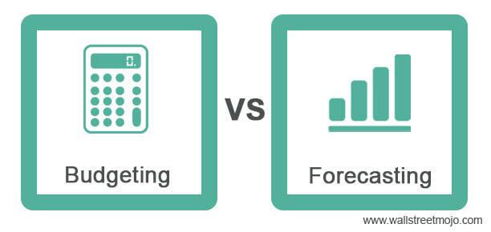

Successful financial management hinges on the integration of several fundamental components, namely financial planning, budgeting, and forecasting. Each of these processes plays a pivotal role in steering an organization towards its financial objectives and ensuring long-term stability. Financial planning establishes a roadmap for allocating resources and setting priorities, thereby facilitating the achievement of both short-term and long-term financial goals. Budgeting, on the other hand, functions as a mechanism to control financial resources, prevent overspending, and strategically allocate funds to various operations. Forecasting is essential for anticipating future financial conditions and allows businesses to adapt their strategies based on predicted trends and potential market shifts.

In recent years, algorithmic trading has emerged as a significant aspect of modern financial strategies. By employing complex mathematical models and automated systems, algorithmic trading executes trades at speeds and frequencies unimaginable to human traders. This approach not only enhances market efficiency but also integrates seamlessly with financial planning and forecasting to optimize investment strategies.



The interconnectedness of these financial processes highlights the necessity for businesses to adopt a comprehensive approach to financial management. Financial planning, budgeting, and forecasting are not isolated tasks but rather interconnected facets of a cohesive strategy aimed at optimizing business growth and financial performance. When effectively integrated, these processes enable organizations to make informed decisions that align with their long-term objectives and adjust to changing market conditions.

Effective planning is crucial for future financial stability. By understanding cash flow patterns, setting realistic revenue targets, and identifying potential risks, businesses can develop robust strategies that ensure sustainability and success. This strategic approach also allows companies to allocate resources wisely, minimize financial uncertainties, and capitalize on growth opportunities.

As we explore each component in detail, it becomes evident that their individual impact on financial decision-making is substantial. By examining how they work together, we can gain insights into how businesses can achieve financial success and resilience in an ever-evolving economic landscape.

## Table of Contents

## Understanding Financial Planning

Financial planning is a crucial process that involves formulating strategies to manage financial resources effectively to achieve long-term financial goals. It serves as a roadmap for individuals and businesses, guiding them through financial decisions and helping them align their activities with their financial objectives. Effective financial planning provides structure and direction, ensuring every financial decision contributes toward overall financial sustainability and growth.

Creating a comprehensive financial plan involves several key steps: establishing clear financial goals, assessing current financial status, developing and implementing strategies to achieve these goals, and continuously monitoring and adjusting the plan as necessary. 

1. **Establishing Financial Goals**: It begins with defining precise, measurable, and time-bound financial goals. These goals could range from short-term objectives, like saving for a vacation, to long-term aspirations, such as retirement planning or business expansion. 

2. **Assessing Financial Status**: This involves a thorough examination of current financial conditions, including income, expenses, savings, and debts. Tools such as balance sheets and income statements are instrumental in this step.

3. **Strategy Development and Implementation**: Based on the financial assessment, strategies are developed to allocate resources effectively, reduce unnecessary expenditure, and focus investments in areas that promise maximum returns. Implementing these strategies requires discipline and consistency.

4. **Monitoring and Adjusting the Plan**: Continuous evaluation of the financial plan is essential to respond to changes in circumstances or unexpected financial challenges. This ensures that the financial plan remains relevant and effective over time.

Financial planning is essential in navigating financial uncertainties. By analyzing potential risks and preparing for possible financial challenges, individuals and businesses can mitigate the adverse effects of economic fluctuations, unexpected expenses, or investment losses. Having a structured financial plan means they can make informed decisions, remain adaptable, and maintain financial stability even in uncertain times.

Several tools and methodologies support financial planning. Software solutions like Microsoft Excel and specialized financial planning software enable detailed financial analysis and simulations. Investment appraisal techniques such as Net Present Value (NPV), Internal Rate of Return (IRR), and scenario analysis help evaluate the feasibility and profitability of financial decisions.

For individuals, effective financial planning ensures they can efficiently manage daily expenses, save for future needs, and invest wisely to enhance wealth over time. Businesses benefit from financial planning by optimizing their resource allocation, improving cash flow management, and aligning their financial practices with strategic business goals. In a business context, financial planning can support growth initiatives, guide mergers and acquisitions, and enhance competitive advantage.

Overall, financial planning is an indispensable component of responsible financial management, enabling both individuals and businesses to achieve stability, growth, and long-term success.

## Budgeting: The Key to Financial Stability

Budgeting is a fundamental aspect of financial management, serving as a blueprint for balancing expenses with income to ensure financial stability. It involves the planning and application of guidelines to allocate financial resources towards various needs such as operational expenses, saving, and investments.

Effective budgeting plays a pivotal role in managing finances by preventing overspending and guarding against resource misallocation. Through budgeting, individuals and organizations can track their spending habits, minimize waste, and allocate funds toward priorities. This control mechanism aids in maintaining fiscal discipline, reducing the likelihood of financial distress.

Several budgeting techniques are employed to enhance the effectiveness of financial management. These include:

1. **Zero-based budgeting**: This method requires justifying every expense for each new period, starting from a "zero base". Each budget cycle starts from scratch, considering all financial activities anew. It is effective for eliminating unnecessary expenses but can be time-consuming.

2. **Incremental budgeting**: Budgets are prepared by taking the previous period's budget as a base and adjusting for changes. It is simple and easy to implement but may perpetuate inefficiencies from past budgets.

3. **Activity-based budgeting**: It involves allocating funds based on activities that incur costs, enabling precise control over expenditures. This method is beneficial for identifying cost drivers but requires detailed activity analysis.

4. **Envelope budgeting**: Money is physically or digitally allocated to different categories, ensuring that spending is limited to predetermined amounts. This helps in stickiness to budgets but lacks flexibility.

Incorporating flexibility and adaptability into budgeting is essential to accommodate unanticipated expenses and changes in financial circumstances. Traditional rigid budgets are becoming obsolete in the face of dynamic economic environments. Adaptive budgeting techniques such as rolling forecasts allow continuous updates based on real-time data shifts, providing agility and responsiveness.

Technology has transformed budgeting practices significantly, automating and enhancing the budgeting process. Software tools and applications now offer functionalities like real-time tracking, data analysis, and forecasting capabilities. For example, [machine learning](/wiki/machine-learning) algorithms can analyze spending patterns and predict future financial activity, enhancing budget preparations. Additionally, cloud-based platforms allow collaborative budgeting and accessible data storage, ensuring delicate adjustments with ease.

In conclusion, budgeting is a cornerstone practice in financial management, crucial for financial health and stability. Modern technologies and adaptive methods enhance the precision and efficacy of budgeting, supporting sustainable financial practices.

## Financial Forecasting for Future Growth

Financial forecasting is a critical component of financial management that involves predicting future financial conditions and outcomes based on historical data, trends, and assumptions. The primary goal of financial forecasting is to provide businesses and individuals with insights that inform strategic decisions, allocate resources efficiently, and identify potential risks and opportunities in the marketplace.

Short-term financial forecasting typically covers a period of less than one year and focuses on immediate financial activities such as managing cash flow, budgeting for operational expenses, and preparing for upcoming financial obligations. In contrast, long-term financial forecasting spans several years and aids in strategic planning, including capital expenditures, long-term investments, and growth initiatives. The main difference between these two types is the time horizon they cover and the level of detail involved in the projections.

Various methodologies and tools are employed in financial forecasting. Quantitative methods such as time series analysis, regression analysis, and econometric models use mathematical and statistical techniques to project future financial metrics based on historical patterns. Time series analysis, for example, involves studying data points collected or recorded at specific time intervals to identify trends, cyclic patterns, and seasonal effects. Regression analysis helps in understanding the relationship between variables and predicting how changes in one variable might impact another.

Qualitative methods, on the other hand, rely on expert opinions, market research, and scenario analysis to forecast financial outcomes. Scenario analysis examines various potential future events by considering different scenarios and their impact on financial performance. This approach is particularly useful in volatile environments where quantitative data may be insufficient.

Technological advancements have significantly enhanced the tools available for financial forecasting. Software applications and platforms such as Excel, Python, and R offer sophisticated capabilities for performing complex calculations, data visualization, and predictive analytics. Python, for instance, has libraries like Pandas for data manipulation and Matplotlib for plotting data trends, while Scikit-learn supports machine learning techniques that can improve forecast accuracy.

Challenges in financial forecasting include data availability, accuracy, and the dynamic nature of markets. Unexpected geopolitical events, economic shifts, and changing consumer behaviors can all impact forecasts. To address these challenges, forecasters increase data quality and relevance by using real-time data analytics. They also develop adaptive models that can adjust to new information, thereby enhancing the reliability of forecasts.

In practice, financial forecasting is used across various industries to drive decision-making. Retailers use sales forecasting to determine inventory levels and optimize supply chains, while manufacturing companies forecast demand to schedule production and manage resources. In the finance sector, investment firms predict asset valuations and market trends to inform portfolio management strategies.

In summary, financial forecasting is a vital process that necessitates a blend of quantitative and qualitative approaches, supported by modern technology. Despite inherent challenges, effective forecasting equips businesses with the foresight needed to maintain competitive advantage and ensure sustainable growth.

## The Role of Algorithmic Trading in Financial Management

Algorithmic trading refers to the use of computer algorithms to automatically execute trading orders in financial markets. These algorithms, governed by a set of pre-defined rules, take into account factors such as timing, price, and [volume](/wiki/volume-trading-strategy) to make trading decisions. The primary purpose of [algorithmic trading](/wiki/algorithmic-trading) is to enhance the speed and efficiency of trading by using advanced mathematical models and statistical analyses, thereby minimizing human intervention.

One of the significant advantages of algorithmic trading is its ability to process vast amounts of data at high speeds, which enables traders to capitalize on market inefficiencies and [arbitrage](/wiki/arbitrage) opportunities. This high-speed data processing capability allows for the swift execution of trades, reducing the impact of market [volatility](/wiki/volatility-trading-strategies) and enhancing [liquidity](/wiki/liquidity-risk-premium). Additionally, algorithmic trading can also mitigate emotional biases in trading decisions, as strategies are implemented based on systematic analysis rather than human intuition.

However, algorithmic trading is not without its risks. The use of automated systems can lead to systemic challenges, such as flash crashes—sudden, deep, and rapid drop in security prices—if algorithms react unpredictably to market anomalies. There is also the risk of overfitting, where models perform well on historical data but fail to adapt to new and unforeseen market conditions. Moreover, technical glitches in the automated systems can lead to substantial financial losses if not promptly addressed.

Algorithmic trading is intertwined with financial planning and forecasting, offering sophisticated tools that can be used to back-test strategies and forecast the impact of various market scenarios. By incorporating algorithmic models into the financial planning process, traders and financial managers can develop strategies that align with anticipated market trends and volatility. Algorithms can simulate numerous scenarios to predict possible outcomes, thus supporting informed decision-making.

Technological advancements have been pivotal to the growth of algorithmic trading. The increase in computational power, advancements in data analytics, machine learning, and the availability of high-quality data have transformed how trading strategies are developed and executed. Machine learning models, for instance, are now employed to identify patterns and generate predictions about future price movements. These technological changes have made it easier for even small-scale traders to implement sophisticated trading strategies previously reserved for large financial institutions.

Algorithmic trading has significantly impacted investment strategies by enabling more sophisticated and complex approaches. Strategies such as [statistical arbitrage](/wiki/statistical-arbitrage), mean reversion, and [momentum](/wiki/momentum) trading rely heavily on algorithms to optimize their performance. For instance, statistical arbitrage involves leveraging price inefficiencies between correlated instruments, which require precise timing and speed in execution—an area where algorithms excel. By utilizing algorithmic trading, investment managers can enhance portfolio diversification and implement dynamic strategies that react swiftly to market movements.

In summary, algorithmic trading plays a crucial role in modern financial management, offering numerous benefits such as speed, efficiency, and data-driven decision-making. Despite its potential risks, when integrated with comprehensive financial planning and forecasting, algorithmic trading can significantly enhance investment strategies, provided that the inherent challenges and technological requirements are adequately managed.

## Integrating Financial Planning, Budgeting, Forecasting, and Algo Trading

Integrating financial planning, budgeting, forecasting, and algorithmic trading represents a convergence of strategic financial activities that can enhance performance and decision-making. Financial planning provides the overarching framework within which businesses can set long-term goals. Budgeting offers the means to allocate resources effectively, while forecasting predicts future financial conditions. Algorithmic trading, meanwhile, leverages mathematical models and complex algorithms to optimize trading and investment strategies.

The synergy between these components lies in their complementary functions. Financial planning outlines the goals and objectives. Budgeting ensures resources are available to meet these goals. Forecasting anticipates future challenges and opportunities, allowing for proactive adjustments. Algorithmic trading can incorporate the insights from these processes to execute real-time strategies that align with a firm’s financial goals.

Consider the case of a large retail business. This business may use financial planning to establish a growth objective of 10% annually. The budgeting process would then allocate resources towards high-return areas such as digital marketing and supply chain improvements. Financial forecasting would assess market trends, consumer demand, and potential economic disruptions to predict sales volumes and supply needs. These insights could then feed into the company's algorithmic trading system, allowing it to adjust inventory levels and hedge against currency fluctuations automatically.

While integration offers numerous benefits, several challenges may arise. Ensuring seamless data flow between each process is crucial but often hampered by differing data formats and systems. Another challenge is aligning timeframes, as budgeting often focuses on the short term, while financial planning looks ahead several years. Integration also requires robust cybersecurity to protect sensitive financial information shared across platforms.

Solutions involve utilizing integrated financial management software that harmonizes data sharing and provides analytical tools for holistic decision-making. Advanced machine learning algorithms can enhance forecasting accuracy, providing a solid foundation for algorithmic trading strategies.

Technology and data analytics significantly facilitate integration by enabling real-time data processing and actionable insights. Platforms like ERP (Enterprise Resource Planning) systems can centralize financial data, and APIs (Application Programming Interfaces) can connect disparate systems, allowing for seamless communication. Furthermore, tools like Python can automate data analysis and trading algorithms:

```python
import pandas as pd
from statsmodels.tsa.arima.model import ARIMA

# Load financial data
data = pd.read_csv('financial_data.csv')

# Forecasting with ARIMA
model = ARIMA(data['revenue'], order=(5, 1, 0))
model_fit = model.fit()

# Predict future revenue
forecast = model_fit.forecast(steps=12)
print(forecast)
```

Such technological advancements empower businesses to respond faster to market changes, optimize resource allocation, and refine trading results, demonstrating the combined power of these integrated financial processes.

## Conclusion

In this discussion, we explored the integral components of successful financial management, namely financial planning, budgeting, forecasting, and algorithmic trading. Each of these elements plays a vital role in creating a comprehensive framework that can significantly enhance financial decision-making and stability.

Financial planning sets the foundation by establishing long-term financial goals and providing a roadmap to achieve them. It is of paramount importance in navigating financial uncertainties and supporting both personal and business financial objectives. By defining clear strategies and utilizing various tools and methodologies, financial planning empowers individuals and organizations to prepare effectively for the future.

Budgeting emerges as a crucial tool for maintaining financial discipline. It enables effective management of resources, prevents overspending, and ensures that financial allocations align with strategic goals. The evolution of technology in budgeting practices has introduced new levels of flexibility and adaptability, allowing for more dynamic financial management strategies.

Financial forecasting provides a window into future economic conditions, facilitating informed strategic decisions. By differentiating between short-term and long-term forecasting and employing robust methodologies, businesses can anticipate changes and prepare accordingly. The challenges inherent in forecasting require rigorous analysis, yet overcoming these obstacles can lead to substantial business growth.

Algorithmic trading represents a modern advancement in financial markets, offering numerous advantages while also presenting certain risks. Its integration with financial planning and forecasting illustrates the interconnectedness of contemporary financial processes. Technological advancements continue to shape the development of algorithmic trading, significantly impacting investment strategies.

The synergy among these financial management components demonstrates the necessity of a holistic approach. When integrated, financial planning, budgeting, forecasting, and algorithmic trading create a comprehensive ecosystem conducive to enhanced financial performance and decision-making. Real-life examples underscore the successful integration of these processes, while technology and data analytics play crucial roles in facilitating this synthesis.

Looking forward, trends in financial management will continue to evolve with advancements in technology and data analytics. Emphasizing a holistic strategy, individuals and businesses are encouraged to adopt these practices to ensure not only current financial stability but also future growth. A comprehensive examination and continued improvement of financial strategies stand as a call to action for those seeking to achieve financial success.

## References & Further Reading

[1]: Bergstra, J., Bardenet, R., Bengio, Y., & Kégl, B. (2011). ["Algorithms for Hyper-Parameter Optimization."](https://papers.nips.cc/paper/4443-algorithms-for-hyper-parameter-optimization) Advances in Neural Information Processing Systems 24.

[2]: ["Advances in Financial Machine Learning"](https://www.amazon.com/Advances-Financial-Machine-Learning-Marcos/dp/1119482089) by Marcos Lopez de Prado

[3]: ["Evidence-Based Technical Analysis: Applying the Scientific Method and Statistical Inference to Trading Signals"](https://www.amazon.com/Evidence-Based-Technical-Analysis-Scientific-Statistical/dp/0470008741) by David Aronson

[4]: ["Machine Learning for Algorithmic Trading"](https://github.com/PacktPublishing/Machine-Learning-for-Algorithmic-Trading-Second-Edition) by Stefan Jansen

[5]: ["Quantitative Trading: How to Build Your Own Algorithmic Trading Business"](https://www.amazon.com/Quantitative-Trading-Build-Algorithmic-Business/dp/0470284889) by Ernest P. Chan