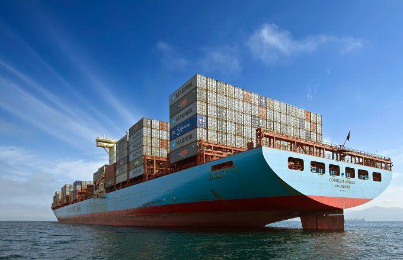

The global shipping industry is vital to international trade, enabling the efficient movement of goods across vast oceans. This industry relies predominantly on three types of vessels: tankers, bulk carriers, and container ships. Each plays a crucial role in facilitating different aspects of maritime transport. 

Tankers are specialized vessels designed for the transport of liquid cargoes, including crude oil and various chemicals. Bulk carriers handle large volumes of dry goods such as coal, ores, and grains, essential commodities that fuel industrial and agricultural sectors worldwide. Container ships, however, have revolutionized logistics by using standardized containers, allowing for streamlined cargo handling and integration with other transport modes.

In recent years, algorithmic trading has introduced significant changes to shipping markets, influencing freight rates and operational strategies. This technology leverages complex algorithms and vast datasets to forecast demand patterns and optimize routes, adding a layer of sophistication to maritime operations. Such advancements underscore a shift in market dynamics that stakeholders must navigate.

This article examines the distinct roles each vessel type plays in global trade and the effects of algorithmic trading on their operations. Understanding these aspects aids in appreciating the complexities inherent to global commerce and the ever-evolving nature of the shipping industry.

## Table of Contents

## Understanding Tankers, Bulk Carriers, and Container Ships

Tankers, bulk carriers, and container ships form the backbone of maritime trade, each serving distinct purposes through their specialized designs and operational capacities. These vessel types play pivotal roles in transporting a variety of goods across the global maritime network, facilitating international commerce.

**Tankers** are engineered to transport liquid cargo, encompassing crude oil, refined petroleum products, chemicals, and liquefied natural gas (LNG). They are classified into various subtypes, such as crude oil tankers, product tankers, and chemical tankers, each catering to specific liquid products. The design of tankers focuses on the safe containment and efficient pumping of liquid cargo. Crude oil tankers, for example, are equipped with expansive cargo holds and sophisticated pumping systems to manage large volumes of oil. These vessels vary significantly in size, from smaller Handymax tankers (20,000-60,000 DWT) to ULCCs (Ultra Large Crude Carriers) which can exceed 300,000 DWT. The transportation efficiency of tankers is critical to sustaining energy supplies globally.

**Bulk carriers**, contrastingly, are designed for transporting dry bulk commodities such as coal, iron ore, grains, and bauxite. These vessels are characterized by large cargo holds and robust structures to carry heavy and solid cargo without containerization. Bulk carriers come in various sizes, including Handysize, Supramax, Panamax, and Capesize, each suited to specific trade routes and cargo loads. Factors like draft, beam, and length influence their operational routes, particularly when navigating through international straits and canals. Bulk carriers' efficiency in moving large quantities of raw materials is essential to the production and manufacturing industries worldwide.

**Container ships** have transformed logistics through the use of standardized shipping containers, which streamline loading, transporting, and unloading processes. The uniformity of containers allows for intermodal transport, switching seamlessly between ships, trains, and trucks. Container ships are measured by TEU (Twenty-foot Equivalent Unit), indicating the number of standard containers they can carry. Vessels range from small feeder ships to Ultra Large Container Vessels (ULCVs) capable of transporting more than 20,000 TEUs. This containerization of cargo has significantly reduced shipping times and costs, making global supply chains more efficient and reliable.

Each of these vessel types operates with distinct design considerations and operational efficiencies that define their roles within the maritime ecosystem. Tankers focus on liquid transfer solutions, bulk carriers on the movement of solid cargo, and container ships on maximizing the intermodal capacity of standardized containers. These capabilities underscore the diversity and specialization within maritime trade, enabling the seamless flow of varied goods across international waters.

## The Impact of Economic Cycles on Shipping Vessels

Shipping is a cyclical industry, heavily influenced by global economic conditions that affect supply and demand dynamics. This inherent cyclicality is linked to broader economic patterns that dictate the [volume](/wiki/volume-trading-strategy) of trade across various sectors. Economic growth tends to increase demand for goods and commodities, thereby driving demand for shipping services. Conversely, economic downturns often lead to contractions in trade volumes, impacting the shipping industry significantly.

During economic downturns, both bulk carriers and container ships typically experience a reduction in demand. Bulk carriers, which transport large volumes of dry goods like coal, ore, and grains, are directly affected by decreases in industrial activity and commodity consumption. For example, in periods of recession, construction projects may slow down, reducing the demand for materials such as steel and coal, and consequently, the services of bulk carriers.

Container ships, which are pivotal in global trade for transporting manufactured goods, also suffer during economic slowdowns. Consumer demand for products declines as spending power decreases, leading to reduced shipments of consumer goods. This can result in lower freight rates due to excess capacity in the market.

On the other hand, tankers may uniquely benefit from certain conditions during economic downturns. When oil demand falls, oil prices may drop, making it economically feasible to store surplus oil in tankers at sea. This practice of floating storage can lead to increased utilization of tanker fleets even when global trade demand diminishes, providing a buffer against the reduced demand experienced by dry bulk and container shipping segments.

Fluctuations in global demand require shipping companies to adopt adaptive strategies. These strategies might include optimizing fleet deployment, adjusting routes, and implementing cost-saving measures to maintain profitability in the face of volatile market conditions. Additionally, shipping firms may engage in asset management strategies, such as putting vessels in lay-up or selling older ships, during periods of downturn to manage financial stability.

Investment and operating decisions in the shipping industry are strongly influenced by anticipated shifts in global economic trends. Companies may delay or advance new ship orders based on expected future demand conditions. Furthermore, technological investments aimed at improving fuel efficiency and operational costs become crucial during periods of economic uncertainty, as these innovations can enhance competitiveness and sustainability.

Overall, understanding the interplay between economic cycles and shipping vessel demand is essential for stakeholders within the maritime sector. By anticipating economic trends and employing strategic adaptability, shipping companies can better navigate the inherent [volatility](/wiki/volatility-trading-strategies) of the global marketplace.

## Algorithmic Trading in Maritime Markets

Algorithmic trading has significantly transformed maritime markets by employing advanced algorithms to execute trades that influence freight rates and optimize vessel utilization. These algorithms function by processing extensive datasets to predict shipping demand patterns and determine optimal routes, which enhances the efficiency of maritime operations.

In maritime logistics, the application of [algorithmic trading](/wiki/algorithmic-trading) facilitates real-time decision-making. This capability is crucial for adjusting to fluctuating market conditions and optimizing the allocation of resources. For example, predictive algorithms can anticipate cargo movements and market demands, enabling shipping companies to adjust pricing strategies and routing plans to maximize profitability and minimize operational costs. By leveraging [machine learning](/wiki/machine-learning) techniques and data analytics, these algorithms contribute to more precise and faster decision-making processes.

The introduction of algorithmic trading in shipping also presents certain challenges. One significant issue is the potential for increased market volatility. The rapid execution of trade orders, driven by algorithms, can exacerbate price swings and create unstable market conditions. Additionally, there are concerns about regulatory compliance, as the use of automated trading mechanisms necessitates adherence to international trade laws and regulations. This aspect requires continuous monitoring and adaptation to ensure that trading practices align with legal requirements.

Despite these challenges, algorithmic trading offers competitive advantages by reshaping traditional shipping practices. It allows for more dynamic pricing models and improved asset utilization. Shipping companies are increasingly incorporating these technologies to gain a competitive edge, reduce costs, and enhance service delivery.

In summary, the integration of algorithmic trading into maritime markets is a pivotal development that is driving profound changes in the shipping industry. While it offers substantial benefits in terms of operational efficiencies and competitive positioning, it also necessitates careful management of associated challenges such as market volatility and regulatory compliance.

## Challenges and Opportunities in Modern Shipping

The global shipping industry stands at a pivotal juncture where rapid advancements and environmental challenges coexist, shaping its future trajectory. One of the primary challenges is adhering to stringent environmental regulations. Governments and international bodies, such as the International Maritime Organization (IMO), have instituted rigorous standards aimed at reducing emissions and promoting sustainable practices. These regulations necessitate significant modifications to vessel designs, including the integration of energy-efficient engines and the use of cleaner fuels. For instance, the IMO’s 2020 sulfur cap has compelled shipping companies to transition from high-sulfur fuel oil to compliant alternatives, impacting operational costs and strategies.

Digitalization is another transformative force in modern shipping, offering enhanced transparency and operational efficiency. Technologies such as blockchain, big data analytics, and Internet of Things (IoT) devices facilitate real-time tracking of cargo and optimize supply chain management. However, this increased reliance on digital systems comes with cybersecurity risks. The industry's vulnerability to cyberattacks necessitates robust cybersecurity measures to safeguard sensitive data and critical infrastructure. According to a report by Allianz Global Corporate & Specialty, the shipping sector faces significant cyber threats, with the potential to disrupt trade and cause substantial financial losses.

Emerging economies present lucrative growth opportunities for the shipping industry. Countries in Asia, Africa, and Latin America are experiencing rapid industrialization and urbanization, driving the demand for goods and, consequently, shipping services. This global economic expansion requires shipping companies to develop strategic partnerships and adapt to changing market needs, ensuring timely delivery and competitive pricing.

To navigate these challenges and capitalize on opportunities, strategic investments in technology and infrastructure are vital. Shipping companies are increasingly adopting advancements such as autonomous vessels and smart port technology to streamline operations and enhance competitiveness. For example, autonomous vessels, equipped with advanced sensors and navigation systems, promise to revolutionize maritime logistics by reducing human error and operational costs.

Innovation, sustainability, and adaptability will thus define the future of the shipping industry. Companies that embrace these elements will be well-positioned to thrive in an evolving market landscape. By addressing the dual imperatives of environmental responsibility and technological advancement, stakeholders can steer the maritime industry toward a sustainable and prosperous future.

## Conclusion

Tankers, bulk carriers, and container ships are fundamental components of global trade infrastructure, each fulfilling distinct roles and catering to specific market demands. These vessels not only transport essential raw materials and finished products across the globe but also contribute significantly to the efficiency and fluidity of international commerce. Their unique designs and functionalities are tailored to optimize the transportation of various cargo types, thereby supporting the intricate network of global supply chains.

Algorithmic trading has emerged as a transformative force in maritime operations, offering enhanced efficiencies through the application of complex data analysis and predictive models. By leveraging these advanced technologies, shipping companies can better anticipate market fluctuations, optimize routing, and improve overall vessel utilization. However, this increased reliance on algorithmic methods also introduces new layers of complexity. The rapid pace of trading decisions and the immense volume of data processed demand robust systems and processes to manage potential market volatility and ensure compliance with regulatory standards.

For stakeholders within the maritime industry, understanding the dynamic interplay between economic cycles, technological advancements, and regulatory environments is crucial. Economic fluctuations impact vessel demand and freight rates, necessitating adaptive strategies to manage operational and investment risks effectively. Technological innovations, such as those driving algorithmic trading, present opportunities for refining operational practices but require careful integration to navigate associated challenges.

Strategic foresight and agility are imperative for successfully navigating these ongoing challenges. Companies that can anticipate changes and respond swiftly to new market and technological conditions are more likely to maintain a competitive edge within the industry. The future of shipping hinges on a careful balance between technological adoption and adherence to sustainability imperatives. As global environmental regulations become increasingly stringent, the industry must embrace sustainable practices to minimize ecological impact while continuing to innovate and enhance operational efficiencies. Through strategic investments in sustainable technologies and infrastructure, the maritime industry can secure its position as a linchpin of global trade, adapting to and evolving with the ever-changing landscape of international commerce.

## References & Further Reading

[1]: Stopford, M. (2009). "Maritime Economics." Routledge. [Link](https://www.taylorfrancis.com/books/mono/10.4324/9780203891742/maritime-economics-3e-martin-stopford)

[2]: UNCTAD (2016). "Review of Maritime Transport 2016." United Nations Conference on Trade and Development. [Link](https://unctad.org/publication/review-maritime-transport-2016)

[3]: Rodrigue, J.-P., Comtois, C., & Slack, B. (2016). "The Geography of Transport Systems." Routledge. [Link](https://www.taylorfrancis.com/books/mono/10.4324/9780429346323/geography-transport-systems-jean-paul-rodrigue)

[4]: Branch, A. E. (2007). "Elements of Shipping." Routledge. [Link](https://www.taylorfrancis.com/books/mono/10.4324/9780203013083/elements-shipping-alan-edward-branch)

[5]: Clarksons Research. "Shipping Intelligence Network." [Link](https://sin.clarksons.net/)

[6]: IMO (International Maritime Organization). "Sulphur 2020 – cutting sulphur oxide emissions." [Link](https://www.imo.org/en/MediaCentre/HotTopics/Pages/Sulphur-2020.aspx)

[7]: Allianz Global Corporate & Specialty (2018). "Safety and Shipping Review 2018." [Link](https://commercial.allianz.com/content/dam/onemarketing/commercial/commercial/reports/AGCS-Safety-Shipping-Review-2018.pdf)

[8]: Notteboom, T., & Vernimmen, B. (2009). "The effect of high fuel costs on liner service configuration in container shipping." Journal of Transport Geography, 17(5), 325-337. [Link](https://www.sciencedirect.com/science/article/pii/S0966692308000410)