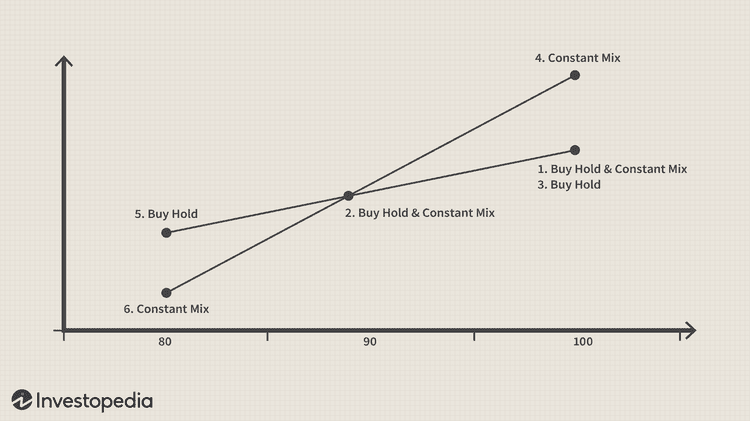

Investing strategies are fundamental to managing a successful portfolio, enabling investors to navigate financial markets effectively and achieve their long-term objectives. A comprehensive grasp of different approaches can assist in tailoring strategies that align with individual or institutional financial goals.

This article will investigate portfolio management strategies, specifically focusing on the buy-and-hold and constant-mix strategies, within the framework of algorithmic trading. Each strategy addresses portfolio management uniquely, providing distinct advantages and potential drawbacks dependent on market conditions and investor aspirations.

The buy-and-hold strategy involves purchasing a well-diversified asset mix and maintaining these holdings over an extended period. This passive investment approach is predicated on the belief that, historically, markets have trended upwards, allowing assets to appreciate over time. By minimizing trading frequency, this strategy often results in reduced transaction costs and lower tax implications. However, a buy-and-hold approach might lead to imbalanced portfolios as market dynamics shift, potentially increasing risk during periods of heightened volatility.

In contrast, the constant-mix strategy is dynamic, requiring the active maintenance of a fixed ratio of asset classes within a portfolio. This technique follows contrarian principles, involving the sale of appreciating assets and the purchase of depreciating ones, thereby capitalizing on market oscillations. While offering the potential for balancing portfolios in volatile markets, constant-mix strategies demand frequent rebalancing, which may give rise to higher transaction expenses.

Algorithmic trading introduces automation and precision into portfolio management. By employing algorithms, investors can continuously monitor markets and execute trades with minimal manual input, refining both the buy-and-hold and constant-mix strategies. The computational capabilities enhance execution speed and help manage transaction costs effectively, significant factors for maximizing investment returns. Despite these benefits, investors must ensure their algorithms are robust and continually updated to reflect evolving market conditions.

Through this exploration, the article aims to equip investors with a clearer understanding of buy-and-hold and constant-mix strategies underpinned by algorithmic trading. By assessing the principles and practical implications, investors can make informed decisions about which methods align best with their personal risk tolerance, market outlook, and financial objectives.

## Table of Contents

## Understanding Buy-And-Hold Strategy

The buy-and-hold strategy is a foundational investment approach characterized by the purchase and retention of a mix of assets over an extended period, eschewing frequent buying or selling to adjust to market fluctuations. This strategy is grounded in the belief that markets, over time, trend upwards, enabling the value of assets to appreciate naturally. Historical data supports this viewpoint, showing that broad market indices such as the S&P 500 have tended to increase in value over decades, despite short-term [volatility](/wiki/volatility-trading-strategies).

A hallmark of the buy-and-hold strategy is its passive nature. By minimizing active trading, investors can achieve significant reductions in transaction costs, which would otherwise erode returns if frequent buying and selling were undertaken. Additionally, this strategy can offer tax advantages. In many jurisdictions, capital gains taxes are lower for long-term investments compared to short-term trades, which can enhance net returns.

However, there are inherent risks associated with a buy-and-hold strategy. Over time, the asset portfolio may become imbalanced due to varying rates of return among the assets held. For instance, if equities outperform bonds significantly, an initially balanced portfolio could become overly equity-heavy, increasing portfolio risk. Furthermore, during periods of heightened market volatility, the lack of rebalancing may expose investors to increased drawdowns.

Despite these risks, the buy-and-hold strategy remains popular among investors with a longer time horizon and a higher risk tolerance. By allowing market forces to work over time, this strategy aims to benefit from compound growth while avoiding the pitfalls of market timing and emotional decision-making.

## Exploring Constant-Mix Strategy

The constant-mix strategy is an active portfolio management approach that involves maintaining a predetermined ratio of different asset classes. This strategy requires investors to regularly rebalance their portfolios by selling assets that have increased in value and buying those that have decreased. This contrarian method aligns with the principle of "buy low, sell high," which can be advantageous in volatile or oscillating markets.

The fundamental objective of the constant-mix strategy is to keep the asset allocation in line with specific investment targets. For instance, if an investor aims for a portfolio composition of 60% stocks and 40% bonds, they would rebalance their holdings accordingly. If the stock market rises and the stocks now represent 70% of the portfolio, the investor would sell a portion of stocks and purchase bonds to restore the initial 60/40 allocation.

This rebalancing acts as a counter-cyclical measure. By selling assets after a price increase and buying after a decrease, investors can potentially secure returns during market fluctuations. The key mathematical component of the strategy involves maintaining a constant ratio, represented by:

$$
\text{New investment} = (\text{Target ratio} \times \text{Total portfolio value}) - \text{Current value of asset}
$$

The constant-mix strategy can outperform in markets where asset prices frequently oscillate, as it takes advantage of interim price movements. However, the need for regular portfolio rebalancing results in higher transaction costs compared to passive strategies like buy-and-hold. These costs can accumulate due to frequent trading, and the strategy might underperform in consistently trending markets where rebalancing could prevent investors from fully benefiting from continuing trends.

Investors implementing a constant-mix strategy should consider using [algorithmic trading](/wiki/algorithmic-trading) for efficiency. Automated systems can monitor asset ratios and execute trades with precision, minimizing manual efforts and reducing the potential for human error. Despite its advantages, relying solely on automated strategies without periodic reviews could lead to vulnerabilities, especially in rapidly changing market environments. Thus, careful design and monitoring of algorithms are vital for optimizing the constant-mix approach.

## The Role of Algorithmic Trading

Algorithmic trading has revolutionized portfolio management by incorporating technology to automate and streamline the execution of investment strategies. This approach provides significant advantages, particularly for strategies like buy-and-hold and constant-mix, where efficiency and precision are paramount. 

Algorithms are capable of continuously monitoring markets and executing trades based on pre-set rules, which dramatically reduces the need for manual intervention. This capability allows for portfolios to be rebalanced with greater accuracy and at optimal times, ensuring alignment with investment goals without the delays inherent in manual monitoring. For instance, an algorithm designed to maintain a constant asset ratio in a constant-mix strategy can automatically sell over-performing assets and buy under-performing ones to maintain the desired balance.

Furthermore, algorithmic trading optimizes execution speed, which is crucial in volatile markets where prices can change rapidly. The ability to execute trades at optimal times minimizes slippage and ensures that investors are getting the best possible execution price. This speed translates into reduced transaction costs, enhancing the net returns of the portfolio by preventing unnecessary expenses that can arise from delays and decision-making lags in manual trading.

However, while the advantages are clear, it's essential that investors ensure their algorithms are robustly designed and periodically reviewed. Market conditions can change unpredictably, and what worked in the past may not be as effective in the future. Regular reviews and updates of trading algorithms help ensure they remain aligned with investment strategies and market realities. Decision-making criteria, risk management parameters, and trading rules should be revisited to adapt to new patterns or economic conditions. Investors should also be mindful of the data quality and parameters used in these algorithms, as inaccuracies can lead to suboptimal trading decisions.

In summary, algorithmic trading enhances the management of investment strategies by offering automated trading solutions that improve efficiency and reduce costs. Through continuous market monitoring and timely execution, algorithms contribute to maintaining balanced portfolios that are in line with predetermined investment strategies, provided they are consistently evaluated and adapted to dynamic market environments.

## Buy-And-Hold vs. Constant-Mix in Different Market Conditions

In different market conditions, selecting the appropriate portfolio management strategy is pivotal for investors. The buy-and-hold strategy is often more effective in trending markets, where asset values are on an upward trajectory. The long-term nature of this strategy allows investors to benefit from the compounding of returns. As asset prices increase over time, the portfolio appreciates, maximizing gains without the need for frequent trades or realignment. This is especially advantageous in scenarios where the market exhibits sustained growth, as consistently holding the assets leverages the upward trend.

Conversely, the constant-mix strategy is particularly beneficial in oscillating or mean-reverting markets, where asset prices fluctuate frequently. This strategy's principle involves maintaining a predetermined asset allocation through regular rebalancing. For instance, if one asset class underperforms and its portfolio percentage reduces, the strategy dictates purchasing more of this asset, thus capitalizing on the reduced prices. Similarly, when an asset class overperforms, the strategy involves selling portions of it to lock in gains and maintain balance. This "buy low, sell high" mechanism effectively exploits market volatility and ensures that the portfolio remains aligned with the investor's risk preference and diversification goals.

Forecasting market movements is crucial for investors when deciding between the two strategies. A favorable trend analysis would suggest a buy-and-hold approach to maximize gains from long-term growth potentials. On the other hand, anticipating market volatility and oscillations aligns well with the constant-mix strategy, allowing investors to turn market fluctuations into profit opportunities. Understanding the market's nature and recognizing patterns can be instrumental in optimizing portfolio returns through the appropriate strategy.

In summary, choosing between buy-and-hold and constant-mix strategies depends significantly on market conditions. Recognizing the distinctions between trending and oscillating markets can equip investors to align their strategies with prevailing economic climates and personal financial goals.

## Conclusion

Both buy-and-hold and constant-mix strategies present distinct benefits, making them suitable for different investment environments and objectives. The buy-and-hold strategy is aligned with long-term growth, capitalizing on the general upward trend of markets. It is particularly advantageous for investors seeking to minimize transaction costs and tax liabilities, as it involves fewer trades. However, it may expose investors to higher risks during volatile market phases due to potential imbalances in asset allocation.

In contrast, the constant-mix strategy is favorable in fluctuating markets. Its active nature leverages market volatility by consistently rebalancing to maintain a predetermined asset allocation, adhering to the principle of "buy low, sell high." This approach, while beneficial in turbulent markets, can result in increased transaction costs due to its frequent trading activity.

Algorithmic trading enhances both strategies by significantly improving the precision and speed of executing trades, minimizing human errors, and decreasing slippage. Algorithms enable automatic and continuous market monitoring, facilitating timely rebalancing actions in constant-mix strategies and maintaining the desired asset allocation with minimal manual intervention. For the buy-and-hold strategy, algorithms can help handle the minor adjustments that may be necessary without deviating from the long-term investment perspective.

Investors must carefully evaluate their risk tolerance, market expectations, and operational costs when selecting either strategy. An understanding of one's own financial goals and constraints is crucial in making an informed choice. Furthermore, continuous monitoring and adaptability are essential for investors to navigate the ever-changing financial landscape effectively. As both strategies have unique advantages, careful strategizing and ongoing assessment are key components of successful portfolio management.

## References & Further Reading

[1]: "Asset Allocation: Balancing Financial Risk" by Roger C. Gibson, which provides extensive insights into investment strategies, including buy-and-hold and constant-mix approaches.

[2]: "Common-Sense on Mutual Funds: New Imperatives for the Intelligent Investor" by John C. Bogle, offering perspectives on buy-and-hold strategies.

[3]: "Quantitative Equity Portfolio Management: An Active Approach to Portfolio Construction and Management" by Ludwig B. Chincarini and Daehwan Kim, detailing methods and techniques, relevant to algorithmic applications in constant-mix strategies.

[4]: "Algorithmic Trading: Winning Strategies and Their Rationale" by Ernie Chan for understanding the role of algorithms in automating trading strategies like buy-and-hold and constant-mix.

[5]: Bodie, Z., Kane, A., & Marcus, A. J. (2013). "Investments" (10th ed.). New York: McGraw-Hill/Irwin, providing foundational knowledge on portfolio management and investment strategies.