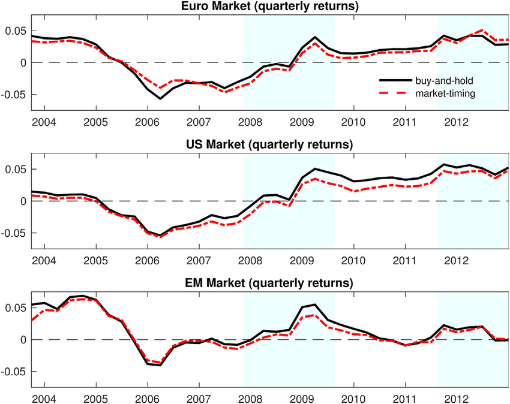

## Table of Contents

## What is buy-and-hold investing?

Buy-and-hold investing is a strategy where you buy stocks or other investments and keep them for a long time, instead of trading them often. The idea is to benefit from the growth of the investments over many years. People who use this strategy believe that, over time, the market will go up, and their investments will become more valuable. This approach requires patience and a long-term view, as it can take years or even decades to see big gains.

One of the main benefits of buy-and-hold investing is that it can save you time and reduce stress. Instead of constantly watching the market and making decisions about when to buy or sell, you can set up your investments and let them grow. This strategy also tends to have lower costs because you are not paying fees for frequent trading. However, it's important to choose your investments wisely and be prepared to hold onto them even if the market goes through ups and downs.

## What is market timing?

Market timing is when investors try to guess the best times to buy and sell stocks or other investments. They watch the market closely and try to buy when prices are low and sell when prices are high. This strategy needs a lot of time and skill because it's hard to predict what the market will do next.

People who use market timing think they can make more money by jumping in and out of the market at the right moments. But it's risky because if they guess wrong, they could lose money. Also, it can be stressful and time-consuming to always be watching the market and making quick decisions. Many experts believe that it's better to invest for the long term instead of trying to time the market.

## How does buy-and-hold investing work?

Buy-and-hold investing is when you buy stocks or other investments and keep them for a long time, maybe many years. The idea is that over time, the value of your investments will grow. People who use this strategy believe that even though the market can go up and down, it will generally go up over the long term. So, instead of trying to guess when to buy and sell, you just hold onto your investments and let them grow.

This strategy can be good because it saves you time and reduces stress. You don't have to watch the market every day or make quick decisions about when to buy or sell. It also tends to be cheaper because you're not paying fees for trading a lot. But it's important to pick your investments carefully and be ready to keep them even if the market goes through tough times. Over many years, this approach can lead to big gains as your investments grow in value.

## How does market timing work?

Market timing is when investors try to guess the best times to buy and sell investments. They watch the market closely and try to buy when prices are low and sell when prices are high. This means they are always trying to predict what the market will do next, which can be really hard because the market can be unpredictable.

People who use market timing think they can make more money by jumping in and out of the market at just the right times. But it's risky because if they guess wrong, they could lose money. It can also be stressful and take a lot of time to always be watching the market and making quick decisions. Many experts think it's better to invest for the long term instead of trying to time the market.

## What are the key differences between buy-and-hold and market timing?

Buy-and-hold investing means you buy stocks or other investments and keep them for a long time. You believe that over many years, the market will go up, so your investments will grow in value. This strategy saves you time and reduces stress because you don't need to watch the market every day. It's also usually cheaper because you're not paying fees for trading often. The main idea is to pick good investments and hold onto them, even if the market has ups and downs.

Market timing is different because you try to guess the best times to buy and sell. You watch the market closely and try to buy when prices are low and sell when they're high. This can be risky because it's hard to predict what the market will do next. If you guess wrong, you could lose money. It's also stressful and takes a lot of time to always be watching the market and making quick decisions. Many people think it's better to invest for the long term with buy-and-hold instead of trying to time the market.

## What are the potential benefits of buy-and-hold investing?

One of the biggest benefits of buy-and-hold investing is that it saves you time and reduces stress. Instead of constantly watching the market and trying to guess when to buy or sell, you can buy your investments and then just let them grow over time. This means you don't have to worry about the ups and downs of the market every day. It's like planting a tree and letting it grow, instead of trying to pick the perfect time to plant and harvest.

Another benefit is that buy-and-hold investing can be cheaper. When you buy and hold, you don't pay as many fees as you would if you were trading a lot. Over time, these savings can add up and make a big difference in how much money you keep. Also, by holding onto your investments for a long time, you give them the chance to grow and become more valuable. Many people find that their investments do well over many years, even if there are some rough patches along the way.

## What are the potential benefits of market timing?

The main benefit of market timing is that it can help you make more money if you guess right. If you can buy when prices are low and sell when they are high, you might make bigger profits than if you just held onto your investments. This can be exciting and rewarding when it works out, as you feel like you're beating the market and making smart moves.

Another benefit is that market timing gives you a sense of control over your investments. Instead of just sitting back and waiting for your investments to grow, you're actively making decisions and trying to take advantage of market changes. This hands-on approach can be appealing to people who like to be involved in their financial decisions and feel like they're doing something to improve their returns.

## What are the risks associated with buy-and-hold investing?

One of the main risks of buy-and-hold investing is that you might hold onto an investment that doesn't do well over time. If you pick a stock or a fund that doesn't grow or even loses value, you could end up losing money. It's hard to know in advance which investments will do well, so there's always a chance you could pick the wrong ones.

Another risk is that the market can go through long periods of being down, which can be hard to handle. Even if you believe in the long-term growth of the market, it can be tough to see your investments lose value for months or even years. This can be especially hard if you need to use that money soon, because you might have to sell your investments at a loss.

## What are the risks associated with market timing?

One big risk of market timing is that it's really hard to guess when the market will go up or down. If you buy when you think prices are low but they keep falling, you could lose a lot of money. And if you sell when you think prices are high but they keep going up, you miss out on making more money. It's like trying to predict the weather, but the market is even harder to predict because so many things can change it.

Another risk is that market timing can make you stressed out and tired. You have to watch the market all the time and make quick decisions. This can feel like a lot of pressure, and if you make a mistake, it can be really upsetting. Plus, all this trading can add up in fees, which can eat into any money you make. So even if you get some things right, the costs and stress might not be worth it in the end.

## How do historical performance data compare between buy-and-hold and market timing strategies?

Historical performance data often show that buy-and-hold investing can do better than market timing over the long run. When you look at the stock market over many years, it usually goes up. So, if you buy good investments and keep them for a long time, they can grow a lot. Many studies have found that buy-and-hold investors often beat market timers because it's hard to guess the market right all the time. Even professional investors who try to time the market often don't do as well as the overall market.

Market timing can work sometimes, but it's risky and hard to do well consistently. Historical data show that even when market timers make good guesses, they can still lose out because of the fees they pay for trading a lot. Also, missing just a few of the best days in the market can hurt your returns a lot. So, while market timing might look good in short bursts, over many years, buy-and-hold usually comes out ahead because it's simpler and less risky.

## What factors should an investor consider when choosing between buy-and-hold and market timing?

When choosing between buy-and-hold and market timing, an investor should think about how much time and effort they want to put into their investments. Buy-and-hold is easier because you just pick good investments and keep them for a long time. You don't have to watch the market every day or make quick decisions. It's good for people who want to invest without spending a lot of time on it. Market timing, on the other hand, needs a lot of work. You have to watch the market closely and try to guess when to buy and sell. It can be exciting but also stressful and time-consuming.

Another thing to consider is how much risk you're okay with. Buy-and-hold is less risky because you're not trying to guess what the market will do next. You believe that over time, the market will go up, so you hold onto your investments even if they go down for a while. Market timing is riskier because if you guess wrong, you could lose a lot of money. It's like trying to predict the weather, but it's even harder because the market can change a lot. So, if you don't like taking big risks, buy-and-hold might be better for you.

## Can a combination of buy-and-hold and market timing strategies be effective, and how?

Yes, combining buy-and-hold and market timing strategies can be effective for some investors. You can have most of your money in buy-and-hold investments, like stocks or funds that you keep for many years. These investments grow over time, and you don't have to worry about them every day. But you can also use a small part of your money to try market timing. This means you might buy and sell some investments more often, trying to make extra money by guessing when the market will go up or down. This way, you get the steady growth of buy-and-hold and the chance to make more money with market timing.

The key is to not put too much of your money into market timing because it's risky. If you guess wrong, you could lose money. But if you only use a small part of your money for this, it won't hurt your overall investments too much. And if you guess right, you can add that extra money to your buy-and-hold investments. This mix can help you feel more in control of your investments while still having the safety of long-term growth. It's like having a steady job but also trying to make some extra money on the side.

## References & Further Reading

[1]: Ellis, C.D., & Malkiel, B.G. (1991). ["The Loser's Game"](https://www.amazon.com/Elements-Investing-Burton-G-Malkiel/dp/0470528494) - Financial Analysts Journal.

[2]: Pedersen, L.H. (2015). ["Efficiently Inefficient: How Smart Money Invests and Market Prices are Determined"](https://www.amazon.com/Efficiently-Inefficient-Invests-Market-Determined/dp/0691166196).

[3]: Markowitz, H. (1952). ["Portfolio Selection."](https://onlinelibrary.wiley.com/doi/abs/10.1111/j.1540-6261.1952.tb01525.x) The Journal of Finance.

[4]: Burton G. Malkiel. (2003). ["A Random Walk Down Wall Street: The Time-Tested Strategy for Successful Investing"](https://yourknowledgedigest.org/wp-content/uploads/2020/04/a-random-walk-down-wall-street.pdf).

[5]: Stefan Jansen. (2020). ["Machine Learning for Algorithmic Trading: Second Edition"](https://github.com/stefan-jansen/machine-learning-for-trading).