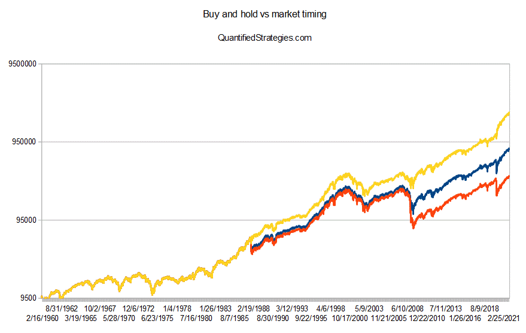

In the world of investing, strategies are as diverse as the investors employing them, catering to a spectrum of risk tolerance levels and financial objectives. Typically, these strategies can be categorized broadly into active and passive approaches. Among these, market timing and buy-and-hold investing stand out as two prevalent strategies, each with distinct philosophies and outcomes. 

Market timing is an active investment strategy that involves making buy or sell decisions of financial assets by attempting to predict future market price movements. Proponents argue that it allows investors to optimize their entry and exit points in the market, potentially maximizing returns. However, market timing is inherently challenging due to the unpredictable nature of market trends, and research often suggests that it underperforms compared to more constant approaches like buy-and-hold.



Conversely, buy-and-hold investing is a passive strategy where investors purchase securities and retain them for an extended period, regardless of market volatility. This approach is based on the premise that, over the long term, markets tend to rise, and short-term fluctuations are merely temporary setbacks. Advocates highlight the benefits of reduced transaction costs and tax advantages from long-term capital gains, although it demands resilience from investors in the face of inevitable market swings.

In recent times, algorithmic trading has gained traction, leveraging software to automate trading decisions based on pre-established criteria. This method provides significant speed and efficiency, outperforming the capabilities of human traders when executing complex strategies. While algorithmic trading is often seen as most effective for short-term trading strategies, it can complement both market timing and buy-and-hold approaches when integrated thoughtfully.

This article investigates the differences and potential synergies between these investment strategies. By providing insights into each method's strengths and weaknesses, it aims to guide both novice and experienced investors in refining their approach to meet specific financial goals.

## Table of Contents

## Understanding Buy-and-Hold Investing

Buy-and-hold investing involves purchasing securities with the intention of maintaining ownership over a long period, regardless of short-term market fluctuations. This approach is rooted in the belief that markets tend to rise over the long-term, allowing investors to benefit from compound growth and market appreciation without the need for frequent trading.

A central advantage of buy-and-hold investing is its ability to withstand market [volatility](/wiki/volatility-trading-strategies). By maintaining a long-term perspective, investors are less likely to be swayed by daily market news and short-term price movements. Historical data supports the notion that stock markets generally increase in value over time, despite experiencing cycles of ups and downs. For instance, the S&P 500 Index, which measures the performance of 500 leading US companies, has delivered an average annual return of approximately 7-10% over several decades, even accounting for market corrections and crashes.

The passive nature of buy-and-hold investing also brings financial benefits. Transaction costs are minimized as buying and selling of securities is infrequent, compared to active trading strategies that require continuous adjustments. With fewer trades, investors save on brokerage fees, which can significantly impact returns when compounded over time. Furthermore, by holding securities for more than a year, investors may qualify for long-term capital gains tax rates, which are usually lower than short-term rates applied to assets sold within a year.

However, buy-and-hold investing is not without challenges. Investors must possess the fortitude to endure short-term market swings and the patience to await long-term growth. Emotional resilience is critical when faced with significant market downturns, as the instinct to sell off holdings in a panic might lead to losses or missed opportunities for recovery. This approach also requires a disciplined focus on long-term goals, avoiding the temptation to react to temporary market disturbances.

In conclusion, buy-and-hold investing is a strategic choice for those seeking steady growth over the long haul, with reduced costs and potential tax benefits. Its success largely hinges on the investor's ability to overlook short-term volatility and trust in the enduring upward trajectory of financial markets.

## The Concept of Market Timing

Market timing involves making strategic decisions about buying or selling financial assets by attempting to predict future price movements. This approach is based on the belief that, by accurately forecasting market trends, investors can optimize their entry and [exit](/wiki/exit-strategy) points to maximize returns. The practice of market timing can be contrasted with a buy-and-hold strategy, where investors maintain their positions over a prolonged period regardless of market volatility.

Advocates of market timing assert that it has the potential to yield substantial returns under the right circumstances. This method relies on various forms of analysis, such as technical indicators, macroeconomic data, and geopolitical events, which can signal advantageous moments to initiate or close investment positions.

However, market timing is fraught with challenges, primarily due to the inherent unpredictability of financial markets. Accurate predictions necessitate a deep understanding of both the complex factors influencing market movements and the psychological dynamics of the market participants. The difficulty of consistently making accurate predictions means that even seasoned investors can easily miss significant market swings, resulting in opportunity losses.

Studies have consistently shown that market timing is a precarious endeavor. For instance, a research paper published in the Financial Analysts Journal highlighted that market timing strategies often fail to outperform the simpler buy-and-hold approach (Malkiel, B.G., & Ellis, C.D., 1991). The unpredictability of short-term market movements and the tendency of financial markets to revert to a mean imply that attempts to predict performance can lead to suboptimal results over time. Additionally, research often points out that investors employing market timing face higher transaction costs and increased tax liabilities, which can erode potential gains.

In practice, market timing requires a disciplined approach to avoid the pitfalls of emotional biases and adhere to predetermined rules and signals. Despite its appeal, the strategy remains controversial and is typically recommended only for investors who have the capacity to absorb potential short-term liabilities and possess the requisite expertise to interpret market signals accurately. Ultimately, overcoming the challenges of market timing demands rigorous analytical skills and the psychological resilience to navigate volatile market conditions.

## Algorithmic Trading: A New Era

Algorithmic trading leverages sophisticated computer algorithms to execute trades at lightning speed based on pre-specified criteria and patterns. This form of trading offers a high degree of efficiency, permitting the execution of complex trading strategies that far exceed the capabilities of any human trader in terms of speed and precision.

One of the primary advantages of [algorithmic trading](/wiki/algorithmic-trading) is its ability to analyze vast amounts of market data in real time, identifying patterns and executing trades within milliseconds. Algorithms can be programmed to respond to various factors such as price movements, [volume](/wiki/volume-trading-strategy), or other market indicators, enabling the quick identification of profitable opportunities. This speed is particularly beneficial for strategies that rely on exploiting short-term price inefficiencies.

While algorithmic trading is prominently used for short-term strategies like high-frequency trading, its scope is not limited to these applications. It can be effectively integrated with long-term buy-and-hold strategies by employing algorithms for optimal asset selection or rebalancing purposes. Moreover, when used alongside market timing, algorithms can enhance the precision of entry and exit timing, potentially maximizing returns.

For implementing algorithmic trading strategies, key considerations involve rigorous [backtesting](/wiki/backtesting), which refers to testing the algorithm against historical data to verify its effectiveness. This process helps in optimizing the strategy, ensuring that it performs well under different market conditions. Backtesting requires careful adjustment of parameters to avoid overfitting, where the model is too closely tailored to past data and performs poorly in future scenarios.

Additionally, continuous monitoring and evaluation of algorithmic performance are crucial. Market conditions are dynamic, and algorithms must be frequently updated to stay relevant. This involves algorithm recalibration, where initial parameters are tweaked to reflect current market trends and prevent systematic errors.

In summary, algorithmic trading represents a new era of investing, characterized by advanced technology that can outperform traditional trading methods in numerous scenarios. However, its successful implementation requires a deep understanding of both the algorithms and the markets in which they operate, along with ongoing adjustments and oversight to adapt to market changes.

## Comparing Strategies: Pros and Cons

Buy-and-hold strategies are designed for investors seeking long-term growth with minimal reaction to market volatility. This approach involves purchasing securities and holding them over an extended period, thereby capitalizing on the overall upward trajectory of markets. One key advantage is its simplicity and cost-effectiveness, as it minimizes transaction costs and capitalizes on long-term capital gains tax advantages. Moreover, by avoiding frequent trading, investors are less likely to fall prey to market timing errors or emotional decision-making. However, this strategy requires a tolerance for short-term market fluctuations and periods of potential underperformance compared to more active strategies.

Market timing involves actively making buy or sell decisions based on predictions of future market movements. Advocates argue that successful market timing can lead to substantial returns by optimizing entry and exit points in response to market signals. However, the unpredictability of markets makes it challenging to consistently predict short-term movements accurately. Studies, such as those by Morningstar, have shown that market timing often underperforms compared to a stable buy-and-hold approach, primarily due to the risk of missing key market upswings or downswings. Thus, while the potential for higher returns exists, the risk of significant losses is also present if predictions are incorrect.

Algorithmic trading employs computer programs to automate trading decisions based on pre-set criteria or predictive models. The primary benefit is the ability to execute trades with precision and speed impossible for human traders, allowing for the implementation of complex strategies and efficient management of vast data sets. This technological advantage is particularly beneficial for short-term trading strategies that require rapid execution. However, algorithmic trading necessitates rigorous testing and continuous oversight to ensure that algorithms remain effective and adapt to changing market conditions. Issues such as overfitting to historical data or mechanical errors can pose significant risks if not properly managed.

Overall, the choice of investment strategy should align with the investor’s goals, risk tolerance, and level of technological expertise. Buy-and-hold strategies cater to those prioritizing long-term growth with minimal day-to-day involvement. In contrast, market timing offers potential high returns but with greater risk, requiring active management and market insight. Algorithmic trading demands a higher proficiency in technology and algorithm management but can offer unparalleled efficiency and execution speed. Each strategy presents unique pros and cons, and an investor's decision should be informed by their specific financial objectives and risk appetite.

## Combining Strategies for Optimal Outcomes

Diversifying across investment strategies is a prudent approach for optimizing portfolios in the financial markets. By integrating various methods, investors can achieve a balanced portfolio that leverages the strengths of each strategy and mitigates their individual weaknesses.

Combining buy-and-hold with market timing involves using the long-term stability of buy-and-hold to anchor a portfolio, while strategically timing market entries and exits for smaller portions of the investment to capitalize on short-term opportunities. This hybrid approach enables an investor to maintain a core, steady investment, while a portion of their capital is actively adjusted to respond to anticipated market movements. This combination seeks to provide the overall portfolio with both stability and the potential for enhanced returns.

Integrating algorithmic mechanisms with traditional strategies enhances decision-making and risk management. Algorithms can process vast amounts of market data much faster than humans and identify patterns or anomalies that might not be apparent through manual analysis. By implementing algorithmic components, such as quantitative models for asset selection or timing decisions, investors can generate signals for more informed trading decisions. For instance, algorithms could dynamically adjust the buy-and-hold allocation in response to market volatility indicators, potentially improving risk-adjusted returns.

Python code for a simplistic strategy that combines buy-and-hold with a basic algorithmic timing signal might look like this:

```python
import yfinance as yf
import numpy as np

# Fetch historical data
ticker = "AAPL"
data = yf.download(ticker, start="2010-01-01", end="2023-01-01")

# Adding simple moving average as a timing signal
short_window = 40
long_window = 100
data['Short_MA'] = data['Close'].rolling(window=short_window, min_periods=1).mean()
data['Long_MA'] = data['Close'].rolling(window=long_window, min_periods=1).mean()

# Buy-and-hold position
data['Buy_and_Hold_Position'] = 1

# Timing position based on moving averages
data['Timing_Position'] = np.where(data['Short_MA'] > data['Long_MA'], 1, 0)

# Combine strategies with a blended position
# Assume 80% dedicated to buy-and-hold and 20% to timing
data['Blended_Position'] = 0.8 * data['Buy_and_Hold_Position'] + 0.2 * data['Timing_Position']

# Calculate returns
data['Market_Returns'] = data['Close'].pct_change()
data['Strategy_Returns'] = data['Blended_Position'].shift(1) * data['Market_Returns']

# Assess performance
cumulative_returns = (1 + data['Strategy_Returns']).cumprod() - 1
print("Cumulative Portfolio Return:", cumulative_returns[-1])
```

Finally, portfolios benefit from tailored strategies to optimize long-term growth and short-term gains. By exploiting the synergies between buy-and-hold, market timing, and algorithmic trading, investors can craft an investment strategy that achieves a specific risk-return profile. This tailoring aligns well with individual investor goals and changing market environments, potentially enhancing portfolio performance while managing risk exposure proactively. Ultimately, combining strategies in a thoughtful manner provides the flexibility and resilience necessary to navigate diverse financial landscapes.

## Special Considerations and Risks

Investment strategies are complex and can be significantly impacted by various factors, including tax implications, transaction costs, and prevailing market conditions. An understanding of these considerations is essential for effective investment planning and execution.

Tax implications can vary significantly across different strategies. For instance, buy-and-hold investors may benefit from long-term capital gains tax advantages, as their investments are held for extended periods. Conversely, frequent trading, often characteristic of market timing and algorithmic trading, can result in higher short-term capital gains taxes. This difference can materially affect net investment returns.

Transaction costs are another crucial [factor](/wiki/factor-investing). Buy-and-hold strategies typically incur lower transaction costs due to infrequent trading. In contrast, market timing and algorithmic trading, which involve frequent buying and selling, can lead to increased costs, potentially eroding profits. Investors must carefully consider these costs when evaluating the net benefits of their chosen strategy.

Market conditions, inherently unpredictable, play a critical role in investment strategies. Market timing, for example, hinges on predicting future price movements and is susceptible to the challenges posed by market unpredictability. Investors attempting market timing must account for the psychological hurdles involved, as emotional biases can adversely impact decision-making. Cognitive biases such as overconfidence and recency bias might lead investors to make premature or delayed decisions, potentially undermining the strategy.

Algorithmic trading offers speed and efficiency in responding to market conditions but requires constant oversight to ensure its algorithms are functioning correctly and adapting to shifting market patterns. The risk of mechanical errors is ever-present, emphasizing the need for regular monitoring and adjustment. Algorithms must be backtested rigorously, and ongoing performance should be closely scrutinized to maintain their effectiveness.

Regular review and adjustment of investment strategies are imperative, given the dynamic nature of financial markets. Investors should remain vigilant and responsive to market developments to optimize their investment outcomes. This might entail rebalancing portfolios, updating algorithms, or re-evaluating market timing assumptions.

In summary, successful investment requires a nuanced understanding of the implications of taxes, costs, and market conditions, alongside a proactive approach to strategy evaluation and adjustment.

## Conclusion

No singular investment strategy universally addresses the needs of every investor or adapts seamlessly to all market conditions. The key to successful investing lies in embracing diversity and maintaining flexibility within one's strategy. Each approach, whether it be buy-and-hold, market timing, or algorithmic trading, possesses unique characteristics and implications that require careful consideration for informed decision-making.

Investors must commit to continuous learning and adaptability to adeptly navigate the ever-evolving financial landscape. Markets are inherently dynamic, influenced by an array of economic, political, and technological factors. By remaining open to new information and adjusting strategies accordingly, investors can better position themselves to respond to changes and uncertainties.

Long-term success in investing often hinges on a balanced approach that thoughtfully incorporates elements from various strategies. For instance, buy-and-hold strategies offer a foundation for long-term stability, while market timing can inject opportunities for capitalizing on short-term market movements. Algorithmic trading can enhance decision-making efficiency and precision, particularly through backtesting and real-time data analysis.

By evaluating personal risk tolerance, financial goals, and technological proficiency, investors can tailor a diversified investment strategy that integrates these methodologies. This synthesis enables the optimization of both long-term growth and short-term gains, positioning investors to achieve sustainable financial success.

## References & Further Reading

[1]: Ellis, C.D., & Malkiel, B.G. (1991). ["The Loser's Game"](https://www.amazon.com/Elements-Investing-Burton-G-Malkiel/dp/0470528494) - Financial Analysts Journal.

[2]: Pedersen, L.H. (2015). ["Efficiently Inefficient: How Smart Money Invests and Market Prices are Determined"](https://www.amazon.com/Efficiently-Inefficient-Invests-Market-Determined/dp/0691166196).

[3]: Markowitz, H. (1952). ["Portfolio Selection."](https://onlinelibrary.wiley.com/doi/abs/10.1111/j.1540-6261.1952.tb01525.x) The Journal of Finance.

[4]: Burton G. Malkiel. (2003). ["A Random Walk Down Wall Street: The Time-Tested Strategy for Successful Investing"](https://yourknowledgedigest.org/wp-content/uploads/2020/04/a-random-walk-down-wall-street.pdf).

[5]: Stefan Jansen. (2020). ["Machine Learning for Algorithmic Trading: Second Edition"](https://github.com/stefan-jansen/machine-learning-for-trading).