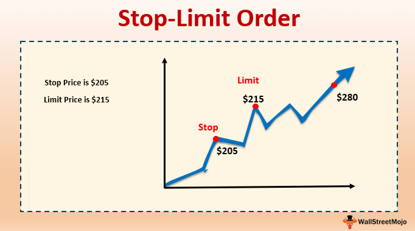

## Table of Contents

## What is a buy limit order?

A buy limit order is a type of order you can place with your broker to buy a stock at a specific price or lower. For example, if you want to buy a stock that is currently trading at $50, but you think it might drop to $45, you can set a buy limit order at $45. This means your order will only be executed if the stock price reaches $45 or lower.

Using a buy limit order can help you get a better price for the stock you want to buy. However, there's a risk that the stock price might never reach your limit price, and you might miss the opportunity to buy the stock if it keeps going up. It's a useful tool for investors who want to control the price they pay for a stock, but it requires careful planning and monitoring of the market.

## What is a sell stop order?

A sell stop order is an order you place with your broker to sell a stock if its price falls to a certain level or lower. For example, if you own a stock that is currently trading at $100, but you want to sell it if it drops to $90, you can set a sell stop order at $90. This means your order will only be executed if the stock price reaches $90 or goes lower.

Using a sell stop order can help you limit your losses if the stock price starts to fall. It's like setting a safety net for your investment. However, there's a risk that the stock price might briefly dip to your stop price and then quickly recover, causing you to sell the stock at a loss when you might have been better off holding onto it. It's important to use sell stop orders carefully and understand the potential risks and benefits.

## How does a buy limit order work?

A buy limit order is a way to tell your broker to buy a stock only if it reaches a certain price or lower. For example, if a stock is trading at $50 and you think it might go down to $45, you can set a buy limit order at $45. This means your order will only be filled if the stock price drops to $45 or below. It's like saying, "I want to buy this stock, but only if I can get it at this specific price or cheaper."

Using a buy limit order can help you buy a stock at a better price than what it's currently trading at. It's a good tool for investors who have a clear idea of what they want to pay for a stock. However, there's a risk that the stock might never reach your limit price, and you could miss out on buying the stock if it keeps going up. So, it's important to think carefully about where you set your limit and keep an eye on the market.

## How does a sell stop order work?

A sell stop order is a way to tell your broker to sell a stock if its price falls to a certain level or lower. For example, if you own a stock that is trading at $100 and you want to sell it if it drops to $90, you can set a sell stop order at $90. This means your order will only be filled if the stock price reaches $90 or goes below that.

Using a sell stop order can help you limit your losses if the stock price starts to fall. It's like setting a safety net for your investment. However, there's a risk that the stock price might briefly dip to your stop price and then quickly recover, causing you to sell the stock at a loss when you might have been better off holding onto it. So, it's important to use sell stop orders carefully and understand the potential risks and benefits.

## What are the primary differences between buy limit and sell stop orders?

A buy limit order and a sell stop order are two different ways to tell your broker to buy or sell a stock at a specific price. A buy limit order is used when you want to buy a stock, but only if you can get it at a certain price or lower. For example, if a stock is trading at $50 and you think it might drop to $45, you can set a buy limit order at $45. This means your order will only be filled if the stock price reaches $45 or goes below that. It's a way to try and get a better price for the stock you want to buy.

On the other hand, a sell stop order is used when you want to sell a stock if its price falls to a certain level or lower. For example, if you own a stock that is trading at $100 and you want to sell it if it drops to $90, you can set a sell stop order at $90. This means your order will only be filled if the stock price reaches $90 or goes below that. It's like setting a safety net to limit your losses if the stock price starts to fall. Both types of orders help you control when you buy or sell a stock, but they work in different ways and serve different purposes.

## In what scenarios would a trader use a buy limit order?

A trader might use a buy limit order when they want to buy a stock, but only if they can get it at a price they think is a good deal. For example, if a stock is trading at $50, but the trader thinks it's a good buy at $45, they can set a buy limit order at $45. This way, the order will only go through if the stock price drops to $45 or lower. It's like telling the broker, "I want to buy this stock, but only if I can get it cheap."

This type of order is useful when a trader is trying to get a better price than what the stock is currently trading at. It's good for people who have a clear idea of what they want to pay for a stock and are willing to wait for the price to come down. However, there's a risk that the stock might never reach the limit price, and the trader could miss out on buying the stock if it keeps going up. So, it's important for the trader to think carefully about where they set their limit and keep an eye on the market.

## In what scenarios would a trader use a sell stop order?

A trader would use a sell stop order when they want to sell a stock if its price starts to fall to a certain level. For example, if a trader owns a stock that is trading at $100, but they want to sell it if it drops to $90, they can set a sell stop order at $90. This way, the order will only go through if the stock price reaches $90 or goes lower. It's like setting a safety net to protect their investment from big losses.

This type of order is useful when a trader wants to limit their losses if the stock price starts to go down. It's good for people who want to make sure they can sell their stock before it loses too much value. However, there's a risk that the stock price might briefly dip to the stop price and then quickly recover, causing the trader to sell the stock at a loss when they might have been better off holding onto it. So, it's important for the trader to think carefully about where they set their stop price and keep an eye on the market.

## What are the potential risks associated with using buy limit orders?

Using a buy limit order can help you buy a stock at a lower price, but there are some risks you need to know about. One big risk is that the stock price might never reach your limit price. If you set your buy limit order too low, the stock might keep going up instead of coming down to your price. This means you could miss out on buying the stock if it keeps going up and you stick to your limit.

Another risk is that the stock might only briefly touch your limit price. If you're not quick enough, the stock price could go back up before your order is filled. This can be frustrating if you really want to buy the stock but it doesn't stay at your limit price long enough. So, it's important to think carefully about where you set your limit and to keep an eye on the market to make sure you don't miss out on a good opportunity.

## What are the potential risks associated with using sell stop orders?

Using a sell stop order can help you limit your losses if a stock's price starts to fall, but there are some risks you should know about. One big risk is that the stock price might only briefly dip to your stop price and then quickly go back up. If this happens, your order will be filled at the lower price, and you'll sell the stock at a loss, even though the price might have recovered right after. This can be frustrating if you end up selling a stock that you could have held onto for a better outcome.

Another risk is that the stock price might keep falling after your sell stop order is filled. If you set your stop price too high, you might sell the stock at a loss, only to see it keep dropping. This means you could have sold it at an even lower price if you had waited longer. It's important to think carefully about where you set your stop price and to keep an eye on the market to make sure you're making the best decision for your investment.

## How can buy limit and sell stop orders be used together in a trading strategy?

A trader can use buy limit and sell stop orders together to create a trading strategy that helps them buy low and sell high while managing risk. For example, if a trader wants to buy a stock that's currently trading at $50, but they think it might drop to $45, they can set a buy limit order at $45. This way, they can try to buy the stock at a lower price. At the same time, if they already own a stock that's trading at $100, but they want to sell it if it drops to $90, they can set a sell stop order at $90. This helps them limit their losses if the stock price starts to fall.

Using these two types of orders together can help a trader control both the price they pay for a stock and the price they sell it at. It's like setting up a plan to buy the stock at a good price and sell it before it loses too much value. However, it's important for the trader to think carefully about where they set their limit and stop prices and to keep an eye on the market. This way, they can make sure they're making the best decisions for their investment and not missing out on good opportunities or selling too soon.

## What advanced techniques can be applied to optimize the use of buy limit and sell stop orders?

To optimize the use of buy limit and sell stop orders, traders can use a technique called trailing stops. A trailing stop is a type of sell stop order that adjusts as the stock price moves in your favor. For example, if you set a trailing stop at 10% below the stock's highest price, the stop price will move up as the stock price goes up, but it won't move down if the stock price drops. This can help you lock in profits while still giving the stock room to grow. You can use this alongside a buy limit order to buy a stock at a lower price and then use the trailing stop to sell it if it starts to fall, helping you make the most of the stock's upward movements.

Another advanced technique is to use technical analysis to set your buy limit and sell stop orders. Technical analysis involves looking at charts and patterns to predict where the stock price might go next. For example, if you see that a stock often bounces back from a certain price level, you can set your buy limit order just above that level. This way, you're more likely to buy the stock at a good price. Similarly, if you see that a stock often drops after reaching a certain high, you can set your sell stop order just below that high to sell the stock before it starts to fall. By using technical analysis, you can make more informed decisions about where to set your orders, which can help you optimize your trading strategy.

## How do market conditions affect the effectiveness of buy limit and sell stop orders?

Market conditions can really change how well buy limit and sell stop orders work. When the market is calm and prices move slowly, these orders can be very helpful. A buy limit order might get filled at a good price because the stock price has time to reach your limit. A sell stop order can also work well because the stock price might slowly drop to your stop price, giving you a chance to sell before it falls too much. But if the market is very busy and prices jump around a lot, it can be harder. Your buy limit order might not get filled if the stock price never reaches your limit, or it might only touch it for a second before going back up. Your sell stop order could also get filled at a lower price than you wanted if the stock price drops quickly and then goes back up.

In a fast-moving market, it's really important to keep an eye on your orders. If you're not quick enough, you might miss out on buying or selling at the price you wanted. Also, during big news events or when the market opens or closes, prices can change a lot in a short time. This can make it harder for your orders to work the way you planned. So, it's a good idea to think about what's happening in the market and maybe change your orders if things get too wild. By understanding how the market is behaving, you can make better choices about when to use buy limit and sell stop orders.

## References & Further Reading

[1]: Bergstra, J., Bardenet, R., Bengio, Y., & Kégl, B. (2011). ["Algorithms for Hyper-Parameter Optimization."](https://dl.acm.org/doi/10.5555/2986459.2986743) Advances in Neural Information Processing Systems 24.

[2]: ["Advances in Financial Machine Learning"](https://www.amazon.com/Advances-Financial-Machine-Learning-Marcos/dp/1119482089) by Marcos Lopez de Prado

[3]: ["Evidence-Based Technical Analysis: Applying the Scientific Method and Statistical Inference to Trading Signals"](https://www.amazon.com/Evidence-Based-Technical-Analysis-Scientific-Statistical/dp/0470008741) by David Aronson

[4]: ["Machine Learning for Algorithmic Trading"](https://github.com/stefan-jansen/machine-learning-for-trading) by Stefan Jansen

[5]: ["Quantitative Trading: How to Build Your Own Algorithmic Trading Business"](https://www.amazon.com/Quantitative-Trading-Build-Algorithmic-Business/dp/1119800064) by Ernest P. Chan