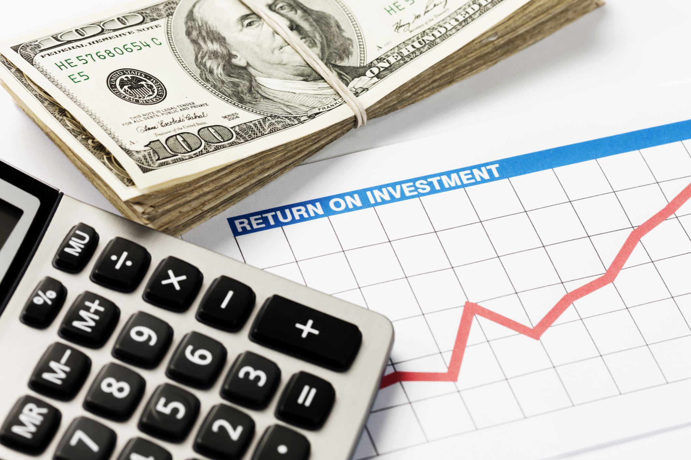

## Table of Contents

## What is CAGR and how is it calculated?

CAGR stands for Compound Annual Growth Rate. It is a way to measure how much something grows over a period of time, like money in an investment or the size of a business. It tells you the average rate of growth per year, as if the growth was smooth and steady, even if it wasn't.

To calculate CAGR, you need to know the starting value, the ending value, and the number of years over which the growth happened. The formula is: CAGR = (Ending Value / Starting Value)^(1 / Number of Years) - 1. For example, if you invested $1,000 and it grew to $1,200 over 2 years, the CAGR would be (1200 / 1000)^(1 / 2) - 1, which equals about 9.5%. This means your investment grew at an average rate of 9.5% per year.

## What is IRR and how is it calculated?

IRR stands for Internal Rate of Return. It's a way to figure out how well an investment is doing by finding the rate at which the investment's gains equal its costs over time. Think of it as the interest rate that makes the total amount of money you get from an investment equal to the total amount of money you put in.

To calculate IRR, you need to know all the cash flows from the investment, both money coming in and money going out. You then use a formula or a financial calculator to find the rate that makes the net present value of these cash flows equal to zero. It's a bit tricky because you usually need to use trial and error or a computer to solve it, but once you find it, the IRR tells you the average annual return you're getting from your investment.

## What are the basic differences between CAGR and IRR?

CAGR, or Compound Annual Growth Rate, and IRR, or Internal Rate of Return, are both ways to measure how well an investment is doing, but they do it in different ways. CAGR looks at the growth of an investment over time and gives you an average yearly growth rate. It's simple to calculate and is great for comparing how different investments have grown over time. You just need to know the starting value, the ending value, and how many years it took to get from start to finish.

On the other hand, IRR is a bit more complex. It figures out the rate at which the total gains from an investment equal the total costs. IRR takes into account all the money coming in and going out at different times during the investment period. It's like finding the interest rate that makes the total value of all those cash flows equal to zero. IRR is useful for deciding if an investment is worth doing because it shows you the average annual return you can expect.

In short, while CAGR gives you a straightforward average growth rate over time, IRR gives you a more detailed look at the profitability of an investment, considering all cash flows. Both are helpful, but they tell you different things about your investment's performance.

## In what scenarios is CAGR more appropriate to use than IRR?

CAGR is more appropriate to use when you want to understand how much an investment has grown over time in a simple way. It's great for looking at things like stock prices, savings accounts, or the size of a business over several years. If you just want to see the average yearly growth from a starting point to an end point, without worrying about all the ups and downs in between, CAGR is the way to go. It's easy to calculate and gives you a clear number that you can use to compare different investments or see how well you're doing over time.

For example, if you're comparing the performance of different mutual funds over the last 5 years, you can use CAGR to see which one grew the most on average each year. It's also useful for personal savings goals, like figuring out how much your savings might grow if you keep adding money to it. Because CAGR gives you a smooth, average growth rate, it's perfect for these kinds of straightforward comparisons and projections.

## In what scenarios is IRR more appropriate to use than CAGR?

IRR is more appropriate to use when you need to see how well an investment is doing by taking into account all the money coming in and going out at different times. It's like figuring out the interest rate that makes the total value of all those cash flows equal to zero. If you're deciding whether to go ahead with a new project or investment, IRR helps you see if it's worth it by showing you the average annual return you can expect. It's great for things like real estate deals, where you might have different costs and rental income over time, or business projects where you need to compare different ways to spend money.

For example, if you're thinking about buying a rental property, you'll have costs like the down payment and repairs, but also income from rent. IRR can show you if the return from the rent will be enough to make the investment worthwhile. It's also useful for businesses when they're looking at different projects and need to see which one will give them the best return on their money. Because IRR considers all the cash flows, it gives a more detailed picture of how profitable an investment might be, which is really helpful for making big decisions.

## How does the time value of money affect CAGR and IRR?

The time value of money is the idea that money today is worth more than the same amount of money in the future. This is because you can use money now to invest or buy things, and it might grow over time. Both CAGR and IRR take this idea into account, but they do it in different ways. When you calculate CAGR, you're looking at how much an investment grows over time, and the time value of money is built into the formula. It shows you the average yearly growth rate, which means it considers that money growing over time is more valuable.

IRR goes a step further because it looks at all the money coming in and going out at different times. It figures out the rate at which the total value of all those cash flows equals zero, so it directly uses the time value of money to tell you if an investment is worth it. IRR helps you see if the return from your investment over time is good enough to make up for the money you're putting in now. So, while both CAGR and IRR consider the time value of money, IRR gives you a more detailed picture because it takes into account the exact timing of all your cash flows.

## Can you explain the impact of cash flows on IRR but not on CAGR?

IRR is all about looking at all the money that comes in and goes out of an investment over time. It's like trying to find the interest rate that makes all those money movements add up to zero. If you put money into an investment now and get money back later, IRR tells you if the return you get over time is good enough to make up for the money you spent at the start. It really matters when the money comes in and goes out because IRR takes into account the exact timing of all those cash flows. So, if you have a project where you spend money now and get money back over several years, IRR helps you see if it's a good deal.

CAGR, on the other hand, doesn't care about the timing of cash flows. It just looks at how much an investment grows from a starting point to an ending point, no matter what happens in between. If you invest $100 and it grows to $150 over 5 years, CAGR will tell you the average yearly growth rate, but it won't consider if you added more money along the way or took some out. It's a simpler way to see how much something has grown over time, but it doesn't give you the detailed picture that IRR does when it comes to the money moving in and out of your investment.

## How do reinvestment assumptions differ between CAGR and IRR?

When you use CAGR to figure out how much an investment grows, it doesn't really think about what you do with the money you get along the way. It just looks at the starting amount and the ending amount, and then it tells you the average yearly growth rate. So, if you get some money back from your investment and you put it back into the same investment or somewhere else, CAGR doesn't care. It just shows you the overall growth from start to finish.

On the other hand, IRR does think about what you do with the money you get back. It assumes that any money you get from the investment gets reinvested at the same rate as the IRR. So, if you're figuring out the IRR of a project and you get some money back, IRR thinks you're putting that money back into the project at the same rate. This can make a big difference because it changes how much the total investment grows over time.

## What are the limitations of using CAGR for investment analysis?

Using CAGR to look at how an investment is doing has some problems. It doesn't care about the money you put in or take out along the way. If you add more money to your investment or take some out, CAGR won't show that. It just looks at the start and end numbers, so it might not give you a full picture of what's really going on. Also, CAGR assumes that the growth rate stays the same every year, which isn't usually true. Investments can go up and down a lot, but CAGR smooths all that out into one average number.

Another problem with CAGR is that it doesn't think about how money changes value over time in detail. It gives you a simple average yearly growth rate, but it doesn't consider when you get money back or how you might use that money. If you get money back and reinvest it somewhere else, CAGR won't show how that affects your overall return. So, while CAGR is easy to use and gives you a quick way to see growth, it might not be the best tool if you need to understand the ups and downs of your investment or how money moves in and out.

## What are the limitations of using IRR for investment analysis?

Using IRR to look at how an investment is doing can be tricky because it makes some assumptions that might not be true in real life. IRR assumes that any money you get back from your investment gets put back into the same investment at the same rate. But in real life, you might not be able to reinvest that money at the same rate, especially if the IRR is really high. Also, IRR can be hard to figure out because you usually need to use a computer or a special calculator to find it. It's not as simple as just doing some math on a piece of paper.

Another problem with IRR is that it can be confusing if an investment has different cash flows going in and out at different times. Sometimes, an investment might have more than one IRR, which can make it hard to know which one to use. Also, IRR doesn't tell you how risky an investment might be. It just gives you a number for the return, but it doesn't say anything about whether that return is likely or not. So, while IRR can be a helpful tool, it's important to use it along with other ways to look at investments to get a full picture.

## How can multiple IRRs occur and what does this imply for investment decisions?

Multiple IRRs can happen when an investment has money coming in and going out at different times in a way that creates more than one point where the total value of the cash flows equals zero. Imagine you invest in a project where you put money in at the start, then get some money back after a few years, but then you have to put more money in later before getting even more money back at the end. This kind of up-and-down cash flow pattern can lead to more than one IRR because there can be more than one rate that makes the net present value of all those cash flows equal to zero.

When you see multiple IRRs, it can make choosing an investment trickier. It means the usual way of using IRR to decide if an investment is good might not work as well. You might need to look at other things, like the Modified Internal Rate of Return (MIRR), which takes into account a more realistic reinvestment rate for the money you get back. Or you might need to use other tools like the Net Present Value (NPV) to get a clearer picture of whether the investment is worth it. So, when you run into multiple IRRs, it's a sign to dig deeper and not just rely on one number to make your decision.

## How can one use both CAGR and IRR together to get a more comprehensive view of an investment's performance?

Using both CAGR and IRR together can give you a fuller picture of how your investment is doing. CAGR is great because it shows you the average yearly growth rate of your investment from start to finish. It's simple to figure out and helps you see how much your money has grown over time. If you're comparing different investments or trying to see how well your savings are doing, CAGR can give you a quick and easy way to understand the overall growth.

But IRR goes deeper by looking at all the money coming in and going out at different times. It tells you the rate at which the total gains from your investment equal the total costs. IRR is useful when you want to decide if an investment is worth it because it shows you the average annual return you can expect. By using IRR along with CAGR, you can see not just the overall growth but also how the timing of cash flows affects your investment's performance. Together, they help you understand both the simple growth and the more detailed profitability of your investment.

## What is the understanding of IRR in financial contexts?

Internal Rate of Return (IRR) is a fundamental financial metric crucial for assessing the profitability of potential investments. As a measure of an investment's expected growth rate, IRR plays a pivotal role in investment decision-making processes. This metric serves investors by allowing them to evaluate the desirability of various investment opportunities or projects. A higher IRR signifies a more lucrative investment, thus making it an indispensable tool for investors aiming to maximize returns.

### Calculation of IRR

The calculation of IRR involves determining the discount rate that sets the net present value (NPV) of all cash flows from a particular project to zero. Mathematically, IRR is the rate $r$ that satisfies the equation:

$$

NPV = \sum_{t=0}^{T} \frac{C_t}{(1 + r)^t} = 0 
$$

Where:
- $NPV$ is the Net Present Value
- $C_t$ represents the cash flow at time $t$
- $T$ is the total number of time periods

Finding the exact IRR typically involves iterative numerical methods, as it is not always possible to solve the equation algebraically. Algorithms such as the Newton-Raphson method or specialized financial calculators are often used to approximate the IRR for complex cash flow structures.

### Role in Investment Evaluations

In practice, IRR serves as a benchmark for comparing the expected profitability of multiple potential investments. When assessing various projects, an investor might opt for the one with the highest IRR, assuming that it exceeds the required rate of return or hurdle rate. This approach assumes that cash flows are reinvested at the IRR, which can sometimes lead to overly optimistic projections if not adjusted for realistic reinvestment rates.

It is important to note that while IRR is a valuable metric, it should not be used in isolation. Other factors, such as project scale, duration, and risk, must also be considered when evaluating investment opportunities. For instance, comparing projects with significantly different durations using IRR might be misleading because it does not account for differences in scale or external factors influencing each investment scenario.

In conclusion, IRR provides investors with a powerful tool for assessing and comparing the potential profitability of investments. Understanding how to calculate and interpret IRR empowers investors to make informed choices, enhancing their ability to achieve desired financial outcomes.

## What is the Significance of CAGR?

The Compound Annual Growth Rate (CAGR) stands out as a vital metric for investors aiming to comprehend the growth trajectory of various investments across a specific time frame. At its core, CAGR represents the mean annual growth rate of an investment over a specified period, assuming the profits are reinvested at the end of each period. This metric is particularly beneficial in presenting a 'smoothed' growth rate that masks the volatile nature of yearly returns, offering a holistic view of the investment's potential performance.

Mathematically, CAGR is defined as:

$$
\text{CAGR} = \left( \frac{\text{End Value}}{\text{Beginning Value}} \right)^{\frac{1}{n}} - 1
$$

where:
- $\text{End Value}$ is the final value of the investment at the end of the period,
- $\text{Beginning Value}$ is the initial investment value,
- $n$ represents the number of years.

This formula sheds light on how CAGR simplifies the comparison across different investments, despite the inherent [volatility](/wiki/volatility-trading-strategies) during individual years. For instance, investors considering mutual funds, stocks, or real estate portfolios can utilize CAGR to assess the efficacy of their growth strategies as it reduces the noise created by fluctuations in annual returns.

Beyond a mere gauge of historical performance, the utility of CAGR extends into strategic financial planning. It provides insight into whether the investment aligns with long-term financial objectives, facilitating informed decision-making. By presenting a smoothed growth trajectory, CAGR allows investors to objectively evaluate if the investment approach matches their targeted growth aspirations.

Moreover, by normalizing the variations across the investment timeline, CAGR presents a standardized measure that aids in comparing returns across diverse asset classes and market conditions. This becomes instrumental for investors who are keen on juxtaposing different investment opportunities to optimize their portfolio mix for superior risk-adjusted returns.

In summary, understanding and leveraging CAGR empowers investors with a comprehensive metric that benchmarks investment growth effectively over time. This, in turn, aids in sculpting investment strategies that resonate with their financial goals while optimizing the potential for profitability.

## How can IRR and CAGR be integrated in algo trading?

Algorithmic trading, widely adopted in contemporary finance, utilizes advanced computational techniques to execute trading decisions with precision and speed. The integration of Internal Rate of Return (IRR) and Compound Annual Growth Rate (CAGR) into algorithmic trading models can significantly enhance these systems' effectiveness, providing valuable insights for optimizing investment strategies.

### Incorporating IRR in Algorithmic Models

Internal Rate of Return (IRR), a critical financial metric, evaluates a project or investment's expected growth rate. By integrating IRR into algorithmic trading, algorithms can better assess the potential profitability of various trading strategies and projects. This inclusion aids in identifying investments that yield higher returns relative to their risk profiles. Algorithmically, IRR can be computed using iterative numerical methods, such as the Newton-Raphson method, which is useful for optimizing trading strategies that require precise calculations of expected profitability.

Here's a simple Python code snippet illustrating an IRR calculation:

```python
import numpy as np

def calculate_irr(cash_flows):
    return np.irr(cash_flows)

cash_flows = [-1000, 300, 420, 680, 900]
irr = calculate_irr(cash_flows)
print(f"The IRR of the investment is: {irr:.2%}")
```

Incorporating IRR allows algorithms to dynamically adjust portfolios by selecting assets or projects with the highest potential return rates, aligning investment choices with strategic targets.

### Utilizing CAGR for Long-term Optimization

The Compound Annual Growth Rate (CAGR) offers a smoothed measure of an investment's growth over a specified period, making it invaluable for long-term performance analysis. For algorithmic trading, incorporating CAGR helps in evaluating the sustained growth potential of different assets and portfolios, offering a clearer picture than short-term fluctuations.

CAGR can be mathematically expressed as:

$$
\text{CAGR} = \left( \frac{\text{Ending Value}}{\text{Beginning Value}} \right)^{\frac{1}{n}} - 1
$$

Where $n$ is the number of years. Algorithmic models leverage CAGR to adjust asset allocations, aiming to optimize for consistent growth while managing volatility.

### Case Studies: Successful Integration

Several algorithmic trading systems have demonstrated the successful integration of IRR and CAGR, showcasing their utility. For instance, a [hedge fund](/wiki/hedge-fund-trading-strategies) might use these metrics to filter securities that align with desired risk-adjusted return profiles. By employing these metrics, the fund optimizes its algorithm-driven decisions, enhancing both performance and risk management.

Data-driven platforms like QuantConnect or Alpaca have frameworks that allow traders to incorporate financial metrics, demonstrating how these integrations can effectively predict and analyze investment performance. These platforms frequently offer [backtesting](/wiki/backtesting) environments, enabling the simulation of IRR and CAGR-enhanced strategies over historical data.

The convergence of IRR and CAGR within algorithmic trading models equips traders with robust tools for fine-tuning investment portfolios, ultimately optimizing them for improved returns. By combining these metrics, algorithms operate with an enhanced analytical foundation, leading to better-informed and more strategic investment decisions.

## References & Further Reading

[1]: Bergstra, J., Bardenet, R., Bengio, Y., & Kégl, B. (2011). ["Algorithms for Hyper-Parameter Optimization."](https://papers.nips.cc/paper/4443-algorithms-for-hyper-parameter-optimization) Advances in Neural Information Processing Systems 24.

[2]: ["Advances in Financial Machine Learning"](https://www.amazon.com/Advances-Financial-Machine-Learning-Marcos/dp/1119482089) by Marcos Lopez de Prado

[3]: ["Evidence-Based Technical Analysis: Applying the Scientific Method and Statistical Inference to Trading Signals"](https://www.amazon.com/Evidence-Based-Technical-Analysis-Scientific-Statistical/dp/0470008741) by David Aronson

[4]: ["Machine Learning for Algorithmic Trading"](https://github.com/stefan-jansen/machine-learning-for-trading) by Stefan Jansen

[5]: ["Quantitative Trading: How to Build Your Own Algorithmic Trading Business"](https://www.amazon.com/Quantitative-Trading-Build-Algorithmic-Business/dp/1119800064) by Ernest P. Chan