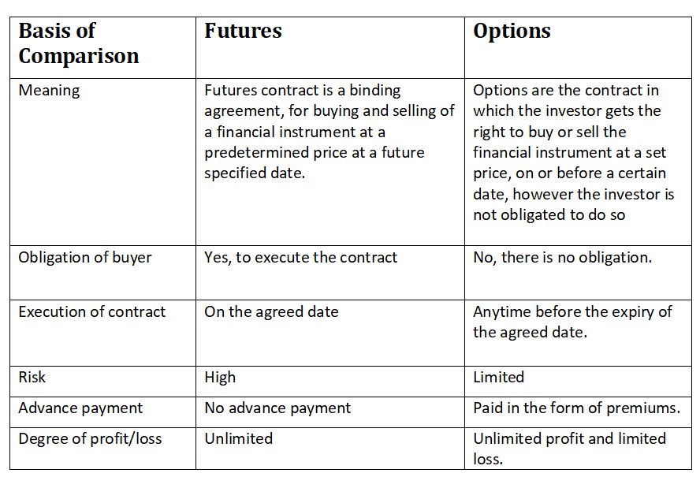

## Table of Contents

## What is a call option?

A call option is a financial contract that gives you the right, but not the obligation, to buy a specific stock at a set price within a certain time period. This set price is called the strike price. For example, if you have a call option for a stock with a strike price of $50, you can buy that stock for $50 no matter how high the market price goes.

You buy a call option if you think the stock's price will go up. If the stock's price goes above the strike price, you can buy the stock at the lower strike price and then sell it at the higher market price to make a profit. However, if the stock's price stays below the strike price, you don't have to buy the stock and you only lose the money you paid for the option. This makes call options a way to bet on a stock's price going up without having to buy the stock itself.

## What is a forward contract?

A forward contract is an agreement between two parties to buy or sell an asset at a future date for a price they agree on today. This asset can be anything from commodities like wheat or oil, to financial instruments like currencies or stocks. The key point is that the price is fixed now, even though the actual exchange happens later. This helps both parties manage their risk because they know exactly what price they will pay or receive in the future.

For example, a farmer might enter into a forward contract with a bakery to sell wheat at a set price in six months. This way, the farmer knows how much money they will get, and the bakery knows how much they will pay, no matter what happens to wheat prices in the meantime. If wheat prices go up, the bakery benefits because they locked in a lower price. If prices go down, the farmer benefits because they locked in a higher price. Forward contracts are useful for planning and can protect against price changes, but they also come with the risk that one party might not fulfill their end of the deal.

## How does a call option work?

A call option gives you the right to buy a certain stock at a set price, called the strike price, within a specific time. You don't have to buy the stock if you don't want to. You pay a fee, called a premium, to get this right. You would buy a call option if you think the stock's price will go up. If the stock's price goes above the strike price, you can buy the stock at the lower strike price and then sell it at the higher market price to make a profit.

If the stock's price stays below the strike price, you don't have to buy the stock. You just lose the money you paid for the option. This makes call options a way to bet on a stock's price going up without having to buy the stock itself. It's like a safety net that lets you make money if the stock goes up, but you only lose a smaller amount if it doesn't.

## How does a forward contract work?

A forward contract is a deal between two people to buy or sell something at a certain price in the future. This thing can be anything, like wheat, oil, or even money from different countries. The important part is that they agree on the price now, even though they will actually exchange the thing later. This helps both people because they know exactly what they will pay or get, no matter what happens to the price of the thing in the future.

For example, a farmer might make a forward contract with a bakery to sell wheat at a set price in six months. The farmer knows how much money they will get, and the bakery knows how much they will pay. If the price of wheat goes up, the bakery is happy because they locked in a lower price. If the price goes down, the farmer is happy because they locked in a higher price. But there is a risk that one person might not keep their promise, so they have to trust each other.

## What are the key differences between call options and forward contracts?

Call options and forward contracts both let you buy or sell things in the future, but they work differently. A call option gives you the right to buy a stock at a set price within a certain time, but you don't have to if you don't want to. You pay a fee called a premium for this right. You would use a call option if you think the stock's price will go up. If it does, you can buy the stock at the lower set price and sell it at the higher market price to make money. If the stock's price doesn't go up, you just lose the fee you paid for the option.

A forward contract is different because it's a promise to buy or sell something at a set price in the future. You have to do it, no matter what happens to the price. For example, a farmer might make a forward contract with a bakery to sell wheat at a set price in six months. The farmer and the bakery know exactly what they will get or pay, which helps them plan. But there's a risk that one person might not keep their promise, so they have to trust each other. Call options are more flexible because you can choose not to buy, but forward contracts are more certain because you know the deal will happen.

## What are the advantages of using call options over forward contracts?

Call options are more flexible than forward contracts because they give you the right, but not the obligation, to buy a stock at a set price. This means you can choose not to buy if the stock's price doesn't go up like you hoped. With a forward contract, you have to buy or sell no matter what happens to the price. So, call options let you make money if the stock goes up, but you only lose a small amount if it doesn't. This makes them less risky because you know the most you can lose is the fee you paid for the option.

Another advantage of call options is that they can be a cheaper way to bet on a stock's price going up. You only need to pay a premium to get the right to buy the stock, which is usually less than buying the stock outright. This means you can use call options to make money from a stock without spending a lot of money upfront. Forward contracts, on the other hand, usually involve bigger commitments because you have to buy or sell the whole thing at the set price. So, call options can be a more affordable way to try to make money from stocks.

## What are the advantages of using forward contracts over call options?

Forward contracts give you more certainty than call options. When you make a forward contract, you know exactly what you will buy or sell and at what price in the future. This can be really helpful for planning. For example, if you're a farmer and you make a forward contract to sell your wheat at a set price in six months, you know how much money you will get no matter what happens to wheat prices. This helps you plan your finances better. With a call option, you don't have this certainty because you can choose not to buy if the price doesn't go up like you hoped.

Another advantage of forward contracts is that they can be customized to fit your needs. You can make a forward contract for almost anything, like wheat, oil, or even different kinds of money. You can also set the price and the date to match what works best for you and the other person. Call options are more standard and usually only for stocks. So, if you need a deal that is just right for your situation, a forward contract might be better. But remember, with forward contracts, you have to trust the other person to keep their promise, which can be a risk.

## How do the risk profiles of call options and forward contracts differ?

Call options have a different risk profile than forward contracts. When you buy a call option, the most money you can lose is the premium you paid for it. This makes call options less risky because you know the maximum amount you could lose. If the stock's price goes up, you can make a lot of money by buying the stock at the lower strike price and selling it at the higher market price. But if the stock's price doesn't go up, you just lose the premium. This limited risk makes call options a safer way to bet on a stock's price going up.

Forward contracts are different because they come with more risk and more certainty. When you make a forward contract, you have to buy or sell the thing at the set price no matter what happens. This means if the price goes against you, you could lose a lot of money. For example, if you agree to buy wheat at a high price and the market price drops, you still have to buy it at the higher price. On the other hand, if the price goes in your favor, you can make money. But there's also the risk that the other person might not keep their promise, which can be a big problem. So, forward contracts have more risk because you're locked into the deal no matter what happens to the price.

## What are the typical uses of call options in financial markets?

Call options are often used by investors who think a stock's price will go up. They buy a call option to get the right to buy the stock at a set price, called the strike price, within a certain time. If the stock's price goes above the strike price, they can buy the stock at the lower strike price and sell it at the higher market price to make a profit. This is a way to make money from a stock without having to buy the stock itself. It's like betting on the stock's price going up, but you only lose a small amount if it doesn't.

Another use of call options is for people who already own a stock. They might buy a call option to protect their stock from losing value. For example, if they own a stock and they think its price might go down, they can buy a call option with a higher strike price. If the stock's price does go down, they can still sell it at the higher strike price. This way, they limit their losses. Call options can also be used by companies to manage the risk of their stock prices or by traders who want to make money from short-term changes in stock prices.

## What are the typical uses of forward contracts in financial markets?

Forward contracts are often used by people who want to lock in a price for something they will buy or sell in the future. This helps them plan their finances better because they know exactly what they will pay or get, no matter what happens to the price later. For example, a farmer might use a forward contract to sell their wheat at a set price in six months. This way, the farmer knows how much money they will get, even if wheat prices drop. A bakery might use a forward contract to buy wheat at a set price, so they know how much they will pay, even if wheat prices go up.

Another use of forward contracts is for companies that need to buy or sell things in different countries. They might use forward contracts to lock in exchange rates for different kinds of money. This helps them know exactly how much they will pay or get when they do business in another country. For example, a company in the United States might use a forward contract to buy Euros at a set rate in three months. This way, they know how much it will cost them to buy things in Europe, even if the exchange rate changes. Forward contracts can help businesses manage their risk and plan for the future.

## How do pricing models for call options differ from those for forward contracts?

Pricing models for call options are different from those for forward contracts because they take into account different things. For call options, the price is based on the stock's current price, the strike price, the time until the option expires, and how much the stock's price might move around. This is called the option's premium. The most common way to price call options is with the Black-Scholes model, which uses these factors to figure out what the option should be worth. Because call options give you the right but not the obligation to buy the stock, their price can be affected by how likely it is that the stock's price will go above the strike price before the option expires.

For forward contracts, the pricing model is simpler because it's just about agreeing on a future price today. The price of a forward contract is based on the current price of the thing you're buying or selling, plus or minus some costs like interest rates or storage costs, depending on what you're dealing with. For example, if you're buying wheat in the future, the forward price might be the current wheat price plus the cost of storing the wheat until the future date. Unlike call options, forward contracts don't have a premium because you're locked into buying or selling at the set price no matter what happens. This makes the pricing more straightforward but also more risky because you can't back out if the price goes against you.

## What are the regulatory considerations for call options versus forward contracts?

Call options are often traded on big stock markets, like the New York Stock Exchange. Because of this, they have to follow a lot of rules set by the government and the stock market itself. These rules are there to make sure that everyone is treated fairly and that the markets work well. For example, people who sell call options have to tell the government about their trades and follow rules about how much money they need to have. Also, the people who buy call options need to know what they're getting into, so there are rules about what information has to be given to them.

Forward contracts are usually made between two people without a big market in the middle. Because of this, they don't have as many rules to follow. But, if the forward contract is for something really important, like money from different countries, there might be some rules to follow. For example, big banks that make a lot of forward contracts have to report them to the government to keep the financial system safe. But for most forward contracts, the main thing is that both people trust each other to keep their promise, since there aren't as many rules to protect them.

## What is the Role of Algorithmic Trading?

Algorithmic trading uses automated strategies to execute trades with speed and precision, beyond human capabilities. This approach leverages computer algorithms to analyze market data, identify trading opportunities, and execute orders much faster than manual trading. Its foundation rests on exploiting market inefficiencies through various strategies, such as [trend following](/wiki/trend-following), [arbitrage](/wiki/arbitrage), and mean reversion.

Trend following aims to capitalize on the [momentum](/wiki/momentum) of asset prices by identifying and acting on upward or downward trends. The algorithm continuously monitors price movements, [volume](/wiki/volume-trading-strategy), and other technical indicators to make informed buy or sell decisions. For instance, the Moving Average Crossover strategy is a common trend-following technique where the intersection of short-term and long-term moving averages indicates potential entry or [exit](/wiki/exit-strategy) points.

Arbitrage strategies seek to profit from price discrepancies between markets or instruments. By executing simultaneous buys and sells across different exchanges or asset classes, algorithms can lock in risk-free returns before the market corrects these inefficiencies. For example, [statistical arbitrage](/wiki/statistical-arbitrage) involves using econometric models to find price divergences that historically converge, allowing trades to be placed on the expected return to equilibrium.

Mean reversion strategies are based on the concept that asset prices will revert to their long-term average over time. Algorithms employing mean reversion identify short-term deviations from historical norms and place trades anticipating a return to the average. A typical formula used in mean reversion is:

$$
z_t = \frac{x_t - \mu}{\sigma}
$$

where $z_t$ is the z-score at time $t$, $x_t$ is the current price, $\mu$ is the mean of the past prices, and $\sigma$ is the standard deviation. A high absolute z-score indicates a significant deviation likely to revert.

Algorithmic trading mitigates human error and emotion-driven decisions, fostering a systematic, objective approach to trading. This precision not only enhances execution efficiency but also opens complex avenues for managing intricate trading strategies. By ensuring that trades are consistent with predefined rules, it reduces the psychological stress and potential biases that often accompany manual trading.

The increased efficiency and systematic nature of [algorithmic trading](/wiki/algorithmic-trading) make it an invaluable tool in modern financial markets. As technology continues to advance, these systems are poised to become even more sophisticated, further enhancing their ability to optimize trading strategies and manage risks.

## References & Further Reading

For those seeking to expand their understanding of financial instruments, options trading, and algorithmic trading techniques, several resources are recommended. For a solid foundation in financial instruments, the book *Options, Futures, and Other Derivatives* by John C. Hull provides comprehensive coverage of derivatives, including call options and forward contracts.

To deepen your understanding of options trading, consider reading *Options as a Strategic Investment* by Lawrence G. McMillan, which offers in-depth analysis and strategies for using options effectively. The book covers a wide range of topics from basic properties to more advanced trading techniques.

On algorithmic trading, *Algorithmic Trading and DMA* by Barry Johnson is an excellent resource. It explains the technical and quantitative approach used in algorithmic trading, covering popular strategies such as trend following, arbitrage, and mean reversion.

For practical applications and case studies, the publication *High-Frequency Trading* by Irene Aldridge provides insights into how high-frequency trading is implemented and its impact on the markets.

Online platforms such as Investopedia and Coursera offer courses and articles that make complex concepts accessible. Websites like QuantInsti provide specialized courses on algorithmic trading and financial engineering.

Exploring academic journals such as *The Journal of Derivatives* and *Algorithmic Finance* can offer research-based insights and the latest developments in these fields. These resources collectively offer a robust framework for understanding and leveraging call options, forward contracts, and algorithmic trading in financial markets.

