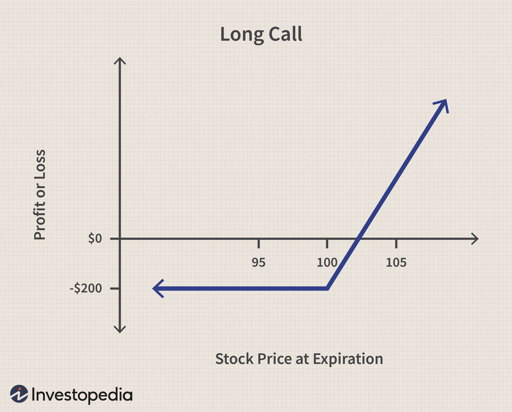

In financial markets, call options, forward contracts, and algorithmic trading form essential components for traders and investors. Each of these financial instruments brings its own set of advantages and complexities to trading strategies.

Call options provide investors the right, but not the obligation, to purchase a security at a predetermined price. This feature allows investors to capitalize on favorable market movements without fully committing capital upfront, thus offering leverage opportunities. However, the leverage also demands rigorous risk management to avert substantial losses.

Forward contracts, on the other hand, are agreements to buy or sell an asset at a predetermined price at a future date. Unlike options, forward contracts are binding, obligating the participating parties to the terms of the contract. These are mostly negotiated over-the-counter and offer high customization, suiting specific risk management needs for various market participants.

Algorithmic trading plays a transformative role in modern trading by employing automated, pre-programmed trading strategies to execute orders. It leverages advanced algorithms to spot trends, arbitrage opportunities, and market inefficiencies with speed and accuracy, minimizing the influence of human error and emotions on trading decisions.

This article will explore how traders can apply call options, forward contracts, and algorithmic trading to optimize strategies for risk management and return maximization. It will provide insights into utilizing these instruments to create robust trading strategies that efficiently manage risks while maximizing potential returns. Further discussion will focus on the integration of these components to enhance the execution and success of complex trading strategies.

## Table of Contents

## Understanding Call Options

A call option is a financial derivative that grants the holder the right, but not the obligation, to buy an asset at a specified price, known as the strike price, within a set timeframe. This type of option is widely used for both speculative investments and hedging strategies. By purchasing a call option, investors can gain control over a large quantity of an asset with a relatively low initial investment compared to purchasing the physical asset directly. This leverage, however, introduces higher risk, necessitating careful risk management.

### Key Elements of Call Options

1. **Premiums**: The premium is the price paid by the buyer to the seller for the call option. It represents the maximum loss potential for the call buyer and the maximum gain for the call seller. Premiums are influenced by several factors, including the underlying asset's price, volatility, and time remaining until expiration.

2. **Strike Price**: The strike price is the price at which the holder can purchase the underlying asset. The relationship between the strike price and the asset's market price determines whether an option is in-the-money, at-the-money, or out-of-the-money, impacting the option's intrinsic value.

3. **Expiration Date**: Each call option has an expiration date, which is the last day the option can be exercised. The time value of the option decreases as the expiration date approaches, a phenomenon known as time decay.

The strategic utility of call options lies in their flexibility and potential for high returns. Speculators use them to profit from upward price movements without the need to initially commit substantial capital. For example, if an investor anticipates a stock price increase, they might purchase a call option with a strike price below the expected future price, aiming to sell the option at a profit or exercise it to acquire the stock at a lower price.

Hedgers, on the other hand, incorporate call options into portfolios to protect against potential price appreciation, effectively setting a price ceiling on future purchases. This application is common in commodity markets, where businesses use call options to manage the cost [volatility](/wiki/volatility-trading-strategies) of essential inputs.

Given the complexity and risks associated with call options, understanding the underlying variables and potential market scenarios is crucial. Techniques such as the Black-Scholes model can be employed to estimate option pricing and assess risk levels, although assumptions in these models may not always align closely with real market behavior. As [algorithmic trading](/wiki/algorithmic-trading) technologies advance, they increasingly integrate such calculations to enhance decision-making and execution efficiency in trading call options.

## Decoding Forward Contracts

Forward contracts are integral elements within the financial derivatives landscape, characterized by their commitment to buy or sell an asset at a predetermined price on a specific future date. Unlike options, which provide the right but not the obligation to execute a trade, forward contracts entail a binding obligation for both parties involved. This fundamental difference underscores the importance of precise terms and conditions negotiated at the contract's inception.

One of the defining features of forward contracts is their customization capability. Since these contracts are typically negotiated over-the-counter (OTC) rather than on formal exchanges, they allow parties to tailor conditions, such as the specific quantity of the asset, delivery dates, and pricing mechanisms. This flexibility makes forward contracts a preferred choice for parties seeking to manage risk exposure according to their unique circumstances.

In financial risk management, forward contracts serve as powerful instruments for hedging. Companies and investors employ them to lock in prices, thus protecting themselves against future price volatility. For example, a firm expecting to make a purchase of commodities in three months might enter into a forward contract to buy those commodities at a price agreed upon today, shielding itself from possible price increases.

Forward contracts also play a significant role in speculative strategies. Traders may use these instruments to capitalize on anticipated price movements. By agreeing to buy or sell an asset at a future date for a pre-set price, speculators can profit if their predictions on price trends are accurate.

Despite their advantages, forward contracts [carry](/wiki/carry-trading) inherent risks, primarily counterparty risk, due to their OTC nature. Since they are not standardized or cleared through a centralized exchange, the possibility of default by either party is a risk that needs careful consideration.

In summary, forward contracts are indispensable tools for managing future financial risk and taking advantage of expected market dynamics. They offer high degrees of customization and are pivotal in both hedging strategies and speculative financial maneuvers.

## The Role of Algorithmic Trading

Algorithmic trading uses automated strategies to execute trades with speed and precision, beyond human capabilities. This approach leverages computer algorithms to analyze market data, identify trading opportunities, and execute orders much faster than manual trading. Its foundation rests on exploiting market inefficiencies through various strategies, such as [trend following](/wiki/trend-following), [arbitrage](/wiki/arbitrage), and mean reversion.

Trend following aims to capitalize on the [momentum](/wiki/momentum) of asset prices by identifying and acting on upward or downward trends. The algorithm continuously monitors price movements, [volume](/wiki/volume-trading-strategy), and other technical indicators to make informed buy or sell decisions. For instance, the Moving Average Crossover strategy is a common trend-following technique where the intersection of short-term and long-term moving averages indicates potential entry or [exit](/wiki/exit-strategy) points.

Arbitrage strategies seek to profit from price discrepancies between markets or instruments. By executing simultaneous buys and sells across different exchanges or asset classes, algorithms can lock in risk-free returns before the market corrects these inefficiencies. For example, [statistical arbitrage](/wiki/statistical-arbitrage) involves using econometric models to find price divergences that historically converge, allowing trades to be placed on the expected return to equilibrium.

Mean reversion strategies are based on the concept that asset prices will revert to their long-term average over time. Algorithms employing mean reversion identify short-term deviations from historical norms and place trades anticipating a return to the average. A typical formula used in mean reversion is:

$$
z_t = \frac{x_t - \mu}{\sigma}
$$

where $z_t$ is the z-score at time $t$, $x_t$ is the current price, $\mu$ is the mean of the past prices, and $\sigma$ is the standard deviation. A high absolute z-score indicates a significant deviation likely to revert.

Algorithmic trading mitigates human error and emotion-driven decisions, fostering a systematic, objective approach to trading. This precision not only enhances execution efficiency but also opens complex avenues for managing intricate trading strategies. By ensuring that trades are consistent with predefined rules, it reduces the psychological stress and potential biases that often accompany manual trading.

The increased efficiency and systematic nature of algorithmic trading make it an invaluable tool in modern financial markets. As technology continues to advance, these systems are poised to become even more sophisticated, further enhancing their ability to optimize trading strategies and manage risks.

## Integrating Call Options, Forward Contracts, and Algo Trading

Integrating call options, forward contracts, and algorithmic trading involves employing mathematical models and computational power to execute trades that are both time-sensitive and complex. This approach utilizes algorithms to continuously monitor market conditions, thus offering the ability to determine the most advantageous entry and exit points for both options and forward contracts.

Algorithms are particularly adept at processing high volumes of market data at speeds far beyond human capabilities. They can identify patterns and market inefficiencies that would otherwise be overlooked. By configuring algorithms to react to specific market movements, traders can automate the decision-making process in executing call options and forward contracts. This automation allows for precise timing in exercising options or fulfilling forward contracts, capturing favorable market conditions that yield optimal returns or mitigate losses.

The integration of these instruments with algorithmic trading enhances risk management capabilities. For instance, traders can use algorithms to hedge positions more effectively through dynamic adjustments. By setting predefined parameters within an algorithm, such as volatility thresholds, traders can automatically adjust the portfolio to reduce exposure to undesirable risks. This approach is especially beneficial when handling forward contracts, whose obligatory nature necessitates careful management to avoid potential losses.

Additionally, algorithmic trading improves the efficiency of executing complex strategies that involve multiple financial instruments. The combinatorial approach, where algorithms simultaneously track and trade in multiple markets or instruments, optimizes the use of options and forward contracts in a diversified portfolio. This reduces transaction costs and timing errors, while also maximizing potential gains by strategically managing each position based on real-time analysis.

Overall, the synergy between call options, forward contracts, and algorithmic trading allows for more sophisticated strategic frameworks. Traders are equipped with tools that not only streamline operations but also augment their capacity to act swiftly and decisively in volatile market environments. As such, effectively integrating these elements can lead to superior performance outcomes.

## Conclusion

Understanding the synergy between call options, forward contracts, and algorithmic trading significantly enhances a trader's strategic capabilities. These financial instruments, when integrated effectively, offer robust opportunities for maximizing returns while concurrently mitigating risks. 

Call options provide traders with the flexibility to leverage investment positions without obligating them to transact, allowing for strategic control over substantial asset quantities with comparatively low capital exposure. This leverage, while beneficial, requires careful formulation of strategies to manage potential risks. Forward contracts, on the other hand, facilitate precise hedging capabilities through their customizability and fixed obligations. They ensure price stability for future transactions, which is crucial for managing financial risks associated with market volatility.

The incorporation of algorithmic trading enhances the strategic deployment of these instruments. Algorithms offer systematic and efficient execution of trades by instantly responding to market conditions, thereby optimizing entry and exit points for call options and forward contracts. This automated approach reduces human errors and emotion-driven decisions, leading to a more rational investment process. By employing strategies like trend following, arbitrage, and mean reversion, algo-trading capitalizes on existing market inefficiencies, ultimately redefining traditional trading paradigms.

As technological advancements continue, the potential for integrating complex data analytics and [machine learning](/wiki/machine-learning) models into algorithmic trading processes is expanding. These innovations are refining how call options and forward contracts are utilized, enabling traders to develop more adaptable and sophisticated strategies. The continued evolution of these technologies promises to further enhance execution efficiency and risk management, solidifying their role as essential tools in modern trading environments. This dynamic intersection not only optimizes returns but also creates a more resilient framework for navigatng the unpredictable landscape of financial markets.

## References & Further Reading

For those seeking to expand their understanding of financial instruments, options trading, and algorithmic trading techniques, several resources are recommended. For a solid foundation in financial instruments, the book *Options, Futures, and Other Derivatives* by John C. Hull provides comprehensive coverage of derivatives, including call options and forward contracts.

To deepen your understanding of options trading, consider reading *Options as a Strategic Investment* by Lawrence G. McMillan, which offers in-depth analysis and strategies for using options effectively. The book covers a wide range of topics from basic properties to more advanced trading techniques.

On algorithmic trading, *Algorithmic Trading and DMA* by Barry Johnson is an excellent resource. It explains the technical and quantitative approach used in algorithmic trading, covering popular strategies such as trend following, arbitrage, and mean reversion.

For practical applications and case studies, the publication *High-Frequency Trading* by Irene Aldridge provides insights into how high-frequency trading is implemented and its impact on the markets.

Online platforms such as Investopedia and Coursera offer courses and articles that make complex concepts accessible. Websites like QuantInsti provide specialized courses on algorithmic trading and financial engineering.

Exploring academic journals such as *The Journal of Derivatives* and *Algorithmic Finance* can offer research-based insights and the latest developments in these fields. These resources collectively offer a robust framework for understanding and leveraging call options, forward contracts, and algorithmic trading in financial markets.

