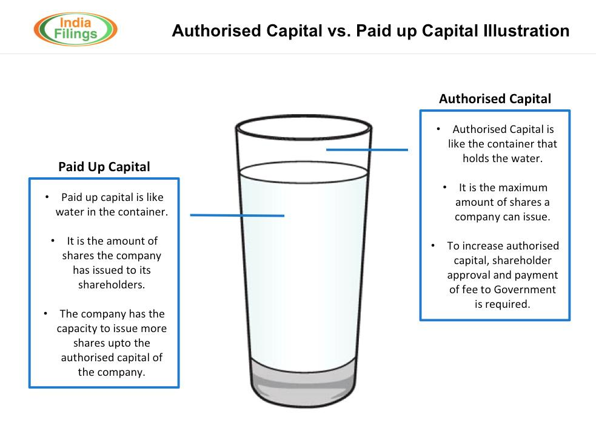

## Table of Contents

## What is share capital?

Share capital is the money a company raises by selling its shares to investors. When a company decides to start or grow its business, it can sell pieces of ownership, called shares, to people or other companies. The total amount of money collected from selling these shares is called the share capital. This money helps the company to buy equipment, hire staff, or expand its operations.

Share capital can be divided into different types, like authorized, issued, and paid-up capital. Authorized capital is the maximum amount of shares a company is allowed to sell, according to its legal documents. Issued capital is the part of the authorized capital that the company has actually sold to investors. Paid-up capital is the amount of money the company has received from the shares it sold. Understanding these types helps in knowing how much money a company has raised and how much it can still raise.

## What is called-up share capital?

Called-up share capital is the amount of money that a company asks its shareholders to pay for the shares they have bought. When a company sells shares, it might not ask for all the money right away. Instead, it can ask for the money in parts over time. The total amount of money the company has asked for so far is called the called-up share capital.

This is different from the paid-up share capital, which is the actual amount of money the company has received from shareholders. For example, if a company asks for $100 per share but only gets $50 from each shareholder so far, the called-up share capital would be $100 per share, but the paid-up share capital would be $50 per share. This helps companies manage their cash flow better by spreading out when they receive money from shareholders.

## What is paid-up share capital?

Paid-up share capital is the amount of money a company has actually received from its shareholders for the shares they bought. When people or companies buy shares, they might not have to pay the full price right away. Instead, they pay in parts over time. The total amount of money the company has collected from these payments is called the paid-up share capital.

This is different from called-up share capital, which is the amount of money the company has asked for from shareholders. For example, if a company asks for $100 per share but only gets $50 from each shareholder so far, the paid-up share capital would be $50 per share. This helps companies know exactly how much money they have from selling shares, which is important for their financial planning and operations.

## How is called-up share capital different from paid-up share capital?

Called-up share capital is the amount of money a company asks its shareholders to pay for the shares they have bought. When a company sells shares, it might not ask for all the money right away. Instead, it can ask for the money in parts over time. This means the called-up share capital is the total amount the company has asked for from shareholders, even if they haven't paid it all yet.

Paid-up share capital is the actual amount of money the company has received from its shareholders. This is the money that shareholders have paid so far for the shares they bought. For example, if a company asks for $100 per share but only gets $50 from each shareholder so far, the paid-up share capital would be $50 per share, while the called-up share capital would still be $100 per share. This difference helps companies manage their cash flow and plan their finances better.

## Why is it important for a company to have called-up share capital?

Having called-up share capital is important for a company because it helps manage money better. When a company sells shares, it might not need all the money right away. By asking for the money in parts over time, the company can plan when it gets the money. This way, it can use the money when it really needs it, like for buying new equipment or expanding the business.

This also helps the company know how much money it can expect to get in the future. If the company knows it can ask for more money from shareholders later, it can make better plans for growing or dealing with unexpected costs. This makes the company's financial planning more stable and reliable.

## Why is it important for a company to have paid-up share capital?

Paid-up share capital is really important for a company because it shows how much money the company has actually gotten from selling its shares. When people buy shares, they might not pay all the money at once. The money they have paid so far is called the paid-up share capital. This money is what the company can use right away for things like buying new stuff or paying workers.

Knowing the paid-up share capital helps the company plan better. It tells the company exactly how much money it has to work with. This is important for making sure the company can pay its bills and keep running smoothly. It also helps the company show investors and banks how much money it has, which can make them more confident in the company.

## How does called-up share capital affect a company's financial statements?

Called-up share capital shows up on a company's balance sheet, which is a big report that tells you what the company owns and owes. When a company asks shareholders for money for shares, this called-up amount goes on the balance sheet as part of the company's equity. Equity is like the company's net worth, showing how much money it has from selling shares. If the company has called up some money but not all of it, this helps show that the company might get more money later.

This called-up share capital also affects the cash flow statement, which is another report that shows where the company's money is coming from and going. When the company asks for money from shareholders, it doesn't show up as cash right away. But it tells people looking at the financial statements that the company expects to get more money in the future. This helps everyone understand the company's plans for using money and how it might grow.

## How does paid-up share capital affect a company's financial statements?

Paid-up share capital is the actual money a company has received from selling its shares. This money shows up on the company's balance sheet under the equity section. The equity section tells you about the company's net worth, which includes money from shareholders. When the company gets money from shareholders, it increases the paid-up share capital on the balance sheet. This helps show how much money the company really has to use for things like buying new equipment or paying bills.

Paid-up share capital also affects the company's cash flow statement. This statement shows where the company's money is coming from and going. When shareholders pay for their shares, it adds to the cash the company has. This makes the cash flow statement show more money coming into the company. This is important because it helps everyone see how much money the company has right now and how it is using that money.

## What are the legal implications of called-up share capital?

When a company asks shareholders for money for shares, it's called called-up share capital. This has some legal rules the company needs to follow. The company has to tell shareholders clearly how much money they need to pay and when they need to pay it. If shareholders don't pay when asked, the company can take legal action against them. This might mean the company can ask for the money in court or even take back the shares if the shareholder still doesn't pay.

Also, the company has to keep good records of how much money it has asked for and how much it has gotten. This is important for following the law and for showing the company's financial health to others. If the company doesn't follow these rules, it could get in trouble with the law. This could mean fines or other legal problems for the company. So, it's really important for the company to handle called-up share capital the right way.

## What are the legal implications of paid-up share capital?

Paid-up share capital is the money a company has actually gotten from selling its shares. The law says the company must keep good records of this money. They need to show how much money they have received from shareholders and when they got it. This helps make sure the company follows the rules and shows everyone how much money the company really has. If the company does not keep these records right, they could get in trouble with the law. This might mean they have to pay fines or face other legal problems.

The company also has to tell everyone about the paid-up share capital in their financial reports. This is important because it helps people like investors and banks trust the company. They can see how much money the company has from selling shares. If the company does not report this correctly, it could be seen as breaking the law. This could lead to legal action against the company, making it hard for them to do business or raise more money in the future.

## How do investors view called-up versus paid-up share capital?

Investors look at called-up share capital to see how much money a company might get in the future. It tells them that the company has asked for money from shareholders, but they haven't paid it all yet. This can be good because it shows the company might have more money coming in soon. But it can also be a bit risky because there's no guarantee that shareholders will pay all the money they owe. Investors need to think about this when deciding if they want to invest in the company.

Paid-up share capital is different because it shows the money the company has already gotten from shareholders. This is important for investors because it tells them exactly how much money the company has right now. They can see if the company has enough money to do what it plans to do, like buy new things or grow the business. Investors usually feel more sure about a company when they see a high paid-up share capital because it means the company has the money it needs to work with.

## What are the strategic considerations for a company in managing called-up and paid-up share capital?

When a company decides how to manage its called-up and paid-up share capital, it needs to think about when it will need money and how to make sure it gets it. Called-up share capital lets the company ask for money from shareholders over time, which can help spread out when the company gets the money. This is good because the company can plan to use the money when it really needs it, like for buying new stuff or growing the business. But the company also needs to be careful because if shareholders don't pay, it might not get all the money it expects.

Paid-up share capital is the money the company has already gotten from shareholders. This is important because it's the money the company can use right away. The company needs to make sure it has enough paid-up share capital to cover its current needs, like paying bills or keeping the business running. By managing both called-up and paid-up share capital well, the company can make sure it has enough money to do what it plans to do and keep investors happy by showing it has the money it needs.

## What is Called-Up Capital?

Called-up capital refers to the portion of a company's subscribed capital that has been called upon for payment by shareholders. This represents a critical step in the capitalization process, where a company requests the actual amounts due from investors who have pledged to purchase shares. It is an essential component of a company's equity structure and differs from paid-up capital, which is the actual amount paid by shareholders.

In accounting terms, called-up capital can be illustrated as follows:

$$
\text{Called-up Capital} = \text{Subscribed Capital} - \text{Uncalled Capital}
$$

Where:
- Subscribed Capital: The total amount of capital that shareholders have agreed to pay to the company.
- Uncalled Capital: The part of the subscribed capital that remains unrequested by the company.

Understanding the dynamics of called-up capital is vital for evaluating a company's [liquidity](/wiki/liquidity-risk-premium) and financial health. When a company calls up capital, it signifies a need for cash, whether for investment in new projects, managing daily operations, or settling obligations. The distinction between called-up and paid-up capital provides insight into the financial commitments of shareholders and the company's success in collecting these funds.

For instance, effectively executing a call on capital can improve a company's liquidity position by increasing available cash. Conversely, delays or defaults in payments can indicate potential issues in financial stability or shareholder commitment. As such, monitoring called-up capital is crucial for corporate financial planners and investors to ensure companies maintain sufficient liquidity to operate effectively.

As businesses evolve, the relevance of maintaining an optimal balance between called-up and paid-up capital becomes even more pronounced. This balance influences investor confidence and can drive strategic financial decisions, shaping the company's ability to capitalize on market opportunities and invest in growth initiatives.

## What is Corporate Finance in Practice?

Corporate finance is an essential domain that involves strategic management of the financial activities needed to run a corporation effectively. This encompasses a broad range of activities including long-term capital investments and budgeting, as well as assessing and managing financial risks. The primary objective is to maximize shareholder value through both short-term and long-term financial planning and implementation of various strategies.

One of the key components of corporate finance is the allocation and management of long-term capital, often referred to as capital budgeting. This involves identifying potential investment opportunities and assessing their future cash flows and risks to determine the best opportunities for investment. Techniques such as Net Present Value (NPV) and Internal Rate of Return (IRR) are commonly utilized to assess the viability of these investments. The formula for NPV, for instance, is:

$$
NPV = \sum_{t=1}^{n} \frac{R_t}{(1 + r)^t} - C_0
$$

Where:
- $R_t$ is the net cash inflow-outflows during a single period t
- $r$ is the discount rate
- $C_0$ is the initial investment cost
- $n$ is the number of time periods

In terms of funding, corporate finance balances between equity and debt finance, a critical aspect that involves making strategic decisions depending on market trends and the company's financial goals. Equity financing includes raising capital through the sale of shares, whereas debt financing involves borrowing funds that must be repaid at a later date, often with interest.

Effective budgeting within corporate finance includes not only estimating costs and revenues but also involves financial forecasting, which allows a corporation to plan future growth and prepare for potential financial challenges. It ensures that the company allocates resources efficiently and is ready to address unforeseen expenses or investment opportunities.

Risk management is another vital aspect, focusing on the identification, analysis, and mitigation of financial risks that could potentially impact the organization's capital and earnings. This involves strategies such as diversifying investments, using hedging techniques, and implementing comprehensive insurance and compliance systems.

Ultimately, corporate finance decisions need to align with the overarching goal of maximizing shareholder value. This often requires making informed choices with regard to business investments, capital structure, and paying dividends. The decisions made must reflect an understanding of both the internal environment of the company and the external market conditions, ensuring the corporation's sustainability and growth in the competitive global market.

## References & Further Reading

[1]: Brealey, R.A., Myers, S.C., & Allen, F. (2016). ["Principles of Corporate Finance"](https://www.mheducation.com/highered/product/Principles-of-Corporate-Finance-Brealey.html). McGraw-Hill Education.

[2]: Frazzini, A., Israel, R., & Moskowitz, T.J. (2012). ["Trading Costs of Asset Pricing Anomalies"](https://papers.ssrn.com/sol3/papers.cfm?abstract_id=2294498). American Finance Association.

[3]: Narang, R. (2009). ["Inside the Black Box: The Simple Truth About Quantitative Trading"](https://onlinelibrary.wiley.com/doi/book/10.1002/9781118267738). Wiley Finance.

[4]: Hull, J. (2018). ["Options, Futures, and Other Derivatives"](https://www.semanticscholar.org/paper/Options%2C-Futures%2C-and-Other-Derivatives-Hull/89bdee500c8623864fc9eb7a471546aa713acc44). Pearson.

[5]: Aldridge, I. (2013). ["High-Frequency Trading: A Practical Guide to Algorithmic Strategies and Trading Systems"](https://onlinelibrary.wiley.com/doi/pdf/10.1002/9781119203803.fmatter). Wiley.