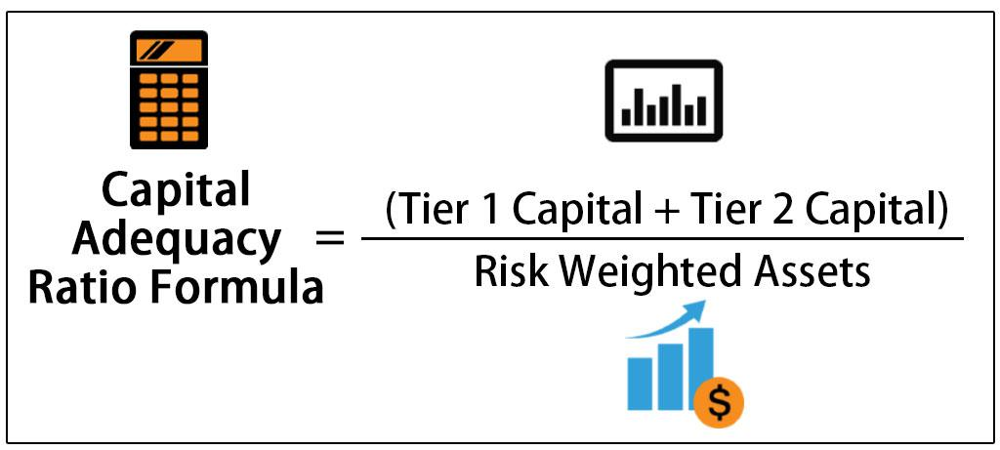

Understanding the key metrics that define a company's financial health is crucial in finance. This article explores important financial ratios, including the solvency ratio and the capital adequacy ratio, highlighting their relevance in financial analysis and algorithmic trading. Solvency ratios measure a company's ability to meet its long-term obligations, while capital adequacy ratios assess a bank's capacity to withstand financial shocks. This exploration aims to provide a comprehensive guide on how these ratios are used to assess financial stability and inform trading strategies.

Algorithmic trading, which automates trade execution using computer programs, relies heavily on accurate financial data. Understanding these ratios is essential, as they serve as critical inputs to the trading algorithms that drive decision-making processes. By bridging the gap between financial analysis and algo trading, this article examines how these metrics can enhance trading strategies.



Readers will learn how solvency and capital adequacy ratios serve as indispensable tools for investors, analysts, and algorithmic traders. The accurate interpretation of these ratios can provide insights into a firm's or bank's financial health, assisting in making informed investment and trading decisions. They serve as foundational elements that allow for effective risk management and strategic planning in an ever-evolving financial landscape.

## Table of Contents

## Understanding Solvency and Capital Adequacy Ratios

Solvency and capital adequacy ratios are essential tools in evaluating a company's ability to meet its long-term obligations, providing insights into financial stability and risk exposure. The **solvency ratio** offers a measure of a company's financial viability by comparing its total assets to total liabilities. This ratio is calculated as:

$$
\text{Solvency Ratio} = \frac{\text{Total Assets}}{\text{Total Liabilities}}
$$

A higher solvency ratio indicates greater financial stability, suggesting that the company is well-positioned to meet its debt commitments and less susceptible to financial distress.

On the other hand, the **capital adequacy ratio (CAR)** is primarily applied within the banking sector. It evaluates a bank's capital concerning its risk-weighted assets to ensure the bank's financial endurance during adverse conditions:

$$
\text{CAR} = \frac{\text{Total Capital}}{\text{Risk-Weighted Assets}}
$$

Regulatory bodies mandate specific CAR levels to ensure that banks maintain enough capital to absorb potential losses, safeguarding depositor funds and promoting economic stability. This ratio is instrumental for ensuring that a bank can withstand financial shocks and continue operating effectively.

Collectively, these ratios serve as crucial indicators for both investors and regulatory agencies. The solvency and capital adequacy ratios deliver comprehensive insights into a company's or bank's financial health, helping to identify potential risks and ensuring that entities maintain a sound capital structure. These metrics are integral to assessing long-term viability and making informed investment and regulatory decisions.

## The Role of Solvency Ratios in Financial Analysis

Solvency ratios are pivotal in financial analysis, primarily by providing insights into a company's financial leverage and long-term sustainability. These metrics allow analysts to evaluate a company's capability to meet its long-term obligations, thereby revealing insights into its fiscal health and risk exposure. Among the key solvency ratios utilized in financial analysis is the debt-to-equity ratio.

The debt-to-equity ratio, calculated as $\frac{\text{Total Debt}}{\text{Shareholder's Equity}}$, offers a measure of a company's financial leverage. A lower ratio is generally favorable as it indicates that a company is not overly reliant on debt to finance its operations, thus suggesting a stable risk profile. Conversely, a higher ratio may signal potential financial distress or excessive leverage, presenting higher risk to investors.

Moreover, solvency ratios are indispensable tools for financial analysts to perform comparative analysis among firms within the same industry. Such comparisons help in identifying which companies hold a stronger position in terms of financial health, thereby influencing investment decisions. Analysts often look for companies with strong solvency ratios as these represent lower risk levels, promising better long-term returns.

Additionally, by focusing on a company's ability to repay its long-term debts, solvency ratios aid in assessing its long-term viability. A robust solvency position suggests that a company is well-equipped to navigate economic fluctuations and persistently fulfill its debt obligations, which is attractive to long-term investors seeking sustainable growth.

In essence, solvency ratios encapsulate vital fiscal prudence indicators, aiding investors and analysts in detecting signs of financial strength or warning signs of potential distress. They contribute significantly to the financial analytical framework, aiding in the formulation of well-informed investment strategies.

## Capital Adequacy Ratio in the Banking Sector

The capital adequacy ratio (CAR) is a crucial metric used in the banking sector to ensure that financial institutions maintain sufficient capital to safeguard depositors and uphold overall financial stability. This ratio is calculated by dividing a bank's capital by its risk-weighted assets. The formula for CAR is:

$$
\text{CAR} = \frac{\text{Capital}}{\text{Risk-Weighted Assets}}
$$

In this context, 'capital' typically refers to the bank's core capital, which includes equity capital and disclosed reserves. 'Risk-weighted assets' are determined by assigning different risk levels to various types of assets, reflecting the likelihood of default associated with each category.

Regulatory authorities closely monitor CAR to ensure banks possess the necessary capital buffer to withstand financial shocks and continue operations during adverse economic conditions. These regulatory standards are often established by international accords, such as the Basel Accords, which set minimum capital requirements to promote global banking stability.

A well-capitalized bank, with a higher CAR, is perceived as more solvent. This is particularly vital during economic downturns, where the ability to absorb losses without affecting depositor confidence becomes paramount. Maintaining a robust CAR not only helps in mitigating risks but also enhances a bank's reputation, leading to greater trust among stakeholders and potential opportunities for growth.

Regulatory frameworks mandate different CAR thresholds depending on the specific risks associated with a bank's activities. For example, banks with higher exposure to market or credit risks may be required to maintain a higher CAR. This dynamic approach ensures that capital requirements are commensurate with the level of risk, fostering a resilient financial system.

## Solvency Ratios and Algorithmic Trading

Algorithmic trading strategies make extensive use of financial ratios, including solvency ratios, to enhance decision-making processes. Solvency ratios, which measure a firm’s ability to meet its long-term obligations, provide valuable insights into its financial stability—an essential [factor](/wiki/factor-investing) for investment potential assessment.

By incorporating solvency metrics into trading algorithms, traders can evaluate a firm’s financial health dynamically. For instance, a common solvency ratio used is the debt-to-equity ratio, which compares a company's total debt to its shareholder equity. The formula for this ratio is:
$$
\text{Debt-to-Equity Ratio} = \frac{\text{Total Debt}}{\text{Shareholder Equity}}
$$

When solvency ratios, like the debt-to-equity ratio, are integrated into algorithmic systems, trading strategies can adapt to shifting financial landscapes in real time. Algorithms can be set to monitor fluctuations in these ratios and execute trades based on predefined thresholds. For example, a high debt-to-equity ratio might trigger a sell-off in trading algorithms, as it could indicate potential financial distress.

Moreover, this use of solvency ratios permits a more refined risk management approach by allowing traders to act proactively on financial stability indicators. This proactive stance helps to optimize portfolio robustness and maintain balance in investment strategies during varied market conditions. Furthermore, Python offers a programmatic way to implement these strategies:

```python
def check_solvency_ratios(debt, equity, threshold=1.5):
    debt_to_equity_ratio = debt / equity
    if debt_to_equity_ratio > threshold:
        return "Sell"
    else:
        return "Hold"

# Example usage
company_debt = 500000
company_equity = 300000

decision = check_solvency_ratios(company_debt, company_equity)
print(f"Trading decision: {decision}")
```

This approach not only facilitates automatic and rapid trading responses but also aids in maintaining a comprehensive view of a firm's financial dynamics, thus optimizing trading decisions aligned with the firm's intrinsic financial health. As financial markets continue to advance, the integration of solvency metrics in [algorithmic trading](/wiki/algorithmic-trading) represents a sophisticated means of managing financial risks and leveraging investment opportunities effectively.

## Limitations of Solvency and Capital Adequacy Ratios

While solvency and capital adequacy ratios provide valuable insights into financial stability, they are not without their limitations. These metrics must be used with caution and in conjunction with a broader analysis to avoid potential pitfalls.

Firstly, these ratios lack the ability to predict future market conditions. Solvency ratios, such as the debt-to-equity ratio, and capital adequacy ratios, like the capital-to-risk-weighted-assets ratio, reflect a company's past and current financial condition but do not incorporate potential market [volatility](/wiki/volatility-trading-strategies) or economic shifts. For instance, a company might appear financially stable based on its current ratios, yet unforeseen economic downturns could affect its ability to meet long-term obligations. This limitation underscores the importance of integrating forward-looking indicators, such as economic forecasts and market trends, into financial analysis.

Secondly, industry-specific challenges are not captured by these ratios. Different industries have varying capital structures and risk exposures, which can influence the interpretation of solvency and capital adequacy metrics. For example, a high debt-to-equity ratio might be typical in capital-intensive industries like utilities, while it may signal excessive leverage in sectors with lower asset intensity. Therefore, sector comparisons require a nuanced understanding, taking into account the unique financial dynamics and risk profiles inherent to each industry.

Furthermore, these ratios should be supplemented with other financial metrics and qualitative analysis to provide a comprehensive evaluation. A reliance solely on solvency and capital adequacy ratios could lead to misinterpretations, as they do not address qualitative factors such as management quality, competitive positioning, or innovation capabilities. Incorporating metrics like cash flow analysis, profitability ratios, and market intelligence offers a multidimensional perspective, enhancing the robustness of financial assessments.

By recognizing these limitations, analysts and investors can avoid oversimplified conclusions that may arise from an isolated view of solvency and capital adequacy ratios. This awareness facilitates more informed financial and trading decisions, enabling a strategic approach that balances quantitative and qualitative facets of financial analysis.

## Conclusion

Solvency and capital adequacy ratios are indispensable tools in assessing a company's financial health. Solvency ratios measure a company's ability to meet its long-term debt obligations, providing insights into financial stability and risk. The capital adequacy ratio, particularly relevant in the banking sector, ensures banks have sufficient capital to absorb losses and protect depositors. These ratios form the backbone of financial analysis and algorithmic trading, providing a solid foundation for risk assessment and informed decision-making.

The integration of solvency and capital adequacy ratios into algorithmic trading systems enhances strategic outcomes by enabling algorithms to respond dynamically to changes in a company's financial stability. As financial markets continue to evolve, leveraging technological advancements to incorporate these ratios in trading strategies allows for improved risk management and better optimization of investment decisions. For instance, an algorithm could monitor real-time changes in a company's debt-to-equity ratio and execute trades based on predetermined financial thresholds, thus aligning trading strategies with financial health indicators.

However, the best insight into financial stability and investment potential is achieved through a comprehensive approach that combines these ratios with other financial metrics. This multifaceted analysis, incorporating both quantitative assessments and qualitative factors, provides a more rounded evaluation of a company's overall financial health. By considering additional metrics such as cash flow analysis, profitability ratios, and market conditions, investors and traders can make more informed and strategic financial decisions, minimizing risks and maximizing returns.

## References & Further Reading

Explore further with recommended resources on financial ratios and their applications in finance and trading.

1. **Books on Financial Analysis**:
   - "Financial Statement Analysis" by Martin Fridson and Fernando Alvarez. This book offers insights into interpreting financial statements, with a detailed focus on various financial ratios.
   - "Investment Valuation" by Aswath Damodaran. A comprehensive guide on valuing assets and companies, covering financial metrics crucial to investment strategies.

2. **Market Research and Studies**:
   - McKinsey & Company Financial Studies: Regular publications that include insights into financial stability factors and the role of financial ratios.
   - The Wall Street Journal and Financial Times: Regular articles and analyses that cover recent trends in financial ratios and their impact on markets.

3. **Academic Journals**:
   - Journal of Financial Economics: Offers rigorous research articles exploring financial ratios, capital adequacy, and their implications in finance.
   - Review of Financial Studies: Includes research on the application of financial ratios in algorithmic trading and financial stability.

4. **Online Courses and MOOCs**:
   - Coursera and edX offer courses related to financial analysis, including modules on ratio analysis. These often include practical examples of how financial ratios are used within algorithms.
   - LinkedIn Learning offers courses specifically tailored for algorithmic trading strategies that incorporate financial ratio analysis.

5. **Software and Tools**:
   - Analysis tools such as Bloomberg Terminal or Thomson Reuters Eikon provide real-time data and analytics, which can be vital in understanding and applying financial ratios effectively.
   - Python Libraries: Libraries such as NumPy and Pandas can be used to calculate and model financial ratios. Here's a simple Python example for calculating the Debt-to-Equity (D/E) ratio:
     ```python
     import pandas as pd

     def calculate_de_ratio(total_debt, total_equity):
         return total_debt / total_equity

     # Example values
     total_debt = 50000
     total_equity = 200000
     de_ratio = calculate_de_ratio(total_debt, total_equity)
     print(f"Debt-to-Equity Ratio: {de_ratio}")
     ```

6. **Staying Updated**:
   - Subscribe to updates from regulatory bodies like the European Central Bank (ECB) or the Federal Reserve, which provide releases on financial stability and capital adequacy requirements.
   - Following relevant finance and trading forums and podcasts can offer current industry perspectives and discussions on evolving financial ratios.

To maintain strategic acumen, integrating insights from these diverse resources will ensure a nuanced understanding of financial ratios and their applications in modern finance and trading.