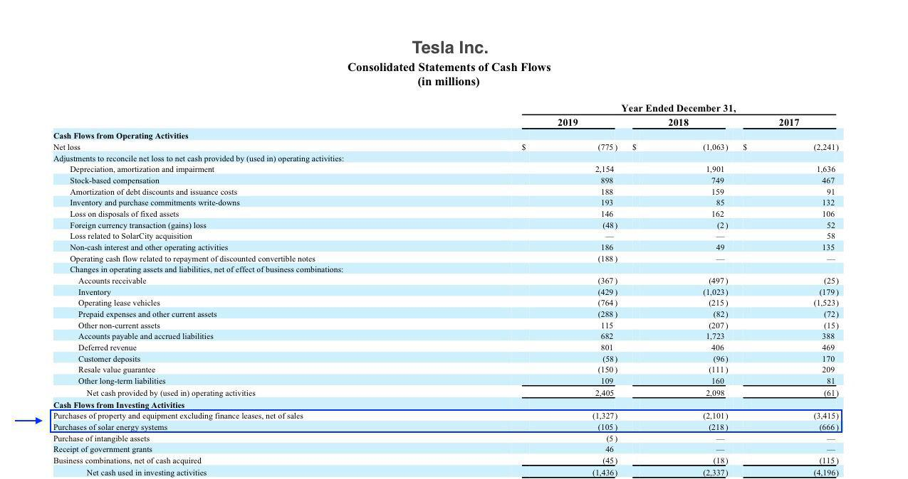

Algorithmic trading has fundamentally reshaped financial markets by enhancing efficiency and minimizing the need for human intervention. Central to this technological advancement is the understanding of a company's financial components, specifically Capital Expenditures (CAPEX) and Operating Expenses (OPEX). CAPEX refers to investments in long-term assets that form the backbone of trading operations, such as technology infrastructure and trading platforms. Conversely, OPEX encompasses the daily costs necessary to maintain the operations, including expenses like data feed subscriptions and system maintenance. The clear distinction between CAPEX and OPEX is critical for several reasons: it plays a crucial role in financial reporting by determining the asset versus expense classification, affects taxation through allowable deductions and depreciation, and influences strategic planning by impacting cash flow and long-term financial health. This article examines how CAPEX and OPEX affect algorithmic trading, shedding light on effective cost management and strategic financial planning.

## Table of Contents



## Understanding CAPEX and OPEX

Capital Expenditure (CAPEX) and Operating Expenses (OPEX) are fundamental concepts in the management of financial resources within algorithmic trading firms. CAPEX refers to the funds used by an organization to acquire, upgrade, and maintain physical assets, such as technology infrastructure and trading platforms. These assets are crucial for executing high-frequency trades and processing large volumes of data swiftly. CAPEX investments are vital for ensuring that a firm remains competitive through improved speed and reliability in a rapidly evolving technological landscape.

Operating Expenditure (OPEX), on the other hand, encompasses the routine and necessary expenses incurred during the day-to-day operations of a trading business. These expenditures include costs such as data feed subscriptions, system maintenance, and staff salaries. OPEX is critical for keeping the trading operations smooth and efficient, ensuring that the firm's trading algorithms function optimally without interruption.

The accounting treatment of CAPEX versus OPEX is distinctly different. CAPEX is capitalized, meaning it is added to the asset side of the balance sheet and then depreciated over the useful life of the asset. This gradual depreciation is reflected as a periodic expense in the income statement, allowing the cost of the asset to be spread over several years. This distribution can be advantageous in stabilizing the firm’s financial outlook by smoothing out the impact of large expenditures.

Conversely, OPEX is expensed in full during the fiscal year in which it occurs. This immediate expensing means that OPEX directly impacts the company’s profit margins within the same year, offering potential for immediate tax deductions. Managing OPEX efficiently enables firms to maintain [liquidity](/wiki/liquidity-risk-premium) and optimize cash flow, crucial for covering operational necessities and unforeseen expenses swiftly.

Grasping the distinctions between CAPEX and OPEX, and the strategic implications of their treatments, is integral for optimizing financial strategies in algorithmic trading. Allocating funds wisely between these two areas ensures that a firm not only invests in its growth and future capabilities via CAPEX but also maintains daily operational efficiency and flexibility through effective management of OPEX.

## Financial Implications of CAPEX and OPEX in Algorithmic Trading

High Capital Expenditures (CAPEX) in [algorithmic trading](/wiki/algorithmic-trading) often reflect significant investments in competitive technology and infrastructure. These investments are crucial for maintaining a competitive edge in the rapidly evolving financial markets where speed and efficiency govern success. CAPEX typically includes expenses related to acquiring high-performance computing systems, advanced trading platforms, and robust data storage solutions. By allocating resources to these long-term assets, firms can enhance their trading capabilities and improve overall operational efficiency.

One of the primary financial advantages of CAPEX is the benefit of depreciation. In accounting, CAPEX is not immediately expensed; instead, it is capitalized and depreciated over time. This depreciation process involves allocating the cost of the asset over its useful life, which can help stabilize profits by spreading the financial impact across multiple fiscal periods. For example, if a trading firm invests $1,000,000 in a new trading platform with a useful life of 5 years, it might depreciate that cost at $200,000 annually, thus smoothing its income statements over time.

In contrast, Operating Expenses (OPEX) encompass costs necessary to sustain daily trading operations. These may include expenditures such as data feed subscriptions, system maintenance, and personnel salaries. OPEX is entirely expensed in the fiscal year it is incurred, offering immediate tax relief. This immediate expensing provides a two-fold benefit: first, it reduces the taxable income for that year, aiding in cash flow management, and second, it ensures the operational costs are immediately accounted for, allowing firms to monitor and control day-to-day expenses effectively.

Balancing CAPEX and OPEX is crucial for the sustained efficiency of algorithmic trading operations and facilitates long-term growth. A strategic approach involves assessing the return on investment (ROI) for CAPEX initiatives while optimizing OPEX to ensure it contributes to improved efficiency and effectiveness in operations. This balance allows firms to make informed decisions about investment in new technologies without jeopardizing their financial health. For instance, a trading company might delay certain CAPEX investments until previous expenditures have been sufficiently depreciated, thereby aligning their financial commitments with their growth strategies.

By understanding the financial implications of these expenditures, algorithmic trading firms can develop strategies that not only leverage technological advancements but also ensure robust financial performance and sustainability in an increasingly competitive industry.

## Strategic Allocation of CAPEX and OPEX

Strategic allocation of Capital Expenditures (CAPEX) in algorithmic trading is pivotal for enhancing technologies that improve trading speed and data processing capabilities. Algorithmic trading relies heavily on the execution of fast and efficient transactions, making the investment in high-performance computing systems, low-latency networks, and advanced data analytics platforms a priority. These investments not only increase the speed and accuracy of trades but also enable the processing of large volumes of data necessary for algorithmic strategies.

Optimizing Operating Expenses (OPEX) is equally vital. Effective OPEX management emphasizes cost efficiency in routine operations, such as data feed subscriptions, system maintenance, and software licensing. Strategies to reduce OPEX may include negotiating better contracts with service providers, leveraging cloud computing for scalable resources, and implementing automated processes for system monitoring and updates.

Evaluating the return on investment (ROI) for CAPEX requires a thorough analysis of the potential financial benefits against the costs incurred. Metrics such as internal rate of return (IRR) and net present value (NPV) can be useful in assessing these investments. For example, Python code can simulate the profitability of a new trading platform by computing the projected cash flows:

```python
# Example Python code for calculating NPV
def calculate_npv(discount_rate, cash_flows):
    npv = sum(cf / (1 + discount_rate) ** i for i, cf in enumerate(cash_flows))
    return npv

# Discount rate and cash flows for the project
discount_rate = 0.1  # 10% discount rate
cash_flows = [-500000, 150000, 200000, 250000, 300000]  # Initial investment and annual returns

npv = calculate_npv(discount_rate, cash_flows)
print(f"NPV of the project: ${npv:,.2f}")
```

Maintaining operational excellence with OPEX necessitates continual monitoring and refining processes to ensure that expenditures support the trading strategy's overall goals. Techniques like variance analysis can help identify deviations from budgeted expenses and guide corrective actions.

Corporate strategies must align with these financial decisions to promote sustainable growth. This involves coordinating the objectives of the development, trading, and analytical teams to ensure that CAPEX and OPEX allocations enhance the firm's overall performance. A forward-looking approach, anticipating changes in technology and market conditions, ensures that the firm remains competitive while optimizing its financial resources. 

Overall, strategic allocation between CAPEX and OPEX is crucial in algorithmic trading, influencing both current performance and future scalability. Effective management and alignment with corporate strategies can lead to significant advantages in a competitive financial environment.

## Tax Implications of CAPEX and OPEX

Capital Expenditures (CAPEX) and Operating Expenses (OPEX) have distinctive tax implications that are pivotal for firms engaged in algorithmic trading. 

CAPEX, associated with the purchase of long-term assets such as advanced trading systems and infrastructure, offers tax advantages through the mechanism of depreciation. Depreciation allows a company to spread the cost of an asset over its useful life, reducing taxable income incrementally over several years. For instance, when a company invests in high-performance computing hardware, it may apply depreciation rates to systematically account for the asset's wear and tear. This process thereby diminishes taxable profits over time, enhancing the firm’s financial stability and planning capability by providing a more predictable expenditure framework.

OPEX, on the other hand, involves expenses that are essential for the day-to-day operations of algorithmic trading, such as software subscriptions and server maintenance. Unlike CAPEX, OPEX can be fully expensed in the fiscal year it is incurred. This immediate expensing provides significant tax relief, as it reduces taxable income promptly, resulting in lower tax obligations for that year. By expensing these operational costs, companies can improve their cash flow, allocating resources more effectively towards other strategic priorities.

Understanding the tax implications of CAPEX and OPEX is crucial for enhancing cash flow management and optimizing tax obligations. Companies may leverage these tax benefits by carefully planning and timing their expenditures. For example, deferring a significant CAPEX investment to a subsequent fiscal year could strategically enhance current period cash flow and allow for spreading tax benefits over future periods. Conversely, by accelerating OPEX payments into the current fiscal year, a company might immediately decrease its taxable income, thereby optimizing its short-term tax position.

In conclusion, effectively managing CAPEX and OPEX with a clear understanding of their tax implications is vital for algorithmic trading firms striving to optimize financial performance and maintain a competitive edge.

## Impact of CAPEX and OPEX on Investor Decisions

Investors keenly evaluate Capital Expenditures (CAPEX) to gauge a company's growth trajectory and potential for future revenue generation, especially in the competitive field of algorithmic trading. CAPEX reflects the strategic decisions to allocate resources towards long-term assets such as advanced trading technologies and infrastructure. These investments often signal the company's commitment to maintaining a competitive edge and expanding its operational capacity. For investors, high CAPEX can be a positive indicator of a company's robust future growth prospects, suggesting potential increases in trading speed, data processing capacity, and overall market reach.

Conversely, Operating Expenses (OPEX) can serve as a barometer for the firm's current operational efficiency. A high OPEX might indicate escalating costs that could erode short-term profitability. However, it can also reflect the firm's investment in essential services and routine operations critical for maintaining algorithmic trading systems. For instance, substantial expenses on data feed subscriptions or system updates might be necessary to ensure optimal performance. Investors often scrutinize OPEX to understand a company's cost management strategies and their impact on profit margins.

Effectively communicating the nuances of CAPEX and OPEX is crucial for sustaining investor confidence. Transparency in financial reporting helps investors understand how these expenditures align with the company's strategic objectives. By providing clarity on how CAPEX investments are expected to enhance future growth or how OPEX is driving operational efficiency, companies can appeal to investors who seek reliability and clarity in financial planning.

Strategically balancing CAPEX and OPEX is pivotal. For instance, while CAPEX is capitalized and depreciated over time, providing potential tax shields through depreciation, OPEX is immediately deductible in the fiscal year incurred, which can improve cash flow efficiency. This distinction is essential for crafting financial strategies that appeal to investors focused on both short-term results and long-term growth potential.

In summary, understanding the impact of CAPEX and OPEX on company financials is a vital aspect of investment decision-making. Clear and informative communication regarding these expenditures can significantly influence investor perceptions and decisions, ultimately affecting the firm's ability to secure capital necessary for sustained growth and innovation in algorithmic trading.

## Conclusion

A well-managed balance of capital expenditures (CAPEX) and operating expenses (OPEX) is crucial for sustaining efficiency and promoting growth in algorithmic trading. The distinction between these two types of expenditures is not merely a matter of accounting. Instead, it forms the backbone of strategic financial management, impacting everything from profitability to investment potential. 

Proper categorization and management of CAPEX and OPEX allow firms to optimize profitability. CAPEX represents long-term investments that are capitalized and depreciated over time, providing potential stabilization of profits through depreciation benefits. In contrast, OPEX relates to the expenses necessary for day-to-day operations, offering immediate tax deductions which enhance cash flow management. A strategic approach ensures that capital investments in technology and infrastructure are mirrored by efficient operational spending, maintaining a firm's competitive edge in the technological race of algorithmic trading. 

Understanding the dynamics between CAPEX and OPEX also helps algorithmic trading firms position themselves in a volatile market environment. Investments in cutting-edge technology and infrastructure through CAPEX can assure investors of a firm’s commitment to maintaining and amplifying its competitive capabilities. On the other hand, strategically controlled OPEX can indicate efficient use of resources, ultimately affecting profitability in the short term.

By integrating CAPEX and OPEX strategies into broader corporate strategies, algorithmic trading firms can ensure their long-term success and attractiveness to investors. This synergy allows these firms to thrive, even in the ever-evolving landscape of financial markets, underscoring the importance of these financial components in sustaining operational efficiency and supporting sustained growth.

## References & Further Reading

[1]: ["Advances in Financial Machine Learning"](https://www.amazon.com/Advances-Financial-Machine-Learning-Marcos/dp/1119482089) by Marcos Lopez de Prado

[2]: ["Machine Learning for Algorithmic Trading"](https://www.amazon.com/Machine-Learning-Algorithmic-Trading-alternative/dp/1839217715) by Stefan Jansen

[3]: ["Quantitative Trading: How to Build Your Own Algorithmic Trading Business"](https://www.amazon.com/Quantitative-Trading-Build-Algorithmic-Business/dp/1119800064) by Ernest P. Chan

[4]: ["Evidence-Based Technical Analysis: Applying the Scientific Method and Statistical Inference to Trading Signals"](https://www.amazon.com/Evidence-Based-Technical-Analysis-Scientific-Statistical/dp/0470008741) by David Aronson

[5]: Rose, P.S. (2008). ["Managerial Finance"](https://archive.org/details/bankmanagementfi0000rose). McGraw-Hill Education.

[6]: ["The Basics of Capital Budgeting: Evaluating Cash Flows"](https://www.chegg.com/homework-help/questions-and-answers/6-basics-capital-budgeting-evaluating-cash-flows-payback-basics-capital-budgeting-evaluati-q123924160) by John Nofsinger on Investopedia

[7]: ["Understanding Operating Expense (OPEX)"](https://www.investopedia.com/terms/o/operating_expense.asp) on Investopedia