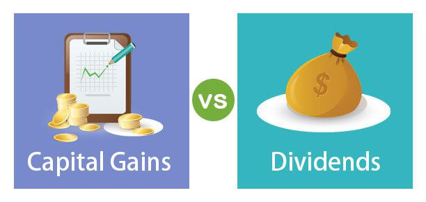

Understanding the landscape of financial income streams is crucial for investors and traders aiming to maximize their returns. Investment returns are influenced by various components, including capital gains, investment income, dividend income, and the role of algorithmic (algo) trading in modern finance. Familiarity with these concepts allows investors to make informed decisions tailored to their financial goals.

Capital gains are profits derived from the sale of assets such as stocks, bonds, or real estate when the sale price exceeds the purchase price. This type of income can significantly boost an investor's overall returns, especially in bullish markets. Investment income, on the other hand, refers to earnings generated from financial assets, typically in the form of interest or similar returns. It offers a steady income stream and comes from sources such as dividends, interest-bearing accounts, and rental properties.



Dividend income represents another component of financial returns. Companies distribute a portion of their profits to shareholders in the form of dividends, providing investors with an additional source of income. This is particularly attractive to those focused on generating passive earnings. 

Additionally, algorithmic trading has gained prominence in finance, using computer programs to automate trading strategies. This innovation enhances the trading process by increasing speed and efficiency, allowing investors to capitalize on market opportunities more effectively.

By understanding these components—capital gains, investment income, dividend income, and algorithmic trading—investors can leverage them for portfolio growth and optimize their investment strategies. Exploring how each element interacts provides valuable insights into crafting a well-rounded approach to financial management, ultimately aiding in achieving desired financial outcomes.

## Table of Contents

## Capital Gains: A Key Component of Investment Returns

Capital gains represent the financial gains realized when the selling price of an asset surpasses its original purchase cost. These profits are commonly associated with the sale of stocks, bonds, real estate, or other investment vehicles. Capital gains are crucial in investment returns, often considerably enhancing an investor's overall income, especially during bullish markets when asset prices tend to rise.

### Factors Affecting Capital Gains

Several variables can influence capital gains, including market trends, economic conditions, and holding periods. Market trends, such as bull or bear markets, directly impact asset prices and, consequently, potential capital gains. A bull market, characterized by rising asset prices, can lead to increased opportunities for realizing higher capital gains.

The holding period of an asset also plays a vital role in determining the nature of capital gains. Short-term capital gains occur when an asset is sold within a year of purchase, often taxed at a higher rate compared to long-term capital gains, which apply to assets held for over a year. Long-term capital gains typically benefit from preferential tax treatment, which can significantly affect net returns.

### Tax Implications of Capital Gains

Understanding the tax implications of capital gains is essential for effective financial planning. Capital gains taxes are levied on the profit made from the sale of an asset, and the rate varies depending on the duration of the investment and the investor's income level. In many jurisdictions, short-term capital gains are taxed as ordinary income, which can result in higher tax liabilities compared to long-term capital gains.

To illustrate, consider the following Python code, which calculates the capital gains tax for a given asset:

```python
def calculate_capital_gains_tax(purchase_price, selling_price, holding_period, tax_rate_short_term, tax_rate_long_term):
    capital_gain = selling_price - purchase_price
    if holding_period <= 1:
        # Short-term capital gains tax applies
        tax = capital_gain * tax_rate_short_term
    else:
        # Long-term capital gains tax applies
        tax = capital_gain * tax_rate_long_term
    return tax

# Example usage
purchase_price = 1000
selling_price = 1500
holding_period = 1.5  # in years
tax_rate_short_term = 0.3  # 30%
tax_rate_long_term = 0.15  # 15%

tax = calculate_capital_gains_tax(purchase_price, selling_price, holding_period, tax_rate_short_term, tax_rate_long_term)
print(f"The capital gains tax is ${tax:.2f}")
```

This code evaluates the tax liabilities based on whether the gains are short-term or long-term, highlighting the significant impact that holding periods can have on an investor's after-tax returns.

In summary, capital gains are a pivotal element of investment strategies, offering the potential for substantial income augmentation. Investors should remain cognizant of the factors influencing capital gains, such as market trends and asset holding periods, while also accounting for their tax implications to effectively maximize financial outcomes.

## Understanding Investment Income

Investment income is a crucial aspect of financial gains derived from investments in various financial assets. These earnings typically take the form of interest or similar returns. Unlike capital gains, which are realized when an asset is sold for more than its purchase price, investment income is generally acquired on a more predictable, scheduled basis. This makes it an attractive option for investors looking for steady revenue streams.

Common sources of investment income include dividends, interest from savings accounts or bonds, and rental income. Each of these sources offers unique advantages and challenges. Dividends are distributions of a company's earnings to shareholders and can provide a regular income stream. Interest-bearing accounts, such as savings accounts or government and corporate bonds, offer periodic interest payments. Rental income is derived from leasing real estate properties and can provide a stable, ongoing cash flow.

Investment income's stability is one of its primary attractions, offering a measure of financial security through regular distributions. This predictability can help in planning for future expenses and investments. Moreover, consistent investment income can potentially balance the more volatile aspects of an investment portfolio, such as stocks or other assets prone to sudden value shifts.

Diversification plays a fundamental role in generating reliable investment income. By spreading investments across multiple asset classes and income sources, investors can mitigate risks associated with any single source. For example, combining income from dividends with interest from bonds and rental earnings can cushion the portfolio against downturns in any specific market sector. Diversification can be achieved through various strategies, such as investing in mutual funds, real estate investment trusts (REITs), or a mix of high dividend-yielding stocks and fixed-income securities.

To illustrate, consider a diversified investment portfolio comprising dividend stocks, treasury bonds, and rental properties. Each component contributes differently to investment income: dividend stocks provide quarterly dividends, bonds generate semi-annual interest, and rental properties offer monthly rental payments. 

Finally, investors should continually assess and adjust their portfolios to ensure that the allocation is aligned with their financial goals and risk tolerance. By adhering to a diversified investment strategy, one can not only achieve a stable investment income but also enhance overall financial health and resilience against market [volatility](/wiki/volatility-trading-strategies).

## Dividend Income: A Source of Passive Earnings

Dividends are payments distributed by corporations to their shareholders, usually derived from the company's profits. They represent a reliable form of cash flow and are particularly appealing to investors focused on generating regular income. There are various types of dividends, with cash dividends and stock dividends being the most common. 

Cash dividends are the most straightforward, involving direct payments to shareholders, normally on a quarterly basis. Stock dividends, on the other hand, involve additional shares being distributed to shareholders, which can provide the benefit of compounded growth if the company continues to perform well over time. 

When evaluating a company's dividend policy, two critical metrics to consider are the dividend yield and the payout ratio. The dividend yield is calculated by the formula:

$$
\text{Dividend Yield} = \frac{\text{Annual Dividends Per Share}}{\text{Price Per Share}} \times 100\%
$$

This metric provides investors with an understanding of the income generated per dollar invested in the stock. A higher dividend yield may indicate a generous return on investment, though it could also reflect potential risks if unsustainable.

The payout ratio, defined as:

$$
\text{Payout Ratio} = \frac{\text{Dividends Paid}}{\text{Net Income}}
$$

offers insight into the proportion of earnings that a company pays out as dividends. A high payout ratio might suggest that the company is returning a significant portion of its profits to shareholders, which can be appealing for those seeking immediate returns. However, an excessively high ratio may raise concerns about the company's ability to maintain its dividend payments in the long term, especially during periods of financial strain.

Investors should also consider the tax implications of dividend income, as it can vary based on jurisdiction. In some regions, dividends are taxed at a preferential rate compared to ordinary income, providing an incentive for dividend-focused strategies. However, understanding the specifics of dividend taxation is crucial for maximizing net income. 

When these aspects are carefully assessed, dividend income can be a valuable component of a well-rounded investment portfolio, contributing to steady, passive earnings.

## The Growing Influence of Algorithmic Trading

Algorithmic trading, also known as algo trading, refers to the use of computer algorithms to automate the decision-making process for trading in financial markets. By leveraging advanced programming and computational power, [algorithmic trading](/wiki/algorithmic-trading) can execute trades at speeds and frequencies that are impossible for human traders. This approach has fundamentally transformed the trading environment by enhancing market efficiency and expanding the tools available to traders.

Algorithmic trading systems are designed to analyze a multitude of market variables rapidly, identifying potential trading opportunities based on pre-set criteria. These systems can execute orders in response to real-time changes in market conditions. The precision and speed at which these algorithms operate have made them indispensable in capital markets, where milliseconds can mean the difference between profit and loss.

One way algorithmic trading affects market dynamics is through its contribution to [liquidity](/wiki/liquidity-risk-premium). Algorithmic trading can provide liquidity by implementing market-making strategies, in which algorithms place both buy and sell orders to capture bid-ask spreads. This increased liquidity can lead to tighter spreads, benefiting all market participants by reducing the cost of trading. However, there is also the risk of market fragmentation, where the excessive speed of transactions may lead to increased volatility, as seen during events such as the 2010 "Flash Crash".

Despite its benefits, algorithmic trading also carries significant risks. One major concern is the potential for systems to malfunction, leading to unintended market consequences. For example, erroneous algorithms can place orders in excessive volumes or at incorrect prices, potentially causing disturbances in market stability. Moreover, the reliance on complex algorithms increases the need for robust risk management systems to ensure that trading strategies remain aligned with market conditions and investor objectives.

The technological challenges of algorithmic trading lie in the continuous development and maintenance of the algorithms themselves. As market conditions and regulatory frameworks evolve, algorithms must be adapted accordingly to maintain their effectiveness. Regulatory authorities around the world have implemented measures to monitor and control algorithmic trading, focusing on ensuring that these systems do not contribute to market abuse or systemic risk. 

For modern investors, understanding algorithmic trading involves recognizing both its potential benefits and its inherent risks. Comprehensive knowledge and strategic implementation of algorithmic trading can yield significant advantages in terms of execution efficiency and market insight. However, careful consideration of the technological and regulatory landscapes is crucial to utilizing algorithmic trading effectively, mitigating its risks, and aligning its use with overarching financial goals.

## Interplay Between Capital Gains, Investment Income, and Algo Trading

The integration of capital gains, investment income, and algorithmic trading offers a multifaceted approach to portfolio enhancement. By effectively leveraging these income streams, investors can achieve both diversification and optimization of financial returns.

Capital gains and investment income are inherently complementary. While capital gains arise from the appreciation and sale of assets, investment income typically accrues from dividend payments or interest on holdings. The strategic alignment of these sources can provide a balanced cash flow and mitigate risks associated with market volatility. For example, a portfolio diversified with dividend-yielding stocks can provide regular income, which can be reinvested to purchase additional assets that might yield capital gains during an upturn.

Algorithmic trading, or algo trading, further enhances this interplay by using advanced computational methods to analyze market data and execute trades. Algorithms can identify patterns and trends that might be invisible to human traders, offering opportunities to realize capital gains when market conditions align favorably. For instance, an algorithm could be programmed to buy undervalued stocks when certain market indicators predict a rise in value, thus capturing capital gains upon sale.

Furthermore, algo trading can optimize investment income by reallocating dividend income to higher-yield assets or those poised for capital appreciation. This approach aligns with modern financial strategies that seek to maximize returns through data-driven insights and rapid execution. Consider a scenario where an algorithm assesses dividend yield and payout ratios across sectors, then automatically invests in companies with robust and sustainable dividend policies. This automation ensures that income-generating assets are constantly adjusted based on real-time financial assessments.

To illustrate, let’s consider a Python-based algorithm that evaluates stocks for potential capital gains and dividend income. By collecting and analyzing market data, such an algorithm could dynamically adjust a portfolio to enhance returns:

```python
import pandas as pd
import yfinance as yf  # For more datasets, visit: https://paperswithbacktest.com/datasets
from sklearn.ensemble import RandomForestRegressor

# Download historical stock data
data = yf.download(['AAPL', 'MSFT', 'GOOG'], period='1y')

# Feature engineering
data['Daily Return'] = data['Adj Close'].pct_change()

# Prepare training data
X_train = data[['Open', 'High', 'Low', 'Volume']].dropna()
y_train = data['Daily Return'].shift(-1).dropna()

# Model training
model = RandomForestRegressor()
model.fit(X_train[:-1], y_train)

# Predicting and identifying buy/sell opportunities
predictions = model.predict(X_train)
buy_signals = predictions > 0.01  # Custom threshold for capital gain potential

print("Buy signals identified in the following stocks:")
print(data.index[buy_signals])
```

Through such a strategy, investors can systematically capture capital gains while algorithmically managing dividend flows to maintain steady portfolio income. This dual approach underscores the importance of understanding the synergies between capital gains, investment income, and algorithmic trading, enabling investors to tailor their portfolios to achieve robust financial outcomes.

## Conclusion

The evolving landscape of investment income requires investors to have a multifaceted understanding of various components such as capital gains, dividends, and advanced trading strategies like algorithmic trading. Mastering these elements can significantly enhance financial outcomes and contribute to the development of robust portfolios. Capital gains offer potential for substantial returns, particularly during market upswings, by realizing profits from the sale of appreciated assets. Meanwhile, dividends provide a reliable stream of passive income, often appealing to conservative investors seeking steady cash flow.

In this dynamic environment, it is imperative for investors to educate themselves continuously on market trends and emerging technologies, especially algo trading. Algorithmic trading has transformed the financial markets by introducing unprecedented speed and efficiency, yet it also brings new challenges and risks. Understanding these aspects requires a comprehensive approach that evaluates both risks and opportunities. Such a strategy will be beneficial in navigating the complexities of financial markets, enabling investors to adapt and thrive amidst ongoing changes.

Staying informed about financial innovations and strategically diversifying income streams are crucial for achieving long-term financial success. By integrating different income sources and utilizing advanced trading techniques, investors can mitigate risks and capitalize on market opportunities. This proactive approach positions them to achieve their financial goals while maintaining a resilient investment portfolio.

## References & Further Reading

[1]: ["The Intelligent Investor: The Definitive Book on Value Investing"](https://www.amazon.com/Intelligent-Investor-Definitive-Investing-Essentials/dp/0060555661) by Benjamin Graham

[2]: Lopez de Prado, Marcos. ["Advances in Financial Machine Learning"](https://www.amazon.com/Advances-Financial-Machine-Learning-Marcos/dp/1119482089). John Wiley & Sons, 2018.

[3]: Aronson, David R. ["Evidence-Based Technical Analysis: Applying the Scientific Method and Statistical Inference to Trading Signals"](https://www.amazon.com/Evidence-Based-Technical-Analysis-Scientific-Statistical/dp/0470008741). John Wiley & Sons, 2006.

[4]: Chan, Ernest P. ["Quantitative Trading: How to Build Your Own Algorithmic Trading Business"](https://github.com/ftvision/quant_trading_echan_book). John Wiley & Sons, 2008.

[5]: Jansen, Stefan. ["Machine Learning for Algorithmic Trading: Predictive Models to Transform Algorithmic Trading Strategies"](https://www.amazon.com/Machine-Learning-Algorithmic-Trading-alternative/dp/1839217715). 2nd ed., Packt Publishing, 2020.

[6]: Poterba, James M. ["Taxation, Risk-Taking, and Household Portfolio Behavior"](https://www.sciencedirect.com/science/article/pii/S1573442002800210). National Bureau of Economic Research, 2001.

[7]: ["Principles for the Regulation and Supervision of Algorithmic Trading"](https://papers.ssrn.com/sol3/papers.cfm?abstract_id=3765882). International Organization of Securities Commissions, 2013.

[8]: Fabozzi, Frank J., Focardi, Sergio M., & Kolm, Petter N. ["Robotics, AI, and the Future of Employment"](https://www.amazon.com/Financial-Modeling-Equity-Market-Cointegration/dp/0471699004). CFA Institute Research Foundation, 2012.