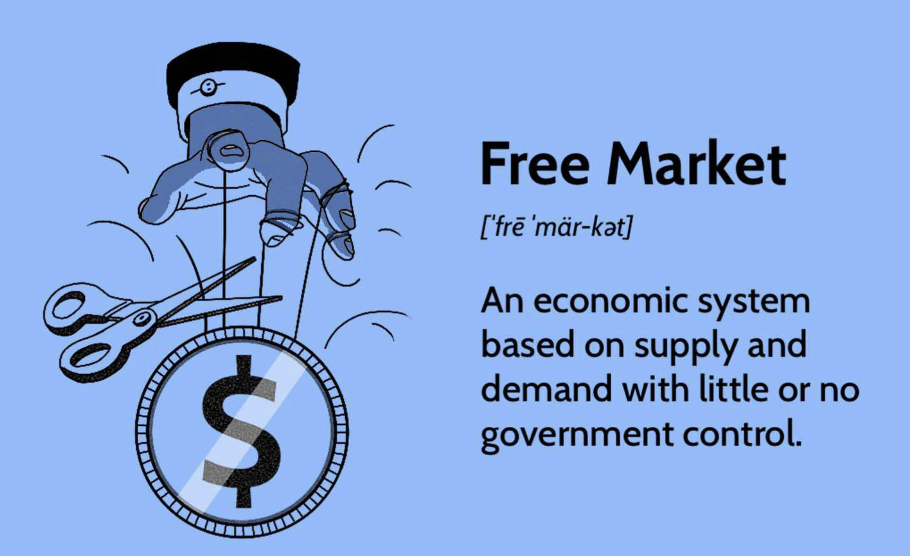

## Table of Contents

## What is capitalism?

Capitalism is an economic system where businesses and the means of production are owned by private people or companies, not by the government. In this system, people can start their own businesses and try to make money. They can also buy and sell things freely. The main goal is to make a profit, which means making more money than you spend. The idea is that when people work hard to make money, it helps the whole economy grow.

In capitalism, the price of things is decided by how much people want them and how many are available. This is called supply and demand. If a lot of people want something and there isn't much of it, the price goes up. If nobody wants something, the price goes down. People who have money can invest it in businesses, hoping to make even more money. This system can lead to a lot of innovation and new ideas because people are always trying to find new ways to make money.

However, capitalism can also have problems. Sometimes, the gap between rich and poor people can get very big. Some people might not have enough money to buy what they need. Also, businesses might not always take care of the environment or treat their workers fairly because their main goal is to make a profit. Governments often have to make rules to help balance these issues and make sure that capitalism works well for everyone.

## What is a free market?

A free market is a type of economy where people can buy and sell things without the government telling them what to do. In a free market, the prices of things are decided by how much people want them and how many are available. This is called supply and demand. If a lot of people want something and there isn't much of it, the price goes up. If nobody wants something, the price goes down. People can start their own businesses and try to make money by selling things that other people want.

In a free market, competition is really important. When different businesses sell the same thing, they have to try to make their product better or cheaper to get more customers. This can lead to new ideas and better products for everyone. But sometimes, big businesses can get too powerful and start to control the market, which can make it hard for new businesses to start. Governments often have to make rules to make sure the market stays fair and that everyone has a chance to succeed.

## How do capitalism and free market systems differ?

Capitalism and free market systems are closely related but not exactly the same. Capitalism is an economic system where private people or companies own businesses and the means of production, not the government. The main goal in capitalism is to make a profit. This means that people work hard to make more money than they spend. Capitalism can lead to a lot of new ideas and growth because everyone is trying to make money. But it can also create big differences between rich and poor people, and sometimes businesses might not take care of the environment or treat workers well.

A free market, on the other hand, is a type of economy where people can buy and sell things without the government telling them what to do. In a free market, the prices of things are decided by how much people want them and how many are available, which is called supply and demand. People can start their own businesses and try to make money by selling things that other people want. Competition is really important in a free market because it can lead to better products and new ideas. But sometimes, big businesses can get too powerful and make it hard for new businesses to start, so governments might need to make rules to keep things fair.

While capitalism focuses on private ownership and making a profit, a free market focuses on letting people buy and sell freely without government control. Many capitalist economies use free market principles, but they can also have some government rules to make sure things stay fair and balanced. So, capitalism is more about who owns things and why they do it, while a free market is more about how buying and selling happens.

## Can a free market exist without capitalism?

A free market can exist without capitalism, but it's not very common. In a free market, people buy and sell things without the government telling them what to do. The prices are decided by how much people want something and how much of it is available. This system can work even if the businesses and means of production are not owned by private people or companies. For example, in a socialist or communist system, the government might own everything, but people could still buy and sell things freely among themselves.

However, it's hard to have a true free market without some elements of capitalism. Capitalism encourages private ownership and the drive to make a profit, which can lead to a lot of competition and new ideas. In a system without capitalism, the government might still control a lot of things, even if they allow some free buying and selling. So, while a free market can exist without capitalism, it often works better when combined with capitalist principles because it motivates people to start businesses and innovate.

## What are the key features of a capitalist economy?

A capitalist economy is all about private people or companies owning businesses and the things they need to make stuff. In this system, the main goal is to make a profit, which means making more money than you spend. People can start their own businesses and try to make money by selling things that other people want. The idea is that when people work hard to make money, it helps the whole economy grow. Capitalism encourages competition, which can lead to new ideas and better products because everyone is trying to do better than their rivals.

In a capitalist economy, the price of things is decided by supply and demand. This means that if a lot of people want something and there isn't much of it, the price goes up. If nobody wants something, the price goes down. People who have money can invest it in businesses, hoping to make even more money. But capitalism can also have problems. Sometimes, the difference between rich and poor people can get very big. Some people might not have enough money to buy what they need. Also, businesses might not always take care of the environment or treat their workers fairly because their main goal is to make a profit. Governments often make rules to help balance these issues and make sure capitalism works well for everyone.

## What are the key features of a free market economy?

A free market economy is all about people being able to buy and sell things without the government telling them what to do. The prices of things in a free market are decided by how much people want them and how many are available. This is called supply and demand. If a lot of people want something and there isn't much of it, the price goes up. If nobody wants something, the price goes down. People can start their own businesses and try to make money by selling things that other people want.

In a free market, competition is really important. When different businesses sell the same thing, they have to try to make their product better or cheaper to get more customers. This can lead to new ideas and better products for everyone. But sometimes, big businesses can get too powerful and start to control the market, which can make it hard for new businesses to start. Governments often have to make rules to make sure the market stays fair and that everyone has a chance to succeed.

## How do property rights function in capitalism versus a free market?

In capitalism, property rights are very important. They mean that private people or companies can own businesses and the things they need to make stuff. This is a big part of capitalism because it lets people start their own businesses and try to make money. When people know they can own things and keep what they earn, they are more likely to work hard and come up with new ideas. But if someone else tries to take their stuff, it can cause problems. So, in capitalism, the government often makes laws to protect these property rights and make sure people can keep what they own.

In a free market, property rights also matter a lot, but in a slightly different way. A free market is all about people being able to buy and sell things without the government telling them what to do. Property rights in a free market mean that people can own things and trade them freely. This helps the market work smoothly because people know they can buy and sell things without someone else taking them away. But just like in capitalism, the government might need to make some rules to make sure these property rights are protected and that the market stays fair. So, while property rights are key in both systems, they help make sure that people can own and trade things freely in a free market.

## What role does government play in capitalism and free market systems?

In capitalism, the government's role is to make rules that help the system work well for everyone. Capitalism is all about private people or companies owning businesses and trying to make a profit. But sometimes, this can lead to big differences between rich and poor people, and businesses might not always take care of the environment or treat their workers fairly. So, the government makes laws to protect workers, keep the environment safe, and make sure that everyone has a chance to succeed. They also protect property rights, which means they make sure that people can own things and keep what they earn.

In a free market, the government's job is to make sure that people can buy and sell things without too much control. A free market works best when people can trade freely and the prices are decided by supply and demand. But sometimes, big businesses can get too powerful and make it hard for new businesses to start. So, the government might need to make rules to keep the market fair. They also need to protect property rights so people know they can own and trade things without someone else taking them away. Both in capitalism and free markets, the government tries to balance things to make sure the system works well for everyone.

## How do capitalism and free market systems impact income inequality?

Capitalism and free market systems can make the difference between rich and poor people bigger. In capitalism, people who own businesses and have money can make a lot more money. They can start new businesses, invest in ideas, and make profits. But people who don't have money or can't start businesses might not make as much. This can make the rich richer and the poor poorer. In a free market, competition can help people make money, but it can also make it hard for some people to get ahead. If big businesses get too powerful, they might make it hard for new businesses to start, which can keep some people from [earning](/wiki/earning-announcement) more money.

Governments in capitalist and free market systems try to make things fairer. They make rules to help people who don't have much money, like giving them help with healthcare or education. They also make laws to make sure businesses treat their workers well and don't harm the environment. But even with these rules, the gap between rich and poor can still be big. It's a tricky balance because while capitalism and free markets can help the economy grow and bring new ideas, they can also make income inequality worse if not managed carefully.

## What are the economic efficiencies associated with capitalism and free markets?

Capitalism and free markets can make the economy work better because they encourage people to work hard and come up with new ideas. In capitalism, people can own businesses and try to make a profit. This makes them want to find new ways to make things better or cheaper. When people compete with each other, they have to keep improving, which can lead to new inventions and better products for everyone. In a free market, the prices of things are decided by how much people want them and how many are available. This helps make sure that things are made and sold in the right amounts, so there's not too much or too little of anything.

But there can also be problems with capitalism and free markets. Sometimes, big businesses can get too powerful and make it hard for new businesses to start. This can stop new ideas from coming out and make the economy less fair. Also, people might focus too much on making money and not enough on taking care of the environment or treating workers well. Governments often have to make rules to help balance these issues and make sure that the economy stays efficient and fair for everyone.

## How do capitalism and free market systems handle market failures?

Capitalism and free markets can sometimes have problems called market failures. This happens when the market doesn't work the way it's supposed to. For example, a company might pollute the environment because it's cheaper for them, but this hurts everyone else. Or, people might not have enough information to make good choices, like when a medicine's side effects are not clear. In these cases, the market doesn't fix the problem on its own, and the government might need to step in.

In a capitalist and free market system, the government can make rules to help fix market failures. They can make laws to stop companies from polluting or to make sure people have the right information. They can also provide things that the market might not, like public parks or roads. By doing this, the government helps make sure that the economy works better for everyone and that the problems caused by market failures are taken care of.

## What are the long-term sustainability issues in capitalism versus free market systems?

Capitalism and free market systems can have problems with staying healthy and good for the future. In capitalism, the main goal is to make a profit. This can make businesses focus on making money now instead of thinking about what will happen later. For example, they might pollute the environment or use up resources too fast because it's cheaper for them. This can hurt the planet and make it hard for future generations to have what they need. Also, if the gap between rich and poor people gets too big, it can cause problems in society and make it hard for everyone to live well.

In a free market, the prices of things are decided by how much people want them and how many are available. This can work well to make sure things are made and sold in the right amounts. But sometimes, the market doesn't think about the future. For example, if people want cheap products, businesses might make them in ways that harm the environment. Also, if big businesses get too powerful, they might stop new ideas from coming out, which can make it hard for the economy to keep growing and changing. Governments often have to make rules to help balance these issues and make sure that capitalism and free markets stay sustainable for the long term.

## References & Further Reading

[1]: Hendershott, T., Jones, C. M., & Menkveld, A. J. (2011). ["Does Algorithmic Trading Improve Liquidity?"](https://onlinelibrary.wiley.com/doi/full/10.1111/j.1540-6261.2010.01624.x) Journal of Finance, 66(1), 1-33.

[2]: Gomber, P., Arndt, B., Lutat, M., & Uhle, T. (2011). ["High-Frequency Trading."](https://papers.ssrn.com/sol3/papers.cfm?abstract_id=1858626) Available at SSRN.

[3]: Johnson, B. (2010). ["Algorithmic Trading & DMA: An Introduction to Direct Access Trading Strategies."](https://archive.org/details/algorithmictradi0000john) 4Myeloma Press.

[4]: "Advances in Financial Machine Learning" by Marcos Lopez de Prado. Available on [Amazon](https://www.amazon.com/Advances-Financial-Machine-Learning-Marcos/dp/1119482089).

[5]: Ferrarini, G., & Saguato, P. (2014). ["Reforming Securities and Derivatives Trading in the EU: From MiFID I to MiFID II."](https://papers.ssrn.com/sol3/papers.cfm?abstract_id=2809752) Journal of Corporate Law Studies, 14(2), 319-356.

[6]: Aldridge, I. (2013). ["High-Frequency Trading: A Practical Guide to Algorithmic Strategies and Trading Systems."](https://www.ahmetbeyefendi.com/wp-content/uploads/2020/07/High-Frequency-Trading-Irene-Aldridge.pdf) Wiley Finance.