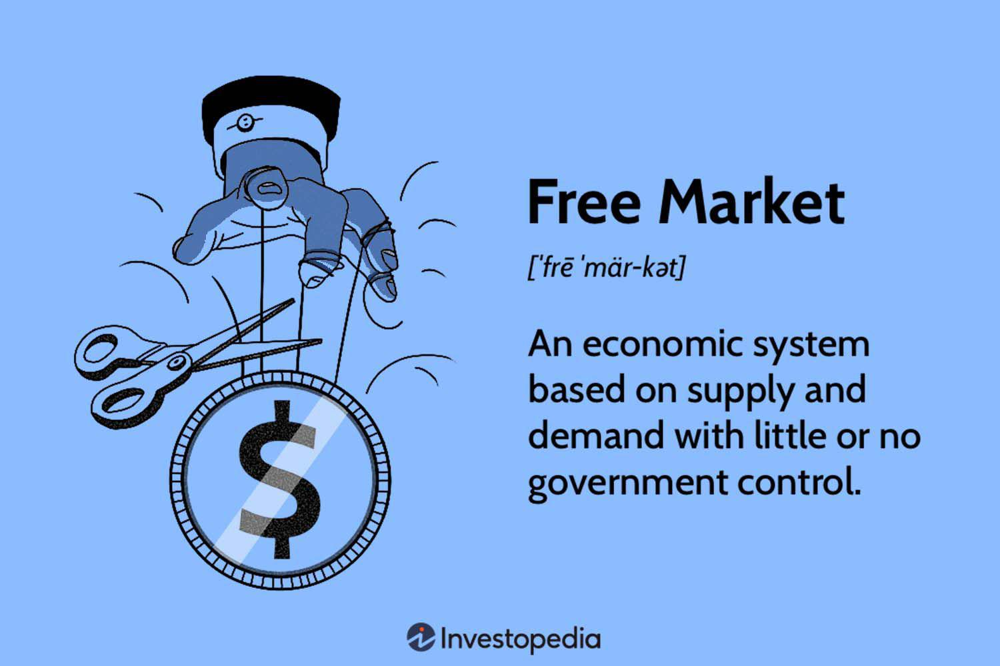

Capitalism, as an economic system, is characterized by private ownership of the means of production, market-driven economies, and the primacy of capital accumulation. It plays a pivotal role in shaping modern economies by fostering innovation, efficiency, and competition. At its core, capitalism is predicated on the free market, which operates on the principles of voluntary exchange, supply and demand dynamics, and minimal government intervention. The free market serves as the operational framework for capitalist economies, allowing for efficient resource allocation and wealth creation through competitive forces.

Algorithmic trading has emerged as a notable byproduct of capitalist economies, leveraging advancements in technology to enhance financial market operations. It involves the use of complex algorithms and sophisticated software to execute trades at speeds and volumes unattainable by human traders. This technological innovation has transformed financial markets by increasing market efficiency, liquidity, and reducing transaction costs.

The intersection of capitalism, free markets, and algorithmic trading is significant in understanding contemporary financial practices. As these economic principles interplay, they underscore the evolution of trading mechanisms and the ongoing pursuit of market efficiency. Analyzing how these elements converge to influence current economic landscapes offers insight into both the benefits and challenges they present. This sets the stage for a comprehensive discussion on how capitalism and free market dynamics foster innovations like algorithmic trading, subsequently reshaping the global economic environment.

## Table of Contents

## Understanding Capitalism and the Free Market

Capitalism is an economic system characterized by private ownership of the means of production and their operation for profit. Central to capitalism is the market-driven economy, where individuals and businesses engage in voluntary exchanges in pursuit of self-interest, leading to the efficient allocation of resources. In such a system, prices of goods and services are determined by the forces of supply and demand. This decentralized mechanism operates under the assumption that individuals, motivated by their own economic advantage, contribute to overall societal wealth generation.

The free market is foundational to capitalism, advocating minimal governmental intervention in transactions. It emphasizes voluntary exchanges, where parties trade goods and services freely, and competition, which encourages innovation and efficiency. This fosters an environment where businesses strive to improve quality and reduce costs to attract consumers. In a free market, consumer preferences guide production decisions, and competition acts as a regulatory instrument, rewarding businesses that efficiently meet market demands.

Capitalism and free markets are deeply intertwined. While capitalism refers to the broader economic system characterized by private ownership and profit motive, the free market represents the ideal operational framework for such a system. Capitalist economies rely on free market principles to operate effectively, where self-regulation and competition drive economic growth. The laissez-faire approach of the free market complements capitalist ideals by advocating for a minimal role of government, allowing market forces to dictate economic outcomes.

Several countries exemplify capitalist economies that predominantly utilize free market principles. The United States is often cited for its commitment to a free market model, with a strong emphasis on private enterprise and minimal regulatory constraints. Singapore is another example, known for its business-friendly policies and low taxation, fostering a vibrant and competitive market environment. Switzerland's economy likewise showcases a free market approach, characterized by economic freedom and limited state intervention.

These examples illustrate how free markets as operational frameworks allow capitalist economies to flourish, promoting innovation, economic efficiency, and wealth generation. In such settings, the principles of voluntary exchange and competition thrive, driving economic progression and setting the stage for the emergence of technologies like [algorithmic trading](/wiki/algorithmic-trading) within capitalist systems.

## Algorithmic Trading: A Byproduct of Capitalistic Innovation

Algorithmic trading refers to the use of computer algorithms to automate trading decisions and execute trades in financial markets. These algorithms, which are based on pre-defined instructions and mathematical models, analyze market data at speeds and volumes beyond human capability. Utilizing technology such as high-frequency trading systems and complex programming languages, algorithmic trading serves as a cornerstone of modern financial markets.

The development of algorithmic trading is a direct outcome of innovation within capitalist frameworks. In capitalism, the drive for profit maximization and competitive advantage has consistently led to technological advancements. Financial institutions, in their pursuit of greater market efficiency and precision, have turned to algorithmic strategies to gain an edge over competitors. This process of innovation is propelled by the private sector's investment in research and development, a hallmark of capitalist economies.

The introduction of algorithmic trading has brought several benefits and efficiencies to financial markets. These include enhanced [liquidity](/wiki/liquidity-risk-premium), as algorithms facilitate a larger number of trades with smaller bid-ask spreads, and increased market efficiency, due to the rapid assimilation and reaction to market information. Moreover, algorithms are capable of exploiting [arbitrage](/wiki/arbitrage) opportunities and optimizing trade execution, which can reduce transaction costs and improve portfolio performance.

The characteristics of algorithmic trading embody the competitive essence of free markets and the relentless quest for efficiency. In a free market, where voluntary exchanges and competition are emphasized, trading strategies are advanced by the need to outperform rivals. Algorithmic trading exemplifies this through its capacity to swiftly adjust to market conditions, react to fluctuations, and refine strategies in real-time. By automating decision-making processes, algorithms streamline operations, thus driving forward the evolution of financial trading practices in a market-oriented economy.

In conclusion, algorithmic trading signifies a pinnacle of capitalistic innovation, leveraging technology to reshape financial markets. It stands as a testament to how capitalist incentives foster cutting-edge developments that transform traditional economic activities, illustrating an ongoing commitment to efficiency and competitiveness.

## Economic Comparison: Capitalism vs. Free Market

Capitalism and free markets are integral components of economic theory, yet they are often conflated. Each framework offers distinct approaches to resource allocation, wealth distribution, innovation, economic growth, and market regulation, while also facing unique challenges and criticisms. 

Capitalism is an economic system characterized by private ownership of the means of production and their operation for profit. Resource allocation in capitalism is primarily guided by market forces and the price mechanism. Prices are determined by the interaction of supply and demand, and thus influence the decisions of producers and consumers. Under capitalism, wealth distribution tends to be unequal as it is closely linked to ownership of capital and access to resources, which can lead to disparate socio-economic classes.

In contrast, a free market is an economic system where the prices for goods and services are determined by the open market and consumers. In a truly free market, there are no interventions by government or other external authorities that dictate economic behavior. The resource allocation in free markets happens through voluntary exchanges and competition, leading to a decentralized method of determining what to produce, how to produce, and for whom the goods are produced. Wealth distribution in free markets is generally a reflection of the market outcomes of supply and demand dynamics, which also tend to favor those capable of better adapting and innovating.

Both capitalism and free markets encourage innovation through competition. In capitalism, the pursuit of profit compels businesses to innovate, enhance efficiency, and improve products. The competitive nature of free markets similarly pushes entities to adopt innovative practices to maintain or improve their market position. Economic growth in these systems is driven by the accumulation of capital, investment in technological advancements, and the productive efficiency improvements spurred by competition.

Market regulation, however, varies between the two. Capitalist systems may feature a range of regulatory frameworks from minimal to significant government intervention, depending on the specific economic policies in place. Free markets, ideally, operate with minimal government intervention, with regulations primarily concerning the protection of property rights and enforcement of contracts. 

Criticism of capitalism often revolves around its tendency to concentrate wealth and power in the hands of a few, potentially leading to monopolistic practices and exacerbating economic inequalities. It is also critiqued for fostering boom-and-bust cycles, environmental degradation, and short-term profit motives at the expense of long-term sustainability. Free markets face their own challenges, including the potential for market failures, externalities, and insufficient public goods provision. Furthermore, free markets may not adequately address income inequality and social welfare concerns without some form of government intervention.

In summary, while capitalism and free markets share the foundational belief in private ownership and the benefits of competition, their approaches to economic organization and the challenges they face can be distinct. Addressing these challenges requires a nuanced understanding of both systems and their interplay in contemporary economic environments.

## Algorithmic Trading within Capitalistic Frameworks

Algorithmic trading, rooted in technological advancements and sophisticated mathematical models, plays a vital role within capitalism and free market systems by enhancing market operations and liquidity. At its core, algorithmic trading utilizes algorithms—predefined sets of rules programmed to execute trades—to automate and optimize trading processes. This automation facilitates quick and efficient transactions, thus contributing positively to market efficiency. In a capitalist framework, where the pursuit of profitability and competitive advantage is paramount, algorithmic trading aligns well by leveraging technology to optimize gains and minimize human error.

The impact of algorithmic trading on market efficiency is profound. By executing trades at unparalleled speeds and reacting to market changes instantaneously, algorithms can reduce the cost of transactions and narrow bid-ask spreads. A study by Hendershott, Jones, and Menkveld (2011) highlights that algorithmic trading contributes significantly to informational efficiency, which is a cornerstone of a free market economy. Increased liquidity, brought about by this high-frequency trading, reduces the price impact of trades and ensures smoother operation of financial markets.

Nevertheless, the integration of algorithmic trading into free markets introduces regulatory and ethical challenges. The 2010 Flash Crash exemplifies the potential risks associated with high-frequency trading ([HFT](/wiki/high-frequency-trading-strategies)), initiated by a trading algorithm that caused rapid, significant price fluctuations. Consequently, regulatory bodies such as the U.S. Securities and Exchange Commission (SEC) have imposed measures like circuit breakers to curb such [volatility](/wiki/volatility-trading-strategies). There are ethical concerns, too, particularly related to fairness and market manipulation. Smaller traders might find themselves at a disadvantage compared to large financial institutions equipped with advanced algorithms, leading to discussions about the equitable distribution of technological access.

The future of algorithmic trading within evolving capitalist systems is poised for continued growth and innovation. As [artificial intelligence](/wiki/ai-artificial-intelligence) and [machine learning](/wiki/machine-learning) become more sophisticated, algorithms may become capable of more complex analyses and predictions, further improving market operations. However, this progression necessitates a balanced regulatory approach to foster innovation while safeguarding market integrity and investor protection. Future research may explore improved algorithm transparency, ethical AI use in trading, and the broader implications on economic equity.

In conclusion, algorithmic trading is an embodiment of capitalistic innovation, profoundly influencing market dynamics and efficiency. While it enhances market function, ongoing scrutiny, regulation, and ethical considerations remain crucial to ensuring that this technology serves the broader interests of both markets and participants.

## Case Studies: Real-World Applications and Implications

Algorithmic trading has become a cornerstone of modern financial markets, with its significant influence observed across various countries and economic environments. This section provides case studies that illustrate the tangible impacts of algorithmic trading in different markets, shaped by overarching principles of capitalism and free market dynamics.

### United States: A Pioneer in Algorithmic Trading

The United States stands at the forefront of algorithmic trading, leveraging its robust capitalist framework. With major exchanges like the New York Stock Exchange (NYSE) and NASDAQ, where high-frequency trading (HFT) accounts for a substantial portion of the trading [volume](/wiki/volume-trading-strategy), the U.S. illustrates how algorithmic systems optimize market efficiency. According to a report by the TABB Group, HFT represented approximately half of the U.S. equity trading volume as of 2019[^1^]. The U.S. financial markets have seen increased liquidity and reduced bid-ask spreads, which can be attributed to the competitive nature of algorithmic trading mirroring core capitalist values like innovation and efficiency enhancement[^2^].

Despite these advantages, the U.S. has also experienced challenges. The Flash Crash of 2010, where the Dow Jones Industrial Average plunged about 1,000 points within minutes before recovering, highlights vulnerabilities within algorithmic trading systems. This incident forced regulators, such as the U.S. Securities and Exchange Commission (SEC), to implement circuit breakers and other safeguards to stabilize markets[^3^].

### European Union: Navigating Regulation and Innovation

In Europe, algorithmic trading is prevalent but operates within a more tightly regulated framework compared to the U.S. The introduction of the Markets in Financial Instruments Directive II (MiFID II) in 2018 marked a significant step towards enhancing transparency and curbing potential risks associated with algorithmic trading[^4^]. Countries like the United Kingdom and Germany, with significant financial hubs in London and Frankfurt, have reported that algorithmic trades constitute a major part of the daily trading volume on their exchanges[^5^].

MiFID II's requirement for high transparency and detailed record-keeping has encouraged a more stable and trust-oriented market environment. This regulatory landscape exemplifies a market-driven approach balanced with precautionary measures, showcasing how capitalism intertwined with free markets adapts in pursuit of sustainable growth[^6^].

### India: Embracing Algorithmic Trading Amid Rapid Growth

India's financial markets provide another compelling context for algorithmic trading's impact. The Bombay Stock Exchange (BSE) and National Stock Exchange of India (NSE) have seen a rapid increase in algorithmic trading, driven by advancements in technology and liberalization under economic reforms[^7^]. This growth accentuates the capitalist pursuit of innovation and efficiency, particularly in enhancing market access and financial inclusion.

However, challenges persist in the form of latency issues and the need for regulatory alignment with global standards. The Securities and Exchange Board of India (SEBI) has introduced reforms aimed at ensuring fair access and mitigating risks of market manipulation[^8^]. These efforts align with India's trajectory towards capitalistic growth while respecting the nuances of its mixed-economy framework.

### Conclusion

These case studies underscore the complex interplay between capitalism, free markets, and algorithmic trading. While the benefits of increased efficiency, liquidity, and innovation are clear, the need for effective regulation and risk management remains critical. As algorithmic trading continues to shape economic landscapes globally, understanding its implications within different capitalist systems offers valuable insights for future market evolution.

[^1^]: Johnson, S. (2019). High-frequency trading. TABB Group.
[^2^]: Haldane, A.G. (2011). The race to zero. Bank of England.
[^3^]: SEC. (2010). Findings regarding the market events of May 6, 2010.
[^4^]: European Securities and Markets Authority. (2018). MiFID II/MiFIR.
[^5^]: Linton, O. (2016). High frequency trading in the European Union. University of Cambridge.
[^6^]: Ferrarini, G., & Saguato, P. (2014). Reforming securities and derivatives trading in the EU: From MiFID I to MiFID II. Journal of Corporate Law Studies.
[^7^]: National Stock Exchange of India. (2020). Algorithmic Trading.
[^8^]: Securities and Exchange Board of India. (2013). Framework for trading algorithm and co-location services.

## Conclusion

Capitalism, the free market, and algorithmic trading are integral components in contemporary economic systems, each playing a distinct yet interconnected role in shaping financial landscapes. Capitalism, characterized by private ownership and profit-driven practices, provides a backdrop where markets operate with minimal governmental interference, thereby promoting competition and innovation. Under such a system, the free market emerges as a natural framework enabling voluntary exchanges that align resource allocation through supply and demand dynamics. These interactions collectively forge pathways for economic growth and wealth creation, albeit not without challenges concerning inequality and market regulation.

Algorithmic trading, on the other hand, epitomizes technological advancement within capitalism, symbolizing the relentless pursuit for efficiency and speed in trade executions. This mechanism has revolutionized financial markets by enhancing liquidity and narrowing spreads, thus making transactions more seamless and cost-effective. The competitive essence of the free market has spurred aggressive adoption of these digital strategies, effectively intertwining technological evolution with economic theory.

As these principles continue to interact, they dynamically shape modern financial practices. Algorithmic trading exemplifies the continuous evolution of trade, constantly adapting to market conditions and regulatory frameworks. However, this also raises ethical and logistical concerns around market manipulation and systemic risks, as rapid advancements often outpace regulatory oversight. Therefore, these domains represent fertile ground for continued scholarly inquiry, particularly on how emerging technologies like artificial intelligence and blockchain may further impact capitalist economies and redefine market operations.

Future research opportunities abound in exploring the balance between innovation and regulation, refining algorithmic models to enhance ethical standards, and understanding the socio-economic implications of digital trading systems. These endeavors are crucial to preserving the integrity of capitalist markets while harnessing the full potential of technological innovation.

## References & Further Reading

[1]: Hendershott, T., Jones, C. M., & Menkveld, A. J. (2011). ["Does Algorithmic Trading Improve Liquidity?"](https://onlinelibrary.wiley.com/doi/full/10.1111/j.1540-6261.2010.01624.x) Journal of Finance, 66(1), 1-33.

[2]: Gomber, P., Arndt, B., Lutat, M., & Uhle, T. (2011). ["High-Frequency Trading."](https://papers.ssrn.com/sol3/papers.cfm?abstract_id=1858626) Available at SSRN.

[3]: Johnson, B. (2010). ["Algorithmic Trading & DMA: An Introduction to Direct Access Trading Strategies."](https://archive.org/details/algorithmictradi0000john) 4Myeloma Press.

[4]: "Advances in Financial Machine Learning" by Marcos Lopez de Prado. Available on [Amazon](https://www.amazon.com/Advances-Financial-Machine-Learning-Marcos/dp/1119482089).

[5]: Ferrarini, G., & Saguato, P. (2014). ["Reforming Securities and Derivatives Trading in the EU: From MiFID I to MiFID II."](https://papers.ssrn.com/sol3/papers.cfm?abstract_id=2809752) Journal of Corporate Law Studies, 14(2), 319-356.

[6]: Aldridge, I. (2013). ["High-Frequency Trading: A Practical Guide to Algorithmic Strategies and Trading Systems."](https://www.ahmetbeyefendi.com/wp-content/uploads/2020/07/High-Frequency-Trading-Irene-Aldridge.pdf) Wiley Finance.