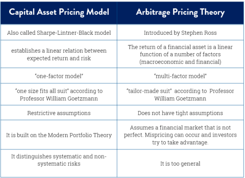

## Table of Contents

## What is the Capital Asset Pricing Model (CAPM)?

The Capital Asset Pricing Model, or CAPM, is a financial tool that helps investors understand the relationship between the risk of an investment and its expected return. It was developed to help investors make better decisions by figuring out how much extra return they should expect for taking on more risk. The basic idea behind CAPM is that investors need to be compensated in two ways: first, for the time value of money, which is usually represented by the risk-free rate, and second, for the risk they take on by investing in a particular asset, which is measured by the asset's beta.

CAPM uses a formula to calculate the expected return of an asset. The formula is: Expected Return = Risk-Free Rate + Beta * (Market Return - Risk-Free Rate). Here, the risk-free rate is typically the return on a government bond, like a U.S. Treasury bond. The beta measures how much the asset's returns move with the market. If an asset has a beta of 1, it moves with the market; if it's more than 1, it's more volatile than the market, and if it's less than 1, it's less volatile. The term (Market Return - Risk-Free Rate) is called the market risk premium, which represents the extra return investors expect for taking on the risk of investing in the market as a whole.

## What is the Arbitrage Pricing Theory (APT)?

The Arbitrage Pricing Theory, or APT, is another way to figure out how much return an investment might give you, based on its risk. It's different from the Capital Asset Pricing Model because it says that an investment's return isn't just affected by how the whole market moves, but by a bunch of different things, like inflation rates, interest rates, and even how well the economy is doing. These are called factors, and APT says that each factor can push the return of an investment up or down.

APT works on the idea of arbitrage, which is a fancy way of saying that if two similar investments have different prices, you can buy the cheaper one and sell the more expensive one to make a profit without taking any risk. According to APT, if an investment's actual return doesn't match what the factors say it should be, smart investors will step in and buy or sell the investment until its price adjusts to what it should be. This means that APT assumes markets are pretty efficient, and prices will eventually line up with what the factors predict.

To use APT, you need to know which factors affect the investment and how much each factor impacts it. This can be tricky because different people might think different factors are important. But once you figure out the factors and their impacts, you can use APT to estimate the expected return of an investment. This can help you decide if an investment is a good deal or not, based on the risks it carries.

## How does CAPM calculate expected return?

The Capital Asset Pricing Model, or CAPM, calculates the expected return of an investment by using a simple formula. The formula is: Expected Return = Risk-Free Rate + Beta * (Market Return - Risk-Free Rate). The risk-free rate is the return you'd get from a very safe investment, like a U.S. Treasury bond. Beta measures how much the investment's return moves with the overall market. If an investment has a beta of 1, it moves exactly with the market. If it's more than 1, it's more volatile than the market, and if it's less than 1, it's less volatile.

The term (Market Return - Risk-Free Rate) in the formula is called the market risk premium. This is the extra return investors expect for taking the risk of investing in the market instead of a risk-free investment. So, the CAPM formula adds the risk-free rate to the product of the beta and the market risk premium. This gives you the expected return of the investment, showing you how much extra return you should expect for the risk you're taking on.

## How does APT calculate expected return?

The Arbitrage Pricing Theory, or APT, calculates the expected return of an investment by looking at different things that can affect it. These things are called factors, and they can be stuff like inflation, interest rates, or how well the economy is doing. Each factor has its own impact on the investment's return. To use APT, you need to figure out what these factors are and how much they affect the investment. Then, you add up all the impacts of these factors to get the expected return.

APT works on the idea that if the actual return of an investment doesn't match what the factors say it should be, smart investors will step in. They'll buy or sell the investment until its price adjusts to what it should be. This means that APT assumes markets are pretty good at making sure prices are fair. By understanding the factors and their impacts, APT helps you estimate what return you might get from an investment, based on the risks it carries.

## What are the key assumptions of CAPM?

The Capital Asset Pricing Model, or CAPM, has some important ideas it assumes are true to work properly. One big idea is that all investors care about the same thing: they want to get the most return they can for the least amount of risk. They all agree on what the risk-free rate is and how much extra return they should get for taking more risk. They also think the same way about how likely different investments are to go up or down.

Another key assumption is that everyone can borrow and lend money at the same risk-free rate. This means they can all get the same safe [interest rate](/wiki/interest-rate-trading-strategies) on their money. Also, CAPM assumes that everyone can buy or sell as much of any investment as they want without changing the price. This means the market is really good at setting prices that are fair. These assumptions help CAPM figure out how much return an investment should give you based on how risky it is.

## What are the key assumptions of APT?

The Arbitrage Pricing Theory, or APT, has some important ideas it assumes are true to work well. One big idea is that there are no chances to make easy money without risk, which is called arbitrage. APT assumes that if an investment's price is off, smart investors will step in and buy or sell until the price is right. Another assumption is that the returns of investments are affected by a bunch of different things called factors, like inflation or interest rates. These factors are the same for everyone, and everyone agrees on how much they matter.

APT also assumes that markets are good at setting fair prices. It thinks that investors can buy or sell as much as they want without changing the price too much. This means the market is efficient, and prices will adjust to match what the factors say they should be. By understanding these assumptions, APT helps figure out what return you might get from an investment based on the risks it carries.

## How do CAPM and APT differ in terms of risk factors?

CAPM and APT both help figure out how much return you might get from an investment, but they look at risk in different ways. CAPM thinks that the only risk that matters is how much an investment moves with the whole market. This is called market risk, and it's measured by something called beta. If an investment has a high beta, it moves a lot with the market, and if it has a low beta, it doesn't move as much. CAPM says that you should get more return if you take on more market risk.

APT, on the other hand, thinks that there are many different things that can affect an investment's return. These things are called factors, and they can be stuff like inflation, interest rates, or how well the economy is doing. APT says that each of these factors can push the return of an investment up or down. So, instead of just looking at market risk like CAPM does, APT looks at a bunch of different risks to figure out what return you might get. This makes APT more flexible because it can take into account many different things that might affect an investment.

## Can you explain the single-factor model of CAPM versus the multi-factor model of APT?

The Capital Asset Pricing Model, or CAPM, uses a single-factor model to figure out how much return you might get from an investment. This one factor is how much the investment moves with the whole market, which is called market risk. CAPM measures this with something called beta. If an investment has a high beta, it moves a lot with the market, and if it has a low beta, it doesn't move as much. So, CAPM says that the only thing you need to worry about is how much your investment goes up and down with the market. If you take on more of this market risk, you should get more return.

The Arbitrage Pricing Theory, or APT, uses a multi-factor model. Instead of just looking at market risk, APT thinks that there are many different things that can affect an investment's return. These things are called factors, and they can be things like inflation, interest rates, or how well the economy is doing. Each of these factors can push the return of an investment up or down. So, APT looks at all these different risks to figure out what return you might get. This makes APT more flexible because it can take into account many different things that might affect an investment.

## What are the practical applications of CAPM in investment decisions?

CAPM is a useful tool for investors who want to figure out if an investment is a good deal. It helps them see if the return they might get from an investment is worth the risk they're taking. For example, if an investor is looking at a stock, they can use CAPM to find out what return they should expect based on how much the stock moves with the market. If the expected return is higher than what they could get from a safer investment, like a government bond, they might decide to buy the stock. This way, CAPM helps investors make smarter choices by comparing the risk and reward of different investments.

Another way CAPM is used is in setting the cost of equity for a company. This is important for businesses that want to raise money by selling stocks. CAPM helps them figure out how much return investors will expect for buying their stock, based on how risky the company is. This information is useful for deciding how much to pay shareholders and for planning how to grow the business. By using CAPM, companies can make sure they're offering a fair return to investors, which can help them attract more money to grow.

## What are the practical applications of APT in investment decisions?

APT is a helpful tool for investors who want to understand how different things can affect the return of their investments. It looks at many factors like inflation, interest rates, and how well the economy is doing. By understanding these factors, investors can figure out if an investment is a good deal. For example, if an investor is thinking about buying a stock, they can use APT to see how different factors might push the stock's return up or down. If the expected return is higher than what they could get from a safer investment, they might decide to buy the stock. This way, APT helps investors make better choices by considering all the different risks that might affect their investments.

Another way APT is used is in figuring out how to spread out investments to lower risk. By understanding the different factors that affect returns, investors can choose investments that don't all go up and down at the same time. This can help them balance their portfolio so that if one investment does badly because of one factor, another investment might do well because of a different factor. This makes their overall investment less risky. So, APT helps investors build a mix of investments that can handle different economic situations better.

## How do empirical tests compare the effectiveness of CAPM and APT?

When people test CAPM and APT to see which one works better, they often find that APT can explain more about why investments go up or down. CAPM looks at just one thing, how much an investment moves with the market. But APT looks at many different things, like inflation or interest rates. Because APT considers more factors, it can sometimes do a better job of figuring out why investments do what they do. Studies have shown that APT can explain a bigger part of the changes in investment returns than CAPM can.

However, CAPM is simpler and easier to use. It's popular because it's easy to understand and apply. Even though APT might be better at explaining things, it's harder to use because you need to figure out which factors matter and how much they affect investments. This can be tricky and different people might come up with different answers. So, while APT might be more accurate, CAPM is often used more because it's simpler and still gives useful information about the risk and return of investments.

## What are the criticisms and limitations of both CAPM and APT in modern financial theory?

CAPM has some big problems that people point out. One big issue is that it only looks at how an investment moves with the whole market. But in real life, there are lots of other things that can affect how an investment does, like inflation or how well the economy is doing. CAPM doesn't take these things into account, so it might not give a full picture of the risk and return of an investment. Another problem is that CAPM assumes everyone can borrow and lend money at the same safe interest rate, which isn't true in the real world. This makes CAPM less useful because it's based on ideas that don't always match reality.

APT tries to fix some of CAPM's problems by looking at many different things that can affect investments. But APT has its own issues too. One big criticism is that it's hard to figure out which factors really matter and how much they affect investments. Different people might come up with different answers, so it can be tricky to use APT in a way that everyone agrees on. Also, APT assumes that markets are really good at setting fair prices, but in real life, markets can make mistakes. This means APT might not always give the right answer about what return you should expect from an investment.

## What is the Capital Asset Pricing Model (CAPM) and how does it work?

The Capital Asset Pricing Model (CAPM) is a cornerstone of modern financial theory, established primarily to understand how securities are priced concerning their intrinsic risk and expected return. It centers on the concept of systematic risk, which refers to the market-wide risks that cannot be eliminated through diversification. The CAPM is instrumental for discerning the expected return of an asset, especially equities, and relies on several core assumptions about market conditions and investor behavior.

### Basic Assumptions of CAPM

The CAPM is predicated on certain market assumptions: 

1. **Market Efficiency**: It assumes that markets are efficient, meaning all available information is already reflected in asset prices.
2. **Rational Investors**: Investors are expected to act rationally with the goal of maximizing utility.
3. **Single Period Transaction**: The model assumes investors make decisions based on a single time period.
4. **Risk-Free Rate**: An asset can be borrowed or lent at a risk-free rate.
5. **No Taxes and Transaction Costs**: Assumes markets with no taxes or transaction costs, enabling seamless trading.
6. **Homogeneous Expectations**: Investors have the same expectations about future securities returns.

### The CAPM Formula

The CAPM formula captures the expected return of an asset based on risk and time value of money:

$$

E(R_i) = R_f + \beta_i (E(R_m) - R_f) 
$$

Where:
- $E(R_i)$ is the expected return of the investment
- $R_f$ is the risk-free rate of return, typically based on government bonds
- $\beta_i$ represents the beta of the investment, indicating its sensitivity to market movements
- $E(R_m)$ is the expected return of the market
- $(E(R_m) - R_f)$ is known as the market risk premium

### Applications of CAPM

**Cost of Equity**: CAPM is widely used to determine the cost of equity, which is essential for computing the weighted average cost of capital (WACC) and for evaluating investment opportunities.

**Optimal Portfolio Design**: Using CAPM, investors can design portfolios that maximize returns for a given level of risk. It aids in identifying the efficient frontier, where the portfolio offers the highest expected return for a given level of risk.

### Critiques and Limitations

While CAPM provides a straightforward framework for assessing potential investment returns, it is not without critiques. Some limitations include:

- **Unrealistic Assumptions**: Critics point out that assumptions like market efficiency and the absence of taxes and transaction costs aren't realistic.
- **Parameter Estimation**: Estimating the expected market return and beta can be challenging and subject to estimation errors, leading to inaccurate predictions.
- **Static Model**: The model's reliance on a single-period framework doesn't account for time-variant risks and market conditions.
- **Beta Instability**: Empirical studies have shown that beta coefficients can change over time, undermining the model's reliability in risk assessment.

Despite these critiques, CAPM remains a fundamental tool in financial analysis, offering valuable insights into the risk-return tradeoff and helping inform investment decisions. Its simplicity and foundational place in the development of modern portfolio theory underscore its continued relevance, albeit within the context of evolving financial models and methodologies.

## What is Exploring Arbitrage Pricing Theory (APT)?

Arbitrage Pricing Theory (APT) provides a multifactorial framework for determining asset prices, distinguishing itself from the singular focus of the Capital Asset Pricing Model (CAPM). Introduced by economist Stephen Ross in 1976, APT posits that asset returns can be predicted by a linear relationship involving multiple factors, each associated with a specific risk premium.

### Core Principles of APT

The core idea of APT is encapsulated in its linear [factor](/wiki/factor-investing) model, which states:

$$
R_i = E(R_i) + b_{i1}F_1 + b_{i2}F_2 + ... + b_{in}F_n + \epsilon_i
$$

where:
- $R_i$ is the expected return of asset $i$,
- $E(R_i)$ is the expected return assuming zero factor influences,
- $b_{ij}$ are the sensitivity coefficients of asset $i$ to factor $j$,
- $F_j$ are the risk factors,
- $\epsilon_i$ represents the idiosyncratic risk of asset $i$.

APT assumes the existence of an [arbitrage](/wiki/arbitrage) process that ensures returns align with risk factor exposures in equilibrium. Unlike CAPM, which uses a single market risk premium to explain disparities in expected returns, APT acknowledges multiple risk dimensions, providing a more comprehensive perspective.

### Comparison with CAPM

APT and CAPM share foundational premises, like the idea of risk-return trade-offs, but differ in execution and flexibility. CAPM simplifies asset pricing to a single risk factor (market risk), as expressed in the well-known formula:

$$
E(R_i) = R_f + \beta_i (E(R_m) - R_f)
$$

where:
- $R_f$ is the risk-free rate,
- $E(R_m)$ is the expected market return,
- $\beta_i$ measures an asset’s market risk exposure.

APT, on the other hand, accommodates several macroeconomic factors, such as GDP growth, inflation, and changes in interest rates. This flexibility allows for tailored analysis in varying contexts, especially when broader economic conditions exert significant influence over asset returns.

### Common Factors in APT

Factors utilized in APT vary based on empirical observations and the economic environment. Commonly considered factors include:

- **Inflation Rates**: Rising inflation often impacts interest rates and purchasing power, affecting asset returns.
- **Interest Rate Changes**: Central bank policies and market interest rates directly influence borrowing costs and investment valuations.
- **GDP Growth**: Economic expansion or contraction reflects broader market conditions that correlate with asset profitability.

### Practical Insights and Model Creation

Constructing a multifactor APT model involves identifying relevant economic factors and estimating their impacts on asset returns through statistical regression techniques. A practical approach entails:

1. **Selection of Factors**: Choose factors empirically proven to affect asset prices, ensuring they capture different dimensions of economic risk.

2. **Data Analysis**: Use historical data to estimate factor sensitivities ($b_{ij}$) by regressing asset returns on the chosen factors.

3. **Model Validation**: Back-test the model using historical datasets to assess its predictive performance and refine factor selection as needed.

Employing coding languages like Python can facilitate this process. A basic script for estimating APT factor sensitivities using ordinary least squares (OLS) regression could be as follows:

```python
import pandas as pd
import statsmodels.api as sm

# Load your dataset
data = pd.read_csv('asset_factors.csv')
Y = data['Asset_Return']
X = data[['Factor1', 'Factor2', 'Factor3']]  # Add more factors as necessary

# Add a constant to the model for OLS regression
X = sm.add_constant(X)
model = sm.OLS(Y, X).fit()

# Output factor sensitivities and model statistics
print(model.summary())
```

This script exemplifies how to determine the relationship between asset returns and selected macroeconomic factors, underpinning the APT framework's application in financial analysis.

In summary, the flexibility of Arbitrage Pricing Theory in incorporating multiple risk factors offers extensive capabilities in modeling asset returns under varied market conditions, providing a nuanced approach relative to CAPM's singular focus on market risk.

## How can CAPM and APT be integrated into Algo Trading?

Algorithmic trading, a contemporary approach to trading financial instruments, leverages the precision and speed of computerized systems to execute trades. Financial models such as the Capital Asset Pricing Model (CAPM) and Arbitrage Pricing Theory (APT) play a pivotal role in these automated strategies, guiding decision-making processes to optimize trading outcomes.

**CAPM and APT in Decision-Making**

CAPM and APT offer frameworks to estimate expected returns, thus informing trading systems on when to enter or [exit](/wiki/exit-strategy) positions. CAPM employs the equation:

$$
\text{E}(R_i) = R_f + \beta_i (\text{E}(R_m) - R_f)
$$

where $\text{E}(R_i)$ is the expected return on the asset, $R_f$ is the risk-free rate, $\beta_i$ is the asset's beta coefficient, and $\text{E}(R_m)$ is the expected return of the market. In algorithmic trading, CAPM can help assess portfolio risk and identify securities that offer a return compensating for their risk level.

APT, on the other hand, allows for multiple factors affecting returns, providing a more nuanced analysis. The APT formula is generally expressed as:

$$
\text{E}(R_i) = R_f + \sum_{j=1}^{n} \beta_{ij} f_j
$$

where $f_j$ represents macroeconomic factors like GDP growth or interest rates. By incorporating a range of economic indicators, APT is adaptable to complex market conditions, allowing algos to react to diverse risk sources effectively.

**Back-Testing Strategies**

Back-testing is crucial in evaluating the potential success of any trading model. By simulating trades using historical data, traders assess the viability of strategies under varied market conditions. CAPM aids in predicting asset behavior based on historical beta values, while APT provides the flexibility to test against multiple data streams, modeling how different economic factors might impact returns.

Python, a widely-used language in [algorithmic trading](/wiki/algorithmic-trading), allows practitioners to implement CAPM and APT models efficiently. Using packages such as `pandas` and `NumPy`, traders can manipulate financial data for back-testing purposes:

```python
import numpy as np
import pandas as pd

def capm_expected_return(risk_free_rate, beta, market_return):
    return risk_free_rate + beta * (market_return - risk_free_rate)

# Example data
risk_free_rate = 0.02
beta = 1.1
market_return = 0.08

expected_return = capm_expected_return(risk_free_rate, beta, market_return)
print(f"Expected CAPM Return: {expected_return:.2%}")
```

**Platforms Incorporating CAPM and APT**

Numerous algorithmic trading platforms have integrated CAPM and APT within their frameworks. Systems like QuantConnect and Alpaca allow traders to build custom algorithms that use these models for risk and return optimization, providing tools to model, back-test, and deploy trading strategies.

**Machine Learning Enhancements**

Incorporating [machine learning](/wiki/machine-learning) enhances the capabilities of CAPM and APT-based strategies. Techniques such as regression analysis and neural networks can improve beta estimation and factor analysis, adapting models dynamically in changing markets. Machine learning algorithms can help identify non-linear relationships and unexpected factor combinations that traditional models might overlook, offering a significant edge in algorithmic trading.

By embedding CAPM and APT into algorithmic trading systems, traders can systematically assess risk, optimize returns, and adapt to market dynamics, thus improving the robustness of trading strategies. The integration of machine learning further enriches these models, paving the way for more adaptive and responsive trading solutions.

## What are some case studies and applications?

Real-world case studies provide a valuable lens through which the practical applications of the Capital Asset Pricing Model (CAPM) and Arbitrage Pricing Theory (APT) can be understood. These models, foundational in the field of financial economics, have been employed in various market settings to optimize investment strategies, manage risks, and enhance portfolio performance.

One illustrative case is the application of CAPM in portfolio management by institutional investors such as pension funds and mutual funds. These entities often leverage CAPM to estimate the expected return on equity investments by calculating the risk-adjusted expected return. The formula for CAPM is given as:

$$

E(R_i) = R_f + \beta_i (E(R_m) - R_f) 
$$

where $E(R_i)$ is the expected return on the investment, $R_f$ is the risk-free rate, $\beta_i$ is the beta coefficient of the investment, and $E(R_m)$ is the expected return of the market. Institutional investors use this calculation to make informed asset allocation decisions, aiming to construct a portfolio that achieves a desired balance between risk and return.

Arbitrage Pricing Theory (APT), on the other hand, provides a multi-factor approach to asset pricing. A notable example of its application is found in the work of hedge funds, which often employ APT to identify mispriced assets by considering various economic factors such as interest rates, inflation, and GDP growth. These factors are input into a multifactor model to predict security returns, allowing hedge funds to exploit arbitrage opportunities across different markets.

Consider a Python example illustrating the implementation of APT in constructing a multivariate regression model to predict asset returns:

```python
import numpy as np
import pandas as pd
from sklearn.linear_model import LinearRegression

# Sample data representing factor returns
factor_data = pd.DataFrame({
    'InterestRateChange': np.random.normal(0, 1, 100),
    'Inflation': np.random.normal(0, 1, 100),
    'GDPGrowth': np.random.normal(0, 1, 100),
})

# Assumed asset returns
asset_returns = np.random.normal(0, 1, 100)

# Creating a regression model
model = LinearRegression()
model.fit(factor_data, asset_returns)

# Coefficients representing sensitivity to each factor
print("Factor Sensitivities:", model.coef_)
```

This code demonstrates how APT can be operationalized to analyze sensitivities of asset returns to multiple economic factors, facilitating more sophisticated investment strategies.

High-frequency trading ([HFT](/wiki/high-frequency-trading-strategies)) firms too have incorporated these models into their algorithms. Both CAPM and APT can be used in back-testing trading strategies to ensure robustness in volatile markets. By applying these models, HFT firms are capable of executing trades that capitalize on minute discrepancies in pricing rapidly, thereby maintaining competitive edges.

Insights from leading financial analysts reveal the importance of understanding each model's limits and advantages to harness their full potential. Analysts suggest that while CAPM provides simplicity and ease of use, APT offers a more comprehensive view by detailing the influence of multiple economic factors. Financial businesses have successfully implemented these strategies by combining expert knowledge with advanced computational tools.

Looking to the future, both CAPM and APT are undergoing evolution to adapt to the dynamics of modern markets. Innovations such as machine learning and [artificial intelligence](/wiki/ai-artificial-intelligence) are being integrated into these models, providing enhanced analytical power to accommodate increasing data complexity. As markets continue to evolve, these models are anticipated to further revolutionize the landscape of financial modeling, opening new avenues for investment decision-making and risk management. The ability to adapt and integrate these models in light of technological advancements will be crucial in maintaining their relevance and effectiveness in future financial environments.

## References & Further Reading

[1]: Fama, E. F., & French, K. R. (2004). ["The Capital Asset Pricing Model: Theory and Evidence."](https://www.aeaweb.org/articles?id=10.1257/0895330042162430) Journal of Economic Perspectives, 18(3), 25-46.

[2]: Ross, S. A. (1976). "The Arbitrage Theory of Capital Asset Pricing." Journal of Economic Theory, 13(3), 341-360.

[3]: Sharpe, W. F. (1964). ["Capital Asset Prices: A Theory of Market Equilibrium Under Conditions of Risk."](https://onlinelibrary.wiley.com/doi/full/10.1111/j.1540-6261.1964.tb02865.x) The Journal of Finance, 19(3), 425-442.

[4]: Grinold, R. C., & Kahn, R. N. (2000). ["Active Portfolio Management: A Quantitative Approach for Producing Superior Returns and Controlling Risk."](https://www.amazon.com/Active-Portfolio-Management-Quantitative-Controlling/dp/0070248826) McGraw-Hill.

[5]: Jorion, P. (1991). ["Bayesian and CAPM Estimation Techniques for Beta and Variance: The Case of a Thinly Traded Stock Market."](https://www.semanticscholar.org/paper/Bayesian-and-CAPM-estimators-of-the-means%3A-for-Jorion/f20646f49c29663aa25491a43eb76524df84d0e5) Journal of Financial and Quantitative Analysis, 26(3), 363-378.

[6]: Endow & Gilder. (2001). ["Applications of the arbitrage pricing theory."](https://www.financestrategists.com/wealth-management/valuation/arbitrage-pricing-theory-apt/) The Journal of Financial and Quantitative Analysis, 36(3).