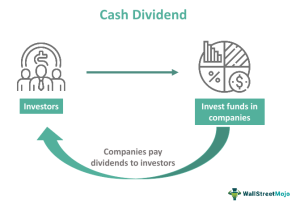

The stock market offers a multitude of strategies aimed at maximizing investor returns, enabling both novice and experienced investors to tailor their approaches to meet distinct financial objectives. Traditional investment strategies, such as dividends, provide a foundational means through which investors can earn income and grow their portfolios. Dividends, typically issued in cash or as additional stock shares, serve as a testament to a company's profitability and financial health, rewarding shareholders through consistent financial returns.

In contrast, modern investment strategies leverage technological advancements, with algorithmic trading standing out as a significant innovation. This method uses automated systems to execute trades based on pre-established parameters, ensuring speed and accuracy that is unattainable through manual trading. Such systems can process vast amounts of data to identify prime trading opportunities while minimizing emotional influences on decisions. By integrating both traditional dividend strategies and sophisticated algorithmic trading techniques, investors have the potential to enhance their portfolios more strategically.



This article explores these diverse strategies—cash dividends, stock dividends, and algorithmic trading—and their role in optimizing investment portfolios. Understanding these methods equips investors with the knowledge to make informed decisions, ultimately leading to improved financial performance and sustained growth. By navigating the complexities and opportunities of these investment approaches, investors can craft strategies that align with their long-term goals and adapt to the ever-evolving landscape of global financial markets.

## Table of Contents

## Understanding Dividends

Dividends are distributions of a corporation's earnings to its shareholders. These distributions are generally issued as either cash dividends or stock dividends. Cash dividends are straightforward: they involve the direct payment of money to shareholders, typically in the form of a fixed amount per share owned. For example, if a company declares a dividend of $1 per share and an investor holds 100 shares, they receive $100 as a cash dividend. This type of dividend provides immediate financial returns to investors, making it an attractive option for those seeking regular income.

On the other hand, stock dividends involve issuing additional shares of the company's stock to existing shareholders. While stock dividends do not provide immediate cash, they increase the number of shares an investor owns, potentially enhancing their future profits if the company grows. Stock dividends do not lead to an outflow of cash from the company, making them a preferable option for companies that wish to reinvest funds into operations for growth. However, issuing stock dividends results in share dilution, which can lead to a decrease in the stock's price per share, although the overall value for shareholders remains unchanged.

Both types of dividends have distinct advantages and implications. Cash dividends offer liquidity and can serve as a source of stable income, which is especially beneficial during market downturns. They may also serve as a signal of a company's financial health, as consistent dividend payments often reflect a firm's stable [earning](/wiki/earning-announcement) power and efficient financial management. Conversely, stock dividends can be indicative of a company with robust growth prospects, considering that firms issuing them often retain cash for investment in business expansion.

The ability of a company to pay dividends is also frequently viewed as an indicator of its financial stability. A consistent dividend payment history is often equated with reliable management practices and profitability. However, investors should conduct thorough analyses of a company’s long-term performance and market conditions to determine the sustainability of dividends, as fluctuations in a firm's earnings can impact its dividend policies.

## Cash Dividends Explained

Cash dividends represent a direct distribution of a company’s earnings to its shareholders and are typically paid in cash. These payments provide investors with a consistent income source. However, they come with tax implications, as dividends are generally subject to income tax. The tax rate can vary depending on the investor's jurisdiction and the dividend type, such as qualified or ordinary dividends.

To receive cash dividends, one must own the stock before the ex-dividend date, which is set by the company. The ex-dividend date is typically set two business days before the record date, which is the date when the company reviews its records to determine the shareholders eligible to receive dividends. If an investor purchases a stock on or after the ex-dividend date, they will not receive the dividend.

After dividends are paid, the stock’s price often drops approximately by the dividend amount. This drop reflects the reduction in the company's retained earnings from which the dividend is drawn. For instance, if a company pays a $1 dividend per share, the stock price might decrease by around $1 the day after the ex-dividend date, all else being equal.

Investors must consider potential fluctuations in share value when opting for cash dividends. Although dividends provide a direct income stream, they can lead to a temporary dip in the stock price, affecting the total value of one's investment holdings. Understanding these dynamics helps investors make informed decisions regarding whether to seek dividend-paying stocks or reinvest profits in other growth-intensive ventures.

## Stock Dividends Explained

Stock dividends increase the number of shares owned by an investor without impacting their immediate cash flow. Unlike cash dividends, which provide a direct monetary distribution to shareholders, stock dividends distribute additional equity in the form of more shares. This process enhances the investor's ownership in a company, effectively increasing their stake without an immediate outflow of cash from the company.

The issuance of stock dividends has an important implication: it results in the dilution of the share price. For example, if a company issues a 10% stock dividend, each shareholder receives additional shares equivalent to 10% of the shares they already hold. However, the overall value of their holdings remains unchanged because the market value per share decreases proportionally. Mathematically, if a company has $N$ shares before the stock dividend and issues an additional $a\%$ stock dividend, the new number of shares becomes $N \left(1 + \frac{a}{100}\right)$.

Stock dividends are attractive to shareholders as they are generally not subject to tax until the shares are sold, offering a potential tax advantage compared to cash dividends. This deferred taxation can be beneficial for investors seeking long-term capital appreciation.

For companies, stock dividends serve as an effective way to reward shareholders without reducing corporate cash reserves. This approach is particularly advantageous for firms that are confident about their growth prospects but prefer to reinvest cash into the business rather than distribute it as cash dividends. By issuing stock dividends, companies can signal their optimism in future earnings growth to the market, concurrently supporting shareholder interest by increasing their equity stake.

In summary, stock dividends provide a strategic mechanism for companies to balance growth and shareholder value, aligning corporate resources with long-term investment objectives.

## Cash vs. Stock Dividends

Cash dividends provide investors with immediate financial returns by distributing a portion of a company's profits directly to shareholders in the form of cash. This tangible income can be particularly appealing for investors seeking regular cash flow or those relying on investments as a source of income. However, cash dividends are generally subjected to taxation in the year they are received, which can affect the overall net yield, especially for those in higher tax brackets. Furthermore, when a company issues cash dividends, its stock price typically drops by approximately the amount of the dividend paid, reflecting the distribution of assets from the company’s balance sheet.

In contrast, stock dividends represent an increase in the number of shares an investor holds. While they do not provide immediate cash income, they offer a way to enhance one's equity in a company without incurring immediate tax liabilities, as taxes are usually deferred until the shares are sold. Stock dividends are particularly beneficial for investors focused on growth, as they allow for the potential compounding of value without the requirement for an immediate cash outlay. However, one must note that issuing stock dividends can lead to share dilution, which may decrease the market price of the stock proportionally to the dividend issued, though not always to the same extent as cash dividends.

Deciding between cash and stock dividends involves assessing strategic use cases that are highly contingent on individual investment goals and prevailing market conditions. For instance, investors may opt for cash dividends when there is a need for [liquidity](/wiki/liquidity-risk-premium) or when market conditions are uncertain and preserving cash is seen as advantageous. Conversely, during times of market growth or when focusing on long-term capital appreciation, stock dividends might be more attractive.

Balancing the need for immediate income against the desire for long-term asset growth is essential. Cash dividends can offer the advantage of income predictability, while stock dividends support the growth of principal wealth over time. Investors crafting a diversified portfolio may consider a mix of both types of dividends. The key lies in aligning dividend choices with personal financial goals, risk tolerance, and the economic context, thereby enabling strategic incorporation that maximizes potential returns while managing associated risks effectively.

 to Algorithmic Trading

Algorithmic trading, also known as algo-trading, leverages computer programs to execute trading decisions based on predetermined criteria. These programs utilize complex mathematical models and algorithms to momentarily analyze large datasets to identify optimal buying and selling points, significantly enhancing speed and precision in trading decisions. By minimizing human intervention, algorithmic systems eliminate emotional biases that often lead to trading errors, thereby ensuring a higher degree of accuracy in transactions.

One of the principal advantages of [algorithmic trading](/wiki/algorithmic-trading) is its ability to operate at a velocity far beyond human capability. Algorithms can process vast amounts of information and execute trades in fractions of a second, known as high-frequency trading ([HFT](/wiki/high-frequency-trading-strategies)). This speed allows traders to take advantage of even the smallest market inefficiencies, often translating into increased profitability.

Moreover, algorithms are capable of optimizing investment strategies, including those based on dividends. For instance, these systems can monitor a multitude of financial indicators and metrics to strategically adjust portfolios around dividend issues, such as dividend yield or payout ratios. This ensures that trading strategies remain optimal and aligned with market conditions, including adjusting for changes in company earnings or dividend policies.

An algorithm's capability to harness vast historical and real-time data enables it to forecast potential market trends and determine entry and [exit](/wiki/exit-strategy) points that align with the investor's strategy parameters. This predictive power is crucial for maintaining competitiveness in dynamic markets, offering structured decision-making over manual trading based on instincts or incomplete data.

Overall, algorithmic trading represents a significant evolutionary step in financial markets by enhancing the precision, objectivity, and efficiency of trading activities. Given its capacity to manage complex calculations and rapid executions, it can substantially improve the implementation of various investment strategies, thus paving the way for more robust financial outcomes.

## Integrating Algo-Trading with Dividend Strategies

Algorithmic trading, or algo-trading, is increasingly being leveraged to enhance dividend strategies, allowing investors to maximize efficiency and returns. By employing sophisticated algorithms, traders can systematically and automatically identify stocks offering high dividend yields and pinpoint optimal trading times. This process involves the use of extensive data analysis and statistical models to uncover patterns and opportunities that might not be visible to the human eye.

One of the notable advantages of integrating algo-trading with dividend strategies is the ability to automate dividend reinvestment plans (DRIPs). These algorithms can promptly buy additional shares when favorable market conditions arise, thus allowing investors to effectively capitalize on market adjustments without the need for constant manual oversight. This automated reinvestment strategy aims to enhance compounded growth over time by systematically reinvesting dividends to purchase more shares.

The successful implementation of algo-trading integrated with dividend approaches necessitates a robust understanding of both trading models and financial markets. This includes knowledge of algorithmic design, financial instruments, and market trends. Conducting thorough [backtesting](/wiki/backtesting) of algorithms against historical data is essential to gauge potential performance and refine strategies before live trading.

Considerations for integrating these systems also encompass programming expertise and risk management. Python is a common language choice for developing trading algorithms due to its extensive libraries and tools for financial analysis. For example, a basic algorithm for identifying high yield dividend stocks might be implemented as follows:

```python
import yfinance as yf  # For more datasets, visit: https://paperswithbacktest.com/datasets
import pandas as pd

# List of stock tickers to analyze
tickers = ["AAPL", "MSFT", "T", "JNJ", "PG"]

# Function to calculate dividend yield
def get_dividend_yield(ticker):
    stock = yf.Ticker(ticker)
    dividend = stock.info["dividendYield"]
    return dividend

# Create a DataFrame to store ticker and dividend yield
yield_data = pd.DataFrame(columns=["Ticker", "Dividend Yield"])

# Populate the DataFrame
for ticker in tickers:
    yield_data = yield_data.append(
        {"Ticker": ticker, "Dividend Yield": get_dividend_yield(ticker)}, ignore_index=True
    )

# Sort the DataFrame by dividend yield in descending order
yield_data.sort_values(by="Dividend Yield", ascending=False, inplace=True)

print(yield_data)
```

Risk management protocols are crucial to address potential challenges such as dividend cuts or changes in company earnings that may impact expected returns. Algorithms must be flexible enough to adapt to volatile markets and should incorporate safeguards to mitigate financial risks. Ensuring compliance with regulatory frameworks and managing possible technical issues or errors is also vital to maintain the integrity and effectiveness of algorithmic systems.

In summary, integrating algorithmic trading with dividend strategies presents an advanced method to optimize investment decisions. By harnessing technology and data analytics, investors can achieve more refined trade execution and strategic portfolio management, ultimately aiming to improve financial outcomes in an increasingly competitive market.

## Risks and Considerations

Using algorithmic trading necessitates a comprehensive understanding of both the potential risks and the dynamic nature of market changes. First and foremost, the success of algorithmic trading strategies is heavily dependent on the quality of data and the robustness of strategy design. Inaccurate or delayed data can significantly impact the decision-making process, leading to suboptimal trades. Therefore, ensuring access to high-quality, real-time data is essential for effective algorithmic trading.

Algorithmic strategies must be flexible to accommodate changes in market conditions, especially during periods of high [volatility](/wiki/volatility-trading-strategies). For instance, algorithms could be programmed to adjust buy and sell thresholds or modify trading [volume](/wiki/volume-trading-strategy) based on volatility metrics such as the VIX index. This adaptability is necessary to prevent significant losses and to capitalize on sudden market opportunities.

Moreover, dividends and company earnings are critical factors for investors focused on dividend strategies. A reduction in dividends or fluctuations in company earnings can alter expected returns, which algorithms need to promptly incorporate into their trading models. This means regularly updating algorithms with the latest financial reports and dividend announcements.

Regulatory compliance is another crucial area requiring attention in algorithmic trading. Algorithms must be designed to adhere to financial regulations, which can vary significantly across different jurisdictions. Failure to comply with these regulations can result in legal implications and financial penalties.

Technical issues, such as system outages or connectivity problems, pose additional risks to algorithmic trading. Implementing robust risk management protocols, including fail-safes and redundancy in systems, is vital to mitigate such risks. Having a fallback infrastructure ensures that trading activities can continue seamlessly even in the presence of technical disruptions.

In summary, while algorithmic trading offers the potential for enhanced efficiency and precision in executing trading strategies, it is imperative to recognize and address the associated risks. Building adaptable algorithms and ensuring compliance with regulatory standards are critical to the successful implementation of algorithmic trading strategies.

## Conclusion

Cash and stock dividends, alongside algorithmic trading, present investors with versatile tools to refine their investment strategies. Each of these techniques offers distinct advantages, which should be carefully evaluated in the context of individual investment goals. Cash dividends provide immediate income, beneficial for investors seeking regular cash flow, while stock dividends allow for increased equity stakes without immediate tax obligations. Algorithmic trading stands out for its ability to process vast datasets with speed and precision, identifying optimal investment opportunities that manual analysis might overlook.

In a financial environment characterized by rapid changes and innovations, continual learning and adaptation are vital for investors aiming to maintain a competitive edge. Staying updated on market trends, regulatory changes, and technological advancements can significantly enhance the effectiveness of investment strategies. Leveraging the combined potential of dividends and algorithmic trading can lead to improved financial outcomes and long-term asset growth.

To make the most out of these investment strategies, informed decision-making and strategic planning are paramount. Investors should focus on aligning their investment choices with their financial objectives while considering market conditions. By adopting a disciplined approach to integrating cash and stock dividends with algorithmic trading, investors can optimize their portfolios, achieving greater returns and securing sustainable growth over time.

## References & Further Reading

[1]: ["Dividend Policy: Its Impact on Firm Value"](https://www.academia.edu/8447440/Dividend_policy_and_its_impact_on_firm_value_A_Review_of_Theories_and_Empirical_Evidence) by Refa Atiyah, available on ScienceDirect.

[2]: ["Principles of Quantitative Equity Investing: A Complete Guide to Creating, Evaluating, and Implementing Trading Strategies"](https://ptgmedia.pearsoncmg.com/images/9780134192796/samplepages/9780134192796.pdf) by Sugata Ray

[3]: Graham, B., & Dodd, D. L. (1934). ["Security Analysis."](https://www.amazon.com/Security-Analysis-Classic-Benjamin-Graham/dp/0070244960) New York: McGraw-Hill.

[4]: O'Hara, M. (2015). ["High Frequency Trading: On the Role of Speed in Financial Markets,"](https://statmath.wu.ac.at/~hauser/LVs/FinEtricsQF/References/oHara2015JFinEco_HighFrequ_Market_MiicroStruct.pdf) Review of Financial Studies, 26(8), 2493-2534.

[5]: ["The Intelligent Investor: The Definitive Book on Value Investing"](https://www.amazon.com/Intelligent-Investor-3rd-Ed/dp/0063356724) by Benjamin Graham

[6]: Narang, R. K. (2009). ["Inside the Black Box: A Simple Guide to Quantitative and High Frequency Trading,"](https://onlinelibrary.wiley.com/doi/book/10.1002/9781118267738) Wiley Trading.

[7]: ["Dividend Policy and Corporate Governance"](https://www.researchgate.net/publication/227467870_Dividend_Policy_and_Corporate_Governance) by Luis Correia da Silva, Marc Goergen, and Luc Renneboog