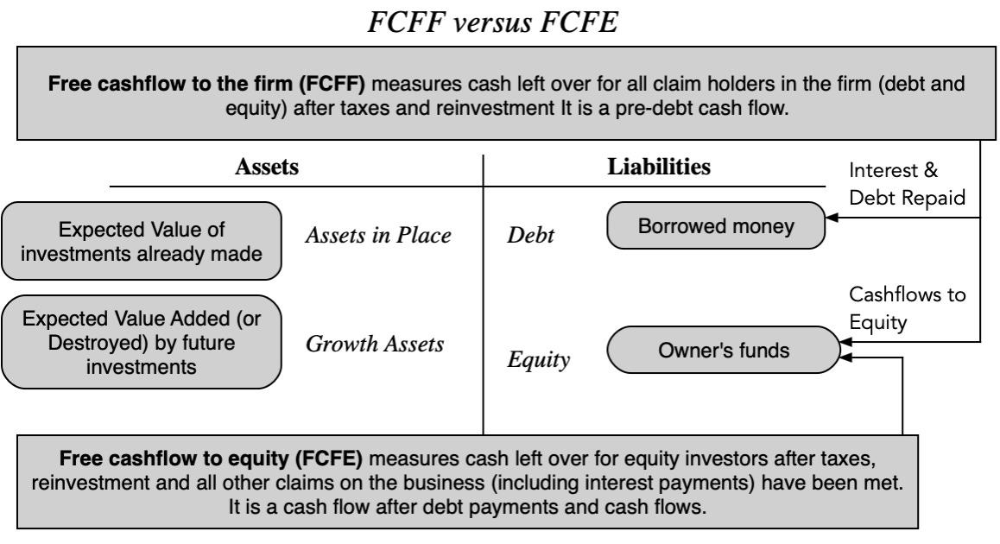

## Table of Contents

## What is cash flow?

Cash flow is the movement of money in and out of a business. It shows how much money is coming into the business from sales and other sources, and how much money is going out to pay for expenses like rent, salaries, and supplies. Good cash flow means that a business has enough money coming in to cover its costs and keep operating smoothly.

Managing cash flow is important for any business because it helps to make sure there is always enough money available to pay bills and invest in growth. If a business has poor cash flow, it might struggle to pay its debts on time, which can lead to bigger problems. Keeping a close eye on cash flow can help business owners plan better and make smarter decisions about spending and saving.

## What is free cash flow?

Free cash flow is the money a business has left after it pays for everything it needs to keep running. This includes things like rent, salaries, and buying supplies. Free cash flow is important because it shows how much money a business can use for other things, like paying back loans, buying new equipment, or giving money back to the owners.

If a business has a lot of free cash flow, it means it is doing well and has extra money to use. This can be good because the business can grow or save for the future. But if a business has little or no free cash flow, it might have trouble paying its bills or growing. Keeping track of free cash flow helps business owners know if they are making enough money to cover all their costs and still have some left over.

## How is cash flow calculated?

Cash flow is calculated by looking at the money coming into a business and the money going out. To find out the cash flow, you start with the money you get from sales and other sources, like loans or investments. This is called cash inflow. Then, you subtract all the money you spend on things like rent, salaries, supplies, and other expenses. This is called cash outflow. The difference between the cash inflow and cash outflow is the net cash flow. If the number is positive, it means more money came in than went out. If it's negative, it means more money went out than came in.

You can also break down cash flow into different parts to understand it better. There's operating cash flow, which comes from the main business activities like selling products or services. Then there's investing cash flow, which includes money spent on or received from investments like buying or selling equipment. Finally, there's financing cash flow, which involves money from loans, paying back loans, or getting money from investors. Adding up these three types of cash flow gives you the total cash flow for the business. This helps business owners see where their money is coming from and where it's going.

## How is free cash flow calculated?

Free cash flow is calculated by starting with the operating cash flow, which is the money a business makes from its main activities like selling products or services. To find the operating cash flow, you take the money coming in from sales and subtract the money going out for things like rent, salaries, and supplies. This gives you the net cash from operations.

Once you have the operating cash flow, you then subtract the money spent on capital expenditures. Capital expenditures are things like buying new equipment or buildings that the business needs to grow or keep running. The money left after you subtract these expenses is the free cash flow. This is the money the business can use for other things like paying back loans, giving money to owners, or saving for the future.

## What are the main components of cash flow?

Cash flow is made up of three main parts: operating cash flow, investing cash flow, and financing cash flow. Operating cash flow is the money a business gets from its main activities, like selling products or services. It's what's left after you subtract the costs of running the business, like rent, salaries, and supplies. This part of cash flow shows how well the business is doing day to day.

Investing cash flow is about the money a business spends on or gets from investments. This can include buying or selling things like equipment, buildings, or other businesses. If a business buys new equipment, it spends money, which is a negative cash flow. If it sells something, it gets money back, which is a positive cash flow. This part helps show how the business is growing or changing.

Financing cash flow is the money that comes from loans, paying back loans, or getting money from investors. When a business takes out a loan or gets money from investors, it's a positive cash flow. When it pays back loans or gives money to owners, it's a negative cash flow. This part shows how the business is managing its money with outside help. Adding up these three parts gives you the total cash flow for the business.

## What are the main components of free cash flow?

Free cash flow is made up of two main parts: operating cash flow and capital expenditures. Operating cash flow is the money a business makes from its main activities, like selling things or doing services. You find it by taking the money coming in from sales and subtracting the money going out for things like rent, salaries, and supplies. This part shows how well the business is doing every day.

The other part is capital expenditures, which is the money a business spends on big things it needs to keep running or grow, like buying new equipment or buildings. To find free cash flow, you take the operating cash flow and subtract the money spent on these capital expenditures. The money left over is the free cash flow, which the business can use for other things like paying back loans, giving money to owners, or saving for the future.

## Why is cash flow important for a business?

Cash flow is important for a business because it shows how much money is coming in and going out. This helps business owners know if they have enough money to pay for things like rent, salaries, and supplies. If a business has good cash flow, it can keep running smoothly and pay its bills on time. If the cash flow is not good, the business might struggle to pay its debts, which can lead to bigger problems.

Keeping track of cash flow also helps business owners plan better. They can see where their money is coming from and where it's going. This helps them make smart decisions about spending and saving. Good cash flow management means a business can grow, invest in new things, and be ready for the future. If a business doesn't manage its cash flow well, it might not be able to grow or might even have to close down.

## Why is free cash flow important for investors?

Free cash flow is important for investors because it shows how much money a business has left after paying for everything it needs to run. This is the money that can be used to pay back loans, buy new things to help the business grow, or give money back to the investors. When a business has a lot of free cash flow, it means it is doing well and has extra money to use. Investors like to see this because it means the business is healthy and can keep growing or paying them back.

If a business has little or no free cash flow, it might be struggling to pay its bills or grow. This can worry investors because it might mean the business is not doing well. Investors look at free cash flow to decide if a business is a good investment. They want to know if the business can make money and use it wisely. Good free cash flow makes investors feel more confident about putting their money into the business.

## How do cash flow and free cash flow differ?

Cash flow is all about the money moving in and out of a business. It shows how much money comes in from sales and other sources, and how much money goes out to pay for things like rent, salaries, and supplies. Cash flow is important because it helps a business know if it has enough money to keep running smoothly. If more money comes in than goes out, the business has positive cash flow. If more money goes out than comes in, it has negative cash flow.

Free cash flow is different because it looks at what's left after a business pays for everything it needs to keep running. It starts with the cash flow from the main business activities, called operating cash flow, and then subtracts the money spent on big things like new equipment or buildings, called capital expenditures. Free cash flow is important for investors because it shows how much money a business can use for other things, like paying back loans, growing the business, or giving money back to the owners. If a business has a lot of free cash flow, it means it's doing well and has extra money to use.

## Can you provide an example of how to calculate cash flow from a company's financial statements?

Let's say we have a company called ABC Widgets. To calculate the cash flow for ABC Widgets, we need to look at its cash inflows and outflows. Imagine that in one year, ABC Widgets made $500,000 from selling widgets. This is their cash inflow from sales. They also received $50,000 from a loan, which adds to their cash inflow. On the other hand, they spent $300,000 on salaries, $100,000 on rent, and $50,000 on supplies. These are their cash outflows. To find the net cash flow, we add up all the cash inflows ($500,000 + $50,000 = $550,000) and subtract all the cash outflows ($300,000 + $100,000 + $50,000 = $450,000). The net cash flow for ABC Widgets is $550,000 - $450,000 = $100,000. This positive number means ABC Widgets had more money coming in than going out that year.

Now, let's look at how to calculate the free cash flow for ABC Widgets. We start with the operating cash flow, which is the money from the main business activities. From the example above, the operating cash flow is the money from sales minus the costs of running the business: $500,000 - ($300,000 + $100,000 + $50,000) = $50,000. Next, we need to subtract the money spent on capital expenditures, like buying new equipment. Let's say ABC Widgets spent $20,000 on new equipment. To find the free cash flow, we take the operating cash flow and subtract the capital expenditures: $50,000 - $20,000 = $30,000. This $30,000 is the free cash flow, which is the money ABC Widgets can use for other things like paying back loans or growing the business.

## Can you provide an example of how to calculate free cash flow from a company's financial statements?

Let's say we have a company called XYZ Gadgets. To find out their free cash flow, we start with their operating cash flow. Imagine that in one year, XYZ Gadgets made $600,000 from selling gadgets. They spent $200,000 on salaries, $100,000 on rent, and $50,000 on supplies. So, their operating cash flow is the money from sales minus the costs of running the business: $600,000 - ($200,000 + $100,000 + $50,000) = $250,000. This number shows how much money they made from their main activities after paying for the things they need to keep the business running.

Next, we need to subtract the money XYZ Gadgets spent on capital expenditures, like buying new equipment. Let's say they spent $100,000 on new machines. To find the free cash flow, we take the operating cash flow and subtract the capital expenditures: $250,000 - $100,000 = $150,000. This $150,000 is the free cash flow, which is the money XYZ Gadgets can use for other things like paying back loans, growing the business, or giving money back to the owners. It shows how healthy the company is and if it has extra money to use.

## How can analyzing trends in cash flow and free cash flow help in making investment decisions?

Analyzing trends in cash flow and free cash flow can help investors make smart choices about where to put their money. By looking at how a company's cash flow changes over time, investors can see if the business is getting better at making money or if it's having trouble paying its bills. If a company's cash flow is going up, it means they're bringing in more money than they're spending, which is a good sign. But if the cash flow is going down, it might mean the company is struggling and could have problems in the future. This helps investors decide if a company is a good investment or if they should look somewhere else.

Looking at free cash flow trends is also important because it shows how much extra money a company has after paying for everything it needs. If free cash flow is growing, it means the company is doing well and has money to use for things like growing the business, paying back loans, or giving money to investors. This makes the company more attractive to investors because it shows the business is healthy and can keep growing. On the other hand, if free cash flow is shrinking, it might mean the company is spending too much or not making enough money, which could be a warning sign for investors. By watching these trends, investors can get a better idea of a company's future and make better decisions about where to invest their money.

## What is the difference between understanding cash flow and free cash flow?

Cash flow is the net amount of cash being transferred into and out of a business and is crucial for maintaining an adequate level of liquidity. It encompasses all financial activities within a company, including operating, investing, and financing activities. Operating cash flow, for example, is derived from the core business operations and indicates the cash generated from sales after covering operating expenses. This indicator is vital for ensuring that a company can maintain its operations without relying on external financing.

Free cash flow, on the other hand, provides a deeper insight into a company’s financial health by representing the cash available after the company has fulfilled its capital expenditures necessary for maintaining or expanding its asset base. In essence, free cash flow reveals the amount of money that can be returned to shareholders or reinvested into the business without compromising its operational capabilities. Calculated as:

$$
\text{Free Cash Flow (FCF)} = \text{Operating Cash Flow} - \text{Capital Expenditures}
$$

This measure reflects the company’s profitability and efficiency in generating cash flow that is not tied up in capital projects. 

Differentiating between these two types of cash flow is essential for accurate financial analysis and making informed investment decisions. Cash flow from operations is a reliable indicator of the financial viability of a company’s core business activities. It helps investors assess if the company can sustain its operations and meet its short-term obligations. Meanwhile, understanding free cash flow helps investors evaluate the potential for growth, dividend payments, debt reduction, and other shareholder value-creating activities.

Both metrics have their distinct roles in financial analysis. Cash flow ensures operational sustainability, while free cash flow provides insights into a company's long-term financial health and flexibility. Together, these metrics offer a comprehensive understanding of a company's financial dynamics, enabling investors and financial analysts to make better decisions.

## How can financial analysis be conducted using cash flow metrics?

Financial analysis utilizes cash flow metrics to evaluate a company's capacity to sustain operations and support investment activities. A fundamental aspect of this analysis is the ability to generate sufficient cash flow from core operations, reflecting sound business practices and robust financial management. This analysis hinges on several key metrics derived from cash flow data to discern a company's operational efficiency, growth potential, and financial stability.

One of the primary metrics used is Cash Flow from Operations (CFO), which indicates the cash generated or consumed by a company in its regular business activities. A positive CFO reflects effective management of working capital and the ability to cover operating expenses, while a declining CFO may indicate inefficiencies or operational challenges.

Another critical metric is Free Cash Flow (FCF), calculated as:

$$

\text{FCF} = \text{CFO} - \text{Capital Expenditures}
$$

FCF provides a clearer picture of the funds available for expansion, debt reduction, and dividend distribution after maintaining the company's asset base. A positive FCF typically signifies strong financial health and the potential for growth, whereas a negative FCF might suggest either aggressive investment or insufficient cash generation from core operations.

Additionally, the Cash Flow to Debt (CFD) ratio offers insights into a company's leverage and its ability to meet long-term obligations:

$$

\text{CFD} = \frac{\text{CFO}}{\text{Total Debt}}
$$

A higher CFD ratio indicates a more favorable position, suggesting that the company can comfortably meet its debt obligations with cash generated from operational activities.

Investment in working capital, a component of CFO, is another key area of analysis. An optimal balance ensures that the company funds its short-term liabilities without compromising operational efficiency or [liquidity](/wiki/liquidity-risk-premium).

By thoroughly understanding these metrics, investors can make well-informed decisions about a company's financial health and future performance. The ability to predict performance based on cash flow analysis is particularly valuable in assessing whether a company has the internal resources to capitalize on growth opportunities or requires external financing. Thus, mastering cash flow metrics enhances the accuracy and reliability of financial evaluations, empowering investors to navigate complex financial markets with confidence.

## What is the Role of Free Cash Flow in Algo Trading?

Algo trading, or [algorithmic trading](/wiki/algorithmic-trading), involves the use of complex mathematical models and formulas to facilitate decision-making processes in trading activities. Free cash flow is particularly important in this context as it provides an indicator of a company's financial health and profitability without considering non-cash expenses. Algorithms leverage free cash flow data to construct predictive models that help identify investment opportunities based on the intrinsic value of companies.

Free cash flow (FCF) is defined as:

$$
FCF = \text{Operating Cash Flow} - \text{Capital Expenditures}
$$

This metric provides insight into the amount of cash generated by a company after accounting for investments in long-term assets. In algorithmic strategies, the analysis of free cash flow can uncover the real [earning](/wiki/earning-announcement) potential of a business, serving as an important input for models determining asset allocation or portfolio rebalancing decisions.

When creating a trading algorithm, one could implement a systematic approach that evaluates companies based on free cash flow trends. For instance, an algorithm could be constructed to favor stocks with a consistent increase in free cash flow over several quarters, suggesting a robust and scalable business model. Python, with its extensive libraries and frameworks for financial data analysis, can be utilized to automate such evaluations, enhancing the speed and efficiency of trading strategies.

```python
import pandas as pd
import numpy as np

# Sample data: A DataFrame containing company financial data
data = {
    'Company': ['A', 'B', 'C'],
    'Operating Cash Flow': [500, 400, 300],
    'Capital Expenditures': [200, 150, 100]
}

df = pd.DataFrame(data)

# Calculate Free Cash Flow
df['Free Cash Flow'] = df['Operating Cash Flow'] - df['Capital Expenditures']

# Define a simple strategy to select companies with positive Free Cash Flow
selected_companies = df[df['Free Cash Flow'] > 0]

print(selected_companies)
```

In this example, the code calculates free cash flow and selects companies with a positive value, signaling a potential for sustainable growth. This data can feed into more sophisticated models that incorporate other financial metrics and market conditions.

The value of integrating free cash flow data in algo trading extends further to risk management. It allows the identification of firms with solid balance sheets, minimizing the exposure to firms susceptible to financial distress. Therefore, incorporating free cash flow analysis helps in achieving greater accuracy, enhancing the strategy's performance in predicting market movements and improving return on investment.

## References & Further Reading

To deepen your understanding of cash flow analysis and its practical applications, a range of resources are available that provide valuable insights into financial metrics and strategies. Several textbooks, articles, and online platforms offer comprehensive analysis techniques and case studies to illustrate how these financial tools can be effectively utilized.

1. **Books**: 
   - "Financial Intelligence" by Karen Berman and Joe Knight is an insightful book that provides a fundamental understanding of financial statements, including cash flow analysis. It breaks down complex financial concepts into digestible information, making it a great starting point for learners at any level.
   - "The Essentials of Finance and Accounting for Nonfinancial Managers" by Edward Fields offers practical guidance and examples to comprehend cash flow statements and evaluate financial data critically.

2. **Academic Journals and Articles**:
   - The Journal of Corporate Finance frequently publishes articles on advanced financial analysis topics, including cash flow assessment and its implications on corporate strategy and performance. 
   - Harvard Business Review articles often explore real-world applications of cash flow analysis, providing practical insights and case studies that link theory to practice.

3. **Online Courses and Tutorials**:
   - Platforms like Coursera and edX offer courses led by experts in finance, where modules cover cash flow analysis in detail. Courses such as "Financial Accounting" and "Corporate Finance" can provide structured learning paths.
   - The Khan Academy also provides free tutorials on financial statements and cash flow concepts for beginners interested in building foundational knowledge.

4. **Software and Tools**:
   - Tools such as Microsoft Excel are widely used for financial modeling and cash flow analysis. Knowledge of Excel functions can greatly enhance analytical capabilities. For those interested in coding, learning Python can be beneficial. Python libraries such as `pandas` and `numpy` are invaluable for data manipulation and analysis.

   Example Python code snippet for calculating free cash flow from cash flow statement data:
   ```python
   import pandas as pd

   # Example data frame
   data = {
       "NetCashFromOperatingActivities": [500000],
       "CapitalExpenditure": [150000]
   }
   df = pd.DataFrame(data)

   # Calculate Free Cash Flow
   df['FreeCashFlow'] = df['NetCashFromOperatingActivities'] - df['CapitalExpenditure']

   print(df['FreeCashFlow'][0])
   ```

5. **Professional Forums and Networks**:
   - Joining financial analysis forums such as those on LinkedIn or Reddit (e.g., /r/financialindependence) can provide community support, diverse perspectives, and updates on current practices in cash flow analysis.

Engaging with these resources will not only enhance your understanding of cash flow analysis but also broaden your expertise in applying these concepts effectively for strategic decision-making and enhancing financial performance.

