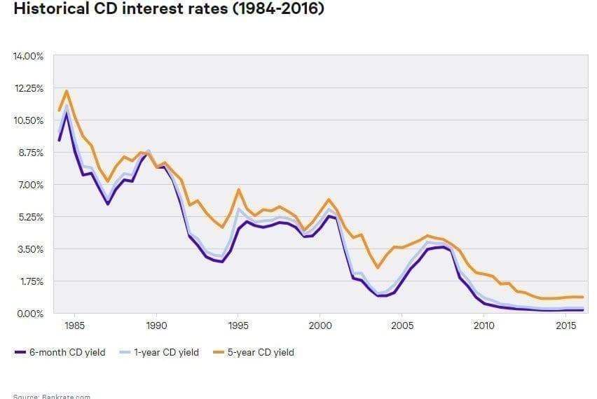

## Table of Contents

## What is a Certificate of Deposit (CD)?

A Certificate of Deposit, or CD, is a type of savings account that you can open at a bank or credit union. When you put money into a CD, you agree to leave it there for a certain amount of time, which can be anywhere from a few months to several years. In return, the bank promises to pay you a fixed interest rate that is usually higher than what you would get from a regular savings account.

Once you put your money into a CD, you can't take it out until the time period is over, which is called the term. If you do need to take your money out early, you might have to pay a penalty. CDs are a good choice if you want to save money safely and earn a bit more interest than a regular savings account, but you need to be sure you won't need the money before the term ends.

## What is inflation and how is it measured?

Inflation is when the prices of things we buy, like food and clothes, go up over time. It means that the money we have can buy less stuff than before. Imagine if a candy bar cost $1 last year, but this year it costs $1.10. That's inflation at work. It happens for many reasons, like when there's more money around than there are things to buy, or when it costs more to make things because of higher prices for materials or labor.

To measure inflation, people look at the prices of a bunch of different things that people usually buy. They put all these prices together into something called a price index. The most common one is the Consumer Price Index, or CPI. Every month, people check the prices of things like food, housing, and transportation, and then they compare these prices to what they were last year. If the prices are higher, that means there's inflation. The percentage increase in the price index tells us the inflation rate. For example, if the CPI goes up by 2% from last year, we say the inflation rate is 2%.

## How do CDs work and what are their typical terms?

A Certificate of Deposit, or CD, is a way to save money at a bank or credit union. When you open a CD, you put in a certain amount of money and agree to leave it there for a set time, called the term. In return, the bank gives you a fixed interest rate, which means you know exactly how much more money you'll get when the term ends. This interest rate is usually higher than what you'd get from a regular savings account. You can't take your money out until the term is over, and if you do, you might have to pay a penalty.

CDs come in different terms, which can be as short as a few months or as long as several years. Common terms include 3 months, 6 months, 1 year, 2 years, 3 years, and 5 years. The longer the term, the higher the interest rate you usually get. So if you choose a 5-year CD, you might earn more interest than if you chose a 1-year CD. It's important to pick a term that matches when you'll need your money back, because taking it out early can cost you money.

## What are the current average interest rates for CDs?

The average interest rates for CDs can change and depend on the length of the CD term. As of early 2023, for a short-term CD like a 3-month or 6-month one, you might see average rates around 0.5% to 1%. For a 1-year CD, the average rate could be around 1% to 1.5%. These rates can be different at different banks, so it's good to shop around.

For longer-term CDs, like 2-year or 5-year ones, the average rates might be a bit higher. A 2-year CD might offer an average rate of around 1.5% to 2%, and a 5-year CD could have an average rate of about 2% to 2.5%. Remember, these are just averages, and you might find better rates if you look at different banks or credit unions. Always check the latest rates before you decide to open a CD.

## How does inflation affect the purchasing power of money?

Inflation makes the money you have worth less over time. When prices go up, the same amount of money can buy fewer things. For example, if a toy costs $10 now and inflation makes it cost $11 next year, you need more money to buy the same toy. This means your money's purchasing power, or what it can buy, goes down.

If inflation is high, it can really change how much you can buy with your money. Imagine saving $100. If inflation is at 5% per year, in one year, that $100 will only be able to buy as much as $95 could buy this year. Over time, this effect gets bigger. So, when you're saving money, you need to think about inflation because it can eat away at the value of your savings if it's not [earning](/wiki/earning-announcement) enough interest to keep up with rising prices.

## How can the interest earned from a CD compare to the inflation rate?

When you put money into a CD, you earn interest over time. This interest can help your money grow. But if the inflation rate is higher than the interest rate you get from your CD, your money loses some of its value. For example, if your CD gives you 1% interest but inflation is 2%, your money is not keeping up with the rising prices. This means that even though you earn some interest, your savings can buy less than before because everything else is getting more expensive.

To make sure your money keeps its value, you want the interest rate on your CD to be at least as high as the inflation rate. If the interest rate is higher than inflation, your money is actually growing in value. For instance, if your CD earns 3% interest and inflation is 2%, you're ahead because your money can buy more over time. It's important to look at both the interest rate and the inflation rate when you decide to save money in a CD.

## What is the real rate of return when investing in CDs during different inflation scenarios?

The real rate of return is how much more money you actually get after you take away the effects of inflation. If you put money into a CD, the interest you earn is the nominal rate. But to find the real rate of return, you need to subtract the inflation rate from the nominal rate. For example, if your CD gives you 2% interest and inflation is 1%, your real rate of return is 1%. This means your money is growing a little bit more than just keeping up with prices going up.

In different inflation scenarios, the real rate of return can change a lot. If inflation is really low, like 0.5%, and your CD gives you 2% interest, your real rate of return is 1.5%. That's pretty good because your money is growing faster than prices. But if inflation is high, like 3%, and your CD still gives you 2% interest, your real rate of return is actually -1%. This means your money is losing value because prices are going up faster than your savings are growing. So, it's important to think about both the interest rate and the inflation rate when you decide to invest in a CD.

## How have historical inflation rates influenced the attractiveness of CDs as an investment?

Historical inflation rates have had a big impact on how good CDs are as an investment. When inflation was low, like in the late 1990s and early 2000s, CDs were more attractive. During those times, you could get interest rates on CDs that were higher than inflation, so your money was growing faster than prices were going up. This made CDs a safe and smart choice for saving money because your savings were keeping up with or even beating inflation.

But when inflation was high, like in the late 1970s and early 1980s, CDs became less appealing. During those years, inflation rates were sometimes over 10%, and even though CD rates were also high, they often didn't keep up with inflation. This meant that even if you earned interest on your CD, your money was still losing value because prices were going up so fast. So, in times of high inflation, people might look for other investments that could grow faster than inflation to protect their money's value.

## What strategies can be used to mitigate the impact of inflation on CD investments?

One way to lessen the impact of inflation on your CD investments is to shop around for the best interest rates. Different banks and credit unions might offer different rates for the same term, so by choosing a CD with a higher interest rate, you can try to keep up with or even beat inflation. Another strategy is to use a strategy called "CD laddering." This means you split your money into several CDs with different terms, like one for 6 months, another for 1 year, and another for 2 years. When each CD matures, you can reinvest it at the current rates, which might be higher if interest rates have gone up. This can help you stay ahead of inflation over time.

Another approach is to consider other types of investments that might offer returns higher than inflation. While CDs are safe, other options like stocks, real estate, or inflation-protected securities like Treasury Inflation-Protected Securities (TIPS) might grow your money faster than inflation. These investments can be riskier, but they might help protect your money's value better in times of high inflation. It's important to think about your comfort with risk and your financial goals when choosing between these options and CDs.

## How do different types of CDs (e.g., bump-up, step-up) respond to changes in inflation?

Different types of CDs, like bump-up and step-up CDs, can help you deal with changes in inflation a bit better than regular CDs. A bump-up CD lets you ask for a higher interest rate once or twice during the term if rates go up. This can be good if inflation goes up and banks start offering higher rates to keep up. If you have a bump-up CD, you can take advantage of the new higher rate and earn more interest, which might help your money keep up with inflation better.

Step-up CDs automatically increase the interest rate at set times during the term. This can also be helpful if inflation is expected to go up over time. With a step-up CD, your interest rate goes up without you having to do anything, so your money might grow faster as inflation rises. Both bump-up and step-up CDs give you a bit more flexibility to respond to inflation changes, but they usually start with lower initial rates than regular CDs. So, it's important to think about how much inflation might go up and if these types of CDs will help your savings keep up.

## What are the tax implications of earning interest from CDs in relation to inflation?

When you earn interest from a CD, you have to pay taxes on that interest. The money you get from the interest is added to your other income, and you pay taxes on it based on your total income for the year. If inflation is high, the interest you earn might not keep up with the rising prices, and after you pay taxes, you might find that your money can buy even less than before. This is because the tax you pay reduces the amount of interest you keep, and if that interest is already lower than inflation, your savings lose even more value.

To handle this, you might want to look at tax-advantaged accounts like Individual Retirement Accounts (IRAs) or 401(k)s. In these accounts, the interest you earn on CDs might grow without being taxed right away, or maybe not at all until you take the money out. This can help your money keep up with inflation better because you get to keep more of the interest. But remember, there are rules about when you can take money out of these accounts, so make sure they fit with your plans for your savings.

## How do expert investors balance CDs with other investment options to hedge against inflation?

Expert investors often use a mix of different investments to protect their money from inflation. They might put some money into CDs because they are safe and give a fixed return, but they also know that CDs might not keep up with high inflation. So, they balance this by investing in things like stocks, which can grow faster than inflation over time. Stocks can be riskier, but they have the potential to earn more money, which helps keep up with or beat inflation. Another option they might use is real estate, which often goes up in value when prices rise. By spreading their money across different types of investments, expert investors try to make sure their savings don't lose value because of inflation.

They also pay attention to inflation-protected securities like Treasury Inflation-Protected Securities (TIPS). These are special bonds that adjust their value based on inflation, so they can help protect against losing money to rising prices. Expert investors might also look at commodities like gold, which some people think can be a good way to hedge against inflation. By mixing CDs with these other investments, they create a plan that can handle different inflation scenarios. This way, they can feel more confident that their money will keep its value no matter what happens with inflation.

## What is the understanding of inflation and its impact on investment?

Inflation is defined as the persistent increase in the general price level of goods and services over time, leading to a decrease in the purchasing power of currency. When inflation occurs, each unit of currency buys fewer goods and services, posing substantial challenges to investors whose returns may not keep pace with the rising cost of living.

### Inflation's Risks to Investment

Investments face significant risks during inflationary periods, primarily when returns are insufficient to counteract the eroding effects of inflation. For instance, if an investment yields a 3% return while inflation is 4%, the real return is negative, resulting in a loss of purchasing power. The formula for real return considering inflation ($r$) is given by:

$$
r = \frac{1 + R}{1 + i} - 1
$$

where $R$ is the nominal return of the investment, and $i$ is the inflation rate.

### Certificates of Deposit and Inflation

Certificates of Deposit (CDs) are traditionally low-risk investment vehicles, offering a fixed return over a specified term. They are typically perceived as safe bets, insured by the Federal Deposit Insurance Corporation (FDIC), making them attractive to risk-averse investors. However, in an inflationary environment, the fixed interest rates on CDs might lag behind the rate of inflation, effectively diminishing their purchasing power and real value. Therefore, investors must consider the real returns compared to inflation when evaluating CDs as a viable investment option.

### Analyzing Recent Trends in Inflation

Understanding recent trends in inflation is crucial for anticipating its future trajectory and impacts on investments. Factors influencing inflation include changes in the money supply, demand-pull effects, cost-push factors, and external shocks. Assessing these indicators provides insights into potential future inflation rates, helping investors make informed decisions. Monitoring economic indicators like the Consumer Price Index (CPI) and Producer Price Index (PPI) can offer valuable data on inflation trends.

In summary, inflation poses inherent risks to investments, particularly low-risk ones like CDs. Evaluating the real rate of return and understanding inflation trends are key steps in safeguarding investment portfolios from the deleterious effects of inflation. Investors should be proactive in adjusting their strategies to align with changing inflationary conditions.

## Are Certificates of Deposit (CDs) a Good Investment Option?

Certificates of Deposit (CDs) represent a form of time deposit, where an individual agrees to deposit an amount of money for a fixed period with a financial institution, receiving a preset [interest rate](/wiki/interest-rate-trading-strategies) upon maturity. Widely regarded as low-risk investments, CDs typically offer greater returns than standard savings accounts due to their fixed-term nature. Importantly, most CDs are insured by the Federal Deposit Insurance Corporation (FDIC) up to a certain limit, which makes them an appealing choice for risk-averse investors.

In a stable economic environment with moderate inflation, the predetermined interest rate of CDs can yield satisfactory returns. However, the purchasing power of these returns can be eroded during periods of heightened inflation if the interest rate fails to outpace inflation rates. Hence, understanding the impact of inflation on CD earnings is critical for investors aiming to preserve capital. For instance, if the inflation rate exceeds the interest rate of the CD, the real return on investment (ROI) is effectively reduced. This can be illustrated by the formula:

$$
\text{Real Return} = \frac{1 + \text{Nominal Return}}{1 + \text{Inflation Rate}} - 1
$$

To address this challenge, investors might consider specialized CD products tailored to mitigate inflationary impacts. These include CDs with inflation-protected features, which adjust interest rates in response to inflation metrics. An example is a bump-up or step-up CD, which allows the investor to increase the interest rate in certain conditions during the term of the CD. Additionally, investors may explore market-linked CDs, where returns are tied to a specific stock index, offering potentially higher yields that could offset inflation.

Creating a balanced portfolio that uses CDs can provide safer returns while other more volatile investments can drive growth. Detailed consideration of the term length of CDs and the prevailing economic conditions is essential, as shorter-term CDs may provide more flexibility in reinvestment opportunities in a changing interest rate environment.

For more information about certificates of deposit, you can refer to the official Federal Deposit Insurance Corporation's documentation or consult financial advisory firms for insights tailored to market conditions and inflation forecasts.

## References & Further Reading

[1]: Bergstra, J., Bardenet, R., Bengio, Y., & Kégl, B. (2011). ["Algorithms for Hyper-Parameter Optimization."](https://papers.nips.cc/paper/4443-algorithms-for-hyper-parameter-optimization) Advances in Neural Information Processing Systems 24.

[2]: ["Advances in Financial Machine Learning"](https://www.amazon.com/Advances-Financial-Machine-Learning-Marcos/dp/1119482089) by Marcos Lopez de Prado

[3]: ["Evidence-Based Technical Analysis: Applying the Scientific Method and Statistical Inference to Trading Signals"](https://www.amazon.com/Evidence-Based-Technical-Analysis-Scientific-Statistical/dp/0470008741) by David Aronson

[4]: ["Machine Learning for Algorithmic Trading"](https://github.com/stefan-jansen/machine-learning-for-trading) by Stefan Jansen

[5]: ["Quantitative Trading: How to Build Your Own Algorithmic Trading Business"](https://www.amazon.com/Quantitative-Trading-Build-Algorithmic-Business/dp/1119800064) by Ernest P. Chan